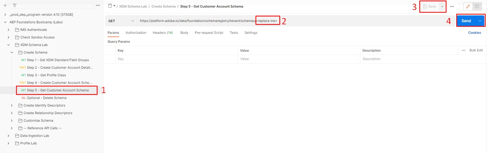
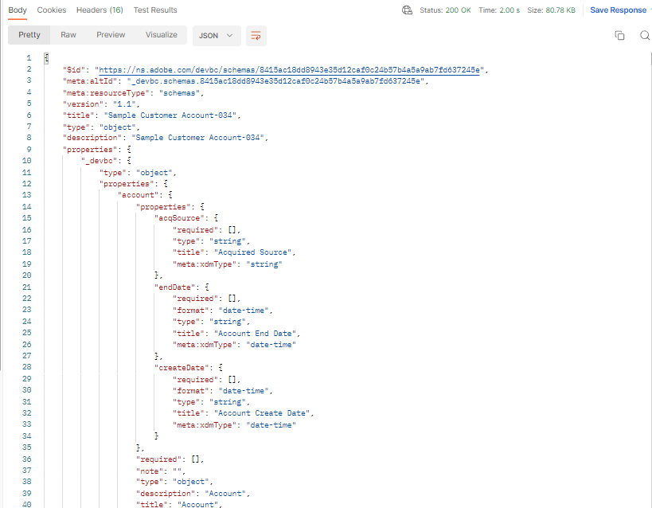

# Schema anzeigen

## Über die Benutzeroberfläche anzeigen

1. Öffnen Sie Ihren Browser und navigieren Sie zurück zum Abschnitt `Schema -> Browse` .

>[!NOTE]
>
>Aktualisieren Sie die Benutzeroberfläche, um sie anzuzeigen, da Sie sie gerade erstellt haben und die Schemaregistrierung erneut abfragen müssen

2. Nach dem `Sample Customer Schema - <your sandbox number>` suchen

3. Beachten Sie, dass die erforderliche Klasse und die zugehörigen Feldergruppen zum Schema hinzugefügt werden

## Über die API anzeigen

1. Wählen Sie die `Step 5 - Get Customer Account Schema`-API aus, indem Sie darauf klicken.
1. Ersetzen Sie in der URL der Anfrage die `<replace me>` durch die `$meta:altId`, die Sie im vorherigen Abschnitt (Schema erstellen) bis zum Ende des Aufrufs gespeichert haben, wie unten dargestellt
1. Speichern Sie die an der Anfrage vorgenommenen Änderungen
1. Ausführen der Anfrage durch Klicken auf die Schaltfläche `Send`

Beispiel für die endgültige Anfrage nach dem Hinzufügen des `$meta:altId`

Wenn Sie eine `200 OK` Antwort erhalten haben, sollten Sie in der Lage sein, das von Ihnen erstellte Schema einfach durch die Linse der XDM-JSON-Struktur zu durchsuchen

