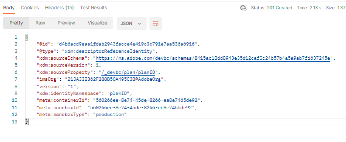

# Planreferenz-Identität erstellen

1. Klicken Sie auf die `Step 3 - Reference Descriptor for Plan`-API-Anfrage im Ordner `XDM Schema Lab -> Create Relationship Descriptors` .

   >[!CAUTION]
   >
   >Anfrage nicht ausführen…noch nicht

   


2. Aktualisieren Sie die folgenden Eigenschaften im Hauptteil des API-Aufrufs.

- Aktualisieren Sie den Wert der Eigenschaft `xdm:sourceSchema` auf den `$id` des `Customer Account` Schemas, das Sie im Schritt [Schema erstellen](../build-schema/create-schema.md) gespeichert haben
- Aktualisieren Sie den Wert der `xdm:sourceProperty` auf den Pfad des `planID` aus dem `Customer Account` Schema

>[!NOTE]
>
>Verwenden Sie den Punktnotation-Wert des `planId` Felds aus dem `dep: Lookup Plan` Schema und ersetzen Sie die `.` durch `/`
>
>Vergiss auch nicht die führende `/` 😄

NUR BEISPIEL

```json
{
  "@type": "xdm:descriptorReferenceIdentity",
  "xdm:sourceSchema": "https://ns.adobe.com/devbc/schemas/8415ac18dd8943e35d12caf0c24b57b4a5a9ab7fd637245e",
  "xdm:sourceVersion": 1,
  "xdm:sourceProperty": "/_devbc/plan/planID",
  "xdm:identityNamespace": "planID"
}
```

>[!NOTE]
>
>Denken Sie daran, den oben genannten Mandantennamen (\_devbc) mit Ihrem eigenen zu aktualisieren


1. Speichern Sie Ihre Anfrage, bevor Sie die Schaltfläche `Save` verwenden

1. Führen Sie die API aus, indem Sie auf die Schaltfläche `Send` klicken

Jetzt wird eine `201 Created` Antwort wie unten angezeigt



>[!NOTE]
>
>Ein Referenz-Identitätsdeskriptor wird immer für das Suchschema definiert (d. h. sourceSchema)

>[!NOTE]
>
>Referenz-Identitätsdeskriptoren werden automatisch auf dem Server erstellt, wenn Sie Beziehungen über die Schema-Benutzeroberfläche erstellen. **Sie müssen sie nur explizit erstellen, wenn Sie die APIs zum Erstellen von Schemas verwenden**

>[!SUCCESS]
>
>Fantastisch! Um das `dep: Lookup Plan` Schema mit dem `Customer Account` Schema zu verknüpfen und seine Referenzierung während der Batch-Segmentierung zu ermöglichen, haben Sie alle erforderlichen Deskriptoren erstellt
