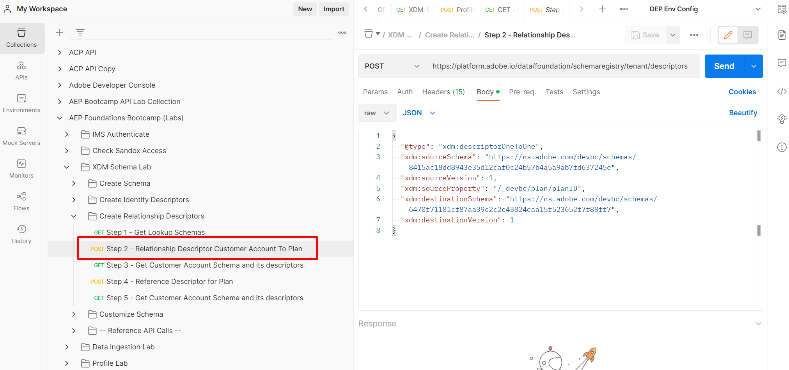

# Erstellen einer Schemabeziehung

1. Klicken Sie auf die `Step 2 - Relationship Descriptor Customer Account To Plan`-API-Anfrage im Ordner `XDM Schema Lab -> Create Relationship Descriptors` .

   >[!CAUTION]
   >
   >Anfrage nicht ausführen…noch nicht

   


2. Aktualisieren Sie die folgenden Eigenschaften im Hauptteil des API-Aufrufs.

- Legen Sie den Wert der Eigenschaft `xdm:sourceSchema` auf den `$id` des Kundenkontenschemas fest, das Sie im Laborschritt [Schema erstellen](../build-schema/create-schema.md) gespeichert haben
- Legen Sie den Wert der `xdm:sourceProperty` auf den Pfad des `planID` aus dem Kundenkontenschema fest.
- Legen Sie den Wert der `xdm:destinationSchema`-Eigenschaft auf den `$id` des Schemas fest, `dep: Lookup Plan` Sie im ersten Schritt gespeichert haben

>[!NOTE]
>
>Verwenden Sie den Punktnotation-Wert des Felds „planId“ aus dem Kundenkontenschema und ersetzen Sie die `.` durch `/`
>
>
>Vergiss auch nicht die führende `/` 😄

NUR BEISPIEL

```json
{
  "@type": "xdm:descriptorOneToOne",
  "xdm:sourceSchema": "https://ns.adobe.com/devbc/schemas/8415ac18dd8943e35d12caf0c24b57b4a5a9ab7fd637245e",
  "xdm:sourceVersion": 1,
  "xdm:sourceProperty": "/_devbc/plan/planID",
  "xdm:destinationSchema": "https://ns.adobe.com/devbc/schemas/6470f71181cf87aa39c2c2c43824eaa15f523652f7f88ff7"
,
  "xdm:destinationVersion": 1
}
```

>[!NOTE]
>
>Denken Sie daran, den oben genannten Mandantennamen (\_devbc) mit Ihrem eigenen zu aktualisieren


&#x200B;3. Speichern Sie Ihre Anfrage, bevor Sie die Schaltfläche `Save` verwenden

&#x200B;4. Führen Sie die API aus, indem Sie auf die Schaltfläche `Send` klicken

Es sollte jetzt eine `201 Created` Antwort wie unten angezeigt werden


>[!NOTE]
>
>Denken Sie daran, dass das Echtzeit-Kundenprofil (und Experience Platform insgesamt) nur einen so genannten **one (1)-Sprung-** aus dem XDM-Kontaktprofil oder dem XDM-Erlebnisereignis-Schema unterstützt (d. h. Sie können nur eine (1)-Ebene-Lookup-Beziehungen erstellen)

>[!NOTE]
>
>Ist Ihnen aufgefallen, dass der Beziehungsdeskriptor `@type` auf den Wert `OneToOne` gesetzt ist? Ist die Beziehung zwischen dem Kundenkonto und der Planungstabelle im XDM ERD auf dem Papier nicht 1\:N?  Was ist los?
>
>
>Das Echtzeit-Kundenprofil dient der Beschreibung der Eigenschaften und Verhaltensweisen einer einzelnen Person.  Daher wird eine Suchtabelle von einer einzelnen Person aus **(**) **je** einer 1:1-Beziehung während der Segmentierung definiert.
>
>Es ist in Ordnung, wenn dein Gehirn schmerzt…
