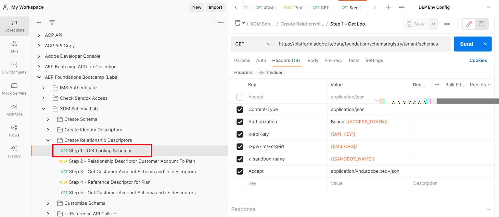

# Plan-Schema-ID abrufen

## Auflisten aller Mandantenschemas

1. Klicken Sie auf die `Step 1 - Get Lookup Schemas`-API-Anfrage im Ordner `XDM Schema Lab -> Create Relationship Descriptors` .
1. Führen Sie die API aus, indem Sie auf die Schaltfläche `Send` klicken

>[!NOTE]
>
>Dieser GET-Aufruf ruft alle Schemata ab, die im „Mandanten“-Teil der Schemaregistrierung vorhanden sind (d. h. benutzerdefinierte erstellte Schemata). Wir müssen nur nach dem Schema **Plan** suchen, um es mit dem Kundenkontenschema verknüpfen zu können.

## Planschema identifizieren

1. Suchen Sie in `dep: Plan [Lookup] ` Anrufantwort nach dem Schema .
1. Kopieren Sie die `$id` des Schemas und speichern Sie sie zur späteren Verwendung an einem anderen Speicherort

>[!NOTE]
>
>Dieses Schema sollte bereits in Ihrer Sandbox bereitgestellt werden

>[!WARNING]
>
>Fahren Sie erst fort, wenn Sie `$id` des Schemas an einer anderen Stelle gespeichert haben.  Später muss der Beziehungsdeskriptor erstellt werden
