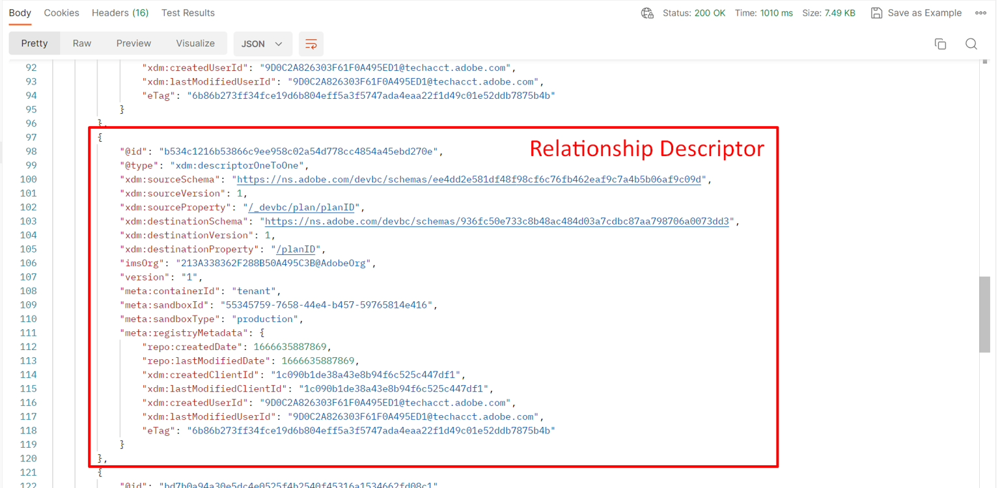
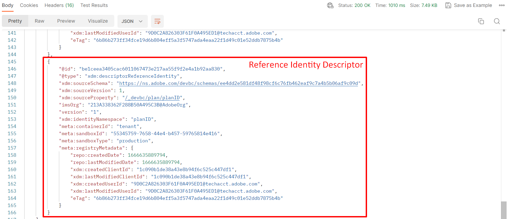

# Schema anzeigen

## Über die Benutzeroberfläche anzeigen

1. Öffnen Sie Ihren Browser und navigieren Sie zurück zum Abschnitt `Schema -> Browse` .
1. Nach dem `Sample Customer Schema - <your sandbox number>` suchen
1. Beachten Sie, dass die Beziehung zum `dep: Plan [Lookup]` definiert ist

## Über die API anzeigen

1. Wählen Sie die `Step 4 - Get Customer Account Schema and its descriptors`-API aus, indem Sie darauf klicken

   

2. Ersetzen Sie in der URL der Anfrage die `<replace me>` durch die `$meta:altId`, die Sie im vorherigen Abschnitt [Schema erstellen](../build-schema/create-schema.md) gespeichert haben, wie unten dargestellt

   

3. Speichern Sie die Anfrage mithilfe der Schaltfläche `Save` .

4. Ausführen der Anfrage durch Klicken auf die Schaltfläche `Send`

Sie sollten jetzt eine `200 OK` Antwort sehen und zum Ende des von Ihnen erstellten Schemas navigieren können, um die Identität durch die Linse der XDM-JSON-Struktur zu sehen

