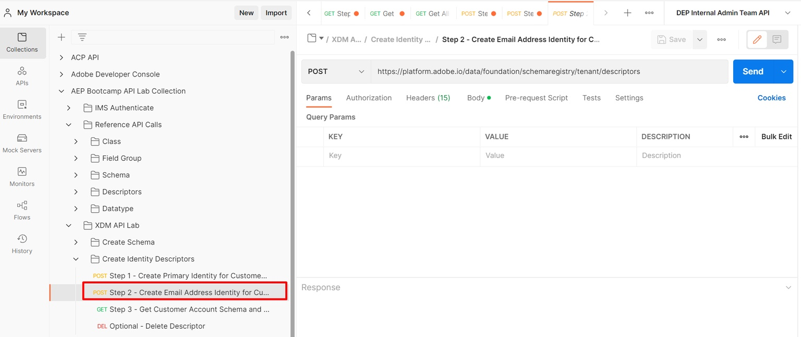

# Erstellen anderer Identitäten

1. Klicken Sie auf den `Step 2 - Create Email Address Identity for Customer Account Schema` API-Aufruf im Ordner `XDM Schema Lab -> Create Identity Descriptors` .

>[!CAUTION]
>
>Anfrage nicht ausführen…noch nicht




1. Aktualisieren Sie den `xdm:sourceSchema` Wert im Textkörper der Anfrage mithilfe der `$id`, die Sie im Laborschritt [Schema erstellen](../build-schema/create-schema.md) gespeichert haben

1. Aktualisieren Sie den `xdm:isPrimary` im Textkörper der Anfrage auf `false`

NUR BEISPIEL

```json
{
  "@type": "xdm:descriptorIdentity",
  "xdm:sourceSchema": "https://ns.adobe.com/devbc/schemas/8415ac18dd8943e35d12caf0c24b57b4a5a9ab7fd637245e",
  "xdm:sourceVersion": 1,
  "xdm:sourceProperty": "/personalEmail/address",
  "xdm:namespace": "Email",
  "xdm:property": "xdm:code",
  "xdm:isPrimary": false
}
```

>[!NOTE]
>
>Denken Sie daran, den oben genannten Mandantennamen (\_devbc) mit Ihrem eigenen zu aktualisieren


1. Speichern Sie Ihre Anfrage, bevor Sie die Schaltfläche `Save` verwenden

1. Führen Sie die API aus, indem Sie auf die Schaltfläche `Send` klicken. Es sollte jetzt eine `201 Created` Antwort wie unten angezeigt werden


