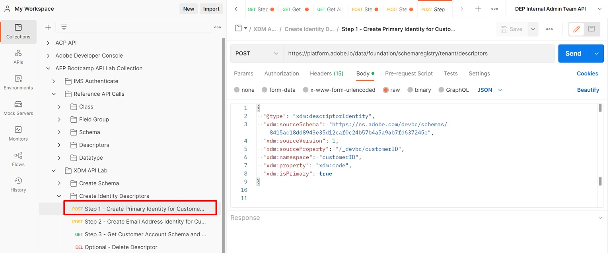

# Primäre Identität erstellen

1. Klicken Sie auf die `Step 1 - Create Primary Identity for Customer Account Schema`-API-Anfrage im Ordner `XDM Schema Lab -> Create Identity Descriptors` .

   

   >[!CAUTION]
   >
   >Anfrage noch nicht ausführen


1. Aktualisieren Sie den `xdm:sourceSchema` Wert im Textkörper der Anfrage mithilfe der `$id`, die Sie im Laborschritt [Schema erstellen](../build-schema/create-schema.md) gespeichert haben

1. Aktualisieren Sie den `xdm:isPrimary` im Textkörper der Anfrage auf `true`

   NUR BEISPIEL

   ```json
   {
     "@type": "xdm:descriptorIdentity",
     "xdm:sourceSchema": "https://ns.adobe.com/devbc/schemas/8415ac18dd8943e35d12caf0c24b57b4a5a9ab7fd637245e",
     "xdm:sourceVersion": 1,
     "xdm:sourceProperty": "/_devbc/customerID",
     "xdm:namespace": "customerID",
     "xdm:property": "xdm:code",
     "xdm:isPrimary": true
   }
   ```

   >[!NOTE]
   >
   >Denken Sie daran, den oben genannten Mandantennamen (\_devbc) mit Ihrem eigenen zu aktualisieren


1. Speichern Sie Ihre Anfrage, bevor Sie die Schaltfläche `Save` verwenden

1. Führen Sie die API aus, indem Sie auf die Schaltfläche `Send` klicken. Jetzt wird eine `201 Created` Antwort angezeigt, wie unten dargestellt


>[!SUCCESS]
>
>Herzlichen Glückwunsch!  Sie haben einen primären Identitätsdeskriptor in Ihrem Schema erstellt
