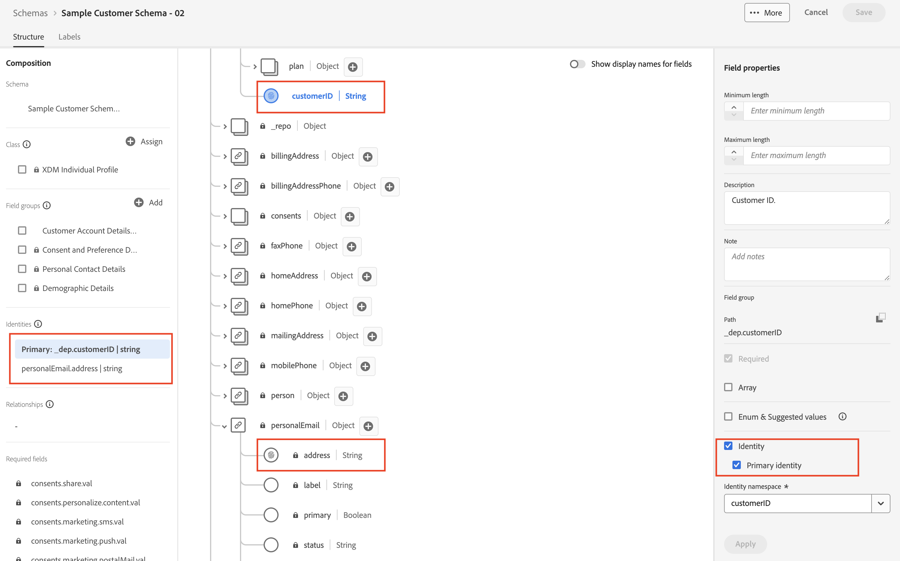
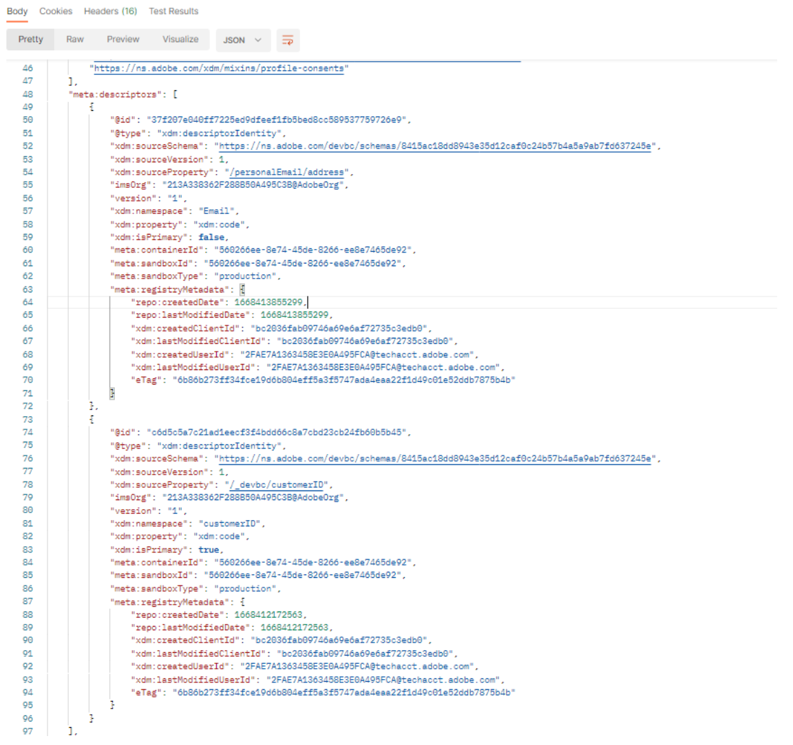
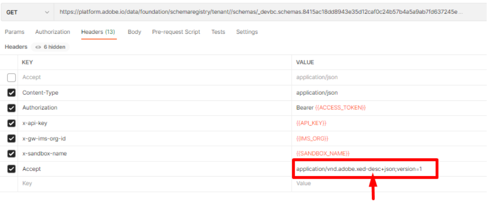
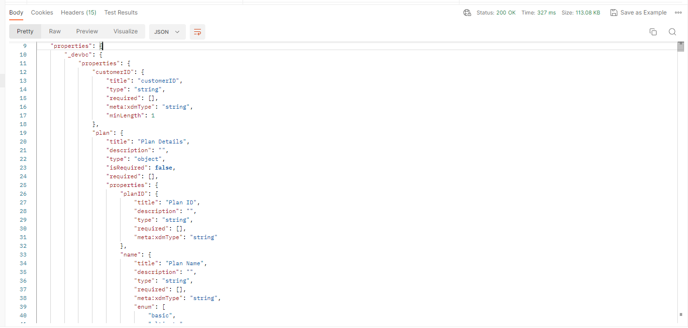

# Schema anzeigen

## Über die Benutzeroberfläche anzeigen

1. Öffnen Sie Ihren Browser und navigieren Sie zurück zum Abschnitt `Schema -> Browse` .
1. Suchen nach dem Schema **Kundenkonto**
1. Beachten Sie, dass die Identitäten zum Schema hinzugefügt werden

## Über die API anzeigen

1. Wählen Sie die `Step 3 - Get Customer Account Schema and its descriptors`-API aus, indem Sie darauf klicken.

1. Ersetzen Sie in der URL der Anfrage die `<replace me>` durch die `$meta:altId`, die Sie im vorherigen Abschnitt (Schema erstellen) bis zum Ende des Aufrufs gespeichert haben, wie unten dargestellt

1. Speichern Sie die von Ihnen angeforderten Änderungen

1. Ausführen der Anfrage durch Klicken auf die Schaltfläche `Send`

Es sollte jetzt eine `200 OK` Antwort angezeigt werden und Sie sollten das von Ihnen erstellte Schema durch die Linse der XDM-JSON-Struktur durchsuchen können

Navigieren Sie weiter unten in der API-Antwort, um die von Ihnen erstellten Identitätsdeskriptoren anzuzeigen

## Accept-Kopfzeilen

Beachten Sie die **Accept**-Kopfzeile, die in der Anfrage verwendet wird. Dieser Header teilt der XDM-Schemaregistrierung mit, dass sie die nicht aufgelösten `$refs` des Schemas (d. h. die minimal erforderlichen Informationen anzeigen) zusammen mit den zugehörigen Deskriptoren in der API-Antwort zurückgeben soll.  Adobe bietet weitere **Accept**-Kopfzeilen, mit denen Sie Details zum Schema erhalten können.

>[!NOTE]
>
>Weitere Informationen zu den verschiedenen Accept-Kopfzeilen finden Sie hier -> [Experience League Schema API-Endpunkt](https://experienceleague.adobe.com/docs/experience-platform/xdm/api/schemas.html?lang=en#lookup)

Um dies in Aktion zu sehen, ändern Sie die **Accept**-Kopfzeile, um der Schemaregistrierung mitzuteilen, dass sie mit allen `$ref` und `allOf` vollständig aufgelöst (d. h. aufgelöst) und allen zugehörigen Deskriptoren antworten soll

1. Aktualisieren Sie den Wert der `Accept`-Kopfzeile wie folgt:
   `application/vnd.adobe.xed-full-desc+json; version=1`
1. Speichern Sie Ihre Anfrage über die Schaltfläche `Save` .
1. Ausführen einer Anfrage über die Schaltfläche `Send`

Sie sollten jetzt eine Antwort sehen, die wie folgt aussieht:

>[!NOTE]
>
>Beachten Sie, dass alle Eigenschaften des Schemas jetzt vollständig in der Antwort angezeigt werden, während Ihnen im vorherigen Aufruf nur die `$ref` Werte des Schemas angezeigt wurden (d. h. welche Feldergruppen es referenziert hat) und nichts für jedes einzelne Feld/jede einzelne Eigenschaft vollständig aufgelöst wurde.

>[!NOTE]
>
>Dies ist wichtig, um zu verstehen, da Sie bei der Arbeit mit -APIs nicht immer die vollständig aufgelöste Antwort benötigen, wenn Sie lediglich die `$id` des Schemas abrufen oder dessen Komposition überprüfen
