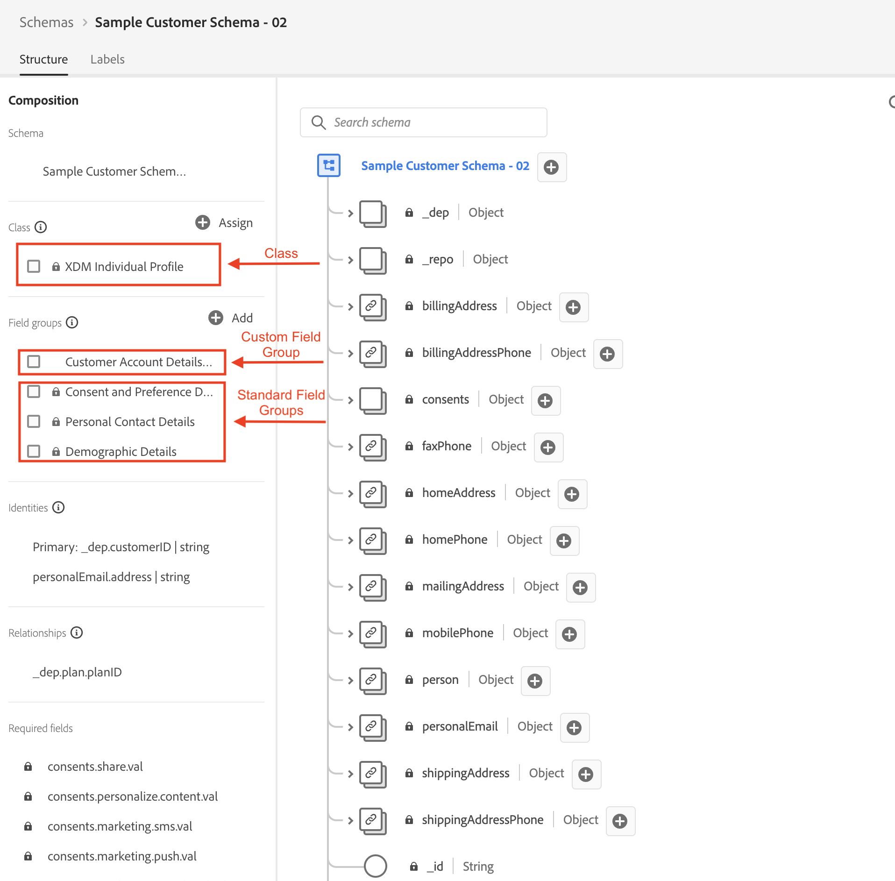
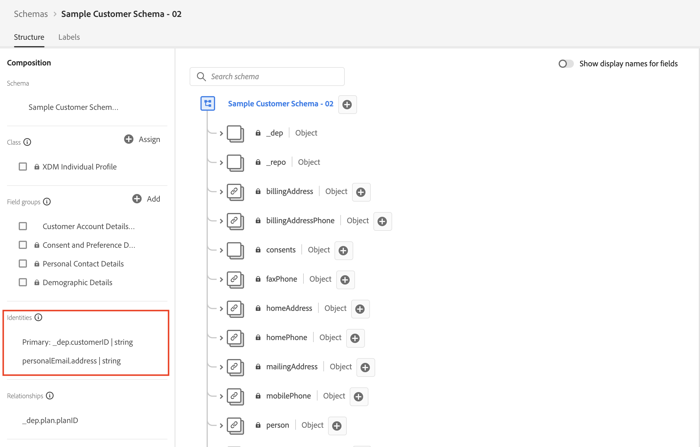
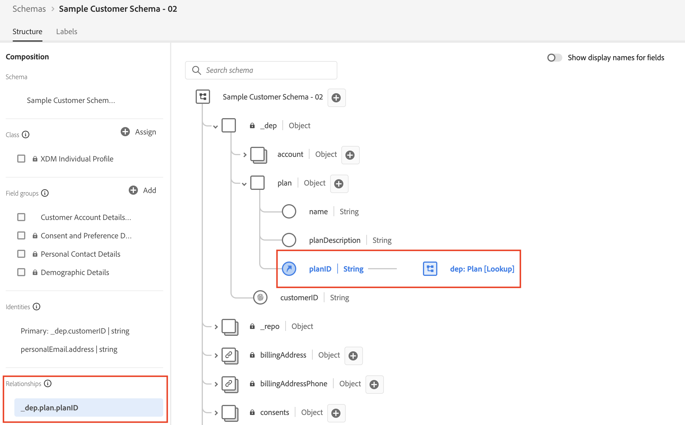

# Zusammenfassung

Im folgenden Video wird zusammengefasst, wie Sie das Schema, die Identitäten und Beziehungsdeskriptoren über API-Aufrufe erstellt haben, und es wird gezeigt, wie JSON Patch zum Ändern eines Schemas verwendet wird.

>[!VIDEO](https://video.tv.adobe.com/v/3459564/?quality=12&learn=on)

>[!TIP]
>
>Glückwunsch als Erstes! Dinge über API zu erstellen ist nicht einfach, aber zu verstehen, wie es funktioniert, hilft Ihnen, das System als Ganzes zu verstehen. Ehre!

## Kundenkonto-Schema erstellt

Sie haben das Schema erstellt, indem Sie sowohl die in Adobe erstellten Feldergruppen als auch Ihre eigene benutzerdefinierte Feldergruppe (d. h. den Mandanten) `$ref` haben.  Sie `$ref` auch die Klasse, die das Schema darstellen soll (d. h. individuelles XDM-Profil)

## JSON-Patch für das Kundenkontenschema

Sie haben die JSON Patch-Methode verwendet, um das Schema des Kundenkontos zu ändern und dem Planobjekt ein neues Feld hinzuzufügen. Patchen Sie hierzu die `$ref` benutzerdefinierte Feldergruppe namens `Customer Account Details` , die Sie unter &quot;[ benutzerdefinierter Feldergruppen“ definiert haben](build-schema/create-custom-field-groups.md), anstatt das Schema selbst zu patchen.

## Markierte Identitätsfelder

In diesem Schritt haben Sie zwei der gleichen `POST`-Aufrufe durchgeführt, um `Identity Descriptors` für die Felder `_devbc.customerID` und `personalEmail.address` im Kundenkontenschema zu erstellen.

1. Das Feld `_devbc.customerID` wurde als &quot;**&quot;**
1. Das Feld `personalEmail.address` wurde **nicht festgelegt** als primäres Feld

## Lookup-Beziehung erstellt

Der letzte Schritt bestand darin, die Beziehung zwischen dem Kundenkonto und den Planschemata aus dem XDM ERD auf Papier-Lab zu erstellen.  Dazu mussten Sie sowohl einen Beziehungsdeskriptor erstellen (d. h. wie Sie das `Customer Account` Schema mit dem `dep: Plan [Lookup]` Schema verknüpfen) als auch einen Referenz-Identitätsdeskriptor für das Kundenkontenschema erstellen.

>[!NOTE]
>
>Der `referenceIdentity`-Deskriptor teilt dem Echtzeit-Kundenprofil mit, welches Feld im `Customer Account` mit welchem Identity-Namespace übereinstimmt. Denken Sie daran, dass Sie beim Definieren eines Lookup-Schemas ein Feld als primäre Identität markieren und ihm einen Namespace mit dem Typ `non-person` zuweisen müssen.
