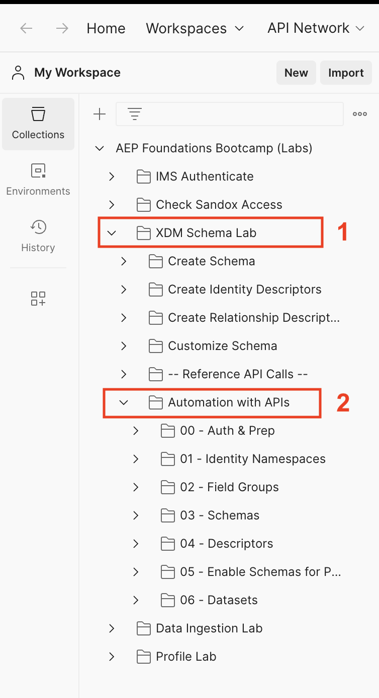
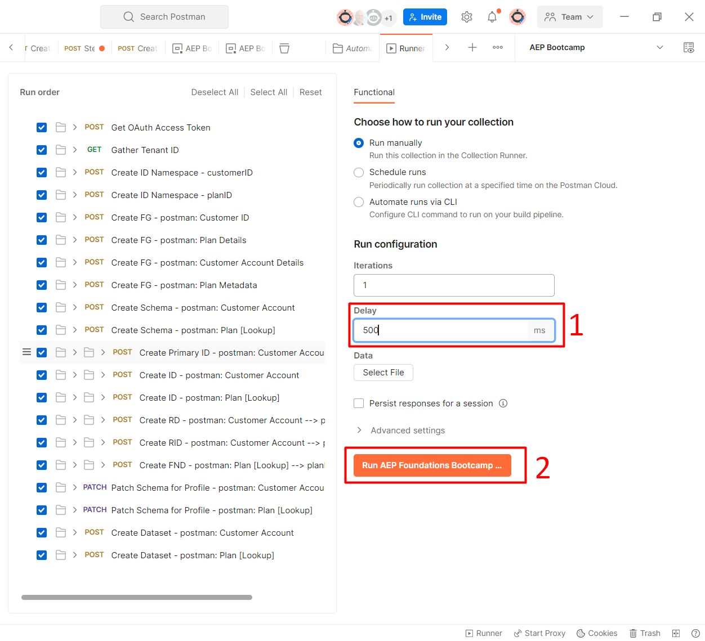

# Automatisieren mit APIs

## Einführung

Um zu sehen, wie Sie Bereitstellungen mithilfe von APIs automatisieren können, führen Sie einen Ordner mit APIs aus, in dem die folgenden Objekte erstellt werden:

- Kundenkonto und Plan \[Lookup] Schema(s)
- Feldergruppen, aus denen die oben genannten Schemata bestehen
- Für das Profil erforderliche Identitätsdeskriptoren
- Beziehung und Referenzdeskriptoren, die für die Erstellung der Beziehungen zwischen Kundenkonto und Plan erforderlich sind \[Lookup]
- Zwei Datensätze, die jedem erstellten Schema entsprechen

## Ausführen des Ordners

1. Navigieren Sie in Postman zum Ordner **Automatisierung mit APIs** im Ordner **XDM Schema Lab**

1. Klicken Sie auf den **Automatisierung mit APIs** und klicken Sie im Arbeitsbereich auf die Schaltfläche **Ausführen**

>[!NOTE]
>
>Die Schaltfläche Ausführen befindet sich oben rechts in Ihrem Postman-Arbeitsbereich

1. Es sollte ein neues Fenster angezeigt werden, in dem alle API-Aufrufe im Ordner angezeigt werden. Stellen Sie **Verzögerung** auf **500ms** ein und klicken Sie dann auf die Schaltfläche **Ausführen**.

1. Die API-Aufrufe werden nacheinander ausgeführt. Nach Abschluss des Vorgangs sollten 32 Tests bestanden sein.

1. Wechseln Sie zur Experience Platform-Benutzeroberfläche. Sie sollten sehen, dass zwei Schemata und zwei Datensätze erstellt und für das Profil aktiviert wurden, wobei das Präfix &quot;**:**&quot; lautet

> [!TIP]
>
>Herzlichen Glückwunsch!  Sie haben gerade die Bereitstellung von Identity-Namespaces, Feldergruppen, Schemata, Identitäts-/Beziehungsdeskriptoren automatisiert und ein Schema für ein Profil aktiviert und einen Datensatz mithilfe des Schemas generiert
