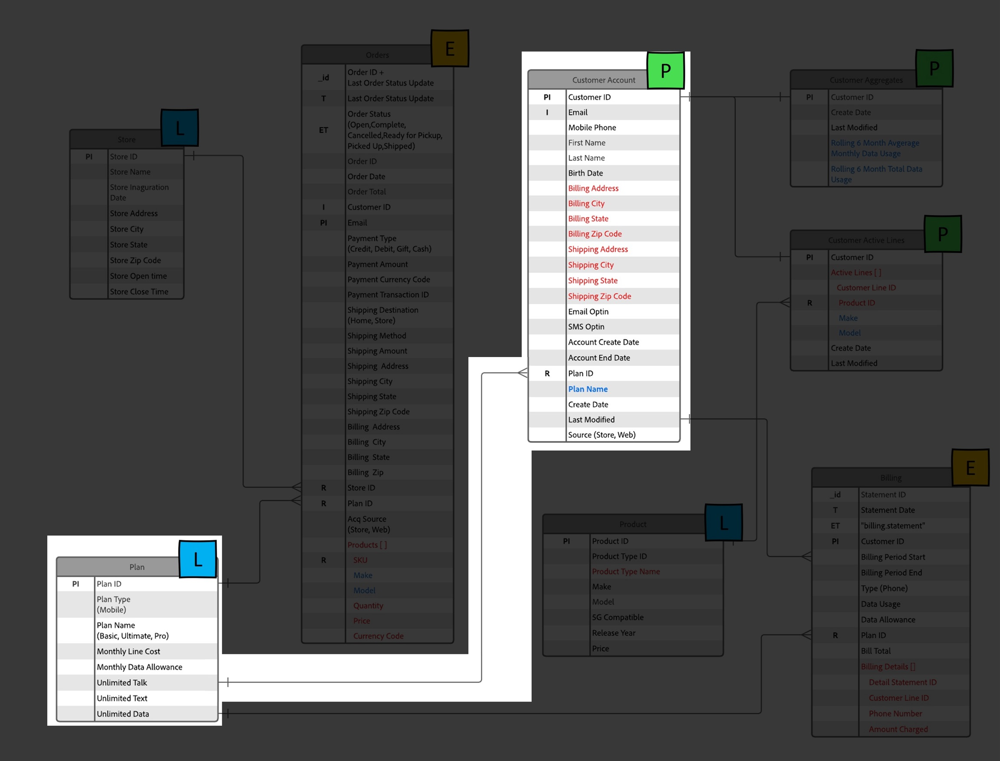
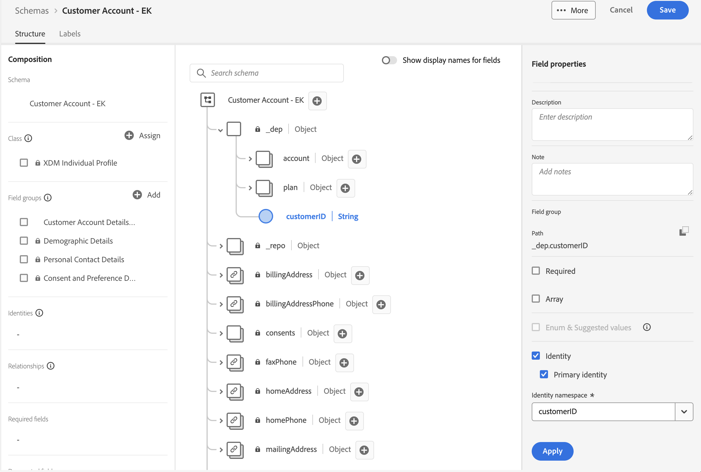
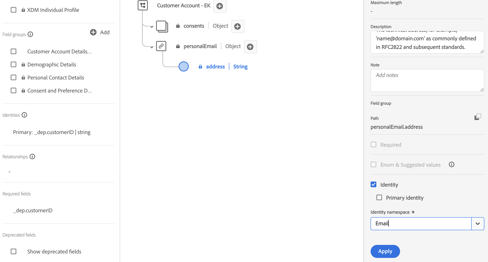
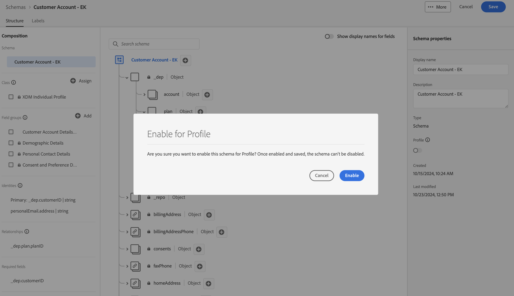

# Für Profil konfigurieren

## Übersicht

Um ein Schema für das Echtzeit-Kundenprofil zu verwenden, müssen Sie zunächst sicherstellen, dass es ordnungsgemäß konfiguriert ist. Dieser Schritt bedeutet, dass Sie das, was Sie im LID-Labor als Primär-/Personen-Identitäten, Beziehungsidentitäten usw. identifiziert haben, übernehmen und sicherstellen, dass diese Konfigurationen für jedes Schema vorgenommen werden. Wenn alles erledigt ist, aktivieren Sie ein Schema zur Verwendung mit dem Profil.

Wenn Sie sich das ERD der XDM-On-Paper-Verbindung 5G ansehen, sehen Sie die folgenden Informationen zum Kundenkonto-Schema.  Dies ist die Aufgabe, die bei der Verwendung des Schemas im Echtzeit-Kundenprofil verbleibt.

## Das Feld für die primäre Identität markieren

Jedes Schema erfordert ein primäres Identitätsfeld, wenn es mit dem Echtzeit-Kundenprofil verwendet werden soll. Gehen Sie wie folgt vor, um ein Feld als primäre Identität zu markieren.

1. Öffnen Sie das **Kundenkonto** Schema, das Sie erstellt haben
1. Wählen Sie das Feld **\_\&lt;tenant-name>.customerID** aus, indem Sie auf das Feld im Schema klicken
1. Aktivieren Sie in der rechten Leiste die Kontrollkästchen **Identität** und **Primäre Identität** .
1. Wählen Sie den **customerID**-Namespace aus der Dropdown-Liste aus
1. Klicken Sie abschließend in der rechten Leiste auf **Übernehmen** und anschließend auf **Speichern**.

>[!NOTE]
>
>Überprüfen Sie, ob in Ihrem Feld nach dem Klicken auf Anwenden ein Fingerabdruck angezeigt wird wie unten dargestellt
>
>
>
>

>[!NOTE]
>
>Beachten Sie außerdem, dass in der linken Leiste jetzt die folgenden Elemente angezeigt werden. Identitäten (primär oder nicht primär) werden hier angezeigt, und **primären** Identitäten werden ebenfalls als Pflichtfelder markiert.
>
>
>
>

## Das/die Identitätsfeld(er) der Person markieren

Jedes Schema kann **optional) Identitätsfelder** anderen Person enthalten. Diese Regel gilt für jedes Schema, das mit dem Echtzeit-Kundenprofil verwendet wird. Um ein Feld als Personenidentität zu markieren, führen Sie die folgenden Aktionen für das zuvor erstellte Kundenkontenschema aus.

1. Wählen Sie das Feld **personalEmail.address** aus
1. Aktivieren Sie das **Identität** in der rechten Leiste
1. Wählen Sie den Identity **Namespace** E-Mail“ aus der Dropdown-Liste aus
1. **Übernehmen und Speichern** Ihrer Änderungen

>[!NOTE]
>
>Überprüfen Sie, ob in Ihrem Feld nach dem Klicken auf „Anwenden“ ein Fingerabdruck angezeigt wird

## Erstellen der Schemabeziehung

Um das Planschema mit dem Kundenkontenschema zu verknüpfen, wie im ERD beschrieben, müssen Sie eine Beziehung definieren. Gehen Sie wie folgt vor, um eine Schemabeziehung zwischen dem Kundenkonto- und dem Plan-(Lookup-)Schema zu erstellen.

### Beziehung hinzufügen

1. Wählen Sie das **planID** im Planobjekt aus, wie unten dargestellt
1. Klicken Sie in der rechten Leiste auf das Symbol **Beziehung hinzufügen** .

### Beziehung definieren

1. Wählen Sie im Auswahlfeld Typ die Option **Eins-zu-eins** aus
1. Wählen Sie im Auswahlfeld Referenzschema das Schema mit dem Namen **dep: Plan \[Lookup]** (dieses Schema wurde für Sie vorerstellt)
1. Klicken Sie auf **Anwenden** und **Speichern**

![Eins-zu-eins-Beziehung zum tiefen Schema definieren: Plan [Lookup]Schema](assets/configure-for-profile-define-one-to-one-relationship.png)

### Beziehung bestätigen

Wenn Sie fertig sind, sollte die erstellte Beziehung wie im folgenden Screenshot gezeigt angezeigt werden.

## Schema für Profil konfigurieren

Das Echtzeit-Kundenprofil führt Daten aus unterschiedlichen Quellen zusammen, um eine vollständige Ansicht jedes einzelnen Kunden zu erstellen. Wenn Sie möchten, dass die von einem Schema erfassten Daten bei diesem Prozess berücksichtigt werden, müssen Sie das Schema für die Verwendung im Profil konfigurieren. Führen Sie dazu die folgenden Schritte aus:

1. Öffnen Sie Ihr neu erstelltes **Kundenkonto - \[Ihre Initialen]** Schema
1. Klicken Sie in der linken Leiste auf den Titel Ihres Schemas
1. Konfigurieren Sie Ihr Schema für das Profil, indem Sie **EIN** den Umschalter Profil in der rechten Leiste umschalten.
1. Klicken Sie in dem erscheinenden Modal auf die Schaltfläche **Aktivieren**
1. Vergessen Sie nicht **Ihr Schema zu speichern** wenn Sie fertig sind!

>[!SUCCESS]
>
>Herzlichen Glückwunsch!  Sie haben soeben ein Schema erstellt, das mit dem Echtzeit-Kundenprofil verwendet werden soll.

## Überprüfen des Profilvereinigungsschemas

Wie bereits erwähnt, besteht die Leistungsfähigkeit von XDM und dem Echtzeit-Kundenprofil in der Möglichkeit, eine Vielzahl von Fragmenten einer Person und deren Verhalten zusammenzustellen.  Diese Aggregation wird als „Vereinigungsansicht“ des Kunden bezeichnet.  In den folgenden Schritten sehen Sie in der Vorschau, wie diese Vereinigung für jede XDM-Klasse aussieht, die für das Echtzeit-Kundenprofil konfiguriert ist

1. Navigieren Sie **der linken Leiste** Profile“
1. Wählen Sie im oberen **die** „Vereinigungsschema“ aus
1. Wählen Sie die Klasse **XDM Individual Profile** aus dem Dropdown-Menü aus

Durchsuchen Sie die Klasse XDM Individual Profile und nehmen Sie sich dann einen Moment Zeit, um andere Klassen wie XDM ExperienceEvent oder Planklassen zu überprüfen.

>[!NOTE]
>
>Beachten Sie, dass das angezeigte Schema eine aggregierte zusammengeführte Ansicht aller profilaktivierten Schemas in Ihrer Sandbox ist. Ähnliche Felder innerhalb der hierarchischen XDM-Struktur werden zusammengeführt, während Felder mit unterschiedlichen Namen und/oder Hierarchien zur Gesamtansicht hinzugefügt werden.

>[!NOTE]
>
>Nur die auf dem XDM-Individualprofil basierende Klasse führt Zusammenführungen zwischen Feldern mit ähnlichen Namen durch.
