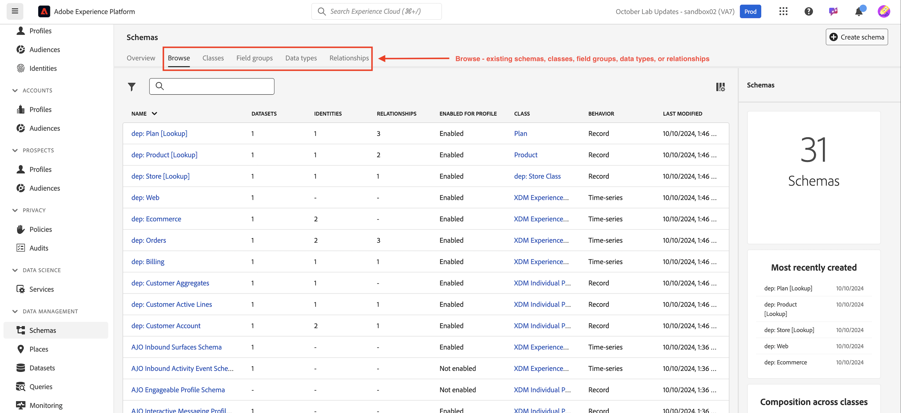

# Anmelden und Durchsuchen

## Über die Benutzeroberfläche anmelden

1. Navigieren Sie zu [https://experience.adobe.com](https://experience.adobe.com/) in Ihrem Browser.
1. Melden Sie sich mit der Adobe ID an, die Entwicklerzugriff auf Ihre Sandbox hat - mit derselben Sandbox, die Sie zum Abschließen der [Developer Console-Einrichtung verwendet haben](../../sandbox-setup/developer-console-setup.md).
1. Wählen Sie auf dem **Konto auswählen** das **Firmen- oder Schulkonto**.

## Experience Platform starten

Klicken Sie auf das Experience Platform-Symbol im Bereich Schnellzugriff , um auf Ihre Bootcamp-Sandbox zuzugreifen

>[!NOTE]
>
>Möglicherweise wird dieser Bildschirm nicht angezeigt und Sie werden direkt in Experience Platform gestartet.  Wenn ja, überspringen Sie diesen Schritt.

## Zu Schemata navigieren

1. Klicken Sie in der **Leiste auf** Schemata“.

   

1. In der oberen Navigation sehen Sie Optionen zum Durchsuchen vorhandener Schemata sowie zum Anzeigen von Feldergruppen und Datentypen, die sich derzeit in der XDM-Registrierung befinden.

>[!NOTE]
>
>Sie sehen, dass es bereits Schemas gibt, die in Ihrer Sandbox vorerstellt wurden. Dazu gehören Schemas, die im Rahmen dieses Bootcamps vorerstellt wurden (sie sind mit dem Präfix `dep` versehen), sowie systemgenerierte Schemas für Adobe Real-Time CDP und Adobe Journey Optimizer.

>[!TIP]
>
>Beginnen Sie mit dem Erstellen einiger Schemata!
