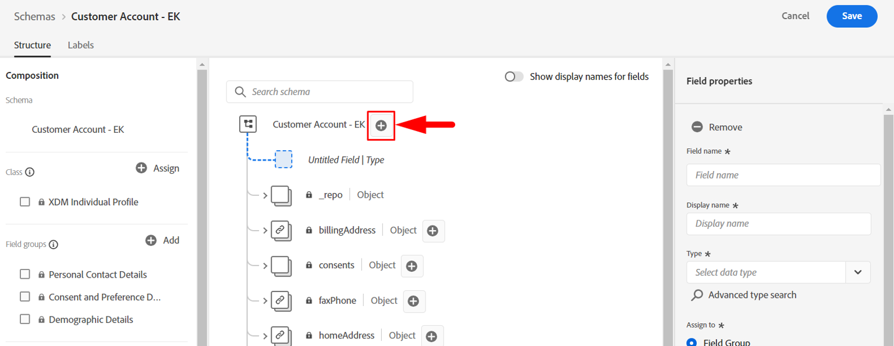
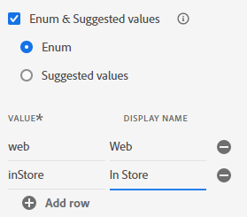

# Modellieren benutzerdefinierter Objekte

## Hinzufügen benutzerdefinierter Felder

Wie in der Vorlesung besprochen, gibt es keine standardmäßigen vordefinierten Feldergruppen oder Datentypen, die die benutzerdefinierten Felder des Kundenkontos modellieren.  Die folgenden Felder werden derzeit als benutzerdefiniert betrachtet und müssen innerhalb des XDM-Schemas modelliert werden.

- \_\&lt;tenant-name>.account.createDate
- \_\&lt;tenant-name>.account.endDate
- \_\&lt;tenant-name>.account.acqSource
- \_\&lt;tenant-name>.plan.planID
- \_\&lt;tenant-name>.plan.name
- \_\&lt;tenant-name>.customerID

>[!NOTE]
>
>Hinweis: \&lt;tenant-name> ist spezifisch für die Umgebung, in der Sie arbeiten

## Erstellung von Kontoobjekten

1. Fügen Sie ein neues Feld hinzu, indem Sie auf die Schaltfläche **+ (Hinzufügen** oben in Ihrem Schema klicken

   

   >[!NOTE]
   >
   >Beachten Sie, dass die rechte Leiste mit einigen Feldern geöffnet wird, die Sie ausfüllen können

1. Erstellen Sie das Kontoobjekt mithilfe der folgenden Details. Wenn Sie fertig sind, klicken Sie auf **Apply**-Schaltfläche in der rechten Leiste, um die Änderung im Schema-Arbeitsbereich anzuzeigen

| Feldname | Anzeigename | Typ | Einer neuen Feldergruppe zuweisen |
| ---------- | ------------ | -------- | ----------------------------------------------------------------------------------------------------------------------------- |
| *Konto* | *Konto* | *Objekt* | *Kundenkonto - \[Ihre Initialen]* *(geben Sie dies ein und wählen Sie die Dropdown-Liste aus oder drücken Sie die Eingabetaste)* |

>[!WARNING]
>
>Ihre Feldnamen müssen einer bestimmten Groß-/Kleinschreibung entsprechen. Der Grund dafür ist, dass dasselbe Schema, das Sie erstellen, bereits vorerstellt wurde. Wenn die Groß-/Kleinschreibung deaktiviert ist, führt dies zu einem Konflikt mit den Feldpfaden des bereits vorhandenen Schemas in Ihrer Sandbox

>[!NOTE]
>
>Beachten Sie, dass das automatisch erstellte benutzerdefinierte Feld unter einem Mandanten-Namespace platziert wird, der im Screenshot durch `_devbc` gekennzeichnet ist. Ihr Mandanten-Namespace kann anders sein. Mandanten-Namespaces werden verwendet, um benutzerdefinierte Objekte von standardmäßigen Adobe-Objekten zu unterscheiden und sicherzustellen, dass zukünftige Ergänzungen/Aktualisierungen von Adobe-Standards nicht mit benutzerdefinierten in Konflikt stehen.

>[!NOTE]
>
>Beachten Sie, dass die neue benutzerdefinierte Feldergruppe in der linken Leiste unter dem `Field groups` ohne Sperrsymbol angezeigt wird.  Dieses fehlende Sperrsymbol weist darauf hin, dass es sich um eine benutzerdefinierte Feldergruppe handelt.

>[!WARNING]
>
>Das Schema kann derzeit nicht gespeichert werden. In diesem Fall tritt ein Fehler auf, da Sie kein leeres Objekt im JSON-Schema erstellen können, da sein Inhalt nicht beschrieben wird

1. Fügen Sie die folgenden Felder hinzu, die unter dem soeben erstellten Kontoobjekt angezeigt werden.

   | Feldname | Anzeigename | Typ |
   | ------------ | ------------- | ---------- |
   | *createDate* | *Erstellungsdatum* | *DateTime* |
   | *endDate* | *Enddatum* | *DateTime* |

   >[!NOTE]
   >
   >Sie werden feststellen, dass beim Hinzufügen der neuen Felder **Option „Zuweisen zu** bereits ausgefüllt ist und auf die Feldergruppe verweist, die Sie für das Kontoobjekt verwendet haben.

1. Wenn Sie fertig sind, sieht das Kontoobjekt Ihres Schemas wie folgt aus. **Speichern** Ihr Schema!

   

1. Fügen Sie dem Kontoobjekt ein weiteres benutzerdefiniertes Feld hinzu. Klicken Sie auf die Schaltfläche **+ (Hinzufügen** neben dem Kontoobjekt.  Erstellen Sie das folgende Feld:

   | Feldname | Anzeigename | Typ | Aufzählungen |
   | ----------- | ----------------- | -------- | --------------------------------------- |
   | *acqSource* | *Erworbene Source* | *Zeichenfolge* | *web :: Web * *inStore :: Im Store* |

   Dieses Feld benötigt standardisierte Werte. Verwenden Sie daher die Option **Aufzählung und vorgeschlagene Werte** in den Eigenschaften des Felds. Wählen Sie **Optionsfeld** Aufzählung“ aus, um bei der Aufnahme eine Validierung für dieses Feld sowie benutzerfreundliche Kennzeichnungen hinzuzufügen. Fügen Sie die Aufzählungswerte wie folgt hinzu:

   - *web :: Web*
   - *inStore :: Im Store*

   

   >[!NOTE]
   >
   >Das Ziel von Aufzählung und empfohlenen Werten besteht darin, die Segmentierung für den Endbenutzer zu vereinfachen. Auflistungen erzwingen die Validierung zum Zeitpunkt der Datenaufnahme, vorgeschlagene Werte dagegen nicht. Weitere Informationen zu dieser Funktion finden Sie in der Dokumentation hier -> [https://experienceleague.adobe.com/docs/experience-platform/xdm/ui/fields/enum.html?lang=en#enums-and-suggested-values](https://experienceleague.adobe.com/docs/experience-platform/xdm/ui/fields/enum.html?lang=en#enums-and-suggested-values)

1. Wenn Sie fertig sind, klicken Sie auf **Apply**-Schaltfläche, um das neue Feld zum Schema hinzuzufügen.

1. **Speichern** Ihres Schemas

>[!SUCCESS]
>
>Sie haben Ihr erstes benutzerdefiniertes Objekt und Ihre ersten Felder erfolgreich in der XDM-Schemaregistrierung erstellt!

## Planobjekt-Erstellung

Wiederholen Sie die oben ausgeführten Schritte und fügen Sie das **Plan**-Objekt und die zugehörigen Felder hinzu. Alle neuen Felder sollten unter der Feldergruppe Kundenkontodetails - \[Ihre Initialen] hinzugefügt werden.

Verwenden Sie die Metadaten in der folgenden Tabelle, um das Planobjekt und die zugehörigen Felder zu erstellen.

| Feldname | Anzeigename | Typ | Aufzählung und vorgeschlagene Werte |
| ---------- | -------------- | -------- | ------------------------------------------------------------------------------------- |
| *Plan* | *Plandetails* | *Objekt* | - |
| *planID* | *Plan-ID* | *Zeichenfolge* | - |
| *name* | *Planname* | *Zeichenfolge* | Enum  *basic :: Basic * *Ultimate :: Ultimate * *pro :: Pro* |
| *type* | *Typ* | *Zeichenfolge* | - |

>[!WARNING]
>
>Stellen Sie sicher, dass Sie die neuen Felder, die Sie erstellen, zur Feldergruppe Kundenkontodetails - \[Ihre Initialen] hinzufügen.  Eine schnelle Möglichkeit, um sicherzustellen, dass sie automatisch zu dieser Feldergruppe hinzugefügt werden, besteht darin, die Feldergruppe in der linken Leiste auszuwählen, bevor ein benutzerdefiniertes Feld hinzugefügt wird.
>
>
>
>
>
>

Wenn Sie die Überprüfung abgeschlossen haben, stimmt Ihr Schema mit dem folgenden Screenshot überein. Wenn es gut aussieht **Speichern** Ihr Schema

>[!TIP]
>
>Schön!  Sie haben Ihr eigenes benutzerdefiniertes Objekt und Ihre eigenen Felder ohne Hilfe hinzugefügt!

## Erstellung eines Kunden-ID-Feldes

Das Hinzufügen des Felds **customerID** als dieses Feld ist wichtig, da es sowohl als primäre Identität für das Schema als auch als allgemeines Feld für die Datenspeicherung dient.

Führen Sie dieselben Schritte wie zuvor aus und verwenden Sie die nachstehende Tabelle für den Verweis auf die Metadaten für das Feld.

| Feldname | Anzeigename | Typ | Feldergruppe |
| ------------ | ------------- | -------- | --------------------------------------------- |
| *customerID* | *Kunden-ID* | *Zeichenfolge* | *Kundenkonto-Details - \[Ihre Initialen]* |

>[!NOTE]
>
>Die `customerID` kann aus einer hierarchischen Perspektive an eine beliebige Stelle im Schema platziert werden. In diesem Labor verbleibt das Feld customerID im Stammverzeichnis und wird nicht in einem der zuvor erstellten benutzerdefinierten Objekte verschachtelt.  An dieser Platzierung hat die Datenarchitektur Meinungen
>
>😄

Ihr Endergebnis sieht nach Abschluss wie der folgende Screenshot aus

## Endgültiges Schemaergebnis

>[!SUCCESS]
>
>Sie haben Ihr erstes XDM-Schema erstellt! Im nächsten Abschnitt konfigurieren Sie das Schema für die Verwendung mit dem Echtzeit-Kundenprofil.
