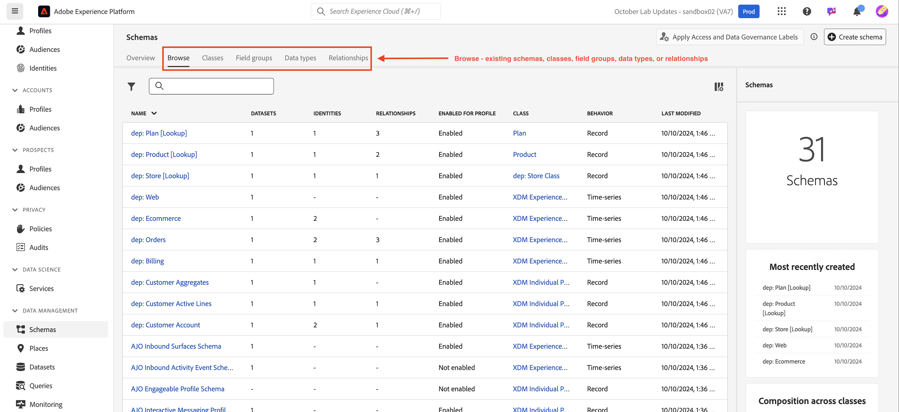
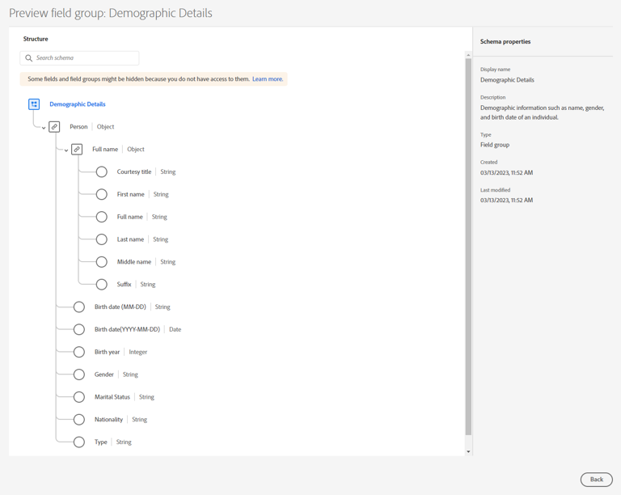
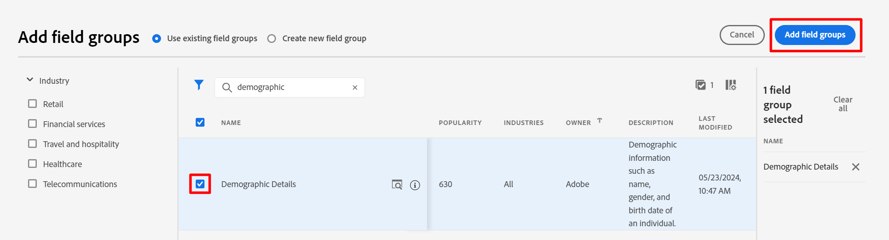
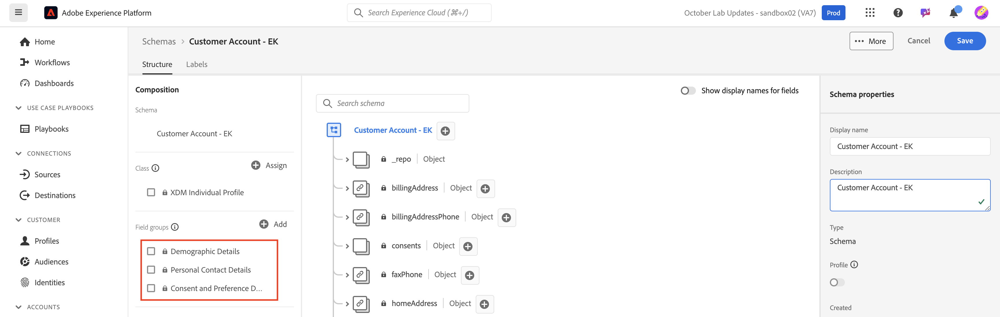
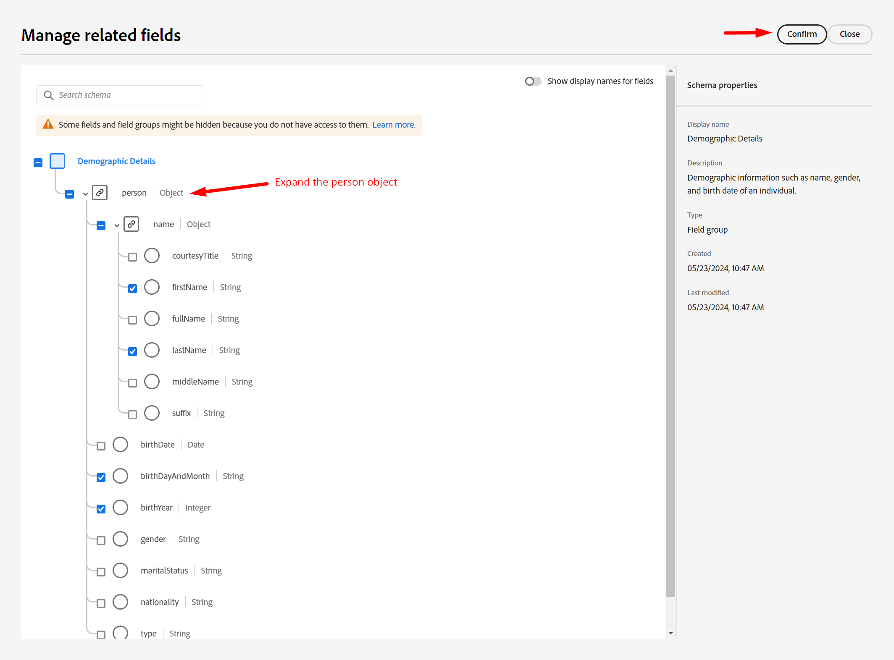
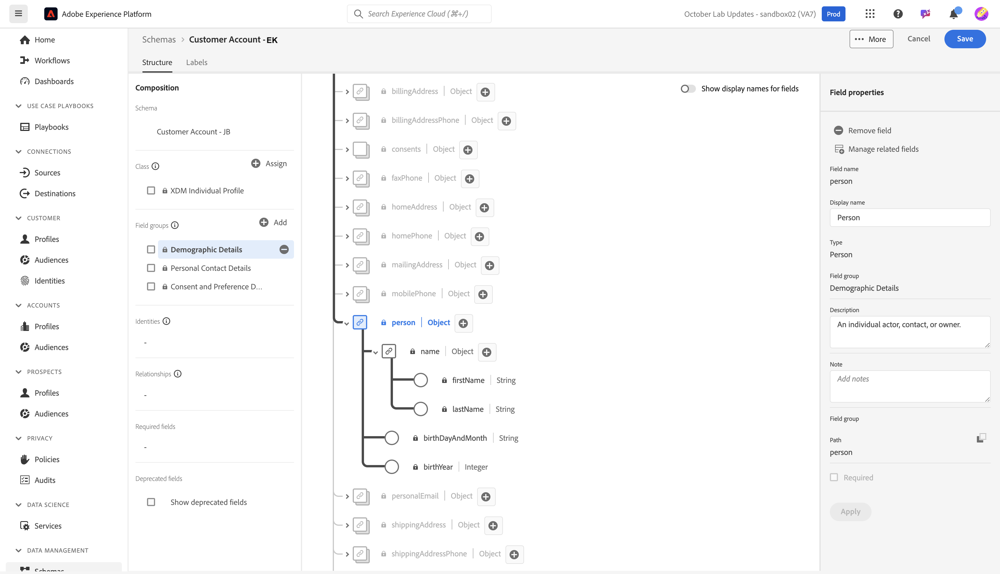
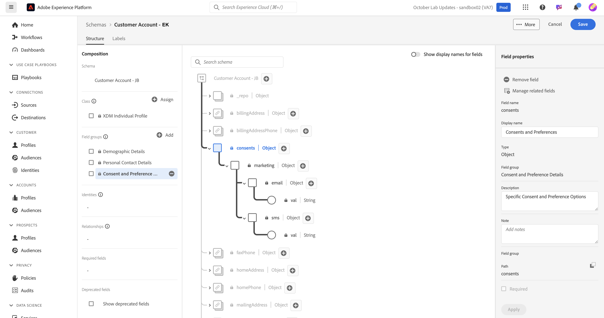

# Standardobjekte modellieren

## Zu Schemata navigieren

1. Klicken Sie in der **Leiste auf** Schemata“.

   

1. In der oberen Navigation sehen Sie Optionen zum Durchsuchen vorhandener Schemata sowie zum Anzeigen von Feldergruppen und Datentypen, die sich derzeit in der XDM-Registrierung befinden.

>[!NOTE]
>
>Sie sehen, dass es bereits Schemas gibt, die in Ihrer Sandbox vorerstellt wurden. Dazu gehören Schemas, die im Rahmen dieses Bootcamps vorerstellt wurden (sie sind mit dem Präfix `dep` versehen), sowie systemgenerierte Schemas für Adobe Real-Time CDP und Adobe Journey Optimizer.

## Individuelles Profilschema erstellen

1. Klicken Sie zunächst auf **Schema erstellen**

   

1. Wählen Sie **Manuell**

   

1. Wählen Sie **Individuelles Profil**

## Benennen des Schemas

Mit klassenbasierten XDM Individual Profile-Schemata können Sie Attribute über eine Person erfassen, die mit dem Profil verknüpft wird. Die Klasse selbst enthält Felder, die nicht bearbeitet werden können, *modifiedByBatchID*, *PersonID* usw.

1. Geben Sie Ihrem Schema einen Namen und eine Beschreibung.
   - **Anzeigename des Schemas** —> *Kundenkonto - \[Ihre Initialen]*
   - **Beschreibung** —> Dieses Schema erfasst Identitäten, Plandaten, demografische Details und Kontaktdaten einer Person.
1. Speichern Sie Ihr Schema mithilfe **Schaltfläche** Beenden“ oben rechts.

## Hinzufügen der Feldergruppe „Demografische Details“

Es gibt viele Feldergruppen, die als Standard-XDM in Adobe Experience Platform vorhanden sind, die Sie Ihrem Schema hinzufügen und anpassen können.

1. Klicken Sie auf **+ (Hinzufügen** in der linken Leiste im Abschnitt Feldergruppe .

   

1. Suchen Sie nach **Demografische Details** oder finden Sie sie in der Liste.

   - Wenn Sie die Feldergruppe gefunden haben, klicken Sie auf die Lupe rechts neben der Feldergruppe, um deren Struktur anzuzeigen.  Dies ist eine nützliche Möglichkeit, eine Vorschau dessen anzuzeigen, was Sie Ihrem Schema hinzufügen möchten, ohne es tatsächlich hinzuzufügen.
   - Vorschau nach Überprüfung schließen

   

   

3. **Aktivieren** das Kontrollkästchen neben der Feldergruppe und klicken Sie dann auf die Schaltfläche **Feldergruppen hinzufügen**

## Hinzufügen anderer Standardfeldgruppen

Sie müssen Ihrem Schema zusätzliche Standardfeldgruppen hinzufügen. Wiederholen Sie die vorherigen Schritte, um Ihrem Schema die beiden zusätzlichen Feldergruppen hinzuzufügen:

- Persönliche Kontaktdaten
- Details zu Einverständnis und Voreinstellungen

Wenn Sie fertig sind, sollte Ihr Schema wie das folgende Bild aussehen, wenn Sie fertig sind. Klicken Sie unbedingt auf die Schaltfläche **Speichern** und speichern Sie Ihre Arbeit!

>[!NOTE]
>
>Beachten Sie, dass die ausgewählten und hinzugefügten Feldergruppen jetzt in Ihrem Schema angezeigt und in der linken Leiste angezeigt werden. Beachten Sie, dass nicht alle Felder in jeder hinzugefügten Feldergruppe unbedingt erforderlich sind.  Im nächsten Schritt werden die überflüssigen Felder entfernt.

>[!WARNING]
>
>Denken Sie daran, Ihr Schema zu speichern, bevor Sie fortfahren!

## Anpassen von Standardfeldgruppen

### Feldergruppe „Demografische Details“

Die Feldergruppe Demografische Details enthält viele Felder, aber basierend auf Ihrem Schemadesign aus der LID-Methodik benötigen Sie nur die folgenden Felder:

- person.name.firstName
- person.name.lastName
- person.bornDayAndMonth
- person.BirthYear

Zum Entfernen von Feldern aus einer Adobe-Standardfeldgruppe können Sie die Option **Verwandte Felder verwalten** verwenden. Mit „Verknüpfte Felder verwalten“ können Sie Standardfelder aus Ihrem Schema entfernen, sodass Sie nur die benötigten Felder behalten.

1. Wählen Sie das **Person**-Objekt in Ihrem Schema aus
1. Klicken Sie auf **Verknüpfte Felder verwalten** in der rechten Leiste

   

1. Erweitern Sie das Objekt Person , indem Sie auf den Pfeil links neben Person klicken, und erweitern Sie das Objekt Vollständiger Name , indem Sie auf den Pfeil links neben dem Objekt Name klicken. Nur die folgenden Felder beibehalten:

   - person.name.firstName
   - person.name.lastName
   - person.bornDayAndMonth
   - person.BirthYear

   Wenn Sie fertig sind, klicken Sie auf die **Bestätigen**-Schaltfläche in der oberen rechten Ecke.

   

   >[!NOTE]
   >
   >Klicken Sie auf das oberste Kontrollkästchen für **Demografische Details**, um die Auswahl aller untergeordneten Objekte automatisch aufzuheben und dann nur die gewünschten Objekte erneut auszuwählen.

1. Wenn Sie fertig sind, sollte das Objekt Person in Ihrem Schema angezeigt werden, wie unten dargestellt. Wenn alles gut aussieht, klicken Sie auf die Schaltfläche **Speichern**, um Ihr Schema zu speichern.

### Feldergruppe „Einverständnis und Voreinstellungen“

Führen Sie dieselben Schritte wie zuvor aus, aber dieses Mal für die Feldergruppe „Einverständnis“ und „Voreinstellungen“.

1. Klicken Sie in der linken Leiste auf **Name der Feldergruppe „Einverständnis und**&quot;, um die entsprechenden Felder in Ihrem Schema zu markieren.
1. Wählen Sie das **Einverständnis**-Objekt aus und verwenden Sie dann den **Verwandte Felder verwalten**-Prozess, um nicht benötigte Felder aus dem Einverständnisobjekt zu entfernen. Nur die folgenden Felder beibehalten:

- consents.marketing.email.val
- consents.marketing.sms.val

>[!NOTE]
>
>Stellen Sie sicher, dass der Umschalter für **Anzeigenamen für Felder anzeigen** in der oberen rechten Ecke des Schemaarbeitsbereichs deaktiviert ist
>
>

Wenn Sie fertig sind, sollte Ihr endgültiges Schema jetzt wie folgt aussehen.  Klicken Sie unbedingt auf **Speichern**, bevor Sie fortfahren.

>[!TIP]
>
>Sie haben nun das Hinzufügen von Standardkomponenten zu Ihrem Schema abgeschlossen. Gut gemacht! Fahren Sie mit dem Erstellen einiger benutzerdefinierter Attribute für Ihr Schema fort.
