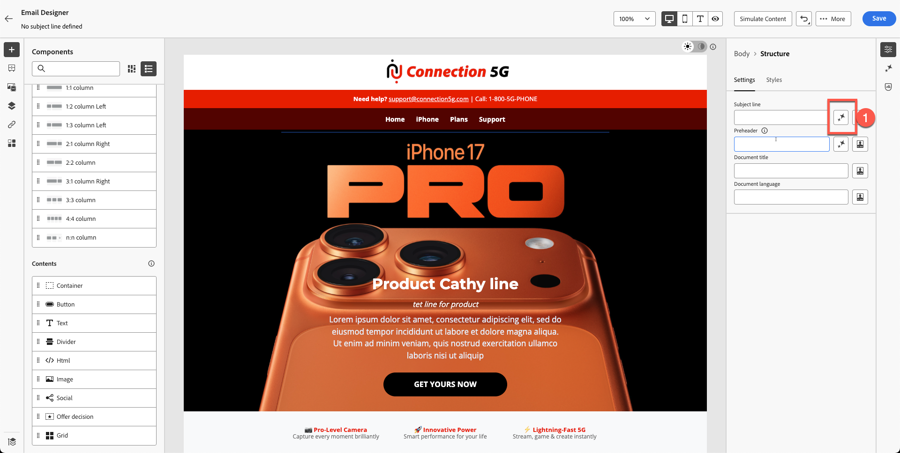
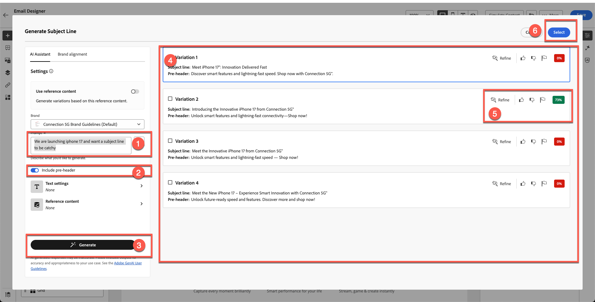
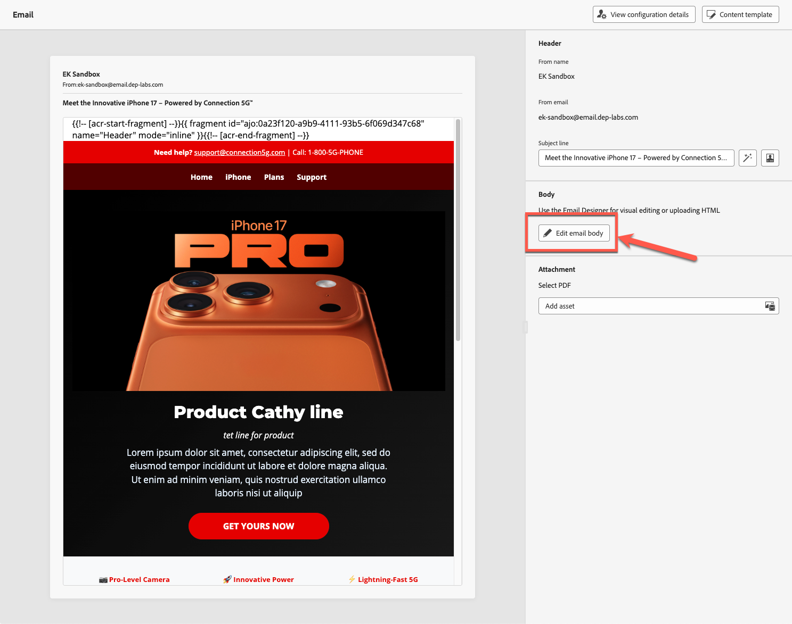
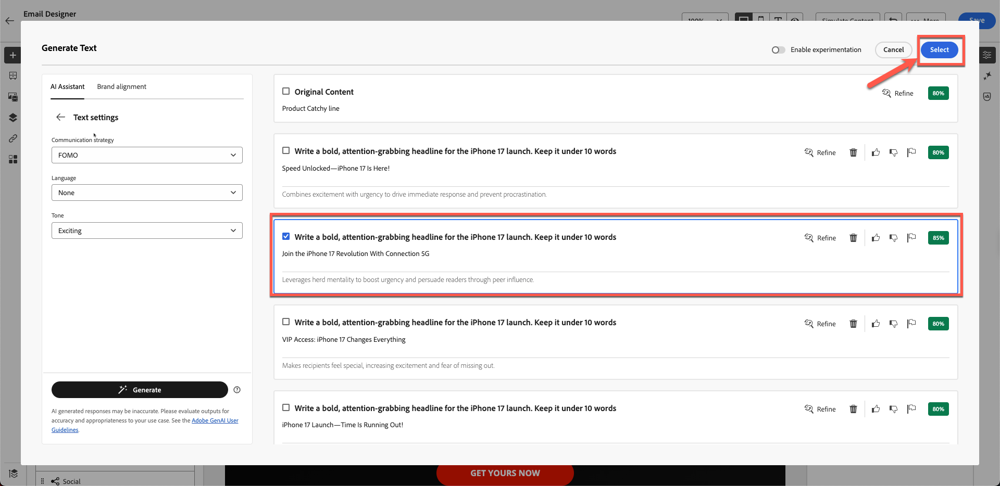
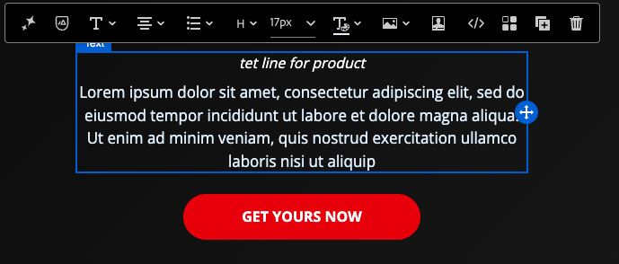
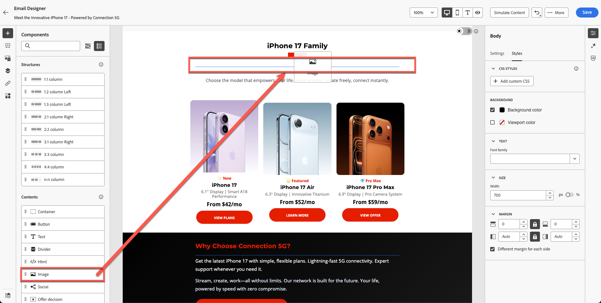
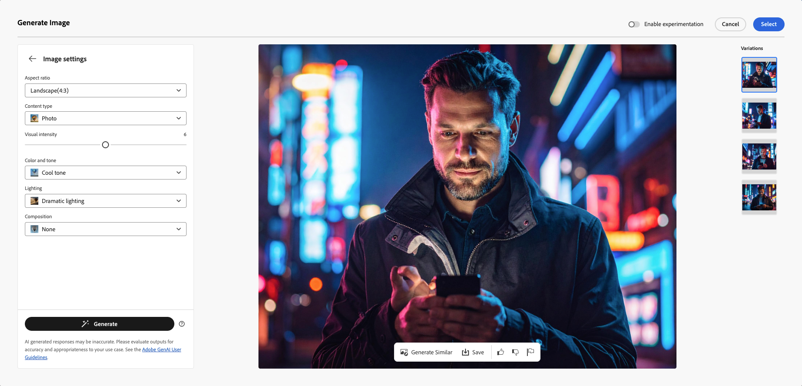
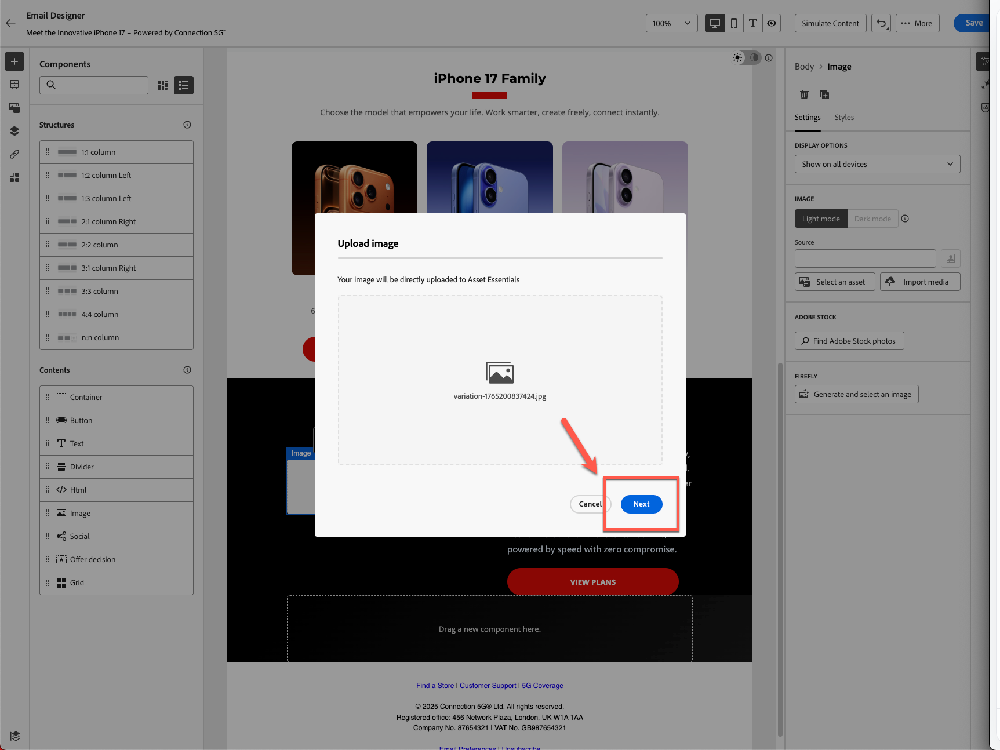
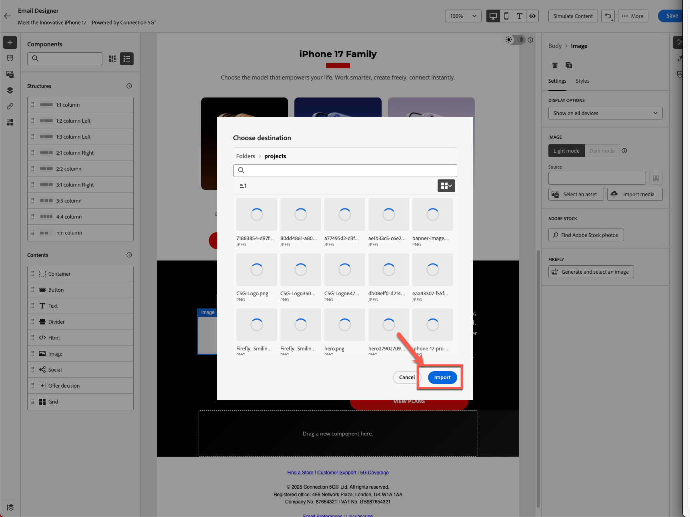
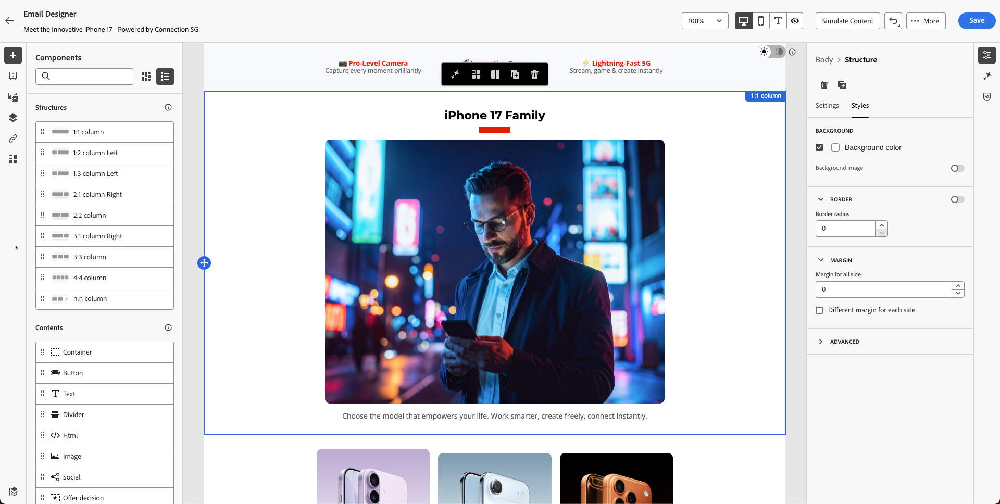

# KI-Assistent und Personalisierung von Inhalten

**Zweck:** Erfahren Sie, wie Sie mit dem KI-Assistenten von Adobe Journey Optimizer Betreffzeilen generieren, E-Mail-Text verfeinern, den Ton anpassen und markeninterne Firefly-Bilder direkt im E-Mail-Designer erstellen.

## Lernziele

Am Ende dieses Moduls haben Sie folgende Möglichkeiten:

1. Verwenden Sie den KI-Assistenten, um Betreffzeilen und Pre-Header zu generieren.
1. Hero-Text, Beschreibungen, Ton und Messaging verfeinern.
1. Wenden Sie KI-gesteuerte Neuformulierung, Zusammenfassung und Tonanpassungen an.
1. Erzeugen von Bildern mit Adobe Firefly mit Referenz- und Markeneinstellungen.
1. Ersetzen Sie Platzhalter durch generierte Bilder in Ihrem E-Mail-Design.

## Einführung

Der KI-Assistent in AJO hilft Ihnen beim Erstellen intelligenterer, markeninterner Inhalte.
Er kann:

- Betreffzeilen generieren
- Vorhandenen Text verbessern
- Anpassen von Ton und Klarheit
- Erstellen von Markenbildern mit Firefly
- Sicherstellen, dass alles mit den Richtlinien für die 5G-Verbindung übereinstimmt

Für diese Übung verbessern Sie die E-Mail, die Sie mit dem KI-Assistenten erstellt haben.

&#x200B;> [!NOTE]
>
>Der KI-Assistent ist **nicht deterministisch** was bedeutet, dass er bei jeder Verwendung etwas anderen Inhalt generieren kann. Was Sie während des Trainings sehen, stimmt möglicherweise nicht genau mit den Screenshots oder Beispielen in diesem Handbuch überein. Das ist okay - konzentrieren Sie sich darauf, den Prozess und die Konzepte zu erlernen, anstatt identische Ergebnisse zu erwarten.

## Erstellen einer E-Mail-Betreffzeile mit dem KI-Assistenten

1. Kehren Sie zur Kampagne zurück, indem Sie auf die Schaltfläche Zurück klicken, oder bearbeiten Sie die E-Mail, die Sie im vorherigen Modul erstellt haben. Im vorherigen Schritt können Sie auf die Registerkarte **Einstellungen** auf der rechten Seite klicken.
2. Klicken Sie auf E-Mail-Container > Klicken Sie auf die Schaltfläche E-Mail bearbeiten .
3. Klicken Sie auf die Registerkarte Inhalt und dann auf E-Mail-Text .
4. Wählen Sie das Feld **Betreffzeile** aus.
5. Klicken Sie auf das **KI-Assistenten-Symbol**. (siehe unten)

&#x200B;6. Sie werden feststellen, dass die Markenrichtlinie standardmäßig ausgewählt ist.
&#x200B;7. Eingabeaufforderung eingeben:

>Wir starten iPhone 17 und möchten, dass eine Betreffzeile eingängig ist

&#x200B;8. Drücken Sie **Generieren**.
&#x200B;9. Überprüfen Sie die vier generierten Varianten.
&#x200B;10. Wählen Sie die Variante mit der besten Alignment-Punktzahl aus und klicken Sie auf **Auswählen**.

&#x200B;> [!NOTE]
>
>Ihre Ergebnisse können völlig anders sein als im Laborhandbuch, sodass Sie sich keine Sorgen machen müssen. Wählen Sie den Ihrer Meinung nach richtigen Titel aus und fahren Sie mit dem Labor fort.

## Heldentitel und -beschreibung verbessern

1. Öffnen Sie die E-Mail, indem Sie auf die Schaltfläche „E-Mail-Textkörper bearbeiten“ klicken.

&#x200B;2. Klicken Sie auf die **Produkteinprägsame Zeile**.
&#x200B;3. Öffnen Sie den KI-Assistenten durch Klicken auf **Erstellen und wählen Sie einen Text aus**

&#x200B;4. Wählen Sie **Dropdown-Liste „Richtlinien für die 5G** Markenbezeichnung Verbindung“.

&#x200B;5. Eingabeaufforderung:

>*Schreiben Sie eine fette, aufmerksamkeitsstarke Überschrift für den Launch von iPhone 17. Halte es unter 10 Wörtern*

&#x200B;6. Klicken Sie auf Texteinstellungen, um den Ton und die Kommunikationsstrategie zu ändern. Ändern Sie die Kommunikationsstrategie in **FOMO (Fear of Missing Out)** Sprache in **Englisch** und Ton in **Spannend**. Verwenden Sie eine kürzere Version, indem Sie den Knopf herunterskalieren.

&#x200B;7. Klicken Sie auf die **Generieren**-Schaltfläche
&#x200B;8. Überprüfen und wählen Sie die beste Version aus,
&#x200B;9. Wenn Ihr Text lang ist, verwenden Sie den Schieberegler, um „kürzeren Text“ zu **&#x200B;**&#x200B;und den Text neu zu generieren.

&#x200B;10. Sobald Sie mit dem Text zufrieden sind, klicken Sie auf **Auswählen**

## Eingabeaufforderung für Beschreibung

Dieses Mal testen Sie, wie KI dabei helfen kann, Probleme zu finden.

1. Wählen Sie den Text aus, unter dem der Vorlagentext liegt und der keine Bedeutung hat.

&#x200B;2. Klicken Sie auf die Schaltfläche „Bewerten“, wie unten dargestellt.

&#x200B;3. Ihr Originalinhalt wird automatisch mit Ihrer Marke ausgewählt, wie in den Schritten 1 und 2 unten dargestellt. Klicken Sie auf **Auswerten**, um fortzufahren.

&#x200B;4. Wie erwartet, bemerken Sie viele Fehler, die gegen die Markenrichtlinien verstoßen. Obwohl diese mit KI korrigiert werden können, überarbeiten Sie in diesem Fall die vorhandenen Materialien nicht. Stattdessen lassen Sie sie unverändert und erstellen neue Inhalte von Grund auf, die vollständig den Markenstandards entsprechen.

&#x200B;5. Verwenden Sie den neuen Absatz, der für Sie mithilfe von KI generiert wurde, mit der folgenden Eingabeaufforderung. Sie können denselben Ansatz für den Beschreibungstext verwenden, indem Sie die unten stehende Eingabeaufforderung verwenden.

Eingabeaufforderung:

>*Schreiben Sie eine überzeugende Produktbeschreibung für das neue iPhone 17. Heben Sie die beeindruckendsten Funktionen hervor, wie erweiterte Kamera, Akkulaufzeit und Leistung. Der Ton sollte Premium, aufregend und für ein breites Publikum leicht verständlich sein. Halte es unter 3 Sätzen.*

Um Zeit zu sparen, wurde der Text bereits für Sie erstellt. Kopieren Sie und fügen Sie unten ein, um Ihren Text zu erhalten.

>Entdecken Sie die iPhone 17™ - mit einer fortschrittlichen Kamera für atemberaubende Fotos, einer ganztägigen Akkulaufzeit, die Sie am Laufen hält, und einer blitzschnellen Leistung, die Ihnen einen Vorsprung verschafft. Lassen Sie sich diese innovative Erfahrung nicht entgehen.

Ihre E-Mail sieht wie im folgenden Beispiel aus.

## Hinzufügen eines von Firefly generierten Bildes

Bisher haben wir den KI-Assistenten in Betreffzeile und Text getestet. Was ist mit Bildern?

Bevor Sie sich mit der Generierung von KI-Bildern befassen, sollten Sie sich ansehen, welche Erlebnisse Sie erstellen können.

Wir verstehen, dass wir das Geburtsjahr des Profils haben. Eine der Erfahrungen, die wir machen können, ist, einen Block mit verschiedenen Varianten zu erstellen. Mit Adobe Journey Optimizer ist dies möglich und einer der größten Vorteile von Adobe Experience Platform als Basis. Wir werden in unserem nächsten Modul über Experimente sprechen, aber zuerst bereiten wir den Block unten vor.

1. Ziehen Sie eine **Bild**-Komponente in die linke Spalte unter dem Block iPhone 17-Familie .

&#x200B;2. Klicken Sie nach außen und wählen Sie dann den Bildplatzhalter aus. (Klicken Sie unbedingt auf das Bild, da sonst die Option Firefly nicht angezeigt wird.)

&#x200B;3. Klicken Sie unter **Firefly** auf **Generieren und wählen Sie ein Bild aus**.

## Referenzbild hochladen

1. &quot;**&quot;**.
2. Wählen Sie **Verbindung 5G Markenrichtlinie** zur Markenauswahl

&#x200B;3. Klicken Sie auf Bild hochladen

&#x200B;4. Wählen Sie reference.jpg im Toolkit-Ordner aus.

&#x200B;5. Eingabeaufforderung für Bild hinzufügen
   `Portrait-oriented image of a confident man in his early to mid-40s, standing alone at night in a neon-lit urban street, focused on his smartphone. Cinematic cyberpunk-inspired city atmosphere with colorful LED signs, cool blue and warm orange lighting, shallow depth of field, soft bokeh lights in the background. Modern lifestyle, tech-savvy mood, realistic skin tones, high contrast, photorealistic, professional lighting, ultra-detailed`.

## Auswählen der Bildeinstellungen

Wählen Sie Ihre **Bildeinstellungen**:

1. Wählen Sie die folgenden Einstellungen aus:
   - **Verhältnis:** Querformat (4:3)
   - **Content-Typ:** Foto
   - **Farbe und Ton:** Kühler Ton
   - **Beleuchtung:** dramatische Beleuchtung
1. Drücken Sie **Generate**-Taste

## Generiertes Bild auswählen und einfügen

1. Überprüfen Sie die Firefly-Ergebnisse, indem Sie alle generierten Bilder überprüfen.

&#x200B;2. Klicken Sie **Auswählen** für das gewünschte Bild.

&#x200B;3. Wenn Sie über ein Upload-Modal dazu aufgefordert werden, klicken Sie auf **Weiter**.

&#x200B;4. Klicken Sie dann auf **Importieren**.

## Blockentwurf fertigstellen

Wenden Sie einen abgerundeten Rahmenradius von 10 an, nur um ihn modern aussehen zu lassen, wenn Sie Zeit haben.

Nach einigen Iterationen und Variationen haben Sie das endgültige Design. Ihr endgültiges Layout ähnelt dem Beispiel.

An dieser Stelle sollten Sie sich darauf verlassen, dass Sie die Inhaltserstellung mit KI beschleunigen und verbessern können.

## Zusammenfassung

Sie haben den KI-Assistenten erfolgreich verwendet, um:

- Betreffzeilen generieren
- Hero-Text verfeinern
- Absätze umformulieren
- Meldeton ändern
- Erstellen von Firefly-Bildern mit Branding mithilfe des Referenzstils
- Einfügen von generierten Bildern in Ihre E-Mail

Sie sind jetzt bereit für das nächste Modul - **Personalization und Inhaltsexperiment**, in dem Sie profilgesteuerte Varianten und Tests erstellen.
