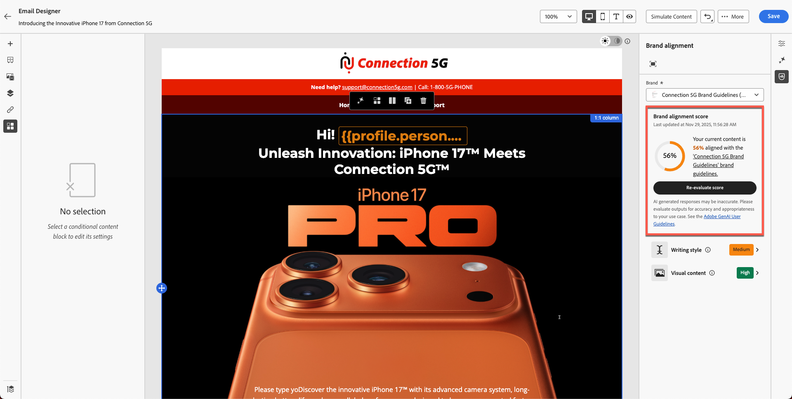
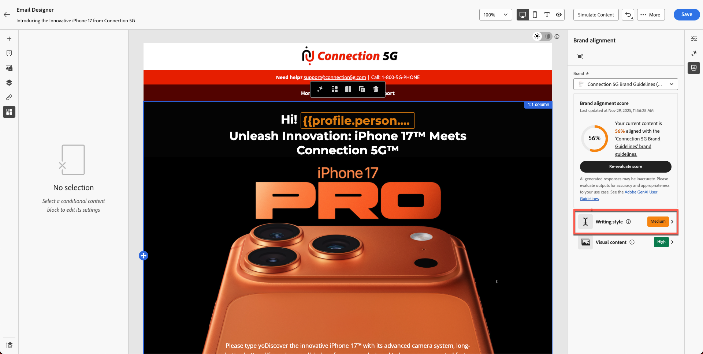
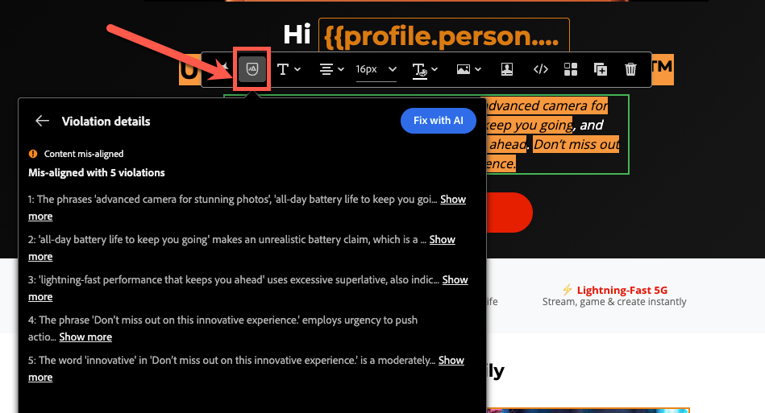
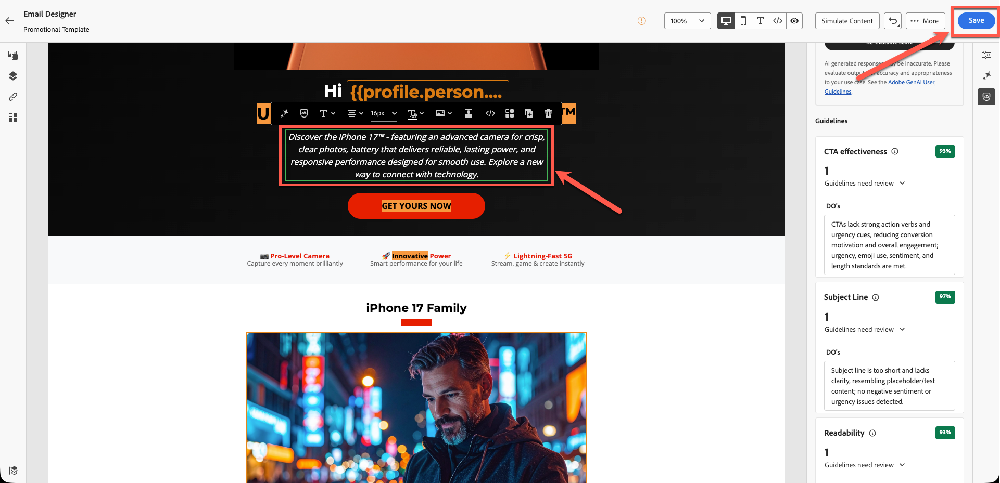
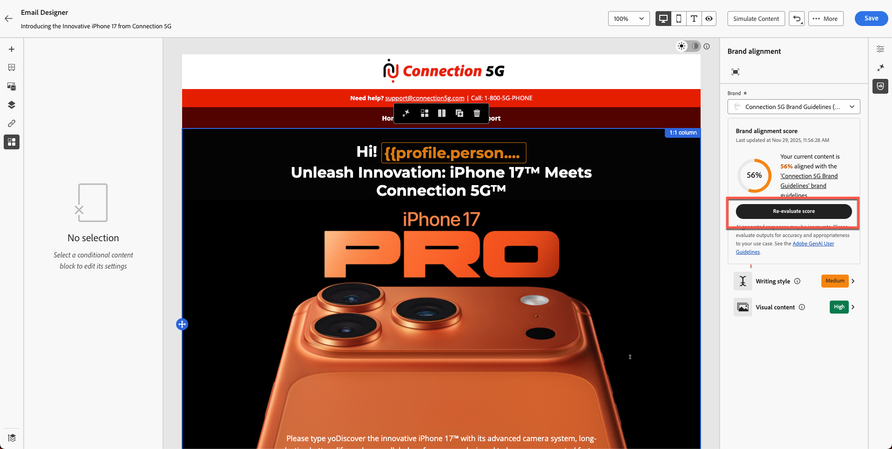

# Markenausrichtung

**Zweck:** Erfahren Sie, wie Sie mit der Funktion „Markenausrichtung“ von Adobe Journey Optimizer E-Mail-Inhalte auswerten, Richtlinienverletzungen identifizieren und KI-gestützte Empfehlungen anwenden können, um die Markenkonformität zu verbessern.

## Lernziele

Am Ende dieses Moduls haben Sie folgende Möglichkeiten:

1. Rufen Sie das Bedienfeld Markenausrichtung auf und interpretieren Sie es.
1. Bewerten von E-Mail-Inhalten anhand der Markenrichtlinien
1. Identifizieren von durch KI gekennzeichneten Problemen
1. Wenden Sie Vorschläge zur Verbesserung der Markenausrichtung an.
1. Scores neu auswerten, um Verbesserungen zu verfolgen.

## Einführung

Adobe Journey Optimizer enthält eine **KI-gesteuerte Bewertung der Markenausrichtung** die Ihren Inhalt mit den veröffentlichten Markenrichtlinien für (**5G** vergleicht.

Dadurch wird Folgendes sichergestellt:

- Ton, Stil und Botschaft entsprechen Ihrer Marke
- Rechtliche Anforderungen sind erfüllt
- Bilder folgen visuellen Regeln
- Inhaltsersteller bleiben skaliert konsistent

In diesem Modul erfahren Sie, wie Sie die Auswertung durchführen, Ergebnisse interpretieren und Ihre Inhalte mithilfe von KI verbessern.

## Bedienfeld „Markenausrichtung öffnen“

1. Öffnen Sie die E-Mail, die Sie in den vorherigen Modulen erstellt haben.
2. Suchen Sie die Registerkarte **Markenausrichtung** in der rechten Leiste oder das Symbol **%** Seitenleiste.
3. Klicken, um das Bedienfeld zu öffnen.

&#x200B;4. Stellen Sie sicher, dass die richtige Marke verwendet wird:
   - **Verbindung 5G** (Standard).
&#x200B;5. Klicken Sie **Score auswerten**.

**Interpretieren Sie die Markenbewertung und das Feedback** Nach einem Moment sehen Sie die Markenkonformitätsbewertung für Ihren Inhalt. Dieser Wert kann als Bewertung (z. B. hoch, Medium oder niedrig) oder Prozentwert angegeben werden, zusammen mit einem Farbindikator (grün, gelb, rot) und dem Zeitpunkt der Bewertung. Eine hohe Punktzahl bedeutet, dass Ihr Inhalt stark an den Markenrichtlinien ausgerichtet ist, während eine mittlere oder niedrige Punktzahl eine mäßige oder schlechte Ausrichtung anzeigt.

Überprüfen Sie das detaillierte Feedback, das im Bedienfeld für jede Kategorie von Richtlinien gegeben wird.

Das Feedback ist in der Regel nach Richtlinienkategorien (wie Ton, Stil, Bild usw.) organisiert, die anzeigen, welche Regeln bestanden wurden und welche möglicherweise beachtet werden müssen.

Notieren Sie sich bestimmte Botschaften oder Highlights - z. B. könnte das Bedienfeld sagen, dass bestimmte Wörter oder Ausdrücke nicht dem vorgeschriebenen Ton entsprechen, oder ein Bild entspricht nicht einem visuellen Standard. Dies ist Ihr Hinweis darauf, was zu verbessern ist.

>[!NOTE]
>
>Beachten Sie, dass sich Ihre Punktzahl vom folgenden Bildschirm unterscheidet. Ihr Ziel ist es, die Punktzahl anhand der Markenrichtlinien und der KI zu verbessern.

## Ausrichtungsbewertung überprüfen

Nach der Auswertung zeigt AJO Folgendes an:

- Bewertung der Markenausrichtung
- Bewertung (hoch / Medium / niedrig)
- Farbanzeige (grün / gelb / rot)
- Zeitstempel
- Richtlinienkategorien (Ton, Stil, Grafik usw.)

Interpretieren Sie die Ergebnisse, um zu verstehen, wie genau Ihre E-Mail mit den Richtlinien für die 5G-Verbindung übereinstimmt.

## Prüfen detaillierter Rückmeldungen

1. Scrollen Sie durch die Kategorien der Richtlinie.
1. Achten Sie auf Warnungen oder rote Indikatoren.
1. Klicken Sie auf jede gekennzeichnete Richtlinie, um detailliertes KI-Feedback zu öffnen.
1. Überprüfungsvorschläge, z. B.:
   - Tonabweichung
   - Falsche Formulierung
   - Verbotene Wörter
   - Verwendung fehlender Marken
   - Verletzungen des Bildstils

## Anwenden von KI-Empfehlungen

1. Klicken Sie in gekennzeichnete Textblöcke oder Bilder innerhalb der E-Mail.
2. Verwenden Sie den in der vorherigen Übung eingefügten Absatz, wie unten dargestellt.

&#x200B;3. Verwenden Sie die vorgeschlagenen Änderungen, die von AI bereitgestellt werden. Klicken Sie auf das Symbol, wie unten dargestellt.

&#x200B;4. Klicken Sie auf die Schaltfläche **Mit KI beheben** wie unten dargestellt.

&#x200B;5. Die vorgeschlagenen Änderungen werden grün hervorgehoben und der entfernte Text rot mit durchgestrichenem Text angezeigt, wie unten dargestellt. Sie werden auch feststellen, dass der Score aktualisiert wurde (in diesem Fall ist es 80%). Klicken Sie auf **Übernehmen**, damit die Änderungen wirksam werden.

&#x200B;6. Änderungen werden mit neuem Text angewendet.
&#x200B;7. Überprüfen Sie alle hervorgehobenen Bereiche und nehmen Sie die erforderlichen Aktualisierungen vor, um den Inhalt zu korrigieren, entweder mithilfe von KI oder durch manuelle Bearbeitung. Stellen Sie sicher, dass alle erforderlichen Änderungen vorgenommen wurden, bevor Sie fortfahren.
&#x200B;8. Änderungen speichern.

## Bewertung der Markenbezeichnung neu bewerten

1. Nehmen Sie Änderungen an allen Speicherorten vor, um den Inhalt mithilfe von KI oder manuell zu beheben.
2. Kehren Sie zum Bedienfeld Markenausrichtung zurück.
3. Klicken Sie **Punktzahl neu auswerten**.
4. Vergleichen Sie die neue Bewertung mit der vorherigen.

Beispiel:

- Ursprüngliche Bewertung: **56%**
- Aktualisierter Score: **90%**

Dies bedeutet, dass Ihre Aktualisierungen die E-Mail erfolgreich an die Markenstandards angepasst haben.

&#x200B;5. Klicken Sie auf **Speichern**, um Ihre E-Mail abzuschließen.

## Zusammenfassung

In diesem Modul haben Sie Folgendes gelernt:

- Bewerten einer E-Mail mithilfe der Bewertung zur Markenausrichtung
- Interpretieren des Feedbacks auf Kategorieebene
- Ermitteln von Schreib-, Ton- und Layout-Problemen
- Von KI empfohlene Korrekturen anwenden
- Verbessern Sie die Markenkonsistenz in Ihrer gesamten Kommunikation

Ihr Inhalt ist jetzt im nächsten Modul validiert und bereit zum Testen - **Testen der E-Mail**.
