# Markenverwaltung

**Zweck:** Konfigurieren, verfeinern und veröffentlichen Sie die Markenrichtlinien für Connection 5G in Adobe Journey Optimizer (AJO), sodass alle Inhalte und KI-Funktionen auf die Marke ausgerichtet bleiben.

## Lernziele

Am Ende dieses Moduls haben Sie folgende Möglichkeiten:

- Erstellen Sie eine neue Marke in Adobe Journey Optimizer.
- Laden Sie Informationen zu Markenrichtlinien aus einer PDF hoch und extrahieren Sie sie.
- Überprüfen und verfeinern Sie die Markendetails auf den Registerkarten „Markenbezeichnung“, „Schreibstil“ und „Visueller Inhalt“.
- Fügen Sie eine Ausschlussregel hinzu, um das Kopieren von Push-E-Mail-Schaltflächen zu vermeiden.
- Veröffentlichen Sie die Marke so, dass sie Vorlagen, Fragmenten, dem KI-Assistenten und der Markenausrichtung zur Verfügung steht.

Datei herunterladen - [toolkit.zip](assets/toolkit.zip)

>[!NOTE]
>
>Bevor Sie mit den praktischen Labs beginnen, stellen Sie sicher, dass Sie die Toolkit-Datei herunterladen (siehe unten toolkit.zip). Entpacken Sie die Datei, um auf die für die Übungen erforderlichen Bilder und unterstützenden Dateien zuzugreifen. Bewahren Sie diese Assets an einem Ort auf, auf den Sie leicht zugreifen können, und verweisen Sie im gesamten Labor darauf.

## Einführung

In diesem Modul erstellen Sie die Markenbezeichnung **Connection 5G** in AJO anhand einer vorbereiteten Markenrichtlinie für PDF.

Mit der Funktion **Marken** von Adobe Journey Optimizer können Sie eine konsistente Identität für alle Marketing-Maßnahmen definieren und beibehalten. Von Logos und Farben bis hin zu Ton und Stil der Botschaft: Durch die Schaffung einer Marke wird sichergestellt, dass jede E-Mail, Kampagne und jedes Inhaltselement eine einheitliche Persönlichkeit widerspiegelt.

Für dieses Labor verwenden wir das Muster 1 aus der Vorlesung (nur AJO). Beachten Sie, dass die Assets mit **Assets Essentials** gespeichert werden.

Sie beginnen mit dem Dokument zur 5G-Markenrichtlinie für die Verbindung, laden es hoch, lassen AJO die wichtigsten Informationen extrahieren, verfeinern und veröffentlichen das Ergebnis.

## Vorbereiten der Markenrichtlinie

1. Öffnen Sie die **Connection 5G Brand Guideline** PDF aus dem Toolkit-Ordner (stellen Sie sicher, dass Sie sie zuerst entpacken).

   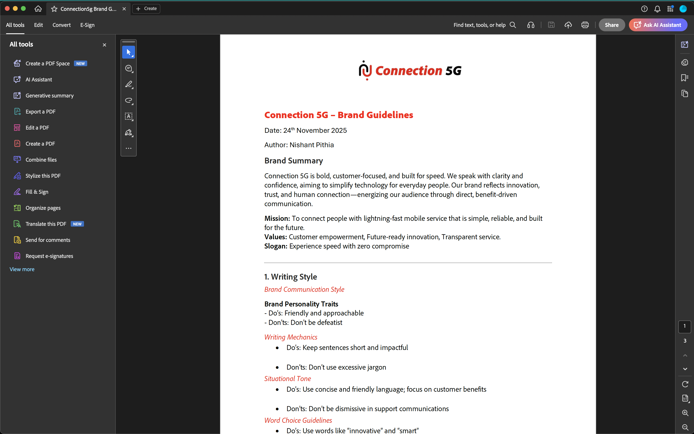

2. Lesen Sie das Dokument, um die für Verbindung 5G verwendeten Inhalte zu verstehen:
   - Tonfall
   - Farben und visueller Stil
   - Beispiele für Schreibstil und Messaging
   - Bildführung
   - Rechtliche und Compliance-Hinweise

## Erstellen einer neuen Marke in AJO

1. Navigieren Sie in Adobe Journey Optimizer zum linken Navigationsbereich und klicken Sie auf **Marken**.
2. Klicken Sie **Marke erstellen**.

   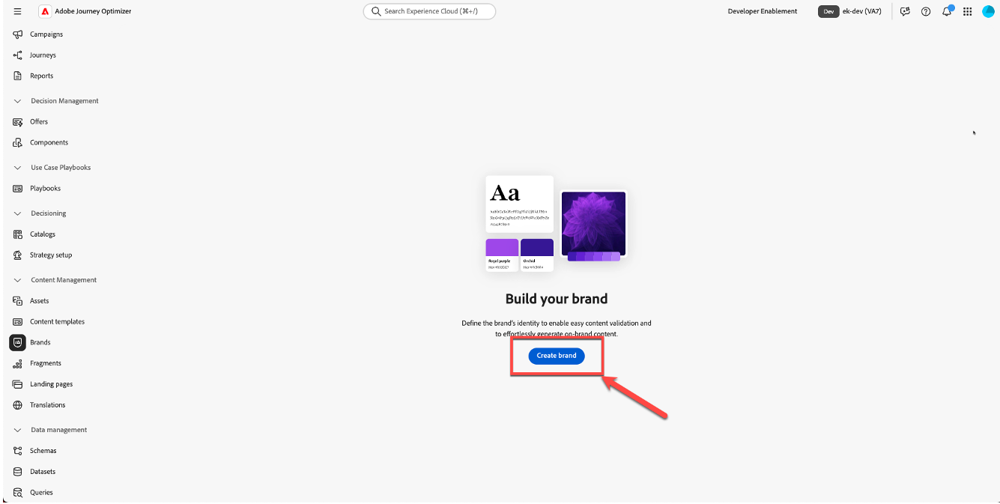

3. Geben Sie **Feld** Name“ `Connection 5G Brand Guidelines`
4. Ziehen Sie im Upload-Bereich die Datei **Connection5g Brand Guidelines.pdf** per Drag-and-Drop (oder klicken Sie auf **Dateien** und wählen Sie sie auf Ihrem Computer aus).

   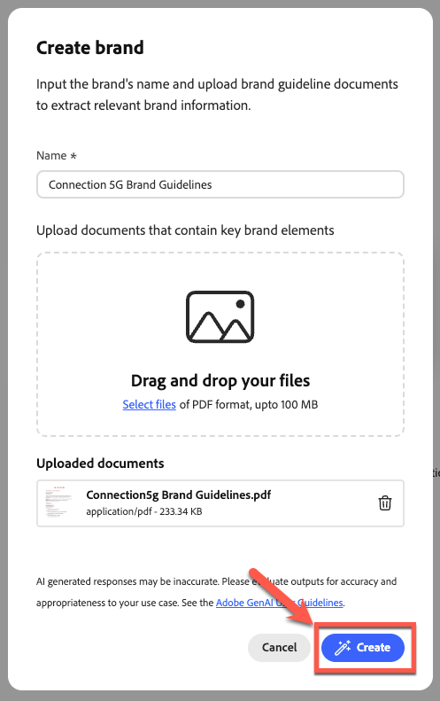

5. Klicken Sie **Marke erstellen**, um die Extraktion zu starten.

   Während AJO Ihre Datei analysiert, wird ein Fortschrittsbildschirm angezeigt. Dieser Vorgang kann je nach Größe des Dokuments mehrere Minuten dauern.

   

6. Sobald die Extraktion abgeschlossen ist:
   - Oben wird eine grüne Bestätigungsleiste angezeigt.
   - Sie werden automatisch zum Bildschirm Markenkonfiguration weitergeleitet.
   - Standards für die Inhalts- und visuelle Erstellung werden jetzt automatisch auf der Grundlage der hochgeladenen Datei mit den Markenrichtlinien ausgefüllt.

   

7. Klicken Sie auf **Veröffentlichen**, um die Markenrichtlinien zu veröffentlichen.

   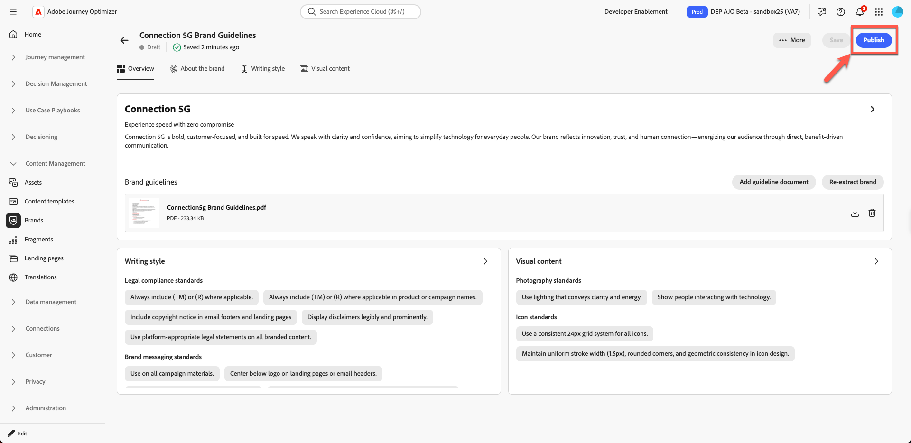

8. Bestätigen Sie mit der Schaltfläche „Veröffentlichen“.

   

   Unten auf der Seite wird eine grüne Bestätigungsleiste angezeigt, die angibt, dass Ihre Marke erfolgreich veröffentlicht wurde.

9. Wenn Sie auf die Hauptseite der Marke klicken, sehen Sie, dass Ihre Marke jetzt live ist (dies sollte durch einen grünen Punkt mit der Bezeichnung **Live“ angezeigt**).

## Überprüfen der Marken-Registerkarten

Sie werden nun die drei wichtigsten Registerkarten überprüfen und verstehen, die für die Verbindung 5G ausgefüllt wurden.

### Über die Marke

Diese Registerkarte definiert die Identität der Marke auf einer allgemeinen Ebene. Sie umfasst in der Regel:

- Markenname
- Grundwerte
- Leitlinien
- Markenzweck und -versprechen
- Das Gefühl, das die Marke schaffen möchte

Alles andere im System baut auf dieser Grundlage auf, daher ist es wichtig, dass diese Registerkarte die wahre DNA von Connection 5G widerspiegelt.

Verbringen Sie einen Moment damit, die extrahierten Felder zu durchsuchen und zu überprüfen, ob sie mit dem Original-PDF übereinstimmen.

### Schreibstil

Die Registerkarte **Schreibstil** definiert, wie die Marke kommuniziert. Dazu gehören:

- Tonrichtlinien
- Aufgaben und Aufgaben
- Beispielsätze und Kernbotschaften
- Schlagzeilen und Slogans
- Rechtliche Regeln, z. B. wann Marken einzubeziehen sind

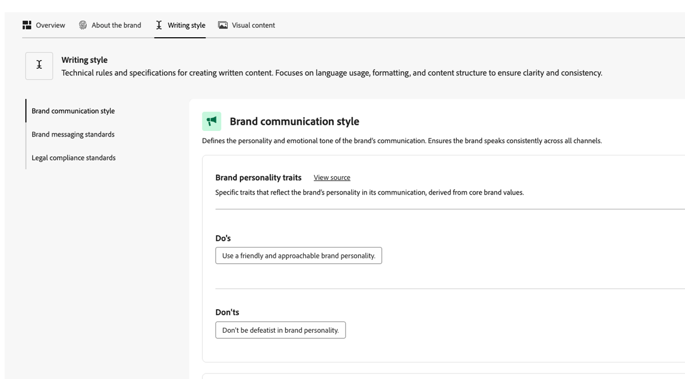

Sie können Regeln in natürlicher Sprache hinzufügen und verfeinern und sie sogar nur auf bestimmte Kanäle wie E-Mail oder SMS anwenden. Dadurch erhalten Sie eine flexible, aber präzise Kontrolle darüber, wie der KI-Assistent und Inhaltsautoren schreiben sollen.

### Visueller Inhalt

Auf der Registerkarte **Visueller Inhalt** wird beschrieben, wie die Marke aussehen sollte. Sie umfasst:

- Fotografiestandards
- Illustrationsstil
- Iconographie-Regeln
- Visuelle Aufgaben und Probleme

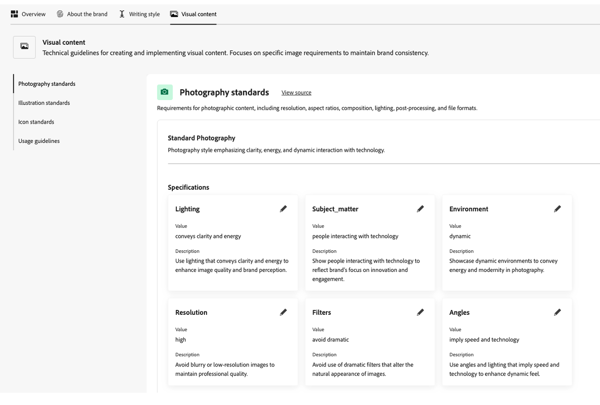

Dadurch wird sichergestellt, dass sich alles von Bildern bis hin zu Symbolen konsistent und auf die Kernwerte von Connection 5G abgestimmt anfühlt.

## Hinzufügen fehlender Visionen und Marktpositionierung

Im extrahierten Inhalt können einige Leitprinzipien unvollständig sein. Vervollständigen Sie sie nun mit dem offiziellen Wortlaut aus der PDF.

1. Klicken Sie auf die Marke, die Sie soeben erstellt haben

   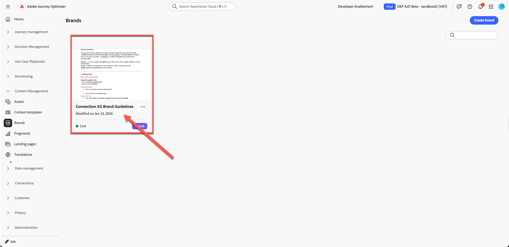

2. Klicken Sie **Marke bearbeiten**. Eine Bestätigungsregisterkarte wird angezeigt. Klicken Sie erneut **Marke bearbeiten** um zu bestätigen.

   

3. Navigieren Sie zur Registerkarte **Über die Marke**.

   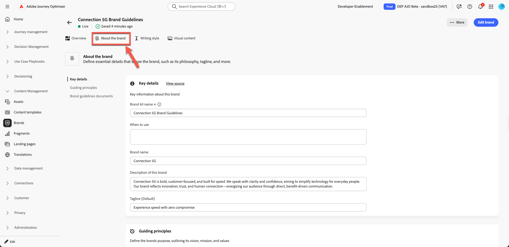

4. Suchen Sie den Abschnitt für **Leitlinien**, **Vision** oder eine ähnliche allgemeine Beschreibung.

   

5. Fügen Sie den folgenden Text hinzu:

   **Vision:**

   >Bieten Sie jedem Einzelnen sofortige, zuverlässige Konnektivität, die das Leben, die Arbeit und das Spiel verbessert, egal wo er sich befindet.

   **Marktpositionierung:**

   >Die 5G-Verbindung bietet einen erstklassigen mobilen Service für digitale Lifestyles, der sich durch unübertroffene Zuverlässigkeit, Einfachheit und zukunftsfähige Innovationen auszeichnet.

   

6. Klicken Sie auf **Speichern**. (Wenn die Schaltfläche **Speichern** nicht angezeigt wird, klicken Sie zuerst auf die Registerkarte **Übersicht** und dann auf **Speichern**.)

>[!TIP]
>
>Sie haben nun sichergestellt, dass der Zweck, die Vision und die Marktpositionierung der Marke in AJO klar dargestellt werden.

## Hinzufügen einer E-Mail-Button-Ausschlussregel

Verbessern Sie als Nächstes die Marke, indem Sie eine Regel hinzufügen, die sicherstellt, dass E-Mail-Schaltflächen nie aufdringlich geschrieben werden.

1. Navigieren Sie zur Registerkarte **Schreibstil**.

   

2. Stellen Sie sicher, dass Sie sich im Abschnitt **Markenkommunikationsstil** befinden.

   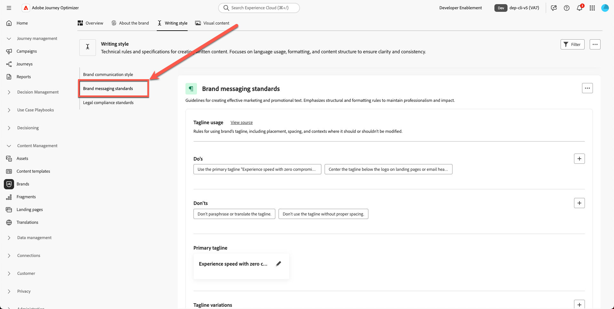

3. Klicken Sie **Bereich &quot;**&quot; auf das **Plus**-Symbol, um eine neue Regel hinzuzufügen.

   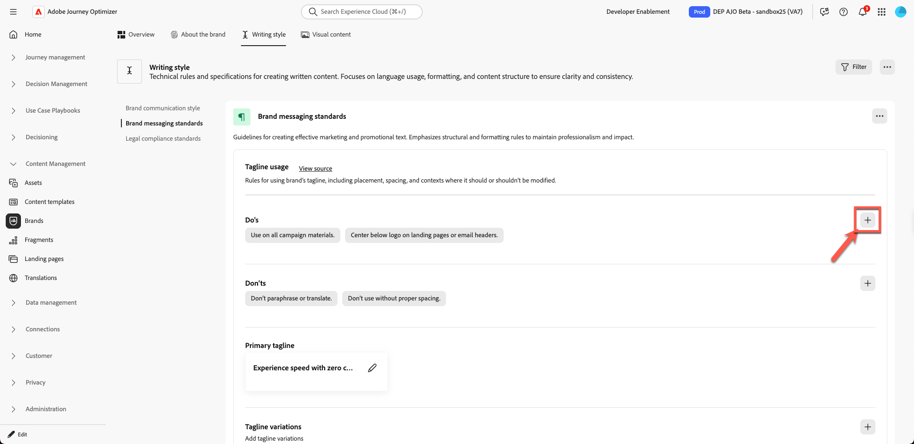

4. Konfigurieren Sie die Regel wie folgt:
   - **Ausschluss:** `Be pushy`

   >[!NOTE]
   >
   >Dies wird als Don&#39;t-Regel hinzugefügt, was bedeutet, dass die Marke keine aufdringlichen CTAs möchte

   **channel:** email

   **element:**-Schaltfläche

5. Klicken Sie **Hinzufügen**.

   

6. Vergewissern Sie sich, dass die neue Don&#39;t-Regel in der Liste als `Be pushy` angezeigt wird.

   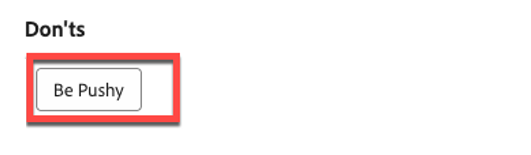

7. Klicken Sie auf **Speichern**.

Diese Regel gilt überall dort, wo KI-Assistent oder Autoren an einer E-Mail-Schaltflächenkopie arbeiten, wobei die CTAs mit dem Verbindungs-5G-Ton ausgerichtet bleiben.

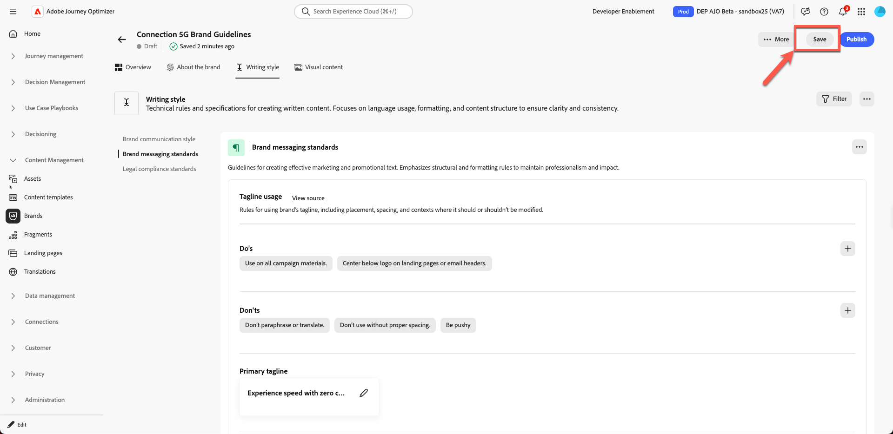

>[!NOTE]
>
>Möglicherweise werden andere „Nicht“-Regeln aufgelistet, die nicht genau mit dem Screenshot übereinstimmen. Ignorieren Sie dies, da es erwartetes Verhalten ist.

## Veröffentlichen der Markenrichtlinien

Wenn Sie mit der Konfiguration zufrieden sind:

1. Kehren Sie zur Registerkarte **Übersicht** zurück. Klicken Sie auf **Speichern**.
2. Klicken Sie oben rechts auf &quot;**&quot;**.

   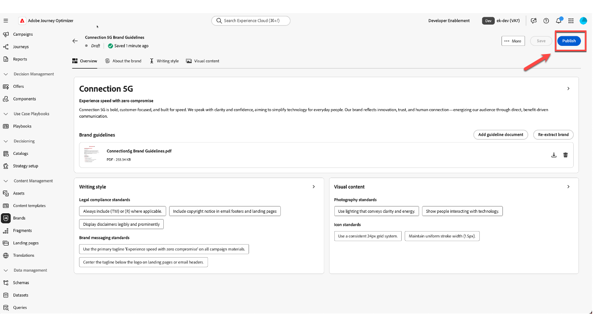

3. Es wird ein Bestätigungsdialogfeld angezeigt, in dem erklärt wird, dass Sie im Begriff sind, die aktualisierten Markenrichtlinien für Verbindung 5G zu veröffentlichen. Klicken **zur Bestätigung erneut** Veröffentlichen“.

   

4. Warten Sie, bis die grüne Bestätigungsleiste angezeigt wird.
5. Klicken Sie auf **Zurück**, um zur Liste der Marken zurückzukehren.
6. Vergewissern Sie sich, dass eine neue Karte für **Richtlinien für die 5G-Markenbezeichnung** mit dem Status „Live“ und „Verfügbar“ angezeigt wird.

Ihre Marke ist jetzt in Adobe Journey Optimizer live und kann verwendet werden.

## Zusammenfassung

In diesem Modul haben Sie folgende Möglichkeiten:

- Lesen Sie die Verbindungs-5G-Markenrichtlinie PDF.
- Neue Marke für Connection 5G in Adobe Journey Optimizer erstellt.
- hat die Datei mit den Markenrichtlinien hochgeladen und AJO die Extraktion der wichtigsten Informationen ermöglicht.
- hat die Registerkarten „Über die Marke“, „Schreibstil“ und „Visueller Inhalt“ überprüft und verfeinert.
- Es wurde eine spezifische Ausschlussregel hinzugefügt, sodass E-Mail-Schaltflächen nie gepusht werden.
- hat die Marke veröffentlicht, damit sie den KI-Assistenten, die Markenausrichtung, Vorlagen und Fragmente unterstützen kann.

Sie haben jetzt ein vollständig konfiguriertes und veröffentlichtes Markenprofil **Connection 5G**, das im Rest des Labors verwendet wird, um alle Inhalte markenintern zu halten.
