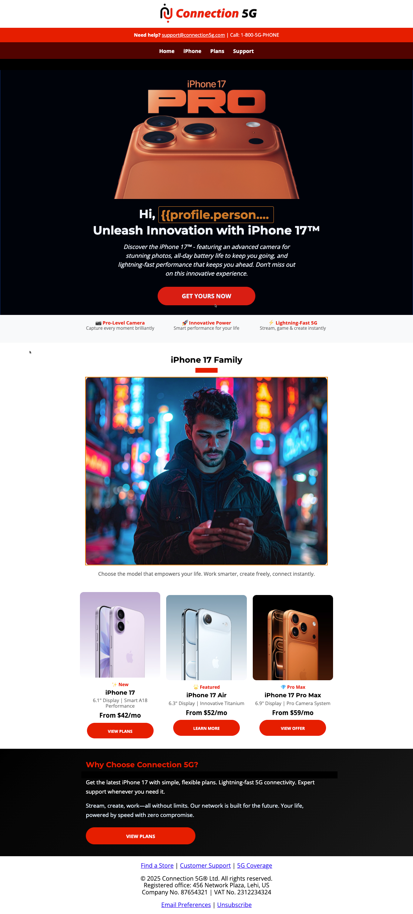
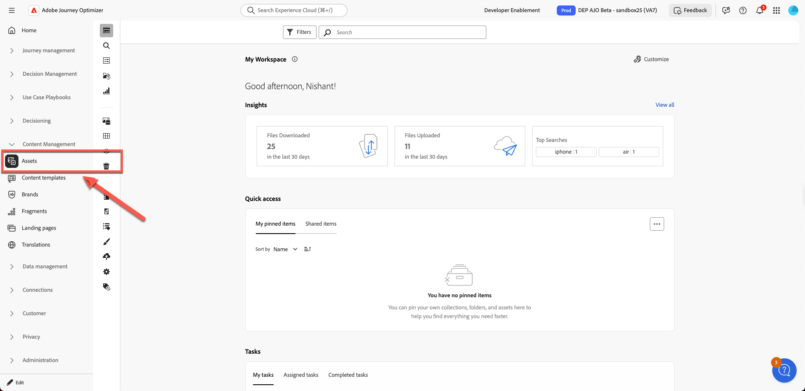
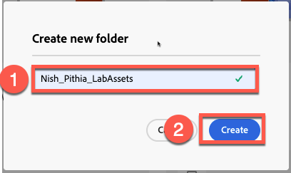
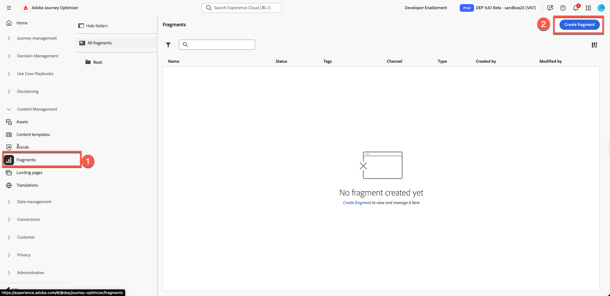
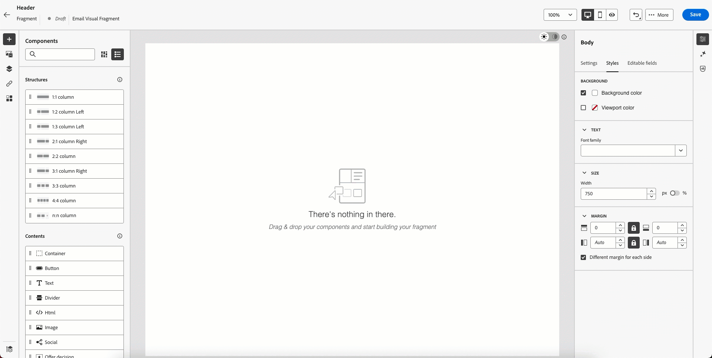
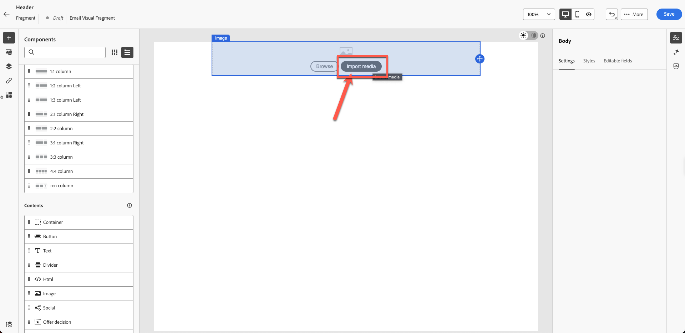
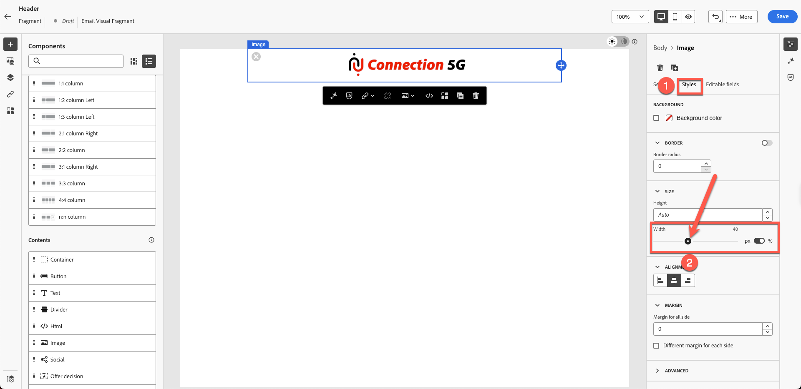
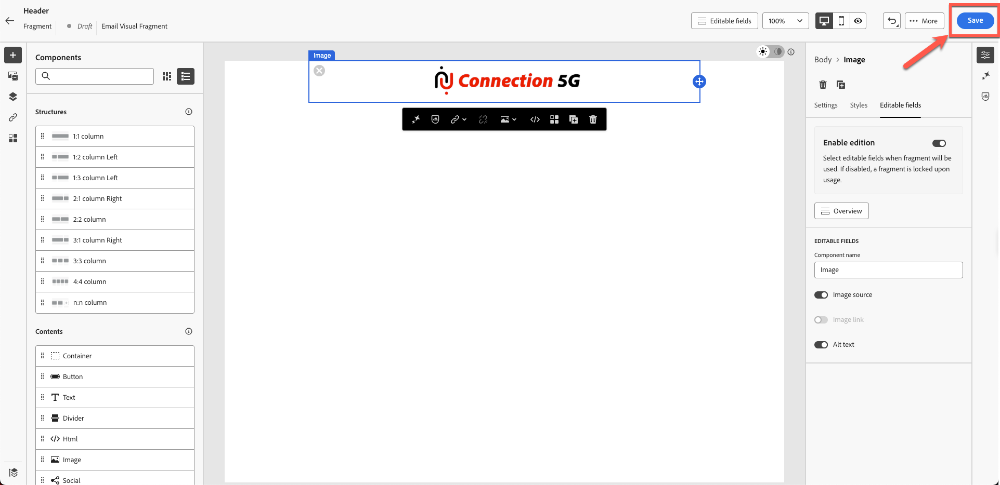
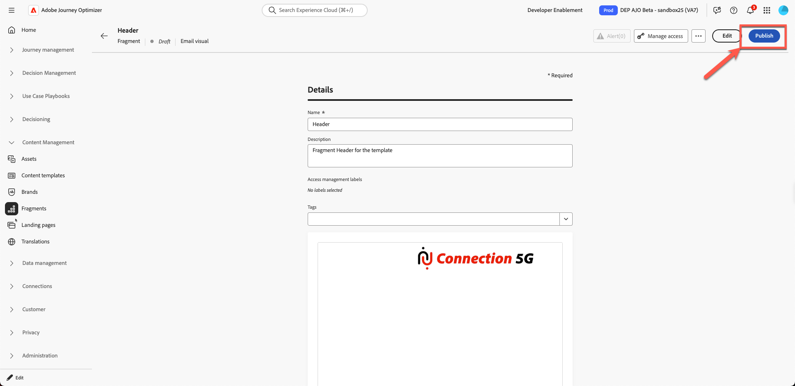
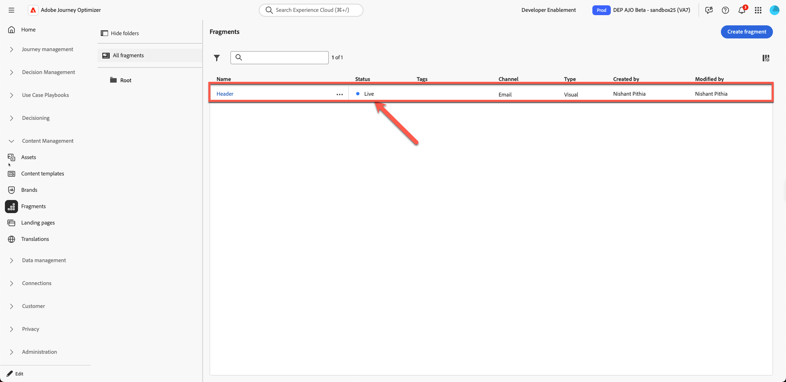

# Erstellen von Inhaltsfragmenten

## Inhaltserstellung mit Vorlagen und Fragmenten

**Zweck:** Erfahren Sie, wie Sie wiederverwendbare Fragmente in Adobe Journey Optimizer erstellen und sie dann in einer echten E-Mail in einem Journey anwenden.

## Lernziele

Am Ende dieses Moduls haben Sie folgende Möglichkeiten:

1. Unterteilen Sie ein E-Mail-Design in wiederverwendbare Fragmente.
1. Erstellen Sie Header-, Footer-, Banner-, Body- und CTA-Fragmente.

## Warum Fragmente wichtig sind

Mit Fragmenten können Sie konsistente, markenorientierte Inhalte erstellen, die in E-Mails, Kampagnen und Journey wiederverwendet werden können.

### Fragmente

Wiederverwendbare Bausteine wie:

- Kopfzeilen
- Footers
- CTAS
- Banner
- Rechtliche Haftungsausschlüsse

Jedes Mal, wenn ein Fragment aktualisiert wird, werden alle E-Mails, die es verwenden, automatisch aktualisiert.

## Wie dies in die E-Mail-Erstellung passt

- **Erstellen Sie Fragmente** für Elemente, die sich nur selten ändern.
- **Erstellen Sie eine Vorlage** die diese Fragmente verwendet.
- **Verwenden Sie die Vorlage** in Ihrer Kampagnen-E-Mail und passen Sie ihren Inhalt an.

Nachfolgend finden Sie die endgültige E-Mail, die Sie aus diesem Labor erstellen werden.

Das Design-Team stellt Ihnen jedoch normalerweise Vorlagen wie diese zur Verfügung:

## Schritt 1: Erstellen Sie Inhaltsfragmente

Die folgende Vorlage ist eine allgemeine Design-Vorlage, und unser Ziel ist es, sie in wiederholbare Inhaltsblöcke aufzuteilen. In Adobe Journey Optimizer wird dies als &quot;**&quot;**.

Der erste Schritt besteht darin, festzustellen, wie viele Fragmente wir erstellen müssen. In dieser Vorlage ist es sinnvoll, wie unten gezeigt 5 Fragmente zu verwenden.

Wir haben die Vorlagen identifiziert, die 5 Fragmente erfordern wie folgt.

- Kopfzeile
- Banner
- CTA
- Textkörper
- Footer

>[!NOTE]
>
>Für diese Übung erstellen Sie nur ein Header-Fragment, um Zeit zu sparen.

Erstellen Sie zunächst ein Header-Fragment. Richten Sie jedoch vor dem Erstellen des Fragments einen Asset-Ordner ein, da die Assets-Umgebung freigegeben ist. Erstellen Sie dazu zunächst einen eigenen Ordner.

1. Suchen Sie in der linken Navigation den Abschnitt **Content-Management** und klicken Sie auf **Assets**.

2. Klicken Sie im Abschnitt &quot;Assets-**&quot; auf** Assets.

3. Erstellen Sie einen Ordner, indem Sie auf **Schaltfläche „Ordner erstellen** klicken.

4. Geben Sie einen Namen wie Ihren Vor- und Nachnamen an. Beispiel: Nish\_Pithia\_LabAssets (Etwas, an das Sie sich erinnern können)

5. **Neues Fragment erstellen:** Klicken Sie unter „Content-Management“ auf **Fragmente** und erstellen Sie ein neues Fragment.

   

   Geben Sie einen Anzeigenamen wie unten gezeigt an. Fügen Sie alle Details wie folgt hinzu:

   **name:**-Kopfzeile

   **Beschreibung:** Fragment-Kopfzeile für die Vorlage

   **Typ:** visuelles Fragment auswählen

   

6. Klicken Sie oben **auf** Schaltfläche „Erstellen“.

Dadurch wird ein leerer Bildschirm zur Fragmenterstellung geöffnet.

7. Klicken Sie unter Strukturen auf 1:1 Spalten und ziehen Sie wie unten dargestellt auf die Arbeitsfläche. (Bitte klicken Sie auf das Bild unten, um eine animierte Grafik zu sehen)

8. Ziehen Sie als Nächstes &quot;**image** auf die gerade hinzugefügte Zeile 1:1 .

9. Laden Sie das bereitgestellte Logo-Bild hoch. Klicken Sie auf **Schaltfläche „Medien importieren“**

10. **Logo hochladen:** Laden Sie das Logo (*C5G-Logo.png*) aus dem Toolkit-Ordner mit Bildern hoch und klicken Sie auf Weiter.

11. Wählen Sie den **Asset-Ordner** aus, den Sie erstellt haben, und klicken Sie dann auf **Importieren**. Die Datei wird im Ordner gespeichert.

12. Das Logo ist korrekt platziert, aber es ist zu groß und muss in der Größe verändert werden. Um die Größe des Logos zu ändern, aktualisieren Sie seine Eigenschaften. Klicken Sie auf **Registerkarte Stil** und legen Sie die Breite auf 40 % fest, indem Sie den Schieberegler ziehen, wie unten dargestellt.

>[!NOTE]
>
>Beachten Sie, dass, wenn die Umschalter-Schaltfläche aktiviert ist, die 40-Zahl für % und nicht für Pixel steht. Wenn Sie einen absoluten Wert für die perfekte Pixelanzahl wünschen, schalten Sie die Schaltfläche auf px um.

13. Klicken Sie auf **Speichern** und Ihr Fragment wird gespeichert. Bei der Bestätigung wird eine Benachrichtigung mit einem grünen Balken angezeigt.

14. Das Fragment wird im Entwurfsmodus gespeichert. Bevor Sie sie verwenden, müssen Sie sie veröffentlichen. Klicken Sie auf die Schaltfläche **Zurück**.

15. Klicken Sie auf **Schaltfläche „Veröffentlichen**. Es wird die Meldung „Fragment wird veröffentlicht, dies kann einige Zeit dauern. Wir benachrichtigen Sie, sobald dies geschehen ist.“ Bei Bestätigung. Ihr Fragment ist bereit für die Vorlagenerstellung.

Sie sehen den Statuswechsel zu **„Live“**. An dieser Stelle ist der Aufbau eines Header-Fragments abgeschlossen, das im nächsten Schritt verwendet wird.

>[!NOTE]
>
>In dieser Übung haben Sie nur ein Fragment erstellt. In der Praxis können Architekten mehrere Fragmente erstellen, z. B. Kopf- und Fußzeilen oder andere wiederverwendbare Komponenten.

## Zusammenfassung

In diesem Modul haben Sie erfolgreich:

- Aufschlüsselung einer E-Mail in wiederverwendbare Header-Fragmente
- Erstellen von Kopfzeilen-Inhaltsblöcken

Sie können jetzt mit dem nächsten Modul fortfahren: **Erstellen einer Inhaltsvorlage** in dem Sie das von Ihnen erstellte Fragment zur Erstellung einer neuen Vorlage verwenden.
