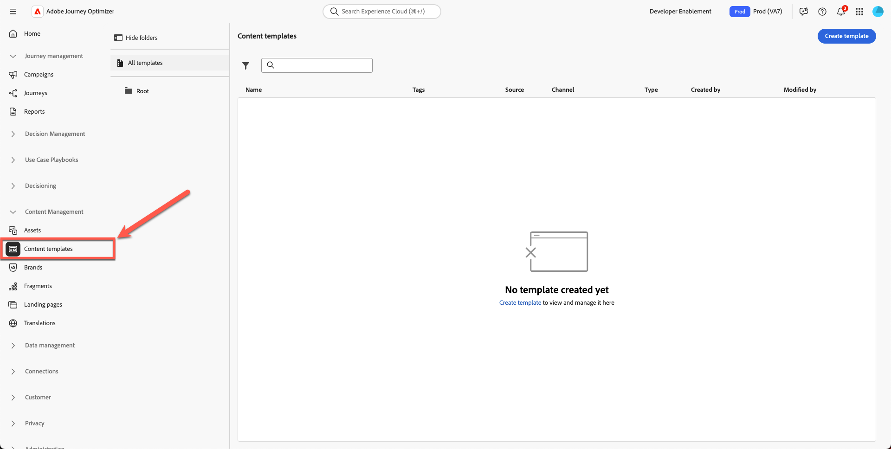
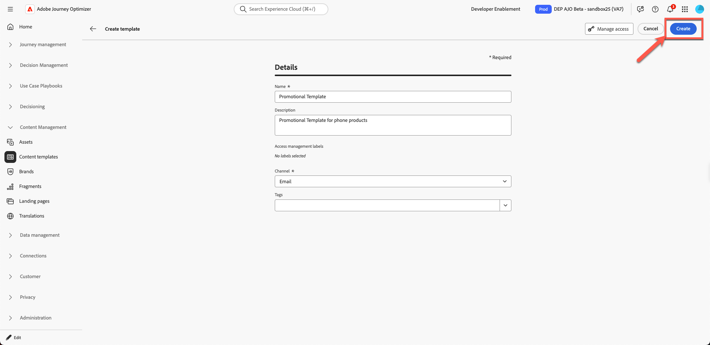
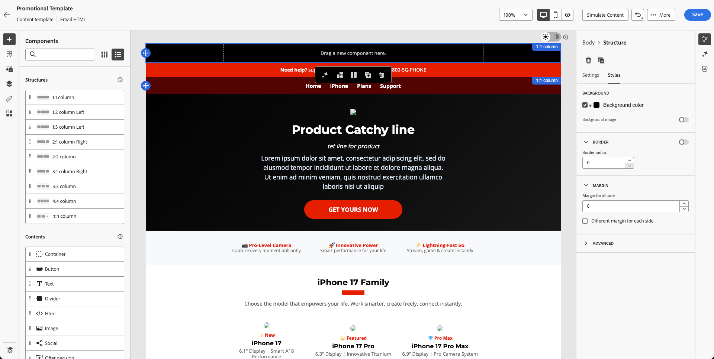
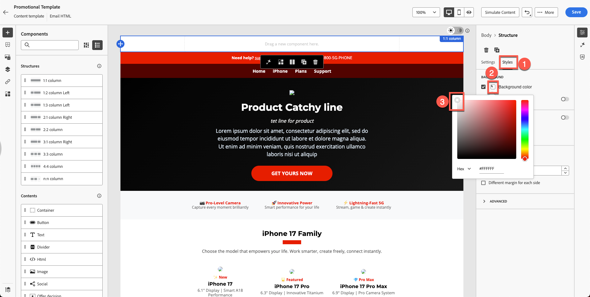
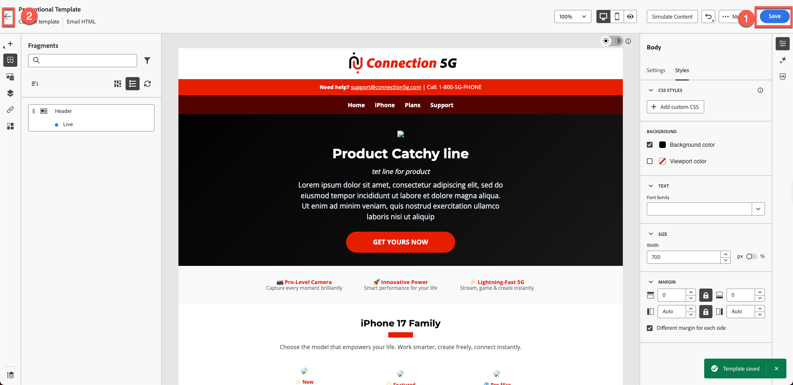

# Erstellen einer Inhaltsvorlage

## Inhaltserstellung mit Vorlagen und Fragmenten

**Zweck:** Erfahren Sie, wie Sie wiederverwendbare Vorlagen in Adobe Journey Optimizer erstellen.

## Lernziele

Am Ende dieses Moduls haben Sie folgende Möglichkeiten:

1. Erstellen Sie eine vollständige E-Mail-Vorlage mit importiertem HTML und Fragmenten.

## Warum Vorlagen wichtig sind

Mit Vorlagen können Sie konsistente, markenorientierte Inhalte erstellen, die in E-Mails, Kampagnen und Journey wiederverwendet werden können.

### Vorlagen

Blueprints mit folgender Struktur:

- Header-Platzierung
- Body-Inhaltsbereich
- Bereich der Fußzeile
- Standard-Layout-Stile

Vorlagen sorgen für eine Team-übergreifende Markenkonsistenz und sparen viel Erstellungszeit.

## Erstellen einer neuen Vorlage mit Fragmenten

Mithilfe von Vorlagen können Benutzer die vollständigen Layouts in Kampagnen wiederverwenden. Inhaltsvorlagen in Adobe Journey Optimizer sind leistungsstarke Tools, die die Erstellung wiederverwendbarer Inhalte für Kampagnen und Journey vereinfachen und optimieren. Unabhängig davon, ob Sie E-Mail-, SMS- oder Push-Benachrichtigungs-Vorlagen erstellen, sparen Sie Zeit, indem Sie vordefinierte Strukturen bereitstellen, die einfach angepasst und projektübergreifend freigegeben werden können.

Für einen beschleunigten und verbesserten Design-Prozess erstellen Sie eigenständige Vorlagen, um benutzerdefinierte Inhalte in Journey Optimizer-Kampagnen und -Journey einfach wiederzuverwenden.

Diese Funktion ermöglicht inhaltsorientierten Benutzenden die Arbeit an Vorlagen außerhalb von Kampagnen oder Journey. Marketing-Benutzer können diese eigenständigen Inhaltsvorlagen dann in ihren eigenen Journey oder Kampagnen wiederverwenden und anpassen.

## Vorlage erstellen

1. Navigieren Sie **Content-Management → Inhaltsvorlagen**.

&#x200B;2. Klicken Sie **Vorlage erstellen** und füllen Sie Folgendes aus:
   - **name:** `Promotional Template`
   - **Beschreibung:** `Promotional Template for phone products`
   - **channel:** `Email`

&#x200B;3. Wählen Sie **Erstellen** aus.

## Betreffzeile hinzufügen und Email Designer öffnen

1. Betreffzeile hinzufügen: `Promotional Template` und klicken Sie auf **auf den E-Mail-**, um ihn zur Bearbeitung zu öffnen

&#x200B;2. Es werden drei Optionen angezeigt:
   1. Von Grund auf gestalten
   2. Eigenen Code erstellen
   3. HTML importieren

Wählen Sie die dritte Option aus. Klicken Sie **HTML importieren**

## Importieren der bereitgestellten HTML-Vorlage

1. Hochladen der HTML-Vorlagendatei aus dem Toolkit-Ordner `promotional-template-final.html`

&#x200B;2. Klicken Sie auf die Schaltfläche Importieren **importieren** um die Vorlage zu importieren.

&#x200B;3. Warten Sie, bis das Layout gerendert wird. Sie bemerken Probleme wie fehlerhafte Bild-Links und fehlendes Branding. (Dies ist das erwartete Verhalten, da wir über Platzhalter-Assets verfügen)

## Erkunden der Vorlagenstruktur

### Linkes Bedienfeld

Die Komponenten **Strukturen** und **Inhalte** in Adobe Journey Optimizer (AJO) sind wesentliche Elemente, die beim Entwerfen von E-Mails, Landingpages und Inhaltsfragmenten verwendet werden. Strukturen definieren das Layout-Framework, während Inhalte die tatsächlichen Bausteine bereitstellen, die innerhalb dieser Layouts platziert sind.

Der Hauptteil-Abschnitt in Adobe Journey Optimizer ist der Haupt-Container für Ihre E-Mail oder Ihren Seiteninhalt. Er dient als Stamm für den visuellen Design-Bereich, in dem alle Strukturkomponenten (Spalten, Layouts) und Inhaltskomponenten (Text, Bilder, Schaltflächen usw.) verschachtelt sind.

### Rechtes Bedienfeld

Mit den Optionen **Einstellungen** und **Stil** im Hauptteil von Adobe Journey Optimizer können Sie das grundlegende Erscheinungsbild und Layout Ihrer E-Mail oder Seite definieren. Diese Steuerelemente wirken sich auf das gesamte Design aus, da der Hauptteil allen Komponenten übergeordnet ist.

In der Leiste auf der linken Seite finden Sie Abschnitte für:

- Fragmente
- Dateien
- Körperstruktur
- Getrackte URLs

Das Header-Fragment, das Sie in der vorherigen Übung erstellt haben, wird hier angezeigt, wie unten dargestellt. Stellen Sie sicher, dass Ihr Header-Fragment mit einem blauen Punkt live angezeigt wird und sich nicht im Entwurfsmodus befindet. Verbringen Sie Zeit mit der Überprüfung der übrigen Abschnitte.

&#x200B;> [!NOTE]
>
>Wenn Ihr Fragment hier nicht angezeigt wird, bedeutet dies, dass Sie es nicht ordnungsgemäß gespeichert haben und erneut hochladen müssen.

## Einfügen von Header-Fragmenten

Verbessern Sie jetzt die Vorlage . Sie haben die Kopf- und Fußzeile bereits erstellt.

1. Ziehen Sie eine **1:1-Spalte** über den vorhandenen Inhalt.

Man sieht so etwas.

&#x200B;2. Ihr Hintergrund verwendet die Hintergrundfarbe der Vorlage, die derzeit schwarz ist. Legen Sie die **Hintergrundfarbe“ auf Weiß fest. Klicken** auf die Registerkarte Stil in der rechten Leiste und verwenden Sie eine weiße Farbe aus der Farbauswahl.

&#x200B;3. Öffnen Sie **Fragmente** und ziehen Sie das **Header**-Fragment hinein.

&#x200B;4. Beachten Sie, dass das Header-Fragment wie unten dargestellt sauber an Ihrer Vorlage ausgerichtet ist.

&#x200B;5. Klicken Sie auf **Speichern**, um Ihre Vorlage zu speichern, und klicken Sie dann auf **Zurück**.

>[!NOTE]
>
>Beachten Sie, dass möglicherweise einige beschädigte Bilder angezeigt werden. Wir werden das später in Ordnung bringen.

## Zusammenfassung

In diesem Modul haben Sie erfolgreich:

- HTML importiert, um eine vollständige Werbevorlage zu erstellen

Sie können jetzt mit dem nächsten Modul fortfahren: **E-Mail erstellen**
