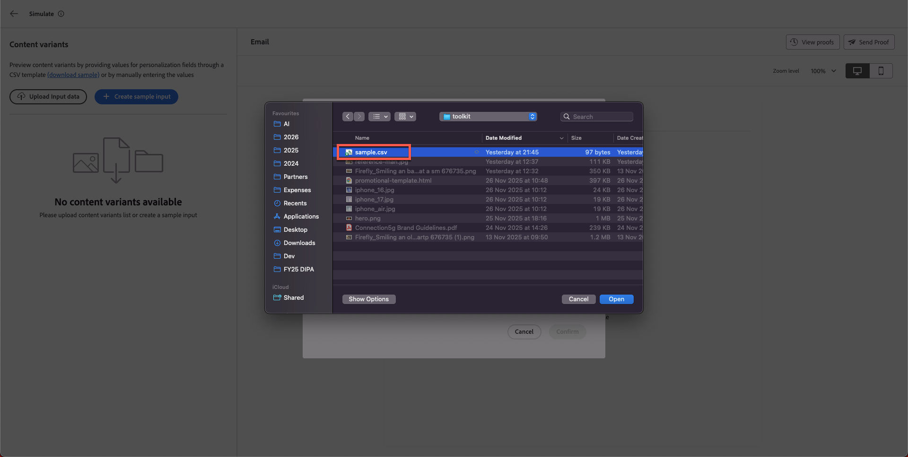
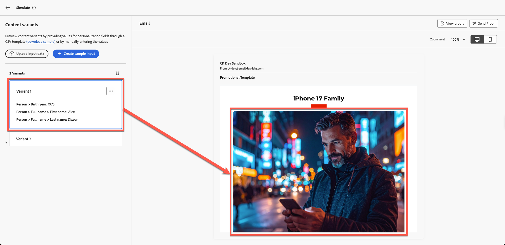
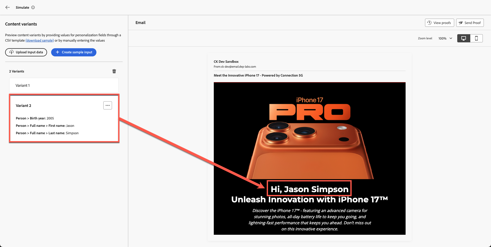

# Inhaltsimulation

**Zweck:** Validieren von Personalisierung, Bedingungslogik und Inhaltsvarianten mithilfe der Simulations- und Testversand-Tools von Adobe Journey Optimizer.

## Lernziele

Am Ende dieses Moduls haben Sie folgende Möglichkeiten:

1. Hochladen und Verwenden von Testprofildaten für die Simulation.
1. Validieren von personalisierten Feldern und Variantenlogik.
1. Testen Sie das Fallback-Verhalten auf fehlende oder nicht übereinstimmende Daten.

## Einführung

In diesem letzten Modul testen Sie Ihre E-Mail mit **zwei bedingten Varianten** mithilfe des Simulationstools in Adobe Journey Optimizer.
Auf diese Weise können Sie sich eine Vorschau davon ansehen, wie Ihre personalisierte Nachricht verschiedenen Kundinnen und Kunden angezeigt wird, und so die Genauigkeit gewährleisten, bevor Sie die Kampagne starten.

Sie verwenden die Beispieltestprofildatei **sample.csv** aus Ihrem Toolkit.

## Öffnen des Simulationstools

1. Öffnen Sie die abgeschlossene E-Mail.
1. Klicken Sie **Inhalt simulieren**.
1. Wählen **Inhaltsvariante simulieren** aus.

Nach einigen Sekunden wird ein Simulationsfenster geöffnet.

## Hochladen der Testprofildaten

1. Öffnen Sie **sample.csv** über den Toolkit-Ordner.
   - **Alex** → Über 40 Jahre alt
   - **Jason** → Unter 40 Jahre alt
2. Klicken Sie **Eingabedaten hochladen**.

   

3. Wählen Sie **sample.csv** aus und klicken Sie auf **Weiter**.

AJO verarbeitet die Datei und bereitet die Vorschau vor.

## Varianten-Rendering überprüfen

AJO zeigt beide Varianten basierend auf den hochgeladenen Profilen nebeneinander an.

**Erwartete Ergebnisse:**

- **Alex** → sieht **Variante 1** (Alter über 40)

Wenn Sie nach oben scrollen, sehen Sie auch personalisierte Felder mit dem Namen jetzt, wie Sie unten sehen können.

- **Jason** → sieht **Variante 2** (Alter unter 40)

Mit Jasons vollem Namen auch. Wie cool ist das denn!

## Fallback-Verhalten überprüfen

**Fallbacks und Standardeinstellungen:** Sie, dass Ihre E-Mail fehlende Daten oder Szenarien, in denen keine Übereinstimmung erzielt werden kann, ordnungsgemäß verarbeitet. Simulieren Sie beispielsweise ein Profil mit einem leeren Feld „Geburtsjahr“ oder eines, das für kein Zielangebot qualifiziert ist. Die Vorschau sollte entweder einen standardmäßigen Inhaltsbaustein oder einen sinnvollen Platzhalter anstelle von beschädigtem oder leerem Inhalt anzeigen. Wenn Ihre Simulation einen leeren Abschnitt anzeigt, in dem die Inhalte sein sollten, bedeutet dies, dass Sie möglicherweise ein Fallback-Angebot oder Standardtext in Ihrem Design konfigurieren müssen.

## Zusammenfassung

In diesem Modul haben Sie erfolgreich:

- Simulierte personalisierte Inhalte mithilfe von Beispielprofilen
- Validierte Variantenwechsellogik
- Bestätigte personalisierte Felder werden korrekt ausgefüllt

Sie sind nun bereit für das nächste Modul: **Markenausrichtung**,
wo Sie Ihre E-Mail anhand der Richtlinien für die 5G-Marke von Connection mithilfe von KI bewerten werden.
