# E-Mail erstellen

## Inhaltserstellung mit Vorlagen

**Zweck:** Erfahren Sie, wie Sie wiederverwendbare Vorlagen in Adobe Journey Optimizer erstellen und sie dann in einer echten E-Mail innerhalb einer Kampagne anwenden.

## Lernziele

Am Ende dieses Moduls haben Sie folgende Möglichkeiten:

1. Erstellen Sie eine neue Kampagne und verwenden Sie Ihre neue gebrandete Vorlage.
1. Aktualisieren Sie Hero-Bilder, Produktbilder, Schaltflächen und Layout-Stile.

## Erstellen und Aktualisieren der E-Mail in einer Kampagne

### Ziel

In dieser Übung erfahren Sie, wie Sie die von Ihnen erstellte Vorlage auf eine E-Mail in einem Journey anwenden. In einem idealen Szenario können Sie jede vorhandene Journey oder Kampagne verwenden und ihren E-Mail-Inhalt durch eine standardisierte Vorlage ersetzen, um Markenkonsistenz und eine schnellere Ausführung sicherzustellen.

Dieser Schritt zeigt, wie Vorlagen in allen Journey wiederverwendet werden können, sodass Teams Designs aktualisieren können, ohne E-Mails von Grund auf neu erstellen zu müssen.

## Neue E-Mail-Kampagne erstellen

1. Kehren Sie zum Hauptbildschirm zurück und klicken Sie auf **Kampagnen → Journey**.
2. Klicken Sie auf **Kampagne erstellen**

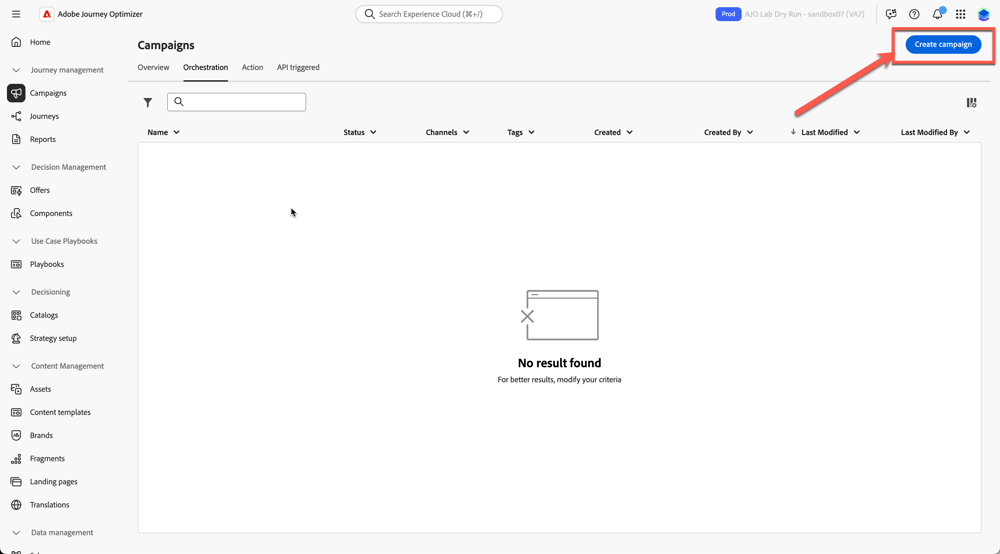

&#x200B;3. Wählen Sie &quot;**Orchestrierung - Marketing** aus und klicken Sie auf **Bestätigen**

&#x200B;4. Benennen Sie Ihre `Flagship Phone Launch Branded`. Drücken Sie **Speichern**.

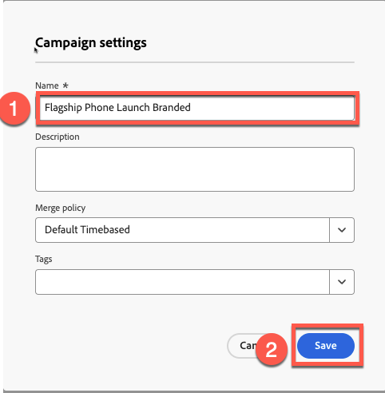

&#x200B;5. Klicken Sie auf das **+-** und wählen Sie die Aktivität **Zielgruppe lesen** aus

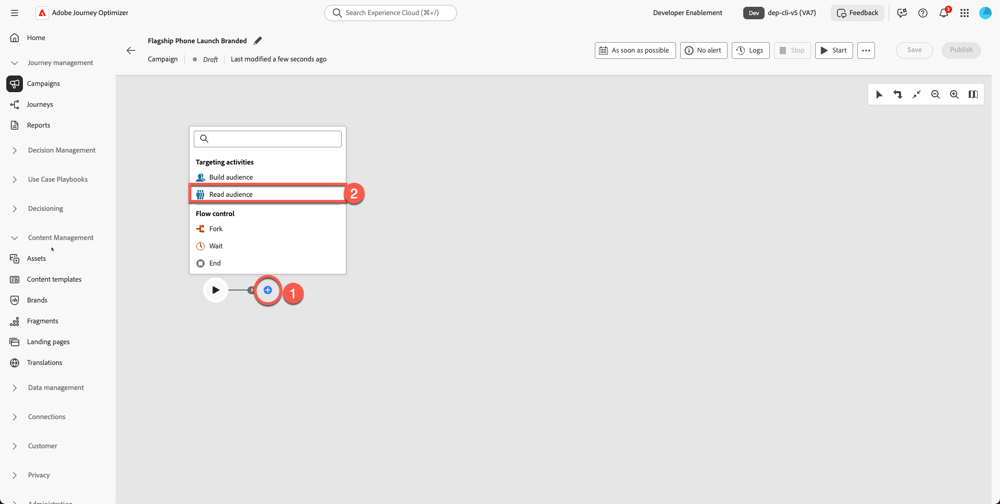

&#x200B;6. Der nächste Schritt besteht darin, **Feld „Zielgruppe lesen** auszuwählen und auf das Symbol **Zielgruppenordner“ zu klicken**

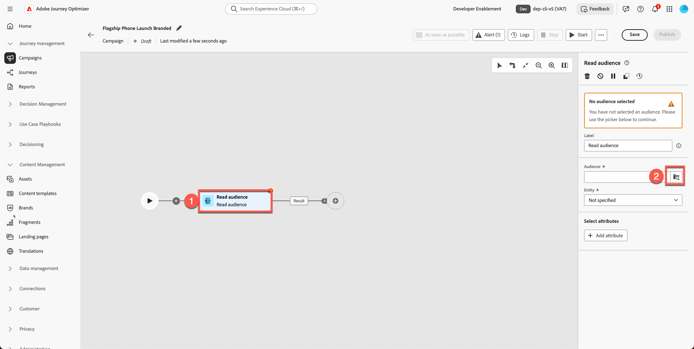

&#x200B;7. Wählen Sie die **dep: Interested in iPhone 17** Audience aus und klicken Sie auf **Schaltfläche „Audience hinzufügen**.

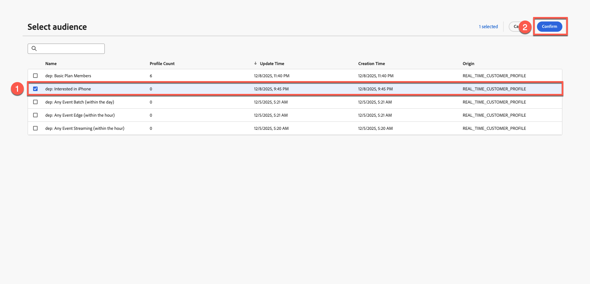

&#x200B;8. Entität auswählen - **dep-rel: Kundenkonto - customer\_id** (oder beliebige, da es für diesen Teil nicht von Bedeutung ist)
&#x200B;9. Fügen Sie die Aktivität **E-Mail** hinzu, indem Sie auf **+** klicken und dann **E-Mail** aus den Kanalaktivitäten auswählen.

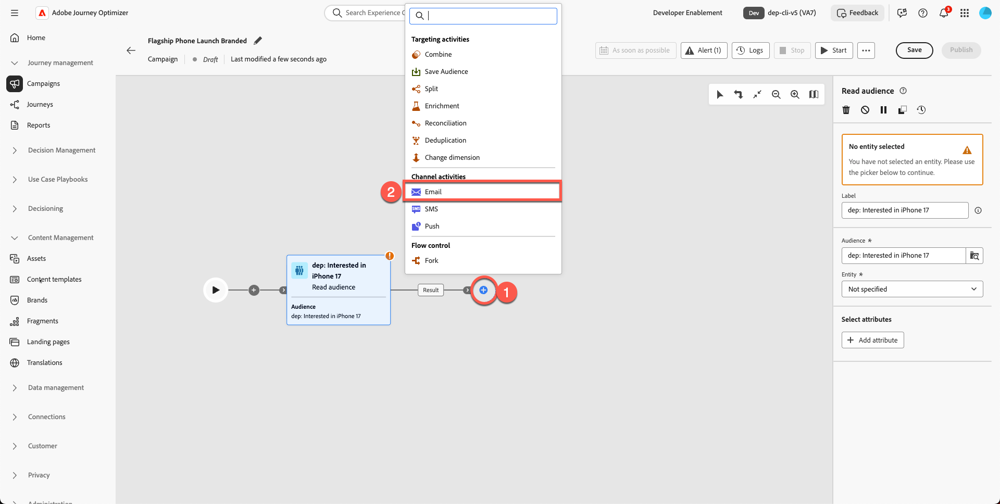

&#x200B;10. Klicken Sie auf **E-Mail**.

&#x200B;11. Klicken Sie auf die **Aktion** und wählen Sie **Ihre** E-Mail-Konfiguration aus. Ihre Sandbox zeigt dies möglicherweise als relationale E-Mail an. (Beliebig auswählen)

&#x200B;12. Klicken Sie auf **Registerkarte Inhalt**

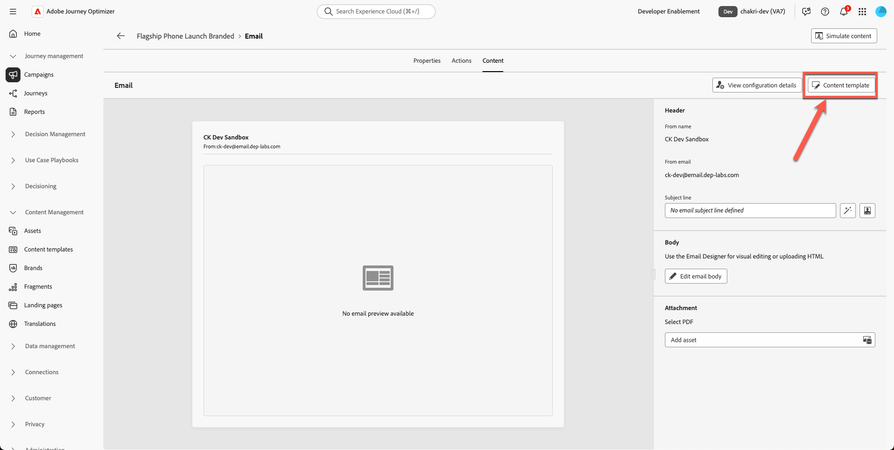

&#x200B;13. Klicken Sie auf **Inhaltsvorlage anwenden**

&#x200B;14. Wählen Sie die von Ihnen erstellte Vorlage **„Werbevorlage** aus und klicken Sie auf **Bestätigen**

&#x200B;15. Klicken Sie auf **E-Mail-Textkörper bearbeiten**

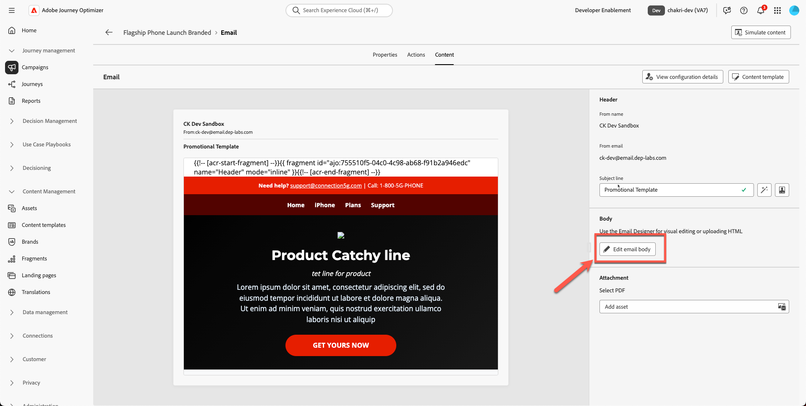

&#x200B;16. Bestätigen Sie, dass die neuen Kopfzeilen-, Helden-, Fußzeilen- und Inhaltsblöcke korrekt angezeigt werden.

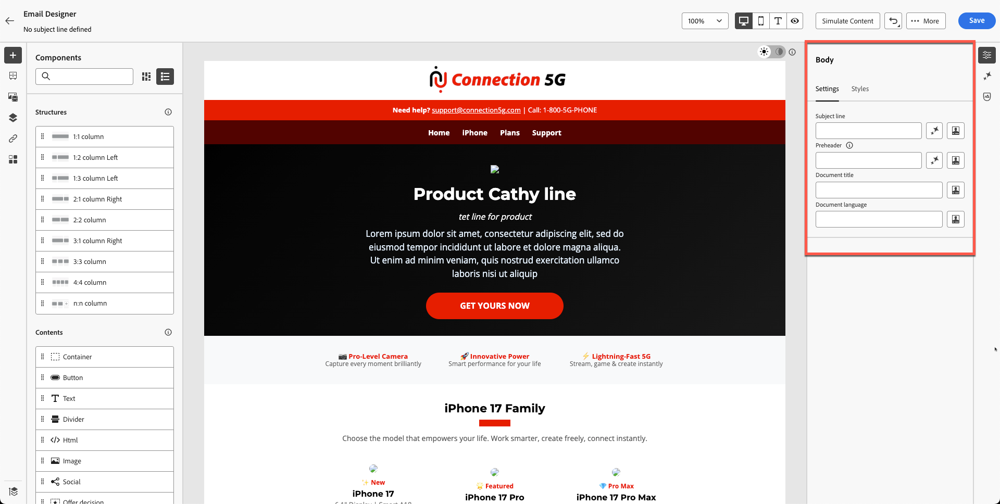

## Hero-Bild und Produktbilder ersetzen

Ändern Sie die Bilder von Helden und Telefonen. Sie müssen Inhalte aus dem Toolkit-Ordner in Assets hochladen. Derzeit ist das Bannerbild für den Produktheld ein Platzhalter.

1. Klicken Sie auf das beschädigte Hero-Bannerbild.

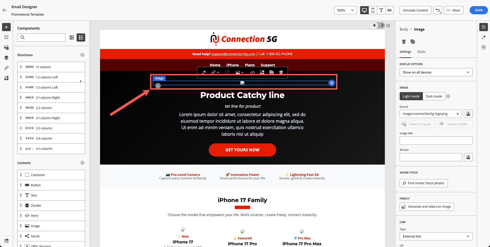

&#x200B;2. Entfernen Sie die temporäre Quell-URL.

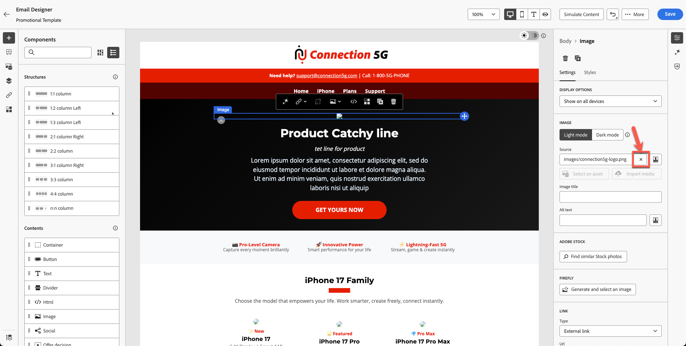

&#x200B;3. Klicken Sie auf **Medien importieren**

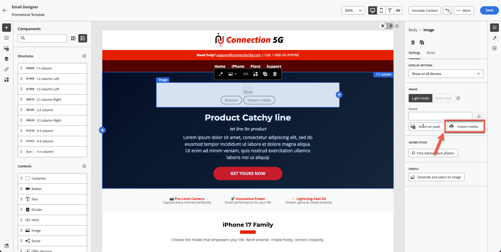

&#x200B;4. Laden Sie `hero.png` aus Ihrem Toolkit hoch. (Sie können die Datei ziehen)

&#x200B;5. Klicken Sie auf **Weiter** Wählen Sie **Ihren Ordner für Assets** und drücken Sie **Importieren**

&#x200B;6. Ihre E-Mail-Vorlage kommt gut an. Sie sieht wie folgt aus. Klicken Sie auf **„Speichern“** um Ihre Arbeit zu speichern.

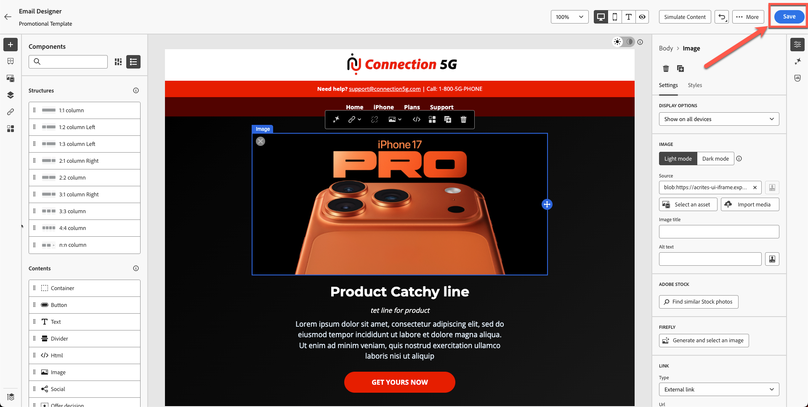

## Optionale Übung

### Produktbilder ersetzen

Aktualisieren Sie dann alle Produktbilder (Bilder aus dem Toolkit-Ordner) und fügen Sie Ihren Wünschen einen abgerundeten Rahmen hinzu. Ihre E-Mail sieht ohne fehlerhafte Links schöner aus, wie unten dargestellt. Wiederholen Sie den Vorgang für alle Produktkarten.

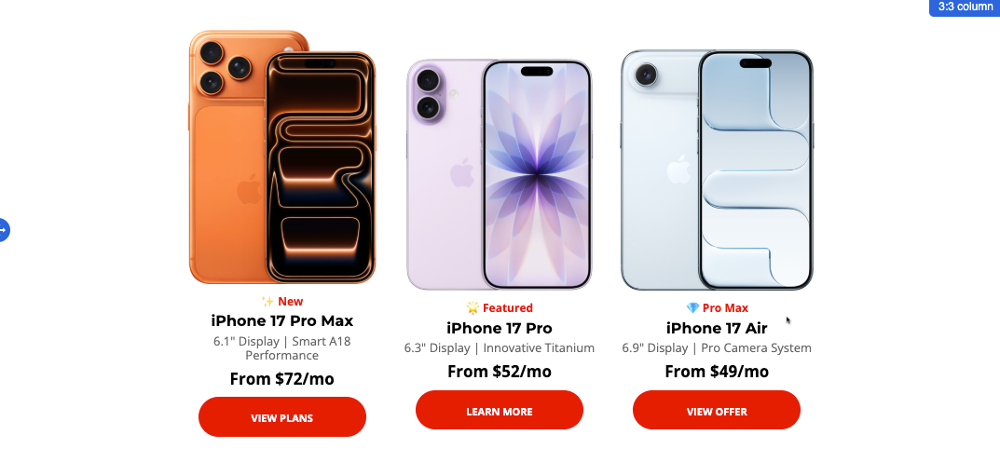

## Zusammenfassung

In diesem Modul haben Sie erfolgreich:

- Neue Kampagne mit E-Mail unter Verwendung Ihrer Markenvorlage erstellt
- Aktualisierte Hero- und Produktbilder
- Erweiterte Formatierung

Sie können jetzt mit dem nächsten Modul fortfahren - **KI-Assistent und Personalisierung von Inhalten** in dem Sie KI verwenden, um Text zu verfeinern und Bilder automatisch zu generieren.
