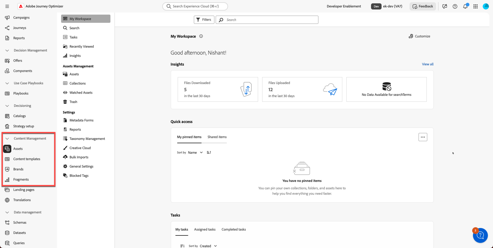

# Übersicht

## Voraussetzungen

>[!WARNING]
>
>Die folgenden Laboratorien müssen vor Beginn dieses Labors abgeschlossen sein

- **Datenspeicher — Relationaler Speicher in Aktion** **—>** [Profile Target Dimension](../data-stores/relational-store-in-action/profile-target-dimension.md)
- **Datenspeicher — Konfigurieren von E-Mail-Kanälen —>** [Konfigurieren für relationale](../data-stores/configure-email-channels/configure-for-relational.md)

Wenn Sie diese Labs nicht abgeschlossen haben, tun Sie dies jetzt, bevor Sie fortfahren.

>[!CAUTION]
>
>Dieses Lab erfordert eine Subdomain, die in Ihrer Sandbox an Adobe delegiert ist. Siehe [Setup](../setup.md), wenn Sie das Tempo selbst bestimmen und noch keine haben.

## Labor-Übersicht

In diesem Video erfahren Sie, was Sie in den drei Teilen dieses praktischen Labors erwarten können: Einrichten der Marke „Connection 5G“, Erstellen von Fragmenten und Vorlagen, Erstellen einer KI-unterstützten E-Mail und Validieren durch Simulation und Testversand.

>[!VIDEO](https://video.tv.adobe.com/v/3491145/)

## Lernziele

Am Ende dieses Moduls haben Sie folgende Möglichkeiten:

1. Erläuterung der Bedeutung der Inhaltserstellung in Adobe Journey Optimizer.
1. Identifizieren und beschreiben Sie wichtige Konzepte, einschließlich Marken, Markenrichtlinien, Journey und Vorlagen.
1. Navigieren Sie in der Benutzeroberfläche von AJO zu den Tools zur Inhaltserstellung, die für die Ausführung von E-Mails und Journey relevant sind.

## Warum die Inhaltserstellung in AJO wichtig ist

Inhalte stehen im Mittelpunkt jeder Kundeninteraktion. In Adobe Journey Optimizer ermöglicht die Erstellung hochwertiger, markenbezogener Inhalte Folgendes:

- Ein konsistentes Kundenerlebnis über alle Kanäle hinweg
- Schnellere Ausführung von Kampagnen mithilfe wiederverwendbarer Vorlagen und Fragmente
- Einhaltung von Markenstandards und gesetzlichen Anforderungen
- Skalierte Personalisierung zur Steigerung von Interaktion und Ergebnissen

## Schlüsselkonzepte

In diesem Labor werden die Kernelemente vorgestellt, die zum Erstellen und Verwalten von markenspezifischen Inhalten für die Verbindung 5G erforderlich sind.

### &#x200B;1. Marken

Eine Marke in AJO stellt eine eindeutige Identität dar (z. B. Verbindung 5G). Jede Marke umfasst:

- Visuelle Identität
- Schreibstil
- Ton- und Sprachregeln
- Assets und Kreativmaterialien

### &#x200B;2. Markenrichtlinien

Markenrichtlinien definieren:

- Schreibstil und -ton
- Sprachregeln
- Rechtliche Anforderungen
- Visuelle Standards (Farbe, Bild, Ikonografie)

### 3. Journeys

Journey-Workflows sind automatisierte Workflows, die Kundenerlebnisse basierend auf Folgendem orchestrieren:

- Profilattribute
- Veranstaltungen oder Trigger
- Förderfähigkeit und Bedingungen

### &#x200B;4. Vorlagen

Vorlagen sind wiederverwendbare Strukturen für Kanäle, zum Beispiel:

- E-Mail
- SMS
- Push-Benachrichtigungen
- In-App-Nachrichten

## Anleitung für Navigation und Benutzeroberfläche

### Anmelden und auf das Dashboard zugreifen

1. Öffnen Sie Adobe Journey Optimizer in Ihrem Browser.
1. Melden Sie sich mit Ihren Anmeldedaten an.
1. Das Haupt-Dashboard wird angezeigt.

### Suchen Sie das Hauptnavigationsmenü

Erkunden:

- Marken
- Inhalt (E-Mails, Vorlagen, Nachrichten)
- Fragmente
- Journeys
- Assets

### Zugriff auf Tools zur Inhaltserstellung

Bevor Sie mit der Erstellung Ihrer Marke beginnen, werfen Sie einen kurzen Blick auf die **Tools zur Inhaltserstellung** die in Adobe Journey Optimizer verfügbar sind, darunter:

- Assets
- Inhaltsvorlagen
- Fragmente

Um sich mit der Benutzeroberfläche vertraut zu machen, wählen Sie jede aus. Dieses Labor geht jeden Abschnitt im Detail durch.

## Zusammenfassung

Sie haben nun gelernt:

- Die Bedeutung der Inhaltserstellung in AJO
- Markendefinitionen, Markenrichtlinien, Journey und Vorlagen
- Navigieren in der AJO-Benutzeroberfläche und Suchen nach wichtigen Tools zur Inhaltserstellung

Sie können mit dem nächsten Modul fortfahren: **Markenmanagement**.
