# Personalization und Inhaltsexperiment

**Zweck:** Erfahren Sie, wie Sie E-Mail-Inhalte mithilfe von Profilattributen personalisieren, dynamische Inhaltsvarianten erstellen und bedingte Logik in Adobe Journey Optimizer anwenden können.

## Lernziele

Am Ende dieses Moduls haben Sie folgende Möglichkeiten:

1. Personalisierungsfelder mithilfe von Profilattributen hinzufügen.
1. Verwenden Sie den Personalisierungseditor und die Handlebars-Syntax.
1. Erstellen dynamischer Inhaltsvarianten basierend auf der Profillogik.
1. Erstellen Sie bedingte Regeln für personalisierte Inhaltsbausteine.
1. Wechsel der Testvariante basierend auf Attributen wie Geburtsjahr.

## Einführung

Die Personalisierung in Adobe Journey Optimizer ermöglicht individuelle Erlebnisse in großem Umfang.
In diesem Modul werden Sie:

- Einfügen von personalisiertem Text (Vor- und Nachname)
- Seitenbasierte Inhaltsvarianten erstellen
- Anwenden von bedingter Logik mithilfe von Profilattributen
- Vorbereiten von Inhalten für die Simulation in Modul 7

Personalization in Adobe Journey Optimizer ermöglicht es Ihnen, maßgeschneiderte, wirkungsvolle Kundenerlebnisse zu erstellen, indem Sie Inhalte dynamisch basierend auf individuellen Profilen, Verhaltensweisen und kontextuellen Daten anpassen. Egal, ob Sie personalisierte E-Mails, Benachrichtigungen oder Angebote erstellen, die verfügbaren Tools und Techniken erleichtern es, die richtige Botschaft zur richtigen Zeit mit der richtigen Person zu verbinden. Erfahren Sie, wie der Personalization-Editor, die Handlebars-Syntax und Adobe Experience Platform-Daten zusammenarbeiten, um Ihre Ideen umzusetzen, wiederverwendbare Inhaltsbausteine mit Ausdrucksfragmenten zu erkunden und sich mit erweiterten Hilfsfunktionen vertraut zu machen, um tiefere Möglichkeiten zu erschließen. Bei jedem Thema werden Ihre Kenntnisse Schritt für Schritt aufgebaut, um sicherzustellen, dass Sie bereit sind, mit Zuversicht personalisierte Journey zu entwerfen.

## Hinzufügen grundlegender Personalisierung

Dieser Teil der Übung vereinfacht die Personalisierung. Fügen Sie der E-Mail den Vor- und Nachnamen basierend auf dem Profil hinzu. Personalization basiert auf den Profildaten, die von dem von Ihnen definierten Schema Individuelles XDM-Profil verwaltet werden. Das Schema Individuelles XDM-Profil ist das einzige, das Sie zum Personalisieren von Inhalten in Journey Optimizer verwenden können.

1. Öffnen Sie die in früheren Modulen erstellte E-Mail.
2. Fügen Sie einen Textblock über dem Hero-Titel mit folgendem Inhalt hinzu: **Hi,**
3. Klicken Sie auf das **Personalisierung**-Symbol.

   

4. Suchen Sie nach **F**&#x200B;**first name**.

   

5. Klicken Sie auf **+**, um es dem Ausdrucksbereich hinzuzufügen.
6. Fügen Sie **Feld** Vorname **ein** hinzu.

   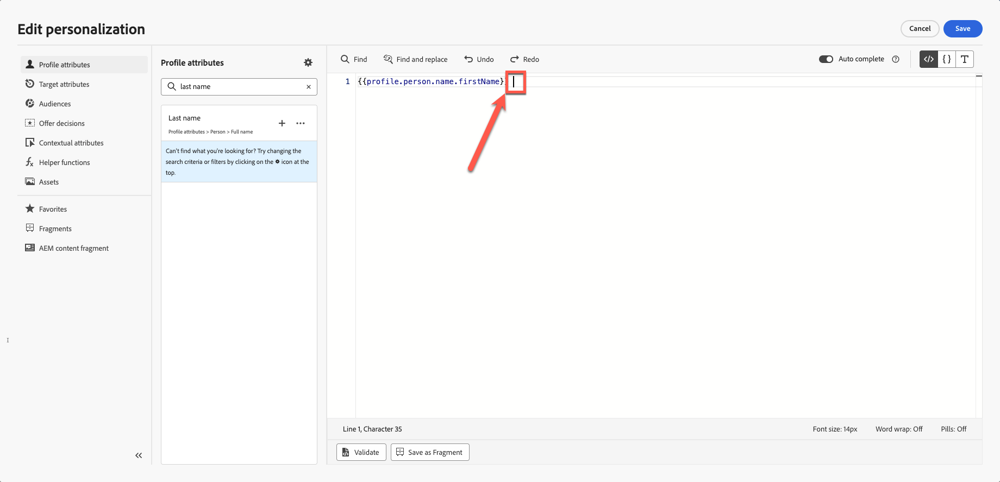

7. Wiederholen Sie den obigen Vorgang, suchen Sie jedoch diesmal nach und fügen Sie **Nachname** hinzu.

   Ihre endgültige Syntax zeigt Vor- und Nachnamenvariablen klar getrennt an.

   

8. Validieren Sie das Fragment. Beachten Sie, dass es eine Option zum Speichern des Inhalts als Fragment gibt. Dies ist eine großartige Gelegenheit, wenn Sie den vollständigen Namen für andere E-Mail-Inhaltserstellungen verwenden. Überspringen Sie dies und fahren Sie mit dem nächsten Schritt fort.
9. Klicken Sie auf **Speichern**

Ihre Ansicht sieht wie folgt aus. Geschweifte Klammern bestehen aus Variablen, und jeder Kontakt erhält eine E-Mail mit seinem Namen.

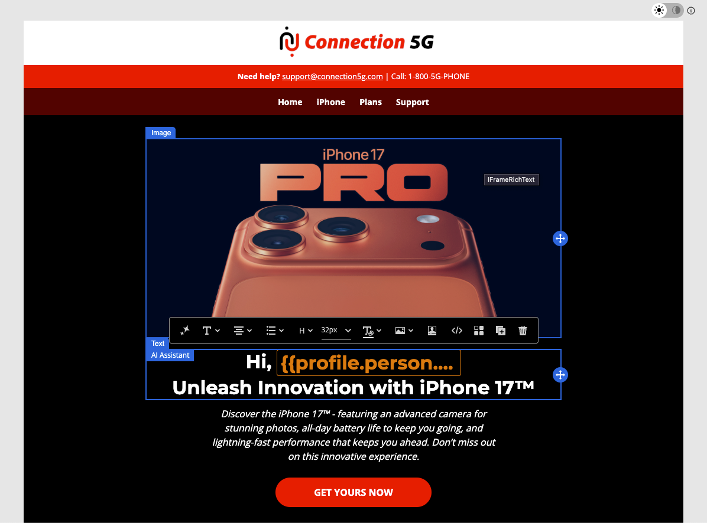

An dieser Stelle wissen Sie, wie Sie Personalisierungen für einzelne Profile hinzufügen können.

## Einführung in dynamische Inhalte

Mit dynamischen Inhalten in Adobe Journey Optimizer können Sie personalisierte Nachrichten erstellen, die sich nahtlos an Ihre Audience anpassen. Mithilfe von bedingten Regeln können Sie E-Mails, SMS und Push-Benachrichtigungen auf der Grundlage von Profilattributen, Zielgruppenzugehörigkeiten oder Echtzeit-Ereignissen anpassen. Unabhängig davon, ob Sie eine Fallback-Nachricht für den Fall erstellen, dass bestimmte Kriterien nicht erfüllt werden, oder wiederverwendbare Regeln zur Konsistenz speichern, bieten der Personalisierungseditor und E-Mail-Designer intuitive Tools, um Ihre Ideen umzusetzen.

Dies ist ein perfekter Anwendungsfall, um der E-Mail bedingte Inhalte hinzuzufügen und sie entsprechend dem Alter der Benutzerin bzw. des Benutzers zu personalisieren.

Kehren Sie zu Ihrem Schema zurück: Sie haben **„person.BirthYear** als Geburtsjahr. Dieses Attribut kann nützlich sein. Targeting und Einrichten einer Kampagne basierend auf dem Alter.

Für diese Übung erstellen Sie zwei altersabhängige Varianten. Eine Variante richtet sich an Anwender über 40 Jahre, die andere an Anwender unter 40 (etwa Mitte 20 und 30). Jeder, der vor dem Jahr 1986 geboren wurde, wird als über 40 betrachtet, jeder, der 1986 oder später geboren wurde, wird als unter 40 betrachtet.

**Alterslogik**

Sie verwenden die Profilattribut-`person.birthYear`.

| Zielgruppe | Bedingung |
| ------------ | ----------------- |
| über 40 | Geburtsjahr \&lt; 1986 |
| Unter 40 | Geburtsjahr >= 1986 |

## Erstellen Sie zwei Bildvarianten

Erinnern Sie sich an diesen Block, den wir in unserem vorherigen Modul erstellt haben? Dein Bild unterscheidet sich von meinem.

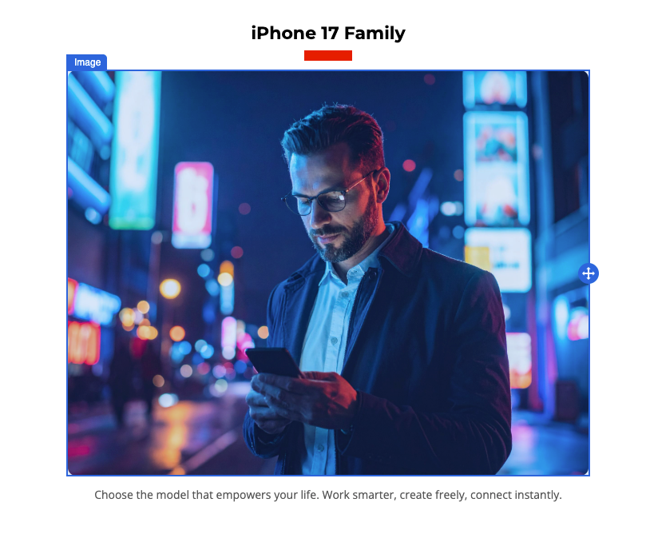

Erstellen Sie ein weiteres Bild für Personen unter 40 Jahren (denken Sie daran, Sie haben ein Firefly-Bild einer Person Mitte 40 erstellt) und verwenden Sie dieses für diese Übung.

1. Wählen Sie den vorhandenen Bildblock. (Klicken Sie auf das Bild) und klicken Sie auf **Bedingter Block**.
2. Klicken Sie **Variante hinzufügen**.

   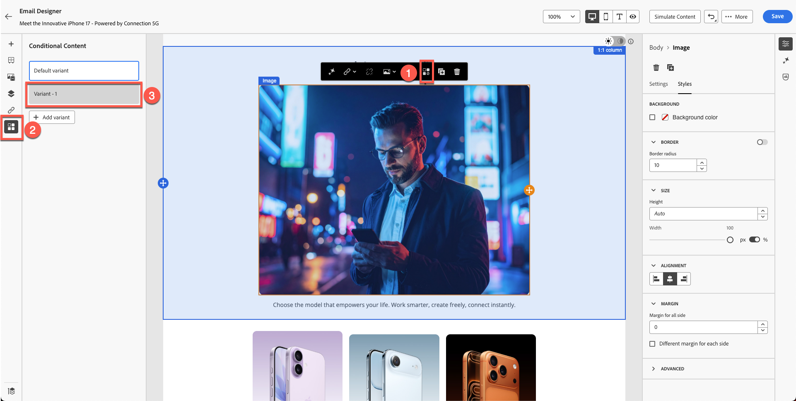

3. Benennen Sie die erste Variante in **Alter über 40 Jahre** um.

   

4. Erstellen Sie eine neue Variante, indem Sie auf **Schaltfläche „Variante hinzufügen“** klicken und sie in &quot;**unter 40.** umbenennen.

   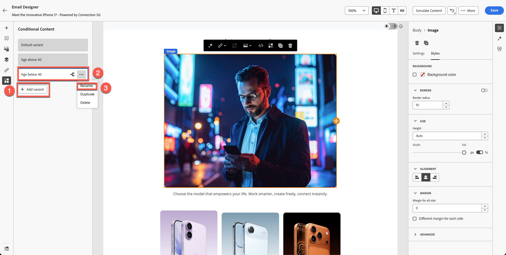

5. Sie können möglicherweise ein Bild mit Firefly erstellen, indem Sie eine Eingabeaufforderung wie „Mitte 20 Jahre alt“ verwenden. Um Zeit zu sparen, haben wir jedoch bereits ein Bild im Toolkit namens &quot;**variant-age-under-40.jpg**.
6. Klicken Sie auf das Bild und importieren Sie Medien.

   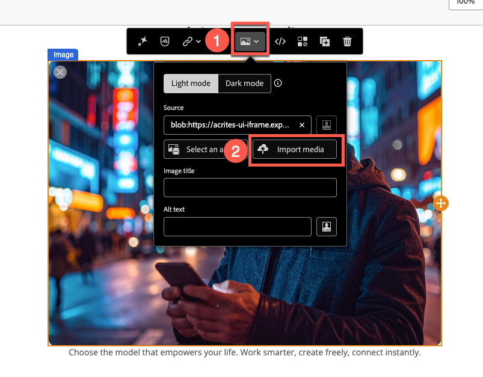

7. Wählen Sie **variant-age-under-40.jpg** Bild aus. Importieren Sie es, indem Sie **Weiter** klicken und schließlich **Importieren** in Ihrem Ordner drücken (Sie sollten sich standardmäßig bereits in Ihrem Ordner befinden).

   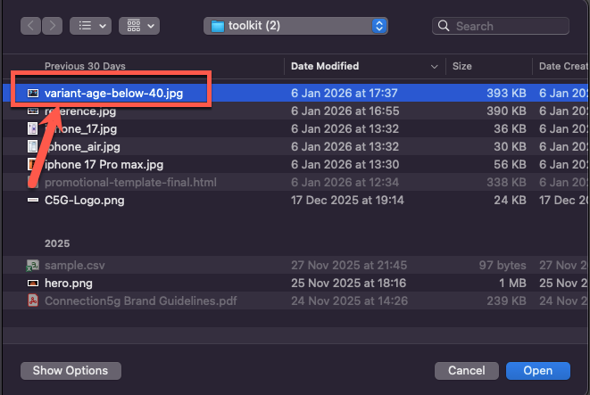

8. Versuchen Sie, zwischen Varianten umzuschalten, und Sie sehen ein anderes Bild angewendet.

Bisher haben Sie das Design erstellt, aber die Logik noch nicht angewendet. Im nächsten Schritt wird die Logik angewendet.

## Anwenden einer bedingten Logik auf Varianten

Beide Varianten sind bereit, Sie haben jedoch noch keine Bedingungslogik angewendet.

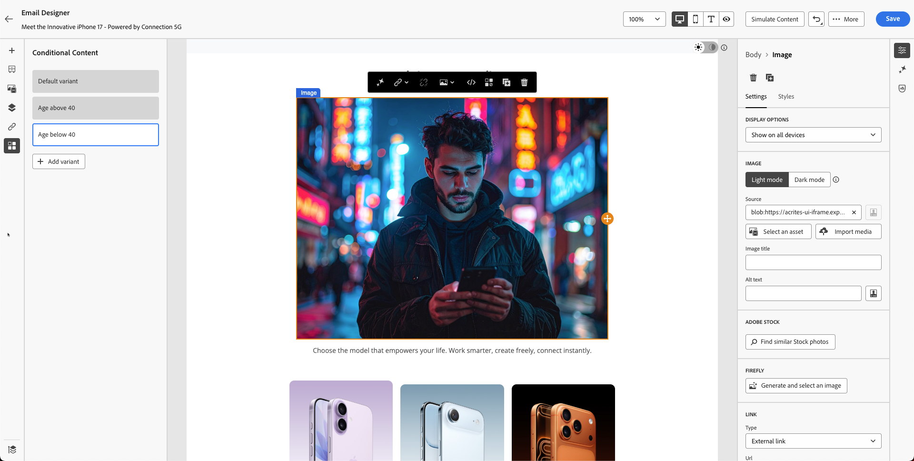

## Logik für „Alter über 40“

1. Wählen Sie die Variante **Alter über 40“ aus und zeigen Sie** darauf.
2. Klicken Sie auf **Symbol** Bedingungslogik“.

   

3. Erstellen Sie eine neue Bedingung.

   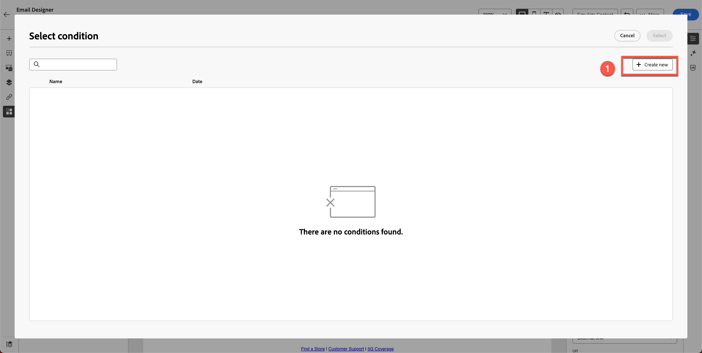

4. Suchen Sie **year** in der Attributliste.
5. Ziehen Sie **Geburtsjahr** auf die Arbeitsfläche.
6. Bedingung festlegen auf:
   - **Geburtsjahr \&lt; 1986**

   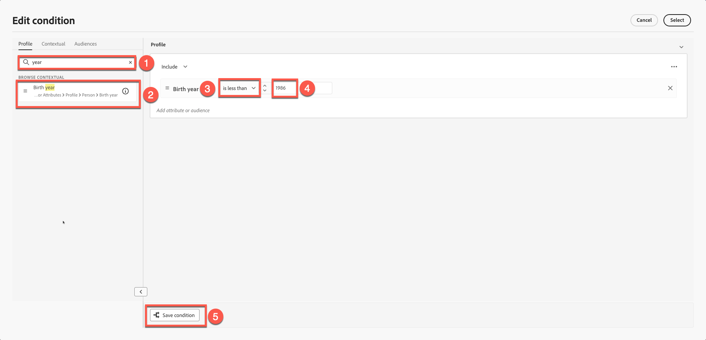

7. Benennen Sie die Bedingung: **Alter über 40**
8. Beschreibung hinzufügen - &quot;**Bildvariante für Personen über 40**&quot;
9. Klicken Sie **Hinzufügen → Auswählen**.

## Logik für „Alter unter 40“

1. Wählen Sie den Abschnitt **Alter unter 40** aus und bewegen Sie den Mauszeiger darauf.
2. Wiederholen Sie die Schritte, ändern Sie jedoch die Logik in:
   - **Geburtsjahr >= 1986**

   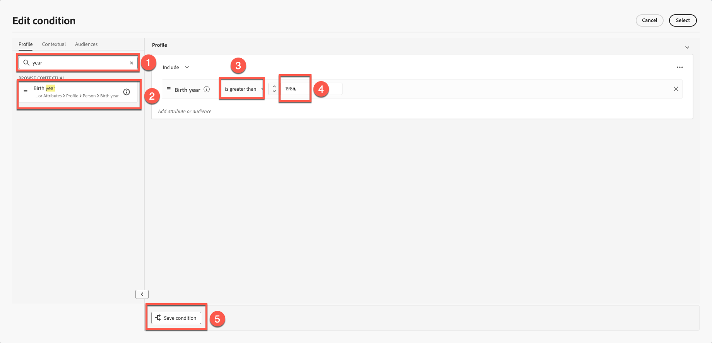

3. Benennen Sie die Bedingung: **Alter unter 40**
4. Beschreibung hinzufügen. &quot;**Bildvariante für Personen unter 40**&quot;
5. Klicken Sie **Hinzufügen → Auswählen**.

## Variantenwechsel validieren

Schalten Sie zwischen beiden Varianten um, um Folgendes sicherzustellen:

- Die korrekten Bilder werden angezeigt
- Logik wird korrekt angewendet
- Keine Variante wird als „Keine Bedingung angewendet“ angezeigt

Variante: **Alter über 40**

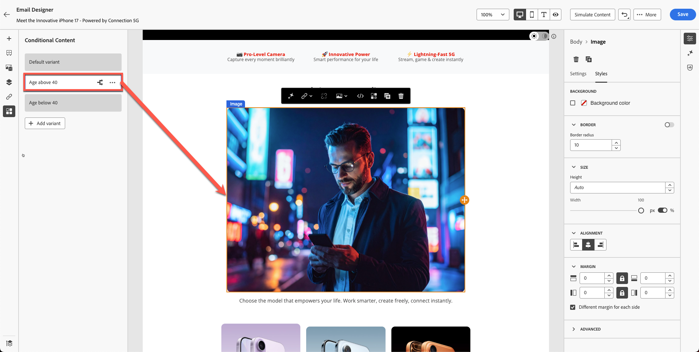

Variante: **Alter unter 40**

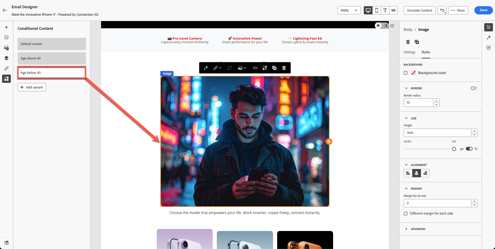

Klicken Sie auf **Speichern**, um die E-Mail zu speichern.

## Zusammenfassung

In diesem Modul haben Sie erfolgreich Folgendes gelernt:

- Hinzufügen von Personalisierungsfeldern für Eins-zu-eins-Messaging
- Erstellen dynamischer Bildvarianten
- Bedingte Regeln basierend auf Alter anwenden

Sie können jetzt mit dem nächsten Modul - **Inhaltssimulation** beide Varianten testen.
