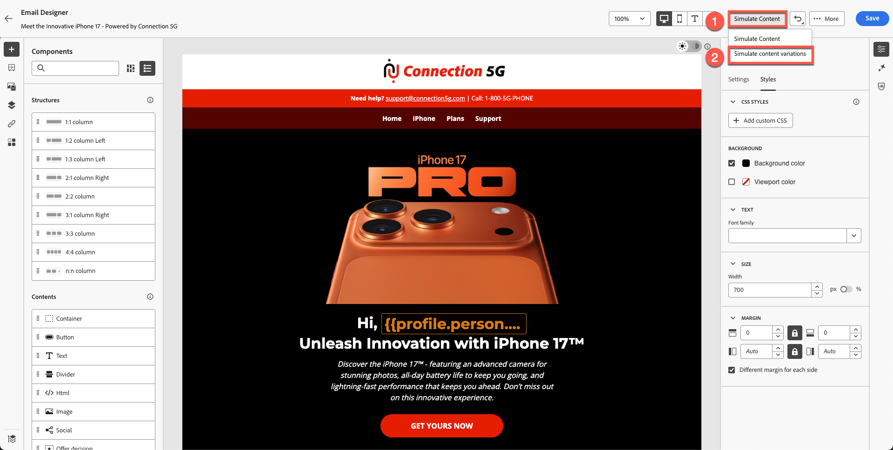
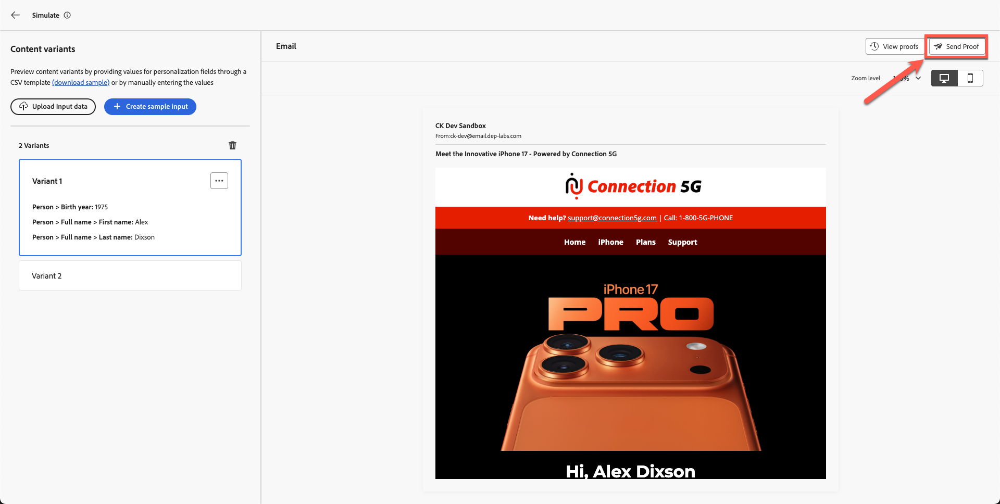
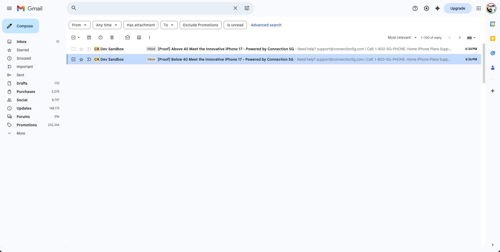
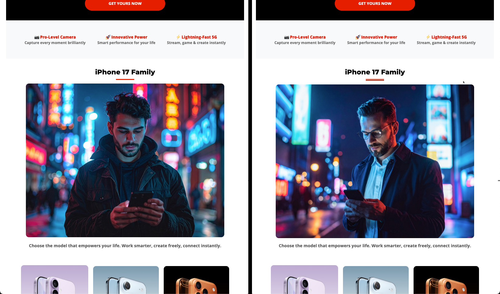
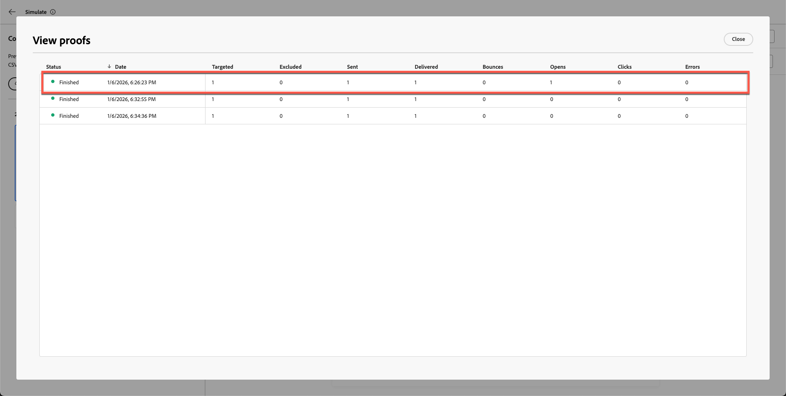

# E-Mail testen

## Lernziele

Am Ende dieses Moduls haben Sie folgende Möglichkeiten:

- Senden von Korrekturabzugs-E-Mails über den Adobe Journey Optimizer-E-Mail-Editor.
- Validieren von personalisierten Inhalten und bedingten Varianten mithilfe von Korrekturabzugs-E-Mails.
- Testversand-E-Mail-Versand in Ihrem Posteingang, einschließlich der Verarbeitung von Spam und abgeschnittenen Nachrichten.
- Überprüfen Sie die Versandlogs, Zeitstempel und Varianten von Testsendungen in Adobe Journey Optimizer.
- Vergewissern Sie sich, dass der E-Mail-Inhalt korrekt und personalisiert ist und aktiviert werden kann.

## Testversand-E-Mails senden (optional, aber empfohlen)

An dieser Stelle haben Sie gelernt, dass wir nicht nur die Profilattribute personalisieren können, sondern auch Attribute verwenden können, um eine bedingte Logik zu erstellen, die den Inhalt bestimmt, den Sie anzeigen möchten. Adobe Journey Optimizer ist extrem leistungsstark und bietet Marketing-Experten viel Flexibilität.

1. Klicken Sie **Inhalt simulieren**.
2. Wählen **Inhaltsvariante simulieren** aus.

   

   Ein Simulationsfenster wird geöffnet.

3. Klicken Sie **Testversand durchführen**.

   

4. Fügen Sie Ihre eigene persönliche E-Mail-Adresse hinzu.

   >[!NOTE]
   >
   >Beachten Sie, dass Ihre Unternehmens-E-Mail manchmal E-Mails aus der Sandbox blockiert. Ich würde Ihnen empfehlen, Ihre persönliche E-Mail zu verwenden.

5. Wählen Sie beide Varianten aus.
6. Präfix der Betreffzeile hinzufügen
   1. Variante 1: über 40
   2. Variante 2: Unter 40
7. Klicken Sie **Testversand durchführen**. Sie erhalten die grüne Bestätigungsmeldung &quot;**Testsendungen erfolgreich gesendet**&quot;

Stellen Sie sicher, dass beide E-Mails in Ihrem Posteingang gelandet sind.

>[!NOTE]
>
>Korrekturabzugs-E-Mails können je nach Filter **Spam** enthalten.

Möglicherweise wird die Nachricht abgeschnitten, aber das ist in Ordnung, da einige der Fußzeilen-Links nicht real sind. Wenn Sie auf den Link klicken, sehen Sie, dass beide E-Mails mit Varianten durchgekommen sind.

### Testversand in AJO überprüfen

Schließlich können Sie auch die Testversand-Bereitstellung in Adobe Journey Optimizer sehen.

1. Zurück zum E-Mail-Editor.
2. Gehen Sie zurück zum Bildschirm zur E-Mail-Erstellung und klicken Sie auf **Korrekturabzug anzeigen**.
3. Überprüfen Sie Versandlogs, Zeitstempel und gesendete Varianten.

Sie bemerken die Details Ihrer Korrekturabzugs-E-Mail.

## Zusammenfassung

In diesem Modul haben Sie erfolgreich:

- E-Mails mit Testversand und Verifizierung in AJO gesendet

Sie haben jetzt die vollständige Journey von Connection 5G AJO Lab abgeschlossen und überprüft, ob Ihre E-Mail korrekt, personalisiert und bereit zur Aktivierung ist.
