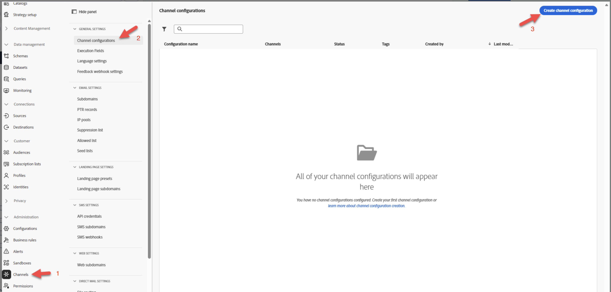
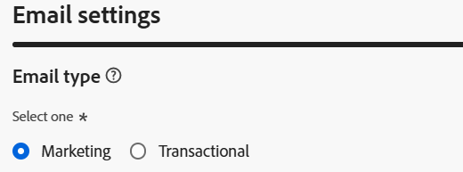
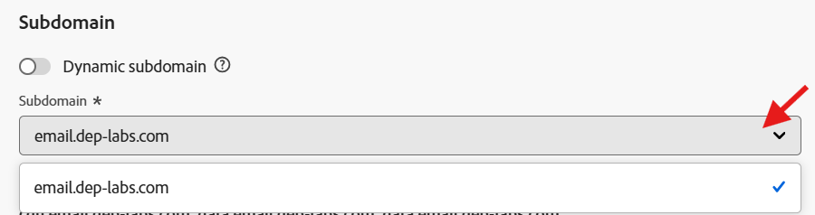
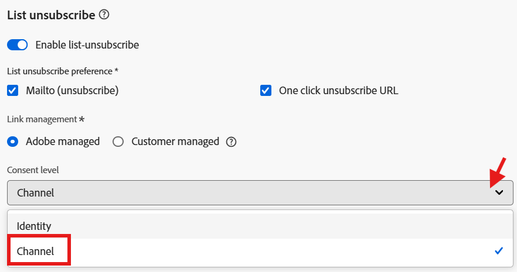
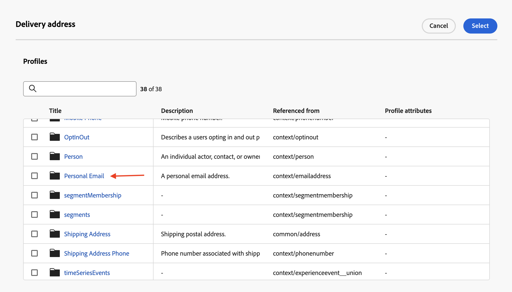
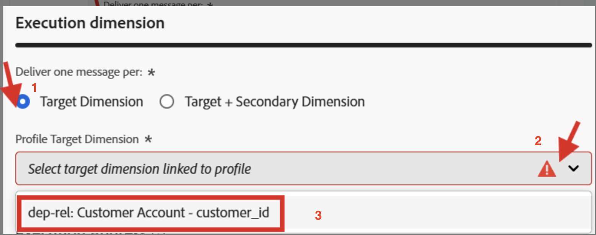
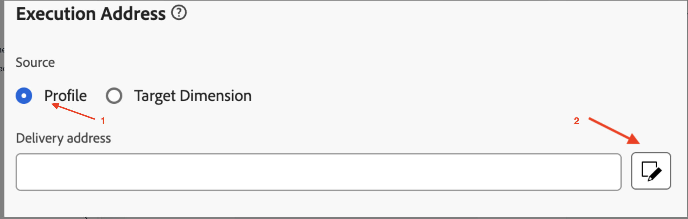
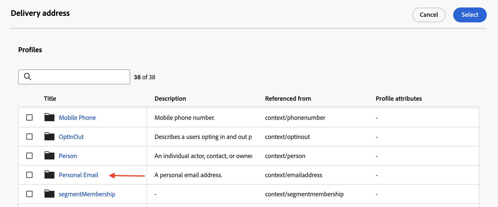
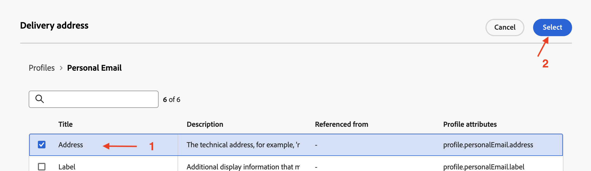
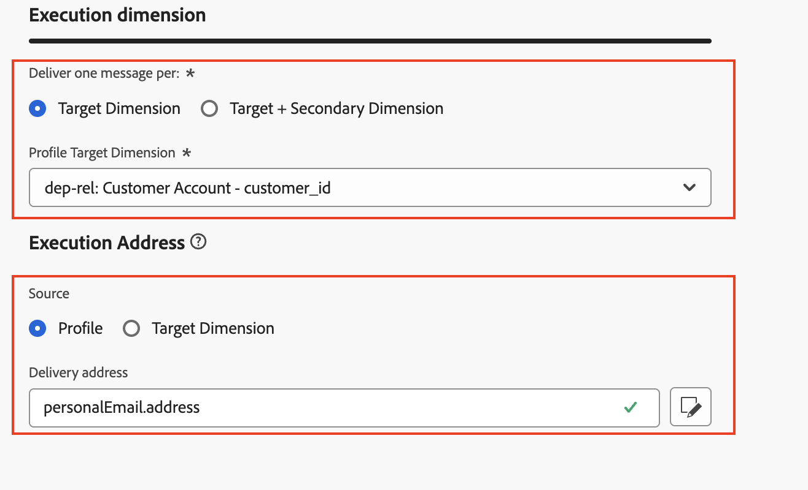

# Für Profil konfigurieren

## Ziel

Im nächsten Schritt erstellen Sie eine E-Mail-Kanalkonfiguration mit Journey und koordinierten Kampagnen unter Verwendung des `personalEmail.address` AEP-Profilattributs

## Kanalkonfiguration erstellen

1. Navigieren Sie zu **Kanalkonfigurationen** im Menü **Administration → Kanäle → Allgemeine Einstellungen**
2. Klicken Sie auf **Schaltfläche** Konfiguration erstellen“

   

3. Legen Sie im Assistenten „Erstellen“ die folgenden Werte fest:
   - **name:** `Profile-Email`
   - **channel:** `Email`
   - **Marketing-Aktion:** `Email Targeting`

>[!NOTE]
>
>Wenn Sie E-Mail als Kanal auswählen, wird ein neuer Abschnitt **E-Mail** Einstellungen) angezeigt.

## Konfigurieren des E-Mail-Typs

Legen Sie den **E-Mail-Typ** auf **Marketing** fest

## Subdomain konfigurieren

Wählen Sie aus dem **Subdomain**-Dropdown **email.dep-labs.com**

>[!NOTE]
>
>Wenn Sie zum Selbststudium bereit sind und keine vorab bereitgestellte Subdomain haben, wählen Sie hier Ihre eigene Subdomain aus, die an Adobe delegiert wurde, anstatt `email.dep-labs.com`. Informationen [ Delegieren einer ](../../setup.md) finden Sie unter „Setup“.

## Konfigurieren von IP-Pool-Details

Wählen Sie aus der Dropdown **Liste** IP-Pool“ **Marketing**

## Abmeldeliste konfigurieren

1. Stellen Sie sicher, dass der Umschalter **aktiviert** für die Abmeldung von einer Liste ist
1. Stellen Sie unter dem Voreinstellungsbereich Abmelden von Liste sicher, dass alle Kontrollkästchen **aktiviert**
1. Stellen Sie unter Linkverwaltung sicher, dass **Adobe verwaltet** ausgewählt ist
1. Stellen Sie für die Einverständnisebene sicher, dass dies auf &quot;**&quot; festgelegt**

## Konfigurieren von Kopfzeilenparametern

1. Legen Sie die folgenden Felder wie folgt fest:
   - **Absendername:** `DEP Labs`
   - **Von E-Mail-Präfix:** `dep`
   - **Antwort an Name:** `DEP Labs Support`
   - **Antwort an E-Mail:** `reply@email.dep-labs.com`
   - **Fehler-E-Mail-Präfix:** `error`

## BCC-E-Mail konfigurieren

Dieses Feld leer lassen

>[!NOTE]
>
>Eine Kopie der gesendeten E-Mails kann aufbewahrt werden, indem sie an einen BCC-Posteingang gesendet wird. Um jede gesendete E-Mail an diese BCC-Adresse zu kopieren, geben Sie die E-Mail-Adresse Ihrer Wahl ein. Die Domain der BCC-Adresse muss sich von jeder an Adobe delegierten Subdomain unterscheiden. Diese Funktion ist optional. *Verwendung von BCC für E-Mails*

## Konfigurieren von E-Mail-Wiederholungsparametern

Lassen Sie die Standardeinstellungen von **Stunden** auf **84**

## URL-Tracking-Parameter konfigurieren

Mit den Standardeinstellungen verlassen

## Ausführungsdetails

1. Füllen Sie **Abschnitt** aus. Wählen Sie auf der Registerkarte **Journey und** Aktion“ -> **Ausführungsdimension** die Option **Profil** als **Source** aus und klicken Sie auf das Bearbeitungssymbol für **Versandadresse** im Abschnitt **Ausführungsadresse**

   

2. Klicken Sie auf den Ordner **Persönliche E-Mail**, um ihn zu öffnen

   

3. Klicken Sie im `Address` auf **Kontrollkästchen** und dann auf die Schaltfläche **Auswählen**.

   

4. Für **Profil** ist die `personalEmail.address` jetzt als **Versandadresse** im Abschnitt **Ausführungsadresse** konfiguriert

   

5. Klicken Sie auf die Registerkarte Orchestrierte Kampagne und aktivieren **das** Aktiviert .

   

6. Konfigurieren Sie unter der Überschrift „Ausführungsdimension“ Folgendes:
   - **Eine Nachricht pro:** `Target Dimension` senden
   - **Profile Target Dimension:** `dep-rel: Customer Account - customer_id`

   

7. Konfigurieren Sie unter Ausführungsadresse Folgendes:
   - **Source:** `Profile`
   - **Lieferadresse:** `click on the Edit icon`

   

8. Suchen Sie nach dem Ordner `Personal Email` und klicken Sie darauf, um ihn zu öffnen

   

9. Wählen Sie das Feld `Address` im Ordner Persönliche E-Mail aus und klicken Sie auf **Auswählen**

   

10. Für **Orchestrierte Kampagne** wird **dep-rel: Kundenkonto - customer\_id** als **Profile Target Dimension** für **Ausführungsdimension** mit **Ausführungsadresse** mit einer **Source** von **Profile** und `personalEmail.address` als **Versandadresse** konfiguriert

>[!NOTE]
>
>Bei orchestrierten Kampagnen können Sie das Kundenkonto mit einer E-Mail ansprechen, sodass Sie nur (*Nachricht pro Profil)* müssen.  Die von Ihnen verwendete Ausführungsadresse stammt aus dem Profil selbst (insbesondere aus dem, was im AEP-Profil unter dem Attribut **personalEmail.address** gespeichert ist)

## Überprüfen und speichern

1. Überprüfen Sie erneut alle Details, um sicherzustellen, dass sie übereinstimmen.
1. Scrollen Sie nach oben und klicken Sie auf **Senden**.

>[!NOTE]
>
>Die Verarbeitung der E-Mail-Kanal-Konfiguration dauerte bis zu 2 Stunden!
>
>Fahren Sie mit der nächsten Übung fort, während Sie warten, bis diese Kanalkonfiguration verarbeitet wird.

>[!TIP]
>
>🚀 Sobald der Konfigurationsstatus des E-Mail-Kanals **Aktiv** ist, ist er bereit und kann jetzt direkt in **E-Mail-Aktivitäten** in orchestrierten Kampagnen ausgewählt werden.

## Zusammenfassung

Sie haben jetzt gesehen, wie Sie eine E-Mail-Kanalkonfiguration erstellen, um das AEP-Profilattribut sowohl für Journey- als auch für orchestrierte Kampagnen zu verwenden.
