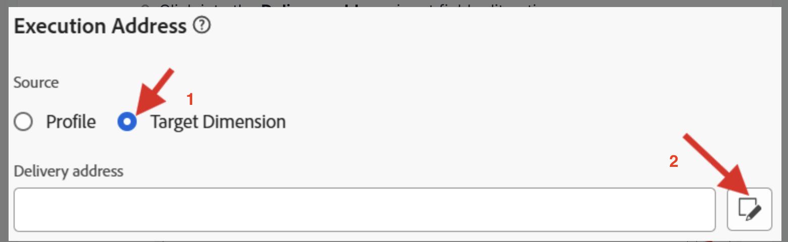
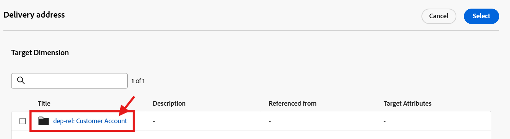
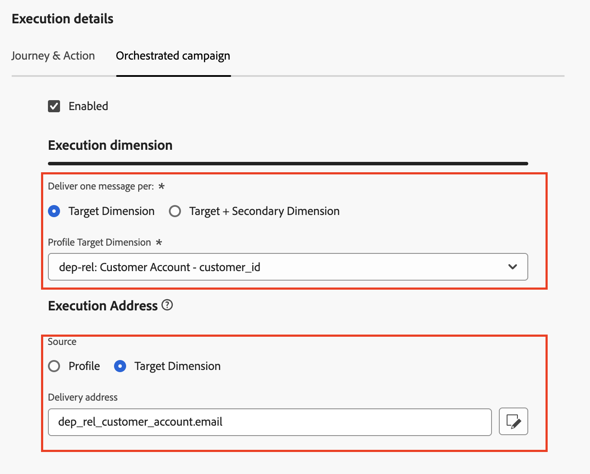

# Konfigurieren von für relationale

## Ziel

In den nächsten Schritten erstellen Sie eine E-Mail-Kanal-Konfiguration, die nur mit orchestrierten Kampagnen verwendet werden kann, indem Sie das Attribut `email` aus dem `dep-rel: Customer Account` Relationales Schema verwenden

## Kanalkonfiguration erstellen

1. Navigieren Sie zu **Kanalkonfigurationen** im Menü **Administration → Kanäle → Allgemeine Einstellungen**
2. Klicken Sie auf **Schaltfläche** Konfiguration erstellen“

3. Legen Sie im Assistenten „Erstellen“ die folgenden Werte fest:
   - **name:** `Relational-Email`
   - **channel:** `Email`
   - **Marketing-Aktion:** `Email Targeting`

>[!NOTE]
>
>Wenn Sie E-Mail als Kanal auswählen, wird ein neuer Abschnitt E-Mail-Einstellungen angezeigt.

## Konfigurieren des E-Mail-Typs

Legen Sie den **E-Mail-Typ** auf **Marketing** fest

## Subdomain konfigurieren

Wählen Sie aus dem **Subdomain**-Dropdown **email.dep-labs.com**

## Konfigurieren von IP-Pool-Details

Wählen Sie aus der Dropdown **Liste** IP-Pool“ **Marketing**

## Abmeldeliste konfigurieren

1. Stellen Sie sicher, dass der Umschalter **aktiviert** für die Abmeldung von einer Liste ist
1. Stellen Sie unter dem Voreinstellungsbereich Abmelden von Liste sicher, dass alle Kontrollkästchen **aktiviert**
1. Stellen Sie unter Linkverwaltung sicher, dass **Adobe verwaltet** ausgewählt ist
1. Stellen Sie für die Einverständnisebene sicher, dass dies auf &quot;**&quot; festgelegt**

## Konfigurieren von Kopfzeilenparametern

1. Legen Sie die folgenden Felder wie folgt fest:
   - **Absendername:** `DEP Labs`
   - **Von E-Mail-Präfix:** `dep`
   - **Antwort an Name:** `DEP Labs Support`
   - **Antwort an E-Mail:** `reply@email.dep-labs.com`
   - **Fehler-E-Mail-Präfix:** `error`

## BCC-E-Mail konfigurieren

Leer lassen

>[!NOTE]
>
>Eine Kopie der gesendeten E-Mails kann aufbewahrt werden, indem sie an einen BCC-Posteingang gesendet wird. Gewünschte E-Mail-Adresse eingeben, sodass jede gesendete E-Mail blind an diese BCC-Adresse gesendet wird. Die Domain der BCC-Adresse muss sich von jeder an Adobe delegierten Subdomain unterscheiden. Diese Funktion ist optional. *Verwendung von BCC für E-Mails*

## Konfigurieren von E-Mail-Wiederholungsparametern

Lassen Sie die Standardeinstellungen von **Stunden** auf **84**

## URL-Tracking-Parameter konfigurieren

Mit den Standardeinstellungen verlassen

## Ausführungsdetails

1. Aktivieren Sie auf der Registerkarte Orchestrierte Kampagne **Kontrollkästchen** aktiviert .

2. Konfigurieren Sie unter der Ausführungsdimension Folgendes:
   - **Eine Nachricht pro:** `Target Dimension ` senden
   - **Profile Target Dimension:** `dep-rel: Customer Account - customer_id`

3. Konfigurieren Sie unter Ausführungsadresse Folgendes:
   - **Source:** `Target Dimension`
   - **Lieferadresse:** `click on the Edit button`

4. Klicken Sie im Popup-Fenster auf den Ordner **dep-rel: Kundenkonto**

5. Wählen Sie **E-** aus und klicken Sie auf die Schaltfläche **Auswählen**.

6. Wenn Sie fertig sind, sehen Ihre endgültigen Ausführungsdetails wie im folgenden Screenshot aus

>[!NOTE]
>
>Bei orchestrierten Kampagnen sollten Sie das Kundenkonto mit einer E-Mail-Adresse ansprechen, sodass Sie nur eine Nachricht pro Target Dimension senden müssen.  Die verwendete Ausführungsadresse stammt aus der Target-Dimension selbst (d. h. was in der Tabelle **dep-rel: Kundenkonto** für **E-Mail** Adresse) gespeichert

## Überprüfen und speichern

1. Überprüfen Sie erneut alle Details, um sicherzustellen, dass sie übereinstimmen.
1. Scrollen Sie nach oben und klicken Sie auf **Absenden**.
1. Wenn Sie fertig sind, sehen Sie zwei E-Mail-Kanal-Konfigurationen, die sich beide wahrscheinlich in einem Status „Verarbeitung läuft“ befinden.

>[!WARNING]
>
>Die Verarbeitung der E-Mail-Kanal-Konfiguration dauerte bis zu 2 Stunden!

## Zusammenfassung

Sie haben jetzt gesehen, wie Sie eine E-Mail-Kanal-Konfiguration erstellen, um das relationale Schemaattribut für orchestrierte Kampagnen zu verwenden.
