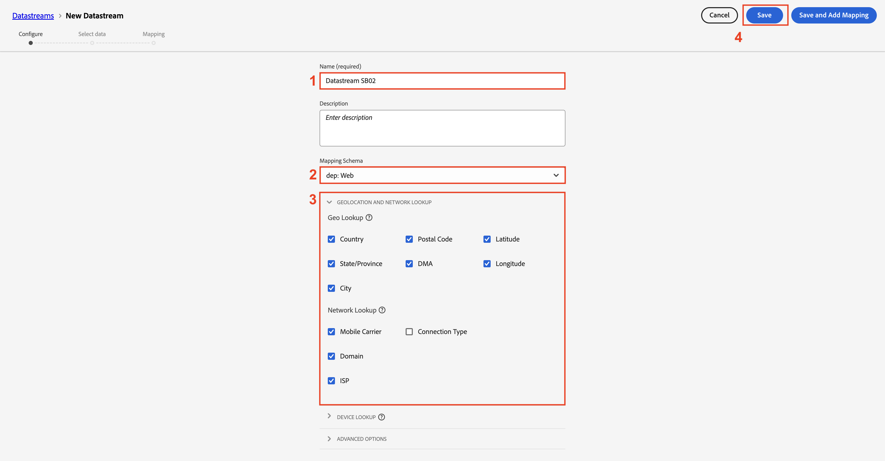
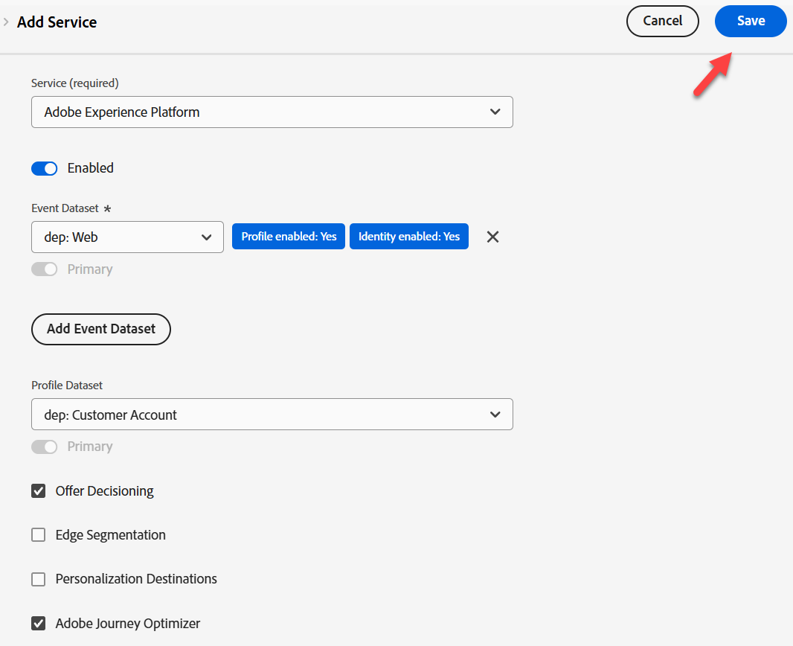
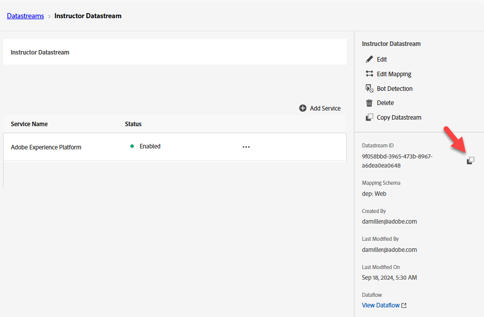

# Erstellen eines Datenstroms

## Lernziel

Erstellen und konfigurieren Sie einen Datenstrom mit den erforderlichen Services, um die Edge-Ereignisverarbeitung zu aktivieren.

Ein Datenstrom definiert, welche Services ihn verwenden werden.

- Beim Senden von Daten an die Edge geben Sie an, welcher Datenstrom verwendet werden soll
- Daten, die an diese Datenströme gesendet werden, können dann entsprechend dem konfigurierten Service Aktionen ausführen
  - Adobe Experience Platform

## Erstellen eines neuen Datenstroms

1. Klicken Sie in der linken Leiste unter **Datenerfassung** auf **Datenströme**
1. Klicken Sie dann auf **Neuer Datenstrom**, um einen zu erstellen

## Konfigurieren des Datenstroms

Konfigurieren Sie den Datenstrom mit folgenden Informationen:

1. Name -> **Datenstrom SB + \&lt;Sandbox-Name> (d. h. Datenstrom SB01)**
1. Zuordnungsschema -> **dep: Web**
1. Schalten Sie **on** alle Optionen unter **Geolocation und Netzwerk-Suche** ein, wenn Sie diese Informationen erfassen möchten.
1. Klicken Sie abschließend auf **Speichern**.

>[!WARNING]
>
>Klicken Sie nicht auf Speichern und Zuordnung hinzufügen .  Wenn Sie es versehentlich tun, brechen Sie einfach ab

Nach dem Speichern des Datenstroms wird der folgende Bildschirm angezeigt:

## Adobe Experience Platform-Service hinzufügen

Auf diese Weise können Sie Daten an den Hub senden und für Daten, die von diesem Datenstrom empfangen werden, in einen Datensatz aufnehmen.

1. Klicken Sie auf **blaue Schaltfläche** Service hinzufügen“ in der Mitte des Bildschirms

&#x200B;2. Konfigurieren Sie die folgenden Elemente:
   - **Service** -> `Adobe Experience Platform`
   - **Ereignisdatensatz** -> `dep: Web`
   - **Profildatensatz** -> `dep: Customer Account`
   - **Kontrollkästchen auswählen** -> `Offer Decisioning`
   - **Kontrollkästchen auswählen** -> `Adobe Journey Optimizer`
&#x200B;3. Klicken Sie abschließend auf **Speichern**

Der Service wird nun zu Ihrem Datenstrom hinzugefügt

**Kopieren** und **Speichern** die **Datenstrom-ID** auf Ihrem lokalen Computer (wir werden sie später in Postman verwenden)

## Zusammenfassung

Es sollte ein funktionierender Datenstrom mit konfiguriertem Adobe Experience Platform-Service vorhanden sein.
