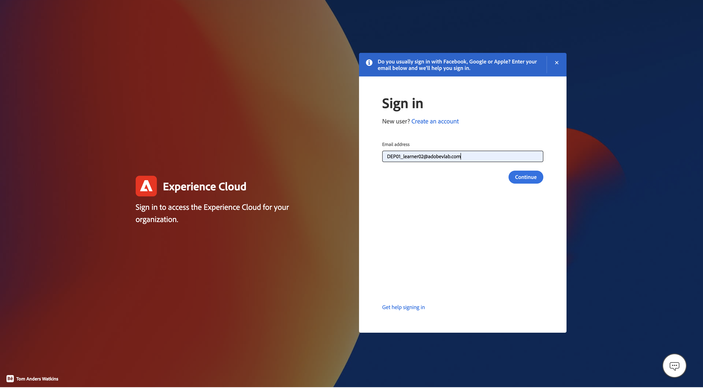
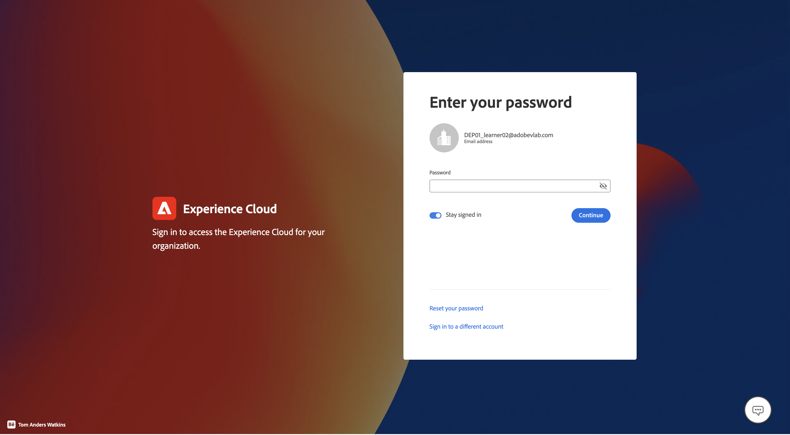

# Anmelden und Durchsuchen

## Über die Benutzeroberfläche anmelden

1. Navigieren Sie zu [https://experience.adobe.com](https://experience.adobe.com/) in Ihrem Browser.
1. Melden Sie sich mit der Adobe ID an, die Entwicklerzugriff auf Ihre Sandbox hat - mit derselben Sandbox, die Sie zum Abschließen der [Developer Console-Einrichtung verwendet haben](../../sandbox-setup/developer-console-setup.md).
1. Wählen Sie auf dem **Konto auswählen** das **Firmen- oder Schulkonto**.

## Experience Platform starten

Klicken Sie auf das Experience Platform-Symbol im Bereich Schnellzugriff , um auf Ihre Bootcamp-Sandbox zuzugreifen

>[!NOTE]
>
>Möglicherweise wird dieser Bildschirm nicht angezeigt und Sie werden direkt in Experience Platform gestartet.  Wenn ja, überspringen Sie diesen Schritt.

