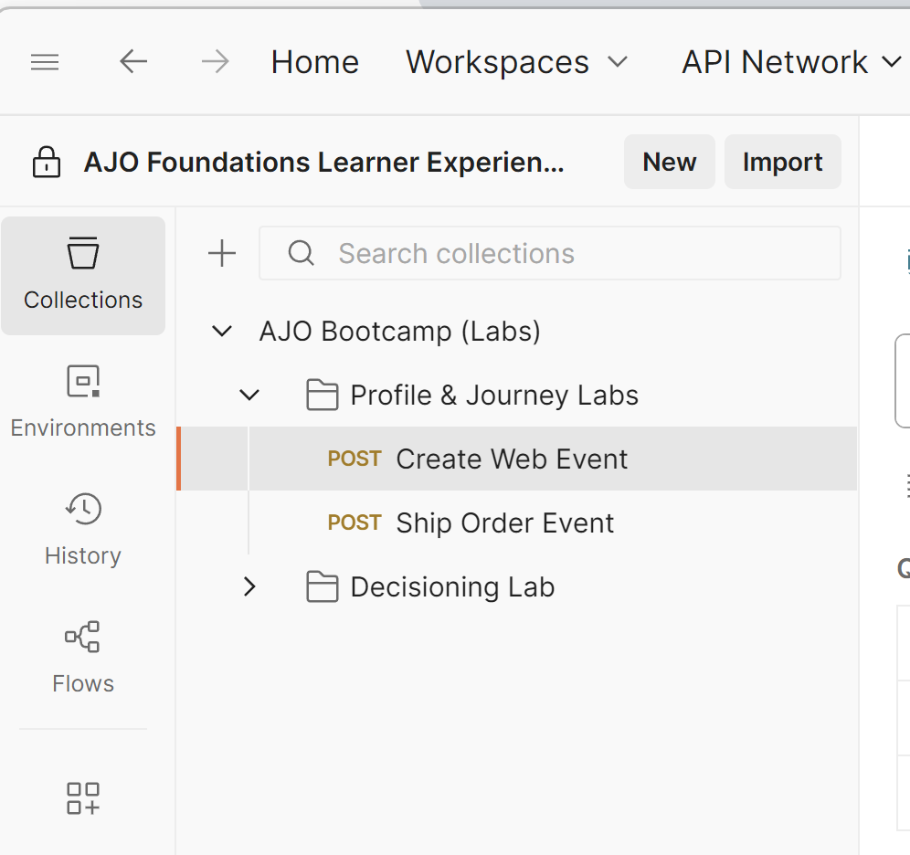
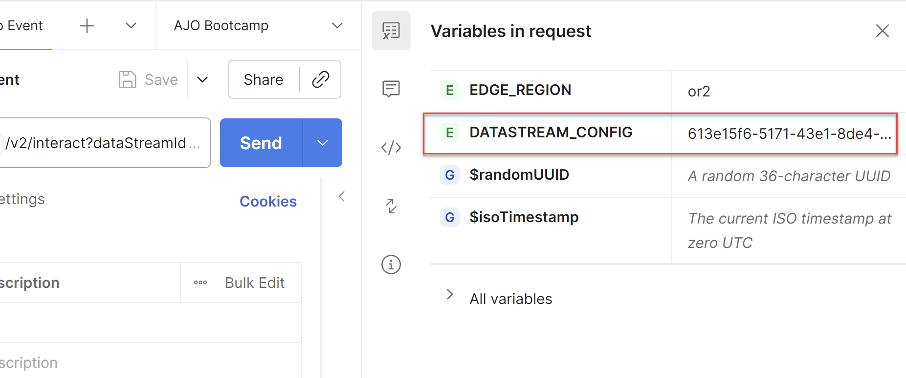
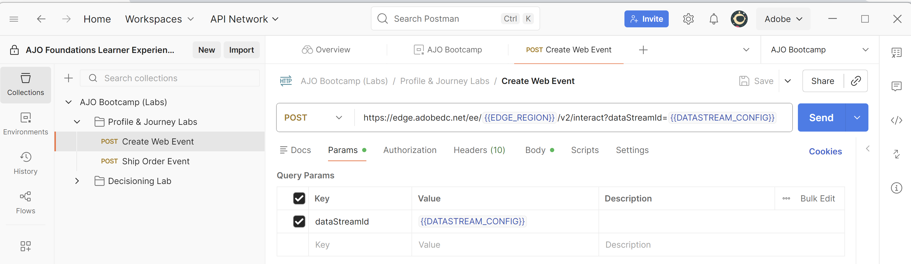

# Senden eines Edge-Web-Ereignisses

## Lernziel

Senden Sie mithilfe der API ein simuliertes Web-Ereignis an das Adobe Edge Network.

Um zu simulieren, wie eine Web-Seite geladen und an AEP Edge gesendet wird, senden Sie einen Postman-Aufruf an den von Ihnen erstellten Datenstrom.

Dies wird in einem Ereignis ohne OAuth-Token gesendet.  Stellen Sie sicher, dass Postman auf Ihrem Computer geöffnet ist, um dieses Labor durchzuführen.

>[!NOTE]
>
>Da Sie kein authentifiziertes Token übergeben, erhalten Sie keine Attribute zurück.

## Laborerwartungen

1. Erlebnisereignis, das auf die Edge trifft
1. Datenstromkonfiguration
1. Datenstromkonfiguration zur Verwendung des AEP-Service
   1. Edge-Zielgruppe zum Ausführen
   2. Ereignis an den Hub senden
1. Postman-Antwort, um Edge-Zielgruppe einzuschließen (aber keine Attribute)
1. Profilspeicher zum Empfangen des Ereignisses und Hinzufügen eines Ereignisprofilfragments
1. Identitätsspeicher zum Hinzufügen einer Beziehung
1. Datensatz zum Empfangen von Daten und Speichern im Data Lake

## Postman-Umgebungsvariable aktualisieren

Bevor Sie die API-Anfrage ausführen können, müssen Sie die Datenstrom-ID zur Postman-Variablenumgebung hinzufügen. Erfassen Sie zunächst die folgenden Werte:

### Datenstrom-ID erfassen

1. Sie sollten bereits über die **Datenstrom-ID“**

>[!NOTE]
>
>**Wenn Sie die Datenstrom-ID verloren haben**
>
>1. Klicken Sie in der linken Leiste auf **Datenströme** (unter der Überschrift Datenerfassung )
>2. Wählen Sie Ihren Datenstrom aus und kopieren Sie den Wert **Datenstrom-ID** .
>
>

### Zum Aufruf navigieren

1. **Linke Seitenleiste von Postman** -> `Collections`
1. **Sammlung** -> `AJO Bootcamp (Labs)`
1. **Ordner** -> `Profile & Journey Labs`
1. **API-Anfrage** -> `Create Web Event`

### Aktualisieren der Variablen DATASTREAM\_CONFIG

1. Klicken Sie oben **auf** Variablen in Anfrage)

&#x200B;2. Aktualisieren Sie **DATASTREAM_CONFIG** **Value** mit der **Datastream-ID** aus dem ersten Schritt auf der Seite.

&#x200B;3. **Speichern** die Aktualisierung (Strg+S oder Befehl+S)
&#x200B;4. Klicken Sie auf **X** in der oberen rechten Ecke der Seitenleiste der Umgebung, um die Seitenleiste zu schließen

&#x200B;5. Die **Web-Ereignis erstellen**-Anfrage kann jetzt gesendet werden, da alle Variablen jetzt blau sind und einen Wert in der Umgebung haben.

## Ausführen der API

Führen Sie Ihre Anfrage aus, indem Sie auf die Schaltfläche **Senden** klicken.

Die Antwort sieht in etwa so aus:

Was Sie in der Antwort sehen, sind diese Kernpunkte:

- Eine Antwort von 200 OK bedeutet, dass die Daten erfolgreich gesendet und von der Edge Network akzeptiert wurden

## Zusammenfassung

Das Ereignis wurde erfolgreich an Edge Network gesendet und von diesem akzeptiert
