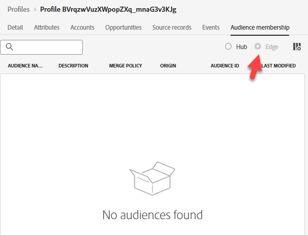

# Profil auf Edge validieren

## Lernziel

Vergewissern Sie sich, dass das Profil nicht im Edge-Netzwerkprofilspeicher vorhanden ist.

## Überprüfen des Edge-Profils

1. Klicken Sie auf die **Attribute** und das Optionsfeld **Edge**, um das Edge-Profil anzuzeigen

>[!NOTE]
>
>Es ist möglich, dass Sie eine „abgespeckte“ Version des Profils sehen, die nur aus den Identitäten besteht, je nachdem, wie viel Zeit vergangen ist.

2. Klicken Sie auf die Registerkarte Zielgruppenmitgliedschaft .  Es wird **leer**.

>[!NOTE]
>
>**Warum keine Edge-Mitgliedschaft?**
>
>Hätten wir nicht sehen sollen **dep: Any Event Edge (innerhalb einer Stunde)** qualifiziert?
>
>Obwohl wir eine Zielgruppe haben, die eine Edge-Bewertung hat, gibt es diese Zielgruppe auf der Edge nicht, da wir keinen Grund dafür haben… noch nicht.
>
>Wenn wir diese Zielgruppe verwenden (z. B. Entscheidungsfindung oder Ziele), werden die Zielgruppenregeln an die Edge gepusht und beim nächsten Streaming eines Ereignisses an die Edge wird diese Zielgruppe ausgewertet.
>
>Außerdem haben wir die Segmentierungs-Services von Edge nicht aktiviert.

## Zusammenfassung

Das Profil existiert (noch) nicht in Edge
