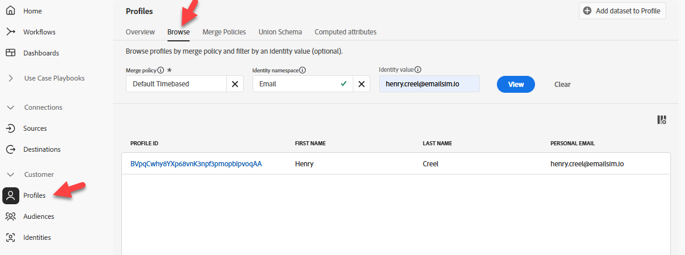
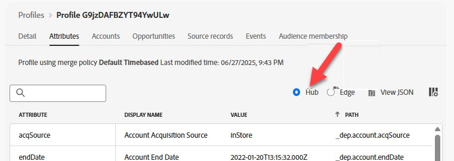

# Profil im Hub validieren

## Lernziel

Überprüfen Sie, ob das Ereignis zu einer Profilaktualisierung und Segmentqualifikation im Echtzeit-Profil im Hub geführt hat.

## Profil auf dem Hub suchen

Suchen Sie in Adobe Experience Platform das Profil, das Sie gerade von dem Ereignis gesendet haben, das Sie gerade an Edge Network gesendet haben.

1. Navigieren Sie **Kunde** -> **Profile** -> **Durchsuchen**, um die Suche mit den folgenden Informationen durchzuführen:
   - **Zusammenführungsrichtlinie** -> `Default Timebased`
   - **Identity-Namespace** -> `Email`
   - **Identitätswert** -> `henry.creel@emailsim.io`
1. Klicken Sie **Anzeigen**, um das Profil zu suchen




## Hub-Profil überprüfen

1. Klicken Sie auf **Profil-ID**, um das Profil zu öffnen
1. Klicken Sie zuerst auf **Registerkarte** und dann auf das **Hub**-Optionsfeld, um das **Hub-Profil anzuzeigen**




## Validieren von Ereignissen

1. Klicken Sie **oberen Navigationsbereich auf** Ereignisse“, um das gerade gesendete Ereignis anzuzeigen


## Segmente validieren

### Über JSON

1. Klicken Sie auf die **Attribute** und Ansicht **JSON**


2. Suchen Sie **segmentMembership**.  Sie sollte wie folgt aussehen (Ihre IDs unterscheiden sich)

```json
  "segmentMembership": {
    "ups": {
      "ce0b8386-ef2a-4244-8ad0-1a72d6494181": {
        "status": "realized",
        "lastQualificationTime": "2025-12-15T23:11:49Z"
      },
      "8ce516fe-920a-4f9d-b92b-0403890a8491": {
        "status": "realized",
        "lastQualificationTime": "2025-12-12T15:01:01Z"
      }
    }
```

>[!NOTE]
>
>**Wie liest man segmentMembership?**
>
>[https://experienceleague.adobe.com/en/docs/experience-platform/xdm/field-groups/profile/segmentation](https://experienceleague.adobe.com/en/docs/experience-platform/xdm/field-groups/profile/segmentation)
>
>**ups:** Dies ist der Zuordnungsschlüssel für verschiedene Arten von Zielgruppen, die von AEP unterstützt werden.  Der UPS-Schlüssel enthält Zielgruppen , die vom Regel-Builder erstellt wurden.  Andere Zielgruppen sind in anderen Schlüsseln enthalten (z. B. AAM).
>
>**lastQualificationTime** Ein Zeitstempel, der angibt, wann sich dieses Profil zuletzt für das Segment qualifiziert hat
>
>**status**
>
>*realized*: Das Profil ist für das Segment qualifiziert.
>*beendet*: Das Profil verlässt das Segment als Teil der aktuellen Anfrage.
>
>

### Über die Benutzeroberfläche

1. Eine einfachere Möglichkeit, zu überprüfen, ob sich das Profil für die Zielgruppen qualifiziert hat, besteht in der Registerkarte **Zielgruppenzugehörigkeit** (Sie sollten mindestens diese sehen):
   - Tiefe: Beliebiges Ereignis-Streaming (innerhalb einer Stunde)
   - Dep: Beliebiges Event Edge (innerhalb der Stunde)


>[!NOTE]
>
>**Warum keine Batch-Zielgruppe?**
>
>Sie sollten nicht sehen **dep: Beliebiges Ereignis-Batch (innerhalb eines Tages)** für das qualifiziert ist, da wir Daten gestreamt haben und die Batch-Auswertung einmal täglich erfolgt.

## Zusammenfassung

Ein Profil ist auf dem Hub vorhanden und für die erwartete Zielgruppe qualifiziert.
