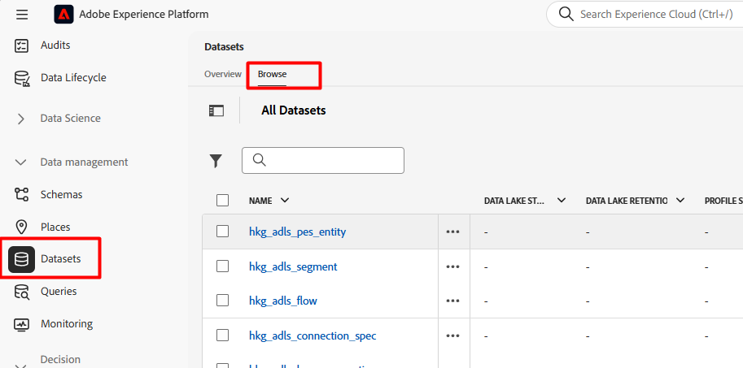
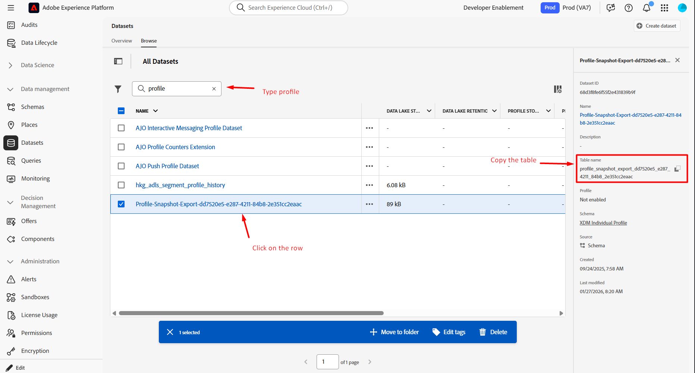
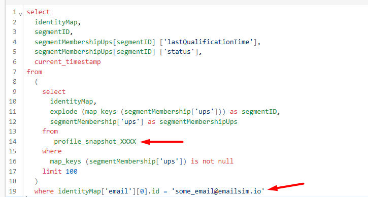

# Momentaufnahme des Profils validieren

## Lernziel

Vergewissern Sie sich, dass das Profil noch nicht im Profil-Snapshot-Datensatz angezeigt wird.

## Profil-Momentaufnahme-Datensatz verwenden

1. Klicken Sie in der linken Navigationsleiste unter dem Abschnitt Daten-Management auf **Datensätze** und klicken Sie dann auf die **Durchsuchen** in der oberen Leiste



2. Geben Sie in das **Suchfeld** den Wert `profile` ein, klicken **auf die** mit dem Titel „Profil-Momentaufnahme…“ und kopieren Sie in der rechten Leiste **kopieren Sie den Tabellennamen** und fügen Sie ihn an eine Stelle ein, auf die Sie im nächsten Schritt verweisen können.

> [!NOTE]
>
>Möglicherweise müssen Sie alle Filter löschen, wenn Sie „Profil-Momentaufnahme…“ nicht sehen Datensatz.




3. Navigieren Sie zurück zum Abfrage-Editor und kopieren Sie die unten stehende SQL in den Editor

```sql
select
  identityMap,
  segmentID,
  segmentMembershipUps[segmentID] ['lastQualificationTime'],
  segmentMembershipUps[segmentID] ['status'],
  current_timestamp
from
  (
    select
      identityMap,
      explode (map_keys (segmentMembership['ups'])) as segmentID,
      segmentMembership['ups'] as segmentMembershipUps
    from
   
    where
      map_keys (segmentMembership['ups']) is not null
    limit 100
  )
  --where identityMap['email'][0].id = 'henry.creel@emailsim.io'
  limit 50
```

4. Aktualisieren Sie den Tabellennamen und die E-Mail-Adresse wie unten beschrieben:
   - **Tabellenname:** Kopieren Sie in Zeile 14 den Tabellennamen, den Sie für die Tabelle Profil-Momentaufnahme haben, und fügen Sie ihn zwischen dem `from` und dem `where` ein
   - **E-Mail-Adresse:** Geben Sie vorerst in Zeile 19 die gleiche E-Mail-Adresse ein, die Sie für den Versand Ihres Web-Ereignisses verwendet haben (wir haben Henry.creel\@emailsim.io verwendet, es sei denn, Sie haben sie geändert).
     - Im Moment haben wir dies auskommentiert (lassen Sie es so). Wenn die Abfrage ausgeführt wird und Sie nach Henry suchen, finden Sie ihn nicht.



5. **Führen Sie** Abfrage aus, indem Sie auf den Pfeil oben links klicken.
6. Die Ergebnisse sind wie unten (aber wenn Sie nach Henry suchen, finden Sie ihn nicht)


>[!NOTE]
>
>**Warum keine Ergebnisse für Henry?**
>
>**Erinnerung**: Die Profil-Momentaufnahme ist eine **Spiegelung** oder Momentaufnahme dessen, was zu einem **Zeitpunkt im Profil vorhanden**. Der Auftrag wird **täglich** ausgeführt und wird für nachgelagerte Zwecke wie AJO verwendet. Da Sie diese Daten gerade gestreamt haben, verfügt der Profil-Schnappschuss noch nicht über sie.  Morgen wird es soweit sein.

## Zusammenfassung

Verstehen Sie, dass Snapshot-Datensätze bei einem geplanten Batch-Prozess und nicht sofort aktualisiert werden.
