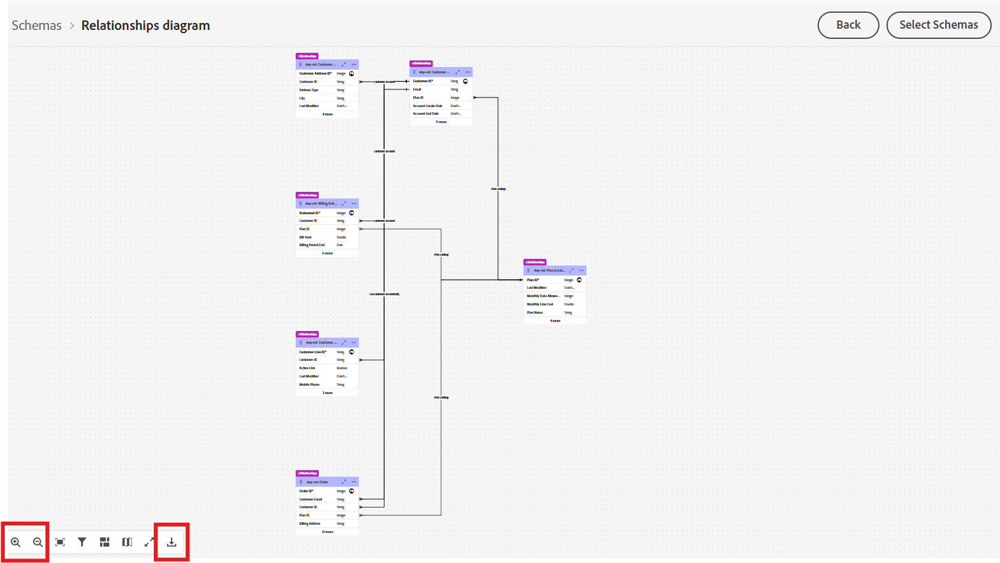

# Durchsuchen von Schemata

## Ziel

Im nächsten Satz von Schritten navigieren Sie in der Benutzeroberfläche, um die Schemata und ihre Beziehungen anzuzeigen.  Dies ist wichtig, um sich mit den Schemata und Beziehungen vertraut zu machen, die beim Erstellen Ihrer Kampagne verfügbar sind.

## Anzeigen von Schemata

Das relationale Datenmodell Connection 5G wurde bereits für Sie erstellt. Sie können die Schemata selbst anzeigen, indem Sie in der Benutzeroberfläche zur Seite **Schemata ->**&quot; navigieren.

Geben Sie im Suchfeld `dep-rel` ein, um alle Schemata anzuzeigen.

>[!NOTE]
>
>Beachten Sie, dass der Typ aller Schemata &quot;*&quot;*

## Beziehungsdiagramm anzeigen

Mit relationalen XDM-Schemata können Sie das Entitätsbeziehungsdiagramm (Entity Relationship Diagram, ERD) einfach anzeigen, indem Sie ein beliebiges Schema auswählen und auf die Schaltfläche Beziehungsdiagramm anzeigen klicken.

Gehen Sie folgendermaßen vor:

1. Klicken Sie auf die **Beziehungen** und dann auf die Schaltfläche **Beziehungsdiagramm anzeigen**.

&#x200B;2. Klicken Sie auf **Schemata auswählen**
&#x200B;3. Wählen Sie im Popup-Fenster die Option `dep-rel: Customer Account` und klicken Sie dann auf **Bestätigen**

&#x200B;4. Klicken Sie im ERD auf die **3 Punkte** und wählen Sie **Zugehörige Elemente anzeigen**

&#x200B;5. Zeigen Sie das ERD mit allen Tabellen an, die sich direkt auf Dep-rel: Kundenkonto beziehen. Optional können Sie das ERD als PNG-Datei herunterladen.

>[!TIP]
>
>Ziemlich cool, eh?!

## Zusammenfassung

Sie haben jetzt gesehen, wie einfach die Navigation in der Benutzeroberfläche für Schemas und Beziehungen ist.  Sie können bestimmte Schemata auswählen und zu den Beziehungen navigieren, um die Daten in der Kampagnenorchestrierung besser zu verstehen und zu verwenden.

Weitere Informationen finden [&#x200B; (hier](https://experienceleague.adobe.com/de/docs/journey-optimizer/using/data-management/get-started-schemas) wenn Sie Interesse haben.
