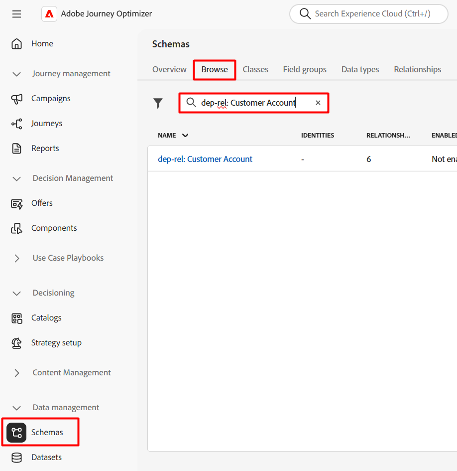
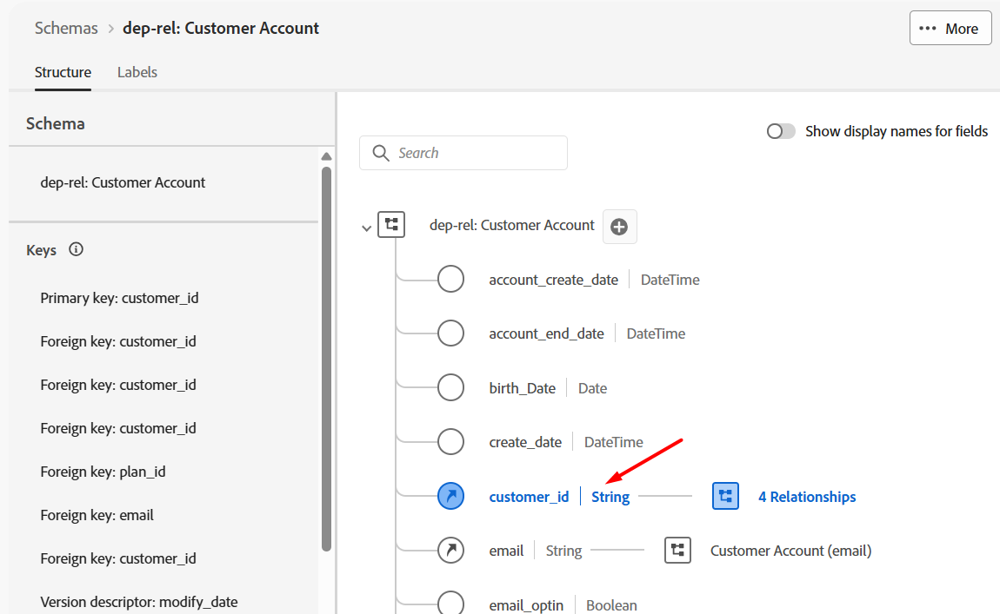
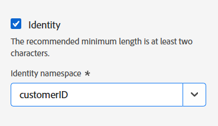
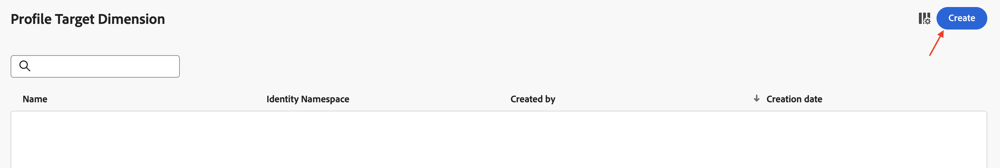
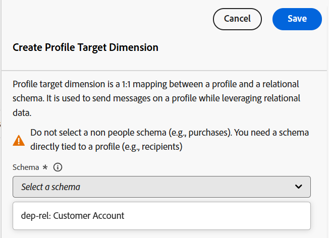

# Profil - Target Dimension

## Ziel

Im nächsten Schritt navigieren Sie in der Benutzeroberfläche , um das Schema anzuzeigen und die Identität einzurichten. Als Nächstes richten Sie die Dimension Profilzielgruppe ein. Dies ist der Entitätstyp, auf den sich die Kampagne bezieht und der mit dem AEP-Profil für den Versand in Einklang steht.

## Warum das wichtig ist

Mit der Profil-Target-Dimension wird Adobe Journey Optimizer mitgeteilt, wie Daten zwischen dem Echtzeit-Kundenprofil und dem relationalen Speicher verbunden werden können. Die Bestandteile dieser Konfiguration sind wie folgt:

- Ein relationales Schema
- Ein einzelnes Feld aus dem relationalen Schema
- Ein mit diesem Feld verknüpfter Identity-Namespace

>[!CAUTION]
>
>Ohne diese Konfiguration können keine Zielgruppen gelesen oder freigegeben werden, und es können auch keine Nachrichten aus orchestrierten Kampagnen gesendet werden

## Kennzeichnen der Identität

1. Klicken Sie auf das Symbol **Apps** und wählen Sie **Journey Optimizer aus**

   

2. Klicken Sie **Menü Daten-** auf „Schemata“ und stellen Sie sicher, dass Sie die Registerkarte **Durchsuchen** ausgewählt haben.
3. Suchen Sie nach dem Schema namens `dep-rel: Customer Account`

   

4. Öffnen Sie das Schema, indem Sie auf den Namen und dann auf das Feld **customer\_id** klicken

   

5. Suchen Sie in der rechten Leiste das Kontrollkästchen **Identität**, aktivieren **das Kontrollkästchen** und wählen Sie den Identity-Namespace **customerID**

   

6. Klicken Sie auf **Speichern**, um Ihr Schema zu speichern. Eine Bestätigungsmeldung wird angezeigt
7. Klicken Sie auf **Abbrechen** oder auf die Schaltfläche **Schemata** in der linken Leiste, um die Schema-Benutzeroberfläche zu verlassen

>[!CAUTION]
>
>Wenn Sie das Schema nach dem Hinzufügen der Identitätskennzeichnung nicht speichern, funktionieren die nächsten Konfigurationsschritte nicht

>[!NOTE]
>
>Nach dem Speichern dauert es einige Minuten (unter 5 Minuten), bis es im nächsten Schritt in der Dropdown-Liste Profil-Dimension angezeigt wird.

## Erstellen der Target-Profil-Dimension

1. Klicken Sie auf **Konfigurationen** unter **Administration**

   

2. Wählen Sie **Profile Target Dimension** aus und klicken Sie auf **Verwalten**

   

3. Der Fensterbereich Profile Target Dimension wird geöffnet. Klicken Sie auf **Erstellen**

   

4. Wählen Sie die `dep-rel: Customer Account` aus der Dropdown-Liste aus.

   >[!NOTE]
   >
   >Es kann einige Minuten dauern, bis das Schema nach dem Markieren der Identität auf diesem Bildschirm angezeigt wird. Aktualisieren Sie die Seite und wiederholen Sie die beiden vorherigen Schritte, bis das Schema angezeigt wird.

   

5. Wählen Sie für **Identitätswert** die Option `/customer_id`

   

   >[!NOTE]
   >
   >Ein relationales Schema kann viele Felder aufweisen, die mit Identitäten beschriftet sind, sodass es sich um ein Listenfeld handelt.

6. Klicken Sie auf **Speichern**, um die Profilzielgruppen-Dimension zu erstellen. Dann wird der Datensatz angezeigt.

>[!NOTE]
>
>Der Name des erstellten Datensatzes ist eine Verkettung aus dem Schemanamen *(dep-rel: Kundenkonto)* und dem Feld mit der *(customer\_id)*

>[!TIP]
>
>Herzlichen Glückwunsch! Damit ist der Erstellungsschritt von Profile Target Dimension im Labor abgeschlossen.

## Zusammenfassung

Sie haben jetzt gesehen, wie einfach es ist, im Schema zu navigieren, ein Attribut als Identität zu markieren und die Profilzielgruppen-Dimension zu erstellen.

Weitere Informationen finden [&#x200B; (hier](https://experienceleague.adobe.com/en/docs/journey-optimizer/using/campaigns/orchestrated-campaigns/data-configuration/target-dimension) wenn Sie Interesse haben.
