# Zielgruppe lesen

## Ziel

In den nächsten Schritten erstellen Sie eine Kampagne, um eine Zielgruppe aus AEP zu lesen und sie zusammen mit der zuvor erstellten Dimension-Profilzielgruppe zu verwenden. Verwenden Sie die Aktivität Aufspaltung , um die Daten auf der Grundlage einer Bedingung aufzuteilen. Testen Sie abschließend die Kampagne, um zu verstehen, wie diese Zielgruppen funktionieren, wenn sie mit dem relationalen Schema verwendet werden.

## Lesen der Zielgruppe

In diesem Labor wird die Verwendung der Aktivität „Zielgruppe lesen“ in Verbindung mit dem relationalen Schema für die Anreicherung behandelt.

Orchestrierte Kampagne verwendet das relationale Schema für alle Aktivitäten. Wenn die Aktivität Audience lesen verwendet wird, die die Audience aus AEP liest, sollte eine entsprechende Entität (Target-Dimension) konfiguriert werden, um die Audience mit der Campaign Target-Dimension abzustimmen.

## Erstellen einer Kampagne

1. Klicken Sie in der linken Seitenleiste auf **Kampagnen**

&#x200B;2. Klicken Sie auf **Kampagne erstellen**

&#x200B;3. Wählen Sie **Orchestrierung - Marketing** und klicken Sie auf **Bestätigen**

&#x200B;4. Geben Sie die Kampagnendetails wie folgt an und klicken Sie dann auf die Schaltfläche **Speichern**
   - Name: **OC-RSL-ReadAudience-Test**
   - Beschreibung: **RSL-read audience test**

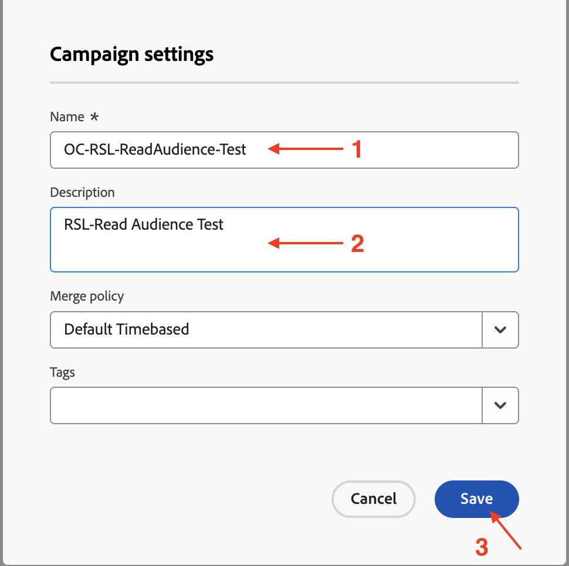

&#x200B;5. Auf die Bestätigungsmeldung warten

## Audience-Aktivität lesen hinzufügen

1. Klicken Sie auf das **+** innerhalb der Arbeitsfläche, um das Optionsmenü zu öffnen, und wählen Sie dann **Zielgruppe lesen** aus den **Targeting-Aktivitäten**

&#x200B;2. Klicken Sie **Detailbereich Zielgruppe lesen** auf das Suchsymbol für **Zielgruppe**

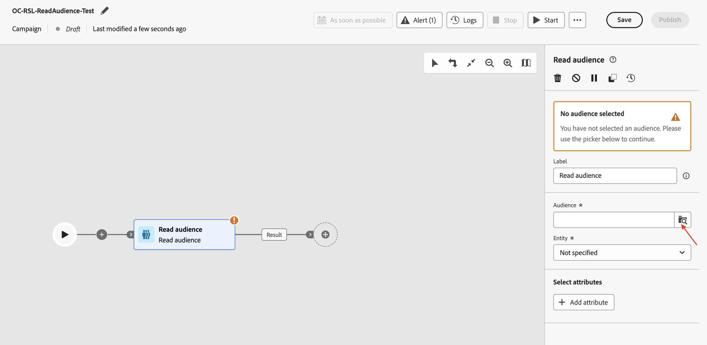

&#x200B;3. Wählen Sie die Zielgruppe **dep: Basic Plan Members** mit der Profilanzahl von **9** aus und klicken Sie auf **Zielgruppe hinzufügen**

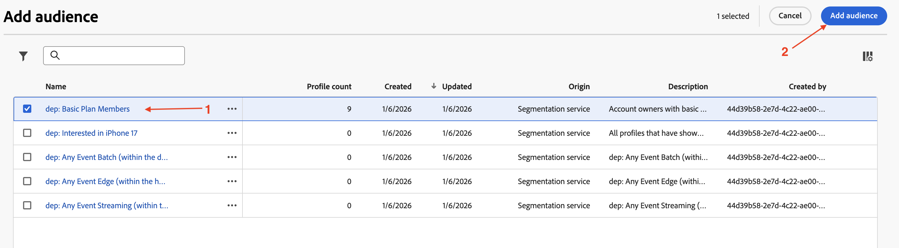

&#x200B;4. Klicken Sie anschließend auf die Dropdown-Liste für **Entität** und wählen Sie die `dep-rel: Customer Account - customer_id` Campaign Target-Dimension aus

>[!NOTE]
>
>Andere Attribute können auch aus dem AEP-Profil extrahiert werden, um sie auf der Arbeitsfläche mithilfe der Schaltfläche **Attribut hinzufügen** zu verwenden. Für dieses Labor sind jedoch keine zusätzlichen Attribute erforderlich, sodass dieser Schritt übersprungen wird.

## Testen der Kampagne

1. Die Einstellungen für die Aktivität **Zielgruppe lesen** sind ausgefüllt. Klicken Sie auf **Starten**, um die Kampagne im **Testmodus“**

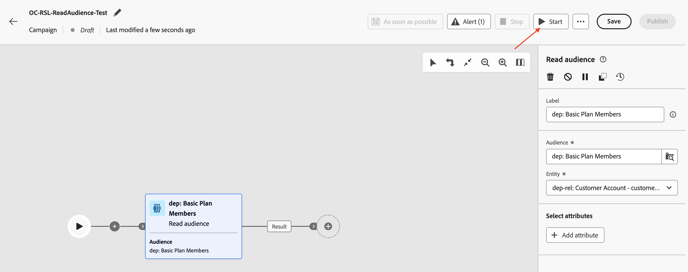

>[!NOTE]
>
>Dieser Vorgang dauert einige Minuten.
>
>Der Testmodus ermöglicht die Ausführung der Kampagne zur Überprüfung und Überwachung ihres Verhaltens sowie der Ergebnisse jeder Aktivität. Die Aktivitäten werden sequenziell bis zum Ende der Arbeitsfläche ausgeführt.

&#x200B;2. Die Testausführung beginnt, und die Ergebnisse werden nach Abschluss angezeigt. Klicken Sie auf **Knoten** Ergebnis“ und dann auf Ergebnisse in der Vorschau anzeigen , um die Ausführungsergebnisse anzuzeigen

&#x200B;3. Beachten Sie, dass **2** (von 9) Profile aus dem **Zielgruppe lesen** keine entsprechende **Zielgruppendimension** aus dem relationalen Schema haben (d. h. sie sind im Profilspeicher, aber nicht im relationalen Speicher vorhanden). Und da die koordinierte Kampagne vom relationalen Schema aus funktioniert, werden die nicht übereinstimmenden `customer_id` (**2**) aus der **Zielgruppe lesen** entfernt und nur die *übereinstimmenden*, **7**, sind in nachfolgenden Aktivitäten verwendbar, die **relationalen Daten** in der Kampagne nutzen

>[!NOTE]
>
>Die folgenden Schritte verwenden die relationalen Daten, um die oben aufgeführte Aussage zu bestätigen, dass nicht übereinstimmende `customer_id` verworfen werden.

&#x200B;4. Klicken Sie auf **Stoppen**, um den **Testmodus** der Kampagne zu stoppen

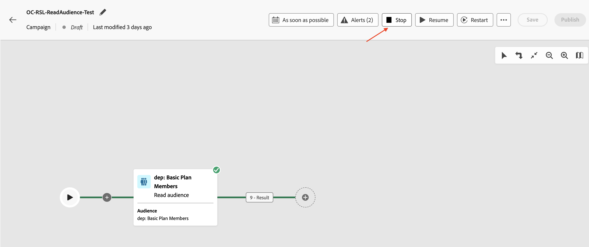

&#x200B;5. Klicken Sie auf das **+** am Ende des Flusses und fügen Sie **Aufspaltung** aus den **Targeting-Aktivitäten**

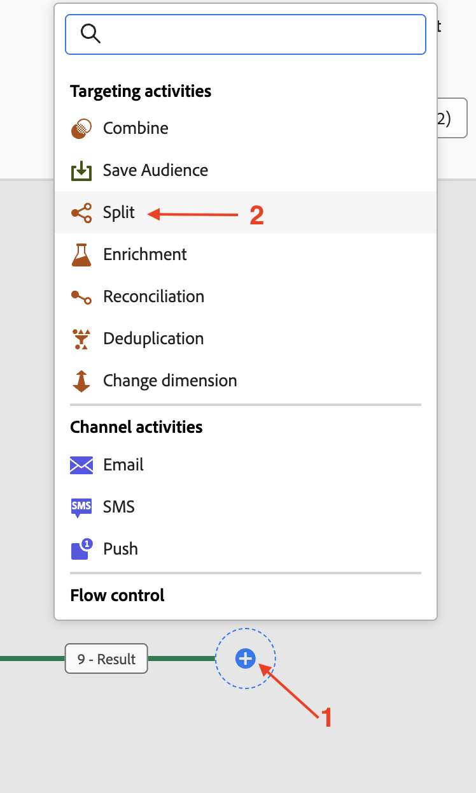

&#x200B;6. Erweitern Sie im Detailbereich der Aktivität **Aufspaltung** die erste Aufspaltung namens „Teilmenge **&#x200B;**

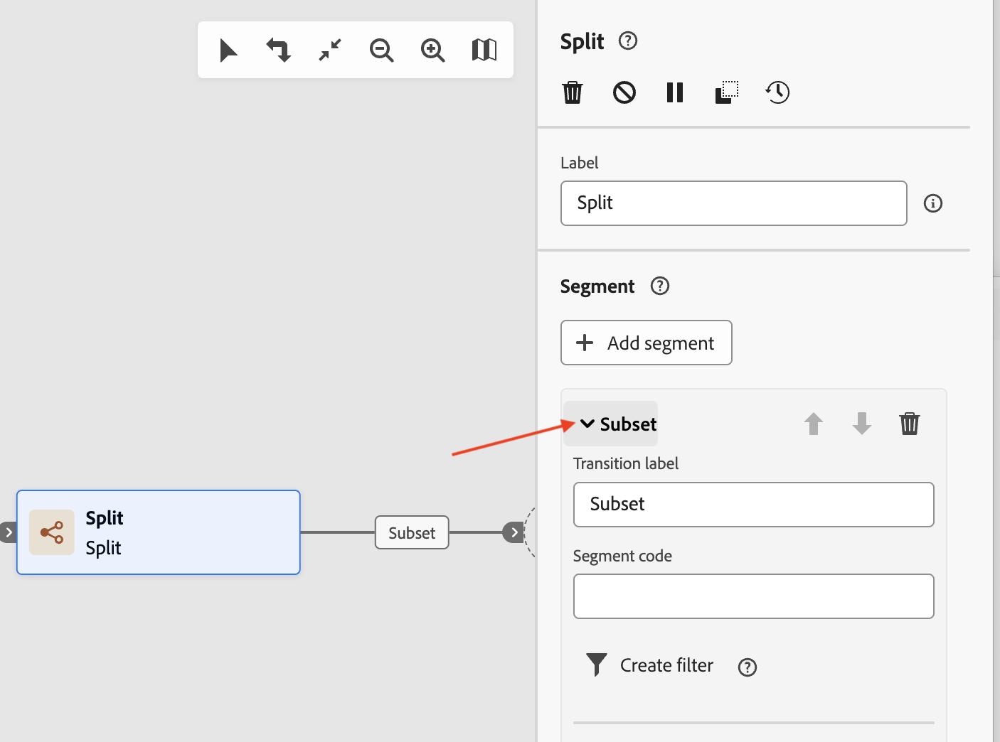

&#x200B;7. Benennen Sie ihn in &quot;**Store** um und klicken Sie auf **Filter erstellen** um die Filterbedingung festzulegen

&#x200B;8. Klicken **im Bereich** Filter erstellen“ auf **Bedingung hinzufügen**

&#x200B;9. Da keine anderen Attribute aus dem AEP-Profil extrahiert wurden, ist das einzige hier verfügbare AEP-Profilattribut das `Customer ID`. Es stehen jedoch Spalten aus dem relationalen Speicher, der der entsprechenden Zieldimension entspricht, zum Einrichten der Filterbedingung zur Verfügung. Erweitern Sie die **Zielgruppendimension** durch Klicken auf **>**

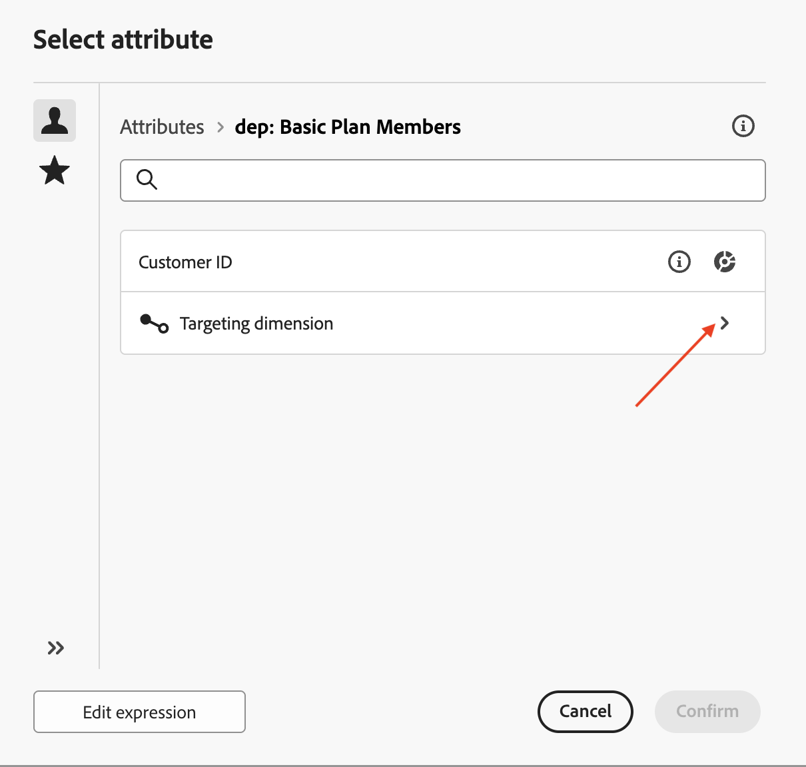

&#x200B;10. Wählen Sie `Source` aus der Liste aus und klicken Sie auf **Bestätigen**

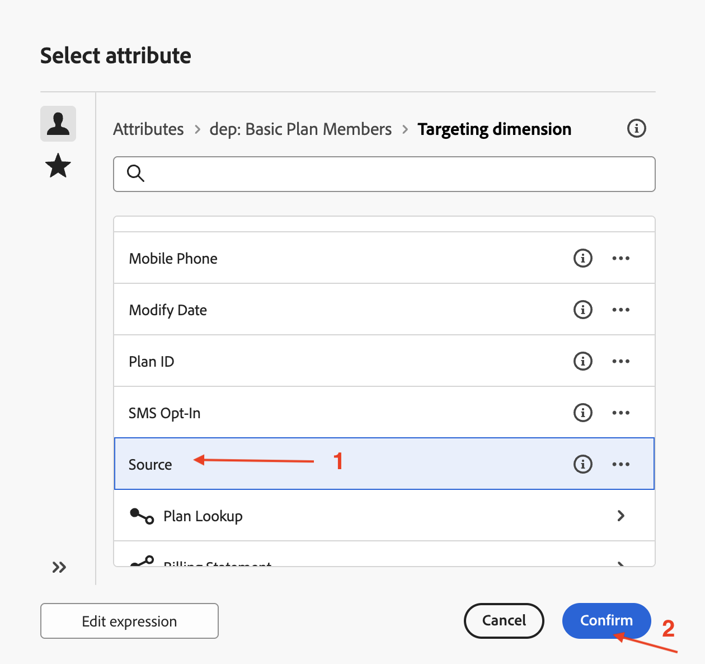

&#x200B;11. Die unterschiedlichen Werte für die Source-Spalte sind in der Dropdown-Liste verfügbar. Wählen Sie für **Benutzerdefinierte Bedingung** aus der Dropdown-Liste die Option **„In Store“** und klicken Sie auf **Bestätigen**, um den Vorgang zu beenden

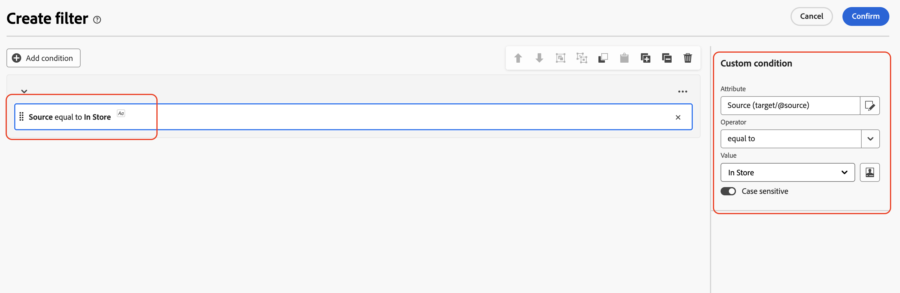

&#x200B;12. Zurück im Detailbereich der Aktivität **Aufspaltung** sind die Einstellungen für die erste Aufspaltung abgeschlossen. Klicken Sie auf **Segment hinzufügen**, um die zweite Aufspaltung zu aktualisieren

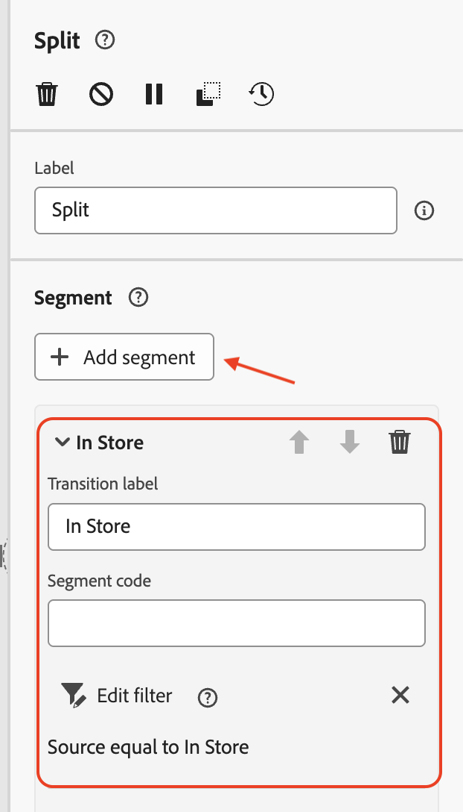

Ein neues Segment mit dem Namen **Ergebnis** wird erstellt

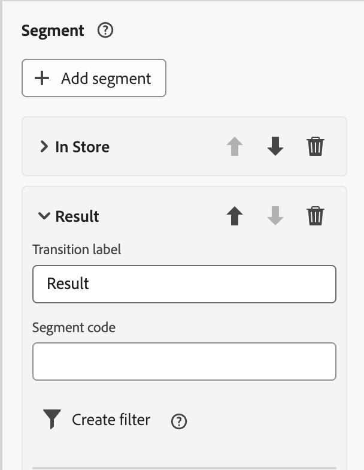

&#x200B;13. Benennen Sie &quot;**Ergebnis**&quot; in &quot;**Nicht im Speicher** um und klicken Sie auf **Filter erstellen**, um die Filterbedingung festzulegen

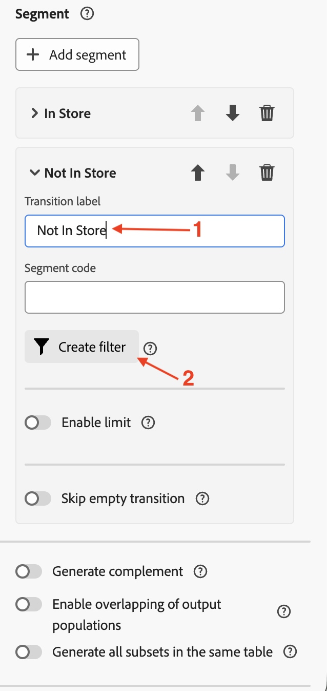

&#x200B;14. Klicken Sie im **Filter erstellen** auf **Bedingung hinzufügen**. Folgen Sie demselben Ansatz wie oben, erweitern Sie die **Zielgruppendimension** indem Sie auf **>** klicken, wählen Sie dann `Source` aus der Liste aus und klicken Sie auf **Bestätigen**

&#x200B;15. Wählen Sie für **Benutzerdefinierte Bedingung** aus der Dropdown-Liste die Option **„In Store“** und wählen Sie für den Operator &quot;**ungleich**. Klicken Sie auf **Bestätigen**, um den Vorgang zu beenden

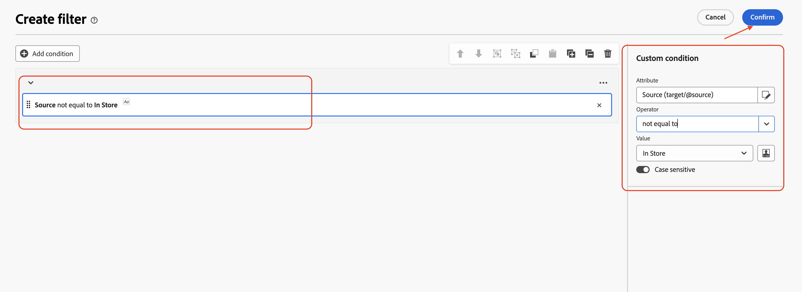

&#x200B;16. Zurück im Detailbereich der Aktivität **Aufspaltung** sind die Einstellungen für die beiden Aufspaltungen abgeschlossen. Klicken Sie auf **Starten**, um die Kampagne im **Testmodus“**

&#x200B;17. Die Testausführung beginnt, und die Ergebnisse werden nach Abschluss angezeigt. Da nur **7** übereinstimmende Zieldimensionen im relationalen Schema gefunden wurden, wird dieselbe Anzahl auch nach den Aufspaltungsvorgängen (**7** und **0**) beobachtet

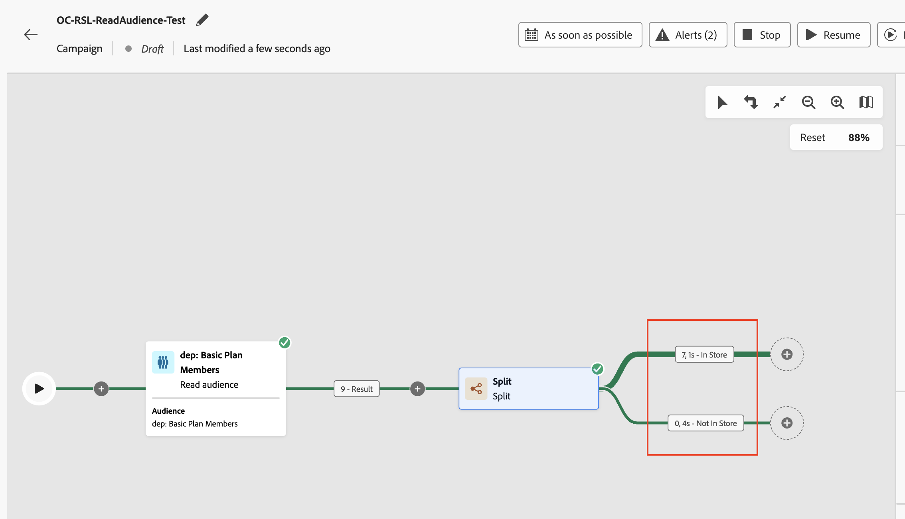

&#x200B;18. Klicken Sie auf jedes Ergebnisfeld und **Vorschau der Ergebnisse**, um die Ergebnisse anzuzeigen

&#x200B;19. Klicken Sie auf **Stoppen**, um den **Testmodus** der Kampagne zu stoppen

>[!NOTE]
>
>Während beim Audience lesen **9** Profile angezeigt wurden. Da wir einen Filter für Source erstellt haben und das Feld &quot;Source&quot; im relationalen Speicher vorhanden ist, mussten wir den Profilspeicher mit dem relationalen Speicher verbinden, um ihn zu überprüfen. Als es über die Campaign Target Dimension mit dem relationalen Schema verbunden wurde, stimmten nur insgesamt **7** Profile überein. Diese **7** übereinstimmenden Kunden-IDs sind für die Verwendung in den folgenden Aktivitäten verfügbar, die versuchen, relationale Daten zu verwenden. Alle **7**-Kunden-IDs `Source` auf **„In Store“**, was durch die Aufspaltungsflüsse deutlich wurde.
>
>Daher ist die Gewährleistung der Datenkonsistenz von entscheidender Bedeutung, wenn AEP-Profile zusammen mit ihren relationalen Gegenstücken zur Anreicherung verwendet werden.

>[!TIP]
>
>Herzlichen Glückwunsch! Damit ist die Übung zur Verwendung der Aktivität „Zielgruppe lesen“ mit dem relationalen Schema abgeschlossen.

## Zusammenfassung

Sie haben jetzt gesehen, wie einfach es ist, eine Kampagne zu erstellen, eine Aktivität „Zielgruppe lesen“ zusammen mit der Dimension „Profilzielgruppe“ durchzuführen, um das relationale Schema zu nutzen. Sie haben die Aufspaltungsaktivität verwendet, um die Zielgruppe basierend auf einer Bedingung aufzuteilen. Schließlich hat der Testmodus dabei geholfen zu verstehen, dass es wichtig ist, die Datenkonsistenz zwischen dem Profil und dem relationalen Schema zu gewährleisten.

Weitere Informationen finden [&#x200B; (hier](https://experienceleague.adobe.com/en/docs/journey-optimizer/using/campaigns/orchestrated-campaigns/design-campaigns/read-audience) wenn Sie Interesse haben.
