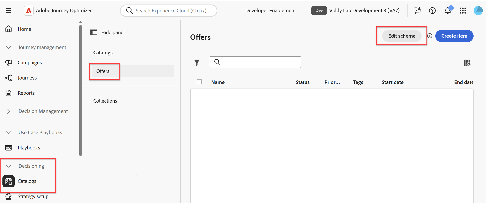
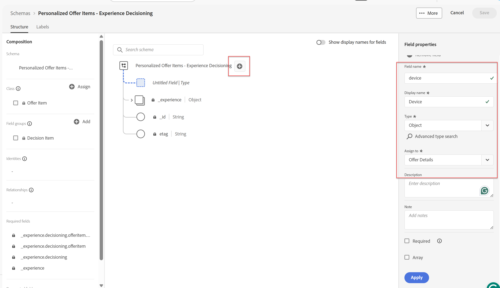
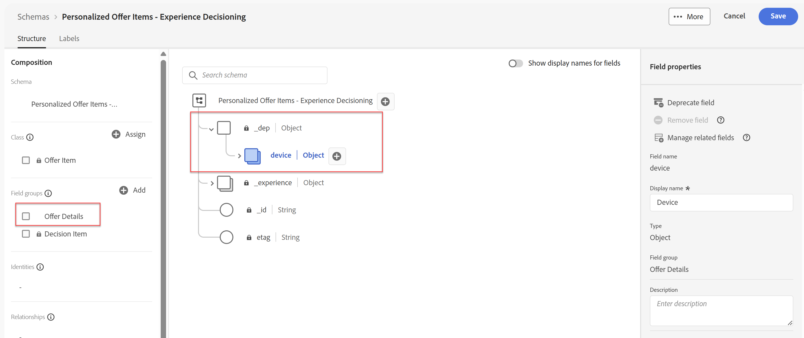

# Angebotsattribute erstellen

## Ziel

In diesem Abschnitt fügen Sie dem Standard-XDM-Schema des Angebots benutzerdefinierte XDM-Felder hinzu. Diese benutzerdefinierten Felder können in Ranking-, Sortier- und Eignungskriterien verwendet werden. Dabei kann es sich auch um Daten handeln, die an das anfragende Gerät zurückgegeben werden.

## Übergeordnetes Objekt für benutzerdefiniertes Gerät erstellen

1. Erweitern Sie bei Bedarf das **Decisioning**-Menüelement in der linken Leiste und klicken Sie auf **Catalogs.**
2. Standardmäßig wird die Seite „Angebote“ angezeigt. Klicken Sie auf **Schema bearbeiten** in der oberen rechten Ecke.

>[!TIP]
>
>Die resultierende Seite ist der standardmäßige XDM-Schema-Editor. Genau wie XDM verwendet wird, um die Datenstruktur von Datensätzen zu definieren, wird XDM hier verwendet, um die Attribute eines Angebots zu definieren.

>[!NOTE]
>
>Das Schema „Personalisierte Angebotselemente - Erlebnisentscheidung“ ist ein systemgeneriertes Standardschema, das für alle Angebote gilt. Sie können jedoch zu diesem Schema hinzufügen, um individuelle Geschäftsanforderungen zu erfüllen. Dies erfahren Sie in diesem Abschnitt.
>
>Darüber hinaus ist das Durchsuchen der Seite „Angebote“ eine Verknüpfung, um zu diesem Schema zu gelangen. Sie können auch über das Menü Schema in der linken Leiste dorthin navigieren.

3. Klicken Sie auf das Symbol **+** rechts neben der Stammebene des Schemas. Füllen Sie über das jetzt sichtbare Menü „Feldeigenschaften“ in der rechten Leiste die folgenden Felder mit den angegebenen Werten aus:
   - Feldname: **device**
   - Anzeigename: **Gerät**
   - Typ Dropdown: **Objekt**
   - Der Feldergruppe zuweisen (geben Sie diesen Wert ein): **Angebotsdetails**

>[!NOTE]
>
>Die Feldergruppe „Zuweisen an“ scheint ein Dropdown-Menü zu sein, akzeptiert jedoch auch eine direkte Texteingabe. Geben Sie daher den Text „Angebotsdetails“ ein. Wenn Sie sie eingeben, wird auch ein Element „Angebotsdetails (Neu)“ angezeigt. Jedes neue Attribut muss einer Feldergruppe zugewiesen werden. In diesem Schritt erstellen Sie also effektiv eine neue Feldergruppe namens Angebotsdetails.

4. Stellen Sie sicher, dass alle Eigenschaften wie im folgenden Screenshot ausgefüllt wurden:

5. Nachdem Sie sich vergewissert haben, dass alle Felder korrekt sind, klicken Sie auf die blaue Schaltfläche **Anwenden** am unteren Rand des Menüs „Feldeigenschaften“ (rechte Leiste), um Ihre auf das Schema angewendeten Änderungen anzuzeigen:

>[!TIP]
>
>Genau wie beim normalen XDM werden die benutzerdefinierten Attribute in einem für die IMS-Organisation spezifischen Namespace gruppiert, in diesem Fall mit der imsOrg-Mandanten-ID oder „dep“. Außerdem sehen Sie, dass die neue Feldergruppe „Angebotsdetails“ jetzt im Bereich „Komposition“ links vom Schema aufgeführt ist.

>[!WARNING]
>
>Beachten Sie, dass diese Änderungen NICHT gespeichert werden. Sie werden nur angewendet. Wenn Sie die Seite verlassen, ohne zu speichern, gehen Sie verloren. Führen Sie die Schritte in diesem Abschnitt aus, bevor Sie die Seite verlassen.

## Erstellen benutzerdefinierter Geräteattribute

Nachdem das Geräte-XDM-Objekt erstellt wurde, können Sie mit der Erstellung gerätespezifischer Felder fortfahren.

1. Klicken Sie auf das **+**-Symbol rechts neben dem neuen **Gerät**-Objekt, das Sie gerade erstellt haben, und füllen Sie über das Menü „Feldeigenschaften“ in der rechten Leiste die folgenden Felder mit den angegebenen Werten aus:
   - Feldname: **make**
   - Anzeigename: **Make**
   - Typ Dropdown: **String**
   - Feldergruppe zuweisen: **Angebotsdetails** (sollte bereits ausgewählt sein)
   - Nachdem Sie sich vergewissert haben, dass alle Felder korrekt sind, klicken Sie auf die blaue **Apply**-Schaltfläche, um Ihre Änderungen auf das Schema anzuwenden
2. Wiederholen Sie die vorherigen Schritte, um zwei zusätzliche Attribute für **Modell** und **Ebene** hinzuzufügen. Verwenden Sie dasselbe Benennungsmuster, denselben Typ und dieselbe Feldergruppe. Nach Abschluss des Vorgangs sollte das Schema wie folgt aussehen:

3. Wenn alle neuen XDM-Felder/Attribute erstellt sind, klicken **oben** auf „Speichern“. Daraufhin wird unten im Bildschirm die grüne Meldung „Schema Successfully Saved“ angezeigt. Sie haben nun die Schritte in diesem Abschnitt ausgeführt.

>[!WARNING]
>
>Das Schema, das Sie gerade aktualisiert haben, gilt für ALLE Angebote, einschließlich aller zukünftigen Angebote. Beim Hinzufügen von Attributen zu diesem Schema ist große Vorsicht geboten. In unserem Beispiel-Anwendungsfall eines Telekommunikationsunternehmens, das Mobiltelefone verkauft, werden die Geräte-, Marken-, Modell- und Stufen-Attribute wahrscheinlich für viele Angebote und in den kommenden Jahren weit verbreitet sein. Daher ist es sinnvoll, sie hinzuzufügen. Wenn Sie darüber nachdenken, welche Attribute für ein Angebot erforderlich sind, vermeiden Sie das Hinzufügen von Attributen, die für eine bestimmte Kampagne eindeutig sind. Über Monate oder Jahre kann dieses Schema aufgebläht werden und beim Erstellen von Angeboten zu Problemen führen. Wie dies zutrifft, erfahren Sie in dem Abschnitt, in dem Sie Angebote erstellen.

## Zusammenfassung

Sie haben das Schema für Standardangebote erfolgreich mit wiederverwendbaren benutzerdefinierten Feldern aktualisiert, die in späteren Teilen des Labors bei der Erstellung und Auswertung von Angeboten genutzt werden.
