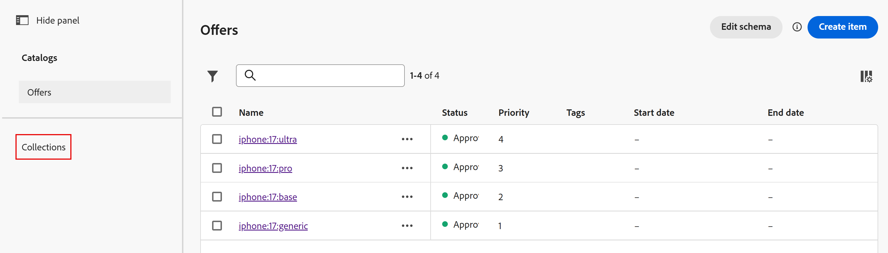
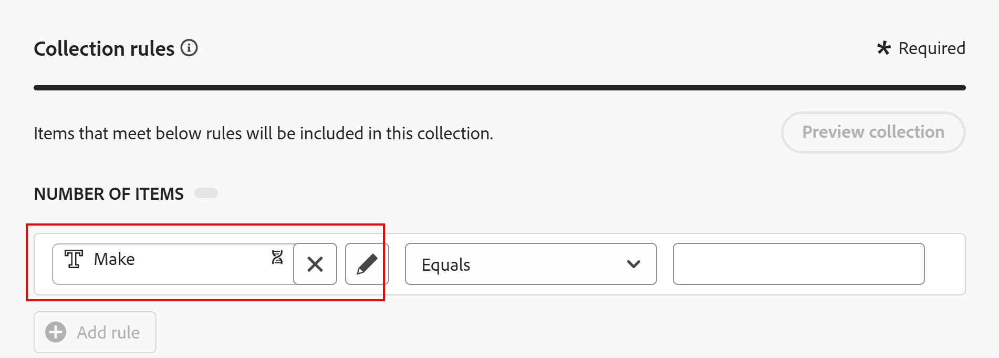
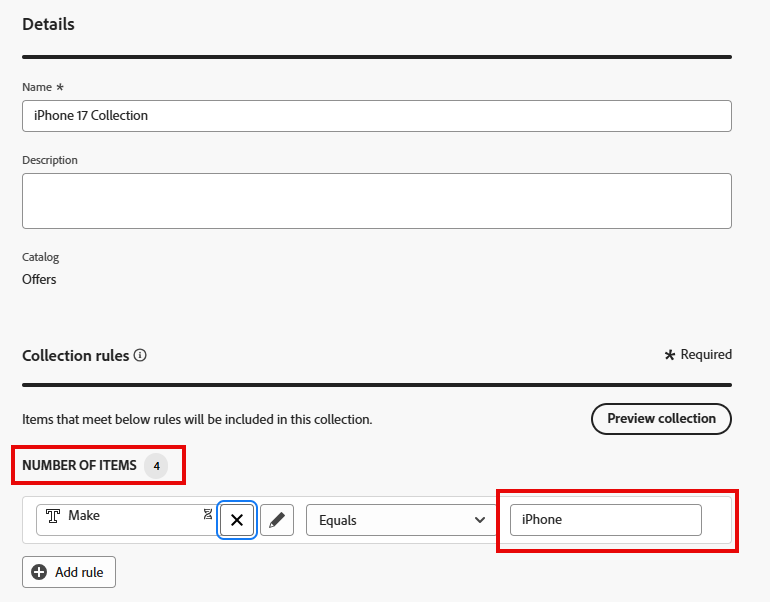
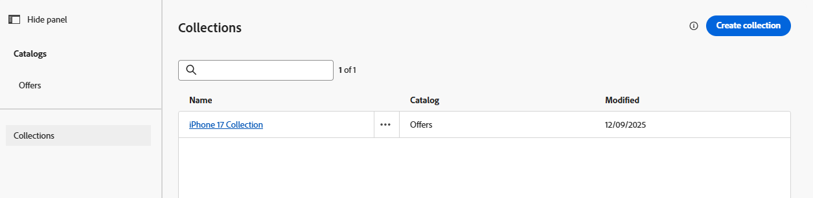

# Angebotssammlung erstellen

## Ziel

Nachdem Ihre Angebote erstellt wurden, müssen sie in einer Sammlung organisiert werden. Eine Sammlung enthält ein oder mehrere Angebotselemente, und ein Angebotselement kann sich in mehreren Sammlungen befinden.

## Erstellen der iPhone-Angebotssammlung

1. Erweitern Sie bei Bedarf **Decisioning** in der linken Leiste und klicken Sie dann auf **Kataloge**. Sie sehen die vier Angebote, die Sie im vorherigen Abschnitt erstellt haben.
2. Klicken Sie auf **Sammlungen** direkt links neben dem Angebotsnamen

   

3. Klicken Sie auf die blaue **Sammlung erstellen**, um die neue Sammlung zu erstellen.
4. Benennen Sie die Sammlung **iPhone 17-Sammlung**
5. Klicken Sie im Abschnitt „Sammlungsregeln“ auf das Textfeld, das den Text enthält **_Klicken Sie, um ein Entscheidungselement zu erstellen_**. Wenn Sie darauf klicken, werden die Optionen zum Erstellen der Regel angezeigt.

   

6. Klicken Sie auf **Attribut auswählen** und navigieren Sie durch Klicken auf „Gerät“ > „Erstellen **durch das**. Klicken Sie **Speichern** und Sie sehen, dass das Attribut „Make“ jetzt in der Entscheidungsregel enthalten ist.

   

   >[!NOTE]
   >
   >Beachten Sie, dass es sich bei den verfügbaren Optionen um dieselben konfigurierbaren Felder handelt, die Sie beim Erstellen der Angebotselemente verwendet haben. Da es sich bei einer Sammlung um eine Gruppierung von Angebotselementen handelt, ist es sinnvoll, dass die Regeln zum Gruppieren von ihren Attributen abhängen.

7. Behalten Sie den Operator „Gleich“ bei und geben Sie den Text **iPhone** in das Wertefeld ein. Die Anzahl der Elemente ändert sich dann auf 4, was bedeutet, dass alle Ihre Angebotselemente diese Kriterien erfüllen

   

   >[!NOTE]
   >
   >Sie können auch auf die Schaltfläche **Vorschau der Sammlung** klicken und die Angebotselemente sehen, die den Kriterien entsprechen.

8. Klicken Sie bei allen vier ausgewählten Angebotselementen auf die blaue Schaltfläche **Erstellen**. Dadurch gelangen Sie zu einer Seite, auf der die neu erstellte Sammlung angezeigt wird.

>[!NOTE]
>
>Eine Sammlung ist mehr als nur ein Mittel zur Organisation. In den nächsten Schritten werden Sie sehen, dass wir bei der Entscheidungsfindung eine Auswahllogik auf eine Sammlung von Angeboten anwenden. Wenn Sie an eine Implementierung im Unternehmensbereich denken, ist es nicht schwer sich vorzustellen, wie viele Angebote im Laufe der Jahre erstellt würden. Um zu ermitteln, welche Angebote eine Auswahlstrategie auf BRINGS anwenden sollte, wird deutlich, wie wichtig eine ordnungsgemäße Sammlungsverwaltung ist.
>
>In diesem Fall würde eine Sammlung, die nur &quot;iPhone&quot; als Kriterium enthält, nach einigen Jahren der iPhone-Versionen zu viele Angebote einbringen. Wir hätten zusätzliche Kriterien wie „Make Equals 17“ oder AEP-Tags verwenden können, um Angebote für eine bestimmte Kampagne zu taggen. Aber der Einfachheit halber verwenden wir diese einfache Logik, um eine Sammlung zu erstellen.

## Zusammenfassung

Sie haben jetzt eine Angebotssammlung erstellt, in der die zuvor erstellten Angebotselemente gruppiert sind. Sie haben alle iPhone 17-Angebote zu einer Sammlung hinzugefügt und eine Regel basierend auf Angebotsattributen (wie dem Gerätehersteller) definiert, sodass nur relevante Angebote zu dieser Sammlung gehören.
