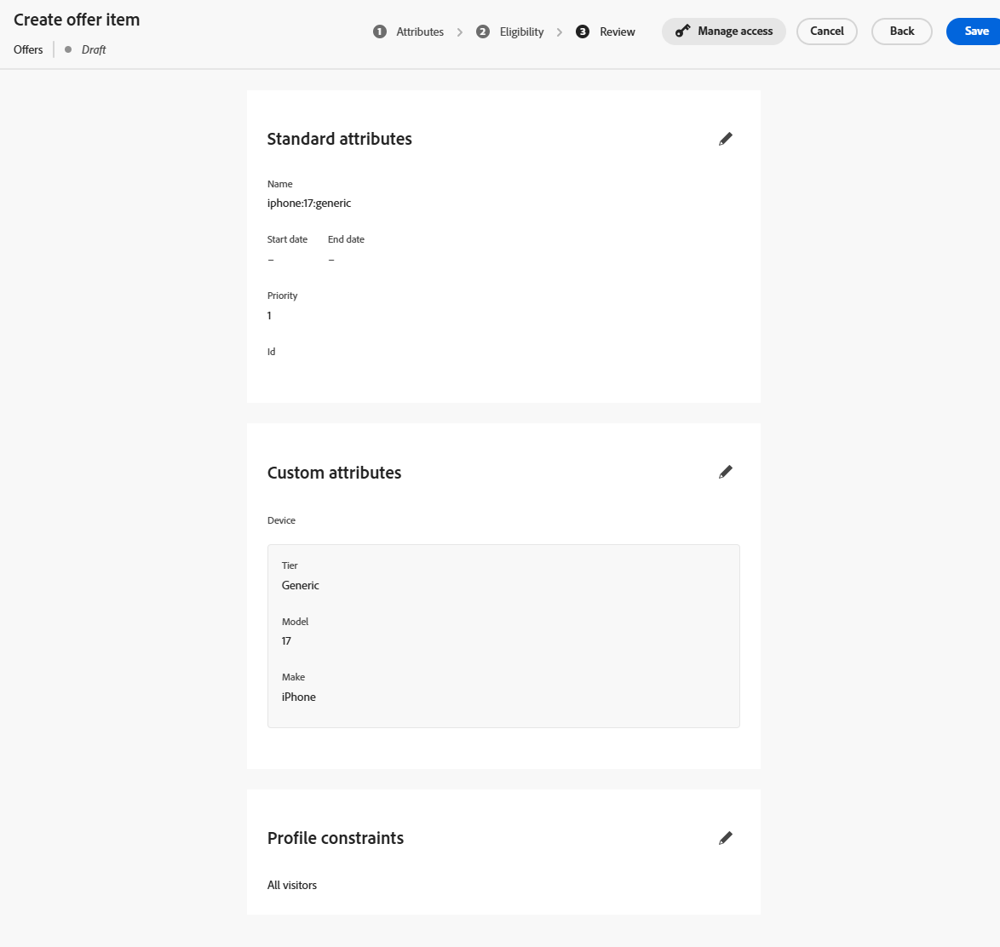
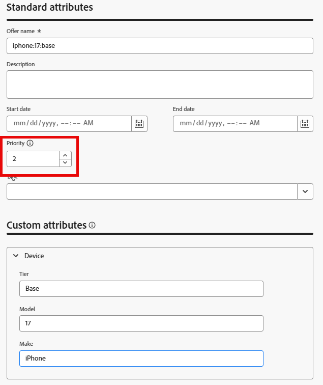
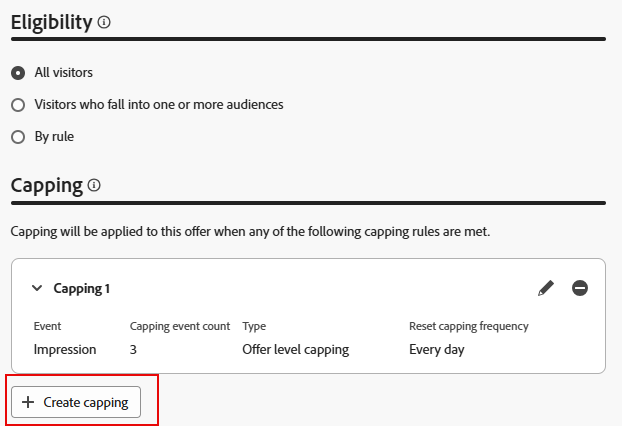
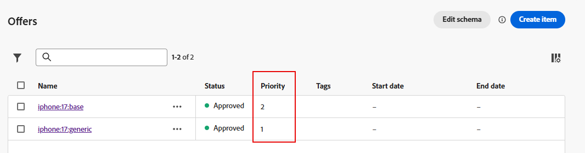
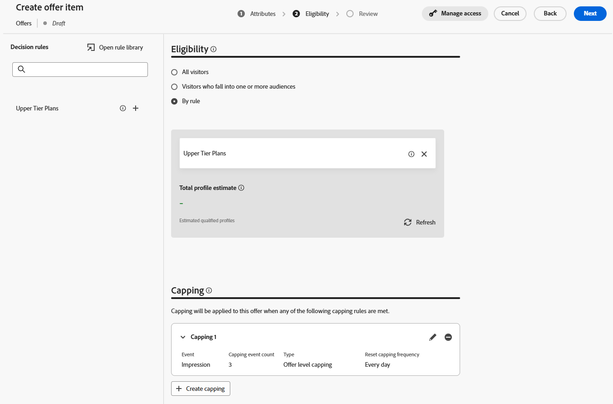
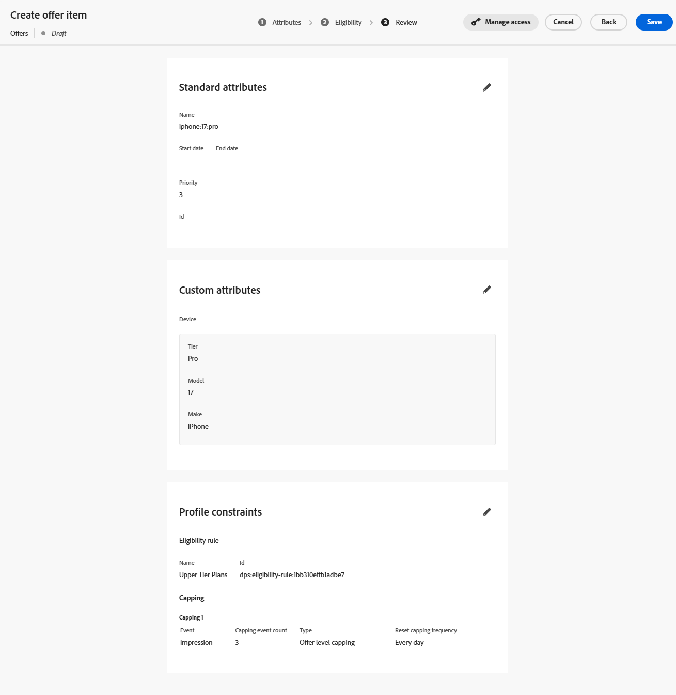

# Erstellen von Angebotselementen

## Ziel

In diesem Abschnitt erstellen Sie die tatsächlichen Angebotselemente, die das Code-basierte Erlebnis (CBE) an den anfragenden Client zurückgibt. Einige der Angebotselemente haben Eignungsanforderungen und eine Frequenzlimitierung, andere dagegen nicht.

## Szenario - Übersicht

Bevor Sie jedoch die Angebotselemente erstellen, hier einige kurze Erinnerungen an unser Szenario. Zunächst gibt es in unserem Szenario 3 iPhone 17-Stufen: Ultra, Pro und Base. Sie erstellen insgesamt 4 Angebote, 1 für jede Ebene, plus ein generisches Fallback-Angebot, das das empfangende System verwenden kann, um allgemeine Informationen über iPhone 17 in allen Ebenen anzuzeigen.

Zweitens sind nur Kunden mit einer Plan-ID von 2 oder 3 für die Ultra- und Pro-Kategorie-Telefone geeignet.

Als Nächstes hat das Unternehmen angefordert, dass jedes Angebot nur dreimal am Tag angezeigt wird, bevor das nächste Telefon der unteren Ebene präsentiert wird.

Und schließlich würde Connection 5G, wenn alles gleich ist, lieber die Ultra-Stufe verkaufen, gefolgt von der Pro und dann das Basismodell. Daher werden diese Prioritäten angezeigt, wenn Sie jedem Angebotselement eine Prioritätsbewertung zuweisen.

## Erstellen eines standardmäßigen/Fallback-Angebotselements

Das erste und einfachste von Ihnen erstellte Angebotselement ist das Fallback-Angebot, das jeder für unbegrenzte Zeit anzeigen kann.

1. Erweitern Sie bei Bedarf **Decisioning** in der linken Leiste und klicken Sie auf **Kataloge**
2. Eine leere Seite mit Angeboten wird angezeigt:

   

3. Klicken Sie auf die blaue Schaltfläche **Element erstellen**. Dadurch wird die Seite „Angebotselement erstellen“ geöffnet.
4. Geben Sie im Feld „Angebotsname“ den Text ein **iphone:17\:generic**. Geben Sie bei Bedarf eine Beschreibung ein.

   >[!NOTE]
   >
   >Die Namenskonvention in nur Kleinbuchstaben und mit Doppelpunkt getrennt ist nur eines unserer eigenen Designs, das für einen echten Kunden als eines dienen könnte. In der Praxis können Sie eine andere Benennungsstrategie für Ihre Angebotselemente entwickeln. Vergewissern Sie sich, dass er dokumentiert und konsistent ist, bevor Sie Angebotselemente erstellen. Dadurch wird sichergestellt, dass Angebotselemente einfach zu finden und in Sammlungen gruppiert werden können. Mehr dazu später.

5. Da dies das Angebotselement mit der niedrigsten Priorität/dem Standard ist, belassen Sie die Standardpriorität bei 1.

   >[!NOTE]
   >
   >Bei der Entscheidungsfindung gilt: Je niedriger die Zahl, desto niedriger die Priorität. Beispielsweise wird ein Angebotselement mit der Priorität 100 vor einem Angebotselement mit der Priorität 1 angezeigt

6. Erweitern Sie das **Gerät** im Bereich „Benutzerdefinierte Attribute“ und geben Sie dann die folgenden Informationen in die Textfelder ein:
   - Ebene: **generisch**
   - Modell: **17**
   - Marke: **iPhone**

   Dies sind die tatsächlichen Textwerte, die sowohl das Angebot beschreiben als auch das beschreiben, was in den Sortierungs-, Ranking- und Eignungskriterien verwendet werden kann. Sie sind auch die Textwerte, die an das anfragende Gerät zurückgegeben werden können.

   

   >[!NOTE]
   >
   >Der erweiterte Gerätebereich ist dasselbe übergeordnete Objekt vom Typ „Gerät“, das erstellt wurde, als das Schema „Personalisierte Angebotselemente - Experience Decisioning“ im vorherigen Abschnitt mit benutzerdefinierten Attributen aktualisiert wurde. Die Felder „Ebene“, „Modell“ und „Marke“ sind die einzelnen Attribute, die hinzugefügt wurden:
   >
   >

   >[!WARNING]
   >
   >Im vorherigen Abschnitt wurde die Notwendigkeit erwähnt, beim Hinzufügen benutzerdefinierter Attribute zum systemgenerierten Schema „Personalisierte Angebotselemente - Erlebnisentscheidung“ große Vorsicht walten zu lassen. Jeder zusätzliche benutzerdefinierte Knoten wird künftig für jedes Angebotselement als mögliches Feld angezeigt. Das Erstellen unnötiger oder kampagnenspezifischer Attribute überlastet die Benutzeroberfläche zur Erstellung von Angebotselementen und kann Verwirrung stiften.

7. Klicken Sie auf die blaue **Weiter**-Schaltfläche in der oberen rechten Ecke, um mit dem nächsten Schritt fortzufahren.
8. Dieses Angebot sollte für alle/alle Besucher verfügbar sein und keine Frequenzlimitierung aufweisen, sodass keine Änderungen an den Abschnitten „Eignung“ oder „Begrenzung“ vorgenommen werden müssen. Klicken Sie erneut auf **blaue Schaltfläche** Weiter“, um mit dem letzten Schritt fortzufahren.
9. Überprüfen Sie im Schritt „Überprüfen“, ob alle Daten korrekt sind:

   

10. Nehmen Sie die erforderlichen Änderungen vor. Wenn Sie bereit sind, klicken Sie auf die blaue Schaltfläche **Speichern**.
11. Nach dem Speichern wird eine weiße Schaltfläche „Genehmigen“ angezeigt, wo sich früher die Schaltfläche „Speichern“ befand. Klicken Sie auf die weiße Schaltfläche **Genehmigen**, um dieses Angebotselement zu genehmigen. Unter dem Titel des Angebotsartikels wird ein grüner Indikator „Genehmigt“ angezeigt:

>[!NOTE]
>
>In der Praxis und bei komplexeren Angeboten sollte ein ordnungsgemäßer Genehmigungsprozess vorhanden sein, um sicherzustellen, dass die Angebotselemente korrekt erstellt wurden. Um in diesem Labor Zeit zu sparen, genehmigen Sie einfach jedes von Ihnen erstellte Angebotselement.

1. Klicken Sie auf den **Pfeil nach links** neben dem Titel des Angebotselements, um zur Seite „Angebote“ zurückzukehren, und Sie sehen Ihr iPhone:17\:generisches Angebot aufgeführt.

## Basismodellobjekt erstellen

Nachdem das generische Angebotselement erstellt wurde, können Sie das nächste Prioritätsangebotselement für das Basismodell von iPhone 17 erstellen.

1. Klicken Sie erneut auf **blaue Schaltfläche** Element erstellen“ und benennen Sie das Angebot **iphone:17\:base**
2. Da dies das nächstniedrigste Angebotselement mit Priorität ist, erhöhen Sie das Feld **Priorität** auf **2**
3. Erweitern Sie den Bereich **Gerät** und geben Sie den Feldern diese Werte:
   - Ebene: **base**
   - Modell: **17**
   - Marke: **iPhone**

   Wenn das Angebot abgeschlossen ist, sieht es wie folgt aus (das rote Feld wird hinzugefügt, um sicherzustellen, dass die Priorität korrekt ist):

   

   Wenn alles korrekt ist, klicken Sie auf die blaue **Weiter**-Schaltfläche, um mit dem nächsten Schritt fortzufahren.

4. Dieses Angebotselement sollte für alle verfügbar sein, sodass keine Eignungsanforderung besteht. Es sollte jedoch auf 3 Impressionen pro Tag begrenzt werden. Klicken Sie auf die Schaltfläche &quot;**+ Begrenzung erstellen**.
5. Ändern Sie in der neuen Begrenzungsregel das **Begrenzungsereignis auswählen** in **Impression.**
6. Ändern Sie die **Begrenzungsereignisanzahl** auf **3**. Nach Abschluss sieht Ihre Begrenzungsregel wie folgt aus:

   

   Klicken Sie nach der Korrektur auf die blaue **Erstellen**-Schaltfläche, um die Begrenzungsregel zu speichern.

   >[!NOTE]
   >
   >Beachten Sie, wie Sie eine zusätzliche Begrenzungsregel erstellen können. In der Praxis empfiehlt es sich, mehrere Regeln hinzuzufügen. In diesem Fall hätten wir eine Regel hinzufügen können, um dies zu begrenzen, wenn ein bestimmtes Ereignis gesehen wurde, z. B. ein Kaufereignis. In diesem Labor wird alles mit einer einzigen Begrenzungsregel einfach gehalten.
   >
   >

   >[!NOTE]
   >
   >Die in den Regeln zur Frequenzlimitierung erwähnten „Tage“ beziehen sich auf Tage in der GMT-Zeitzone.  Frequenzlimitierung mit Tagen in der Logik wird um Mitternacht (GMT) zurückgesetzt.

7. Klicken Sie **Weiter**, um mit dem Überprüfungsschritt fortzufahren.
8. Stellen Sie sicher, dass alles erwartungsgemäß angezeigt wird, und klicken Sie auf die Schaltfläche **Speichern**. Klicken Sie nach dem Speichern auf **Genehmigen.**
9. Klicken Sie nach der Genehmigung auf den Pfeil nach links neben dem Titel und kehren Sie zur Seite Angebote zurück. Es werden jetzt zwei Angebote mit jeweils der entsprechenden Priorität angezeigt.

## Erstellen von Angebotselementen für Modelle der oberen Ebene

Nachdem die allgemeinen und Basismodellangebote erstellt wurden, können Sie zu den Angebotselementen für die Modelle Pro und Ultra wechseln. Diese Angebotselemente müssen auch ein Element der Eignung enthalten, da nur Mitglieder mit einer bestimmten Planebene diese Angebote sehen sollten.

1. Erstellen Sie entsprechend den Schritten und Benennungsmustern in den obigen Abschnitten ein neues Angebot mit dem Namen **iphone:17\:pro** und setzen Sie seine Priorität auf **3.**
2. Legen Sie das **Tier**-Attribut auf **Pro** und die anderen benutzerdefinierten Attribute fest, wie Sie es in den anderen Angeboten getan haben.
3. Wählen Sie im Schritt „Eignung“ das Optionsfeld **Nach Regel** aus.
4. In der linken Leiste wird nur eine Entscheidungsregel angezeigt, die zuvor erstellte Entscheidungsregel heißt „Pläne der oberen Ebene“. Klicken Sie auf das Symbol **+** neben dieser Regel, um sie der Arbeitsfläche hinzuzufügen.
5. Wie bereits erwähnt, hat das Unternehmen erklärt, dass Nicht-Fallback-Angebote eine Häufigkeitsbegrenzung von 3 Anzeigen (oder Impressions) pro Tag haben sollten. Gehen Sie wie im vorherigen Abschnitt beschrieben vor, um eine Begrenzungsregel für drei Impressions pro Tag zu erstellen. Wenn Sie fertig sind, sieht Ihre Seite wie folgt aus:

   

6. Nachdem Sie überprüft haben, dass alles korrekt ist, klicken Sie auf **Weiter**. Die endgültige Konfiguration des Angebotselements sieht wie folgt aus:

   

7. Sobald alles korrekt aussieht, **Sie das** „Speichern **und** Genehmigen“.
8. Kehren Sie zur Seite Angebote zurück und stellen Sie sicher, dass die drei Angebote vorhanden sind und dass sie jeweils die richtige Priorität haben.
9. Erstellen Sie das endgültige Angebotselement und benennen Sie es **iphone:17\:ultra**, geben Sie ihm eine Priorität von **4,** und setzen Sie die anderen benutzerdefinierten Attribute mit denselben Werten wie die anderen Angebote.
10. Legen Sie wie beim letzten Angebotselement die Eignung auf die Entscheidungsregel „Pläne der oberen Ebene“ fest und legen Sie eine Häufigkeitsbegrenzung von 3 Impressionen pro Tag fest. Wenn Sie fertig sind, sieht Ihr Angebotselement wie folgt aus:

1. Nachdem Sie sich vergewissert haben, dass alle Einstellungen korrekt sind, speichern und genehmigen Sie dieses Angebotselement. Jetzt werden alle vier Angebotselemente mit jeweils einer eindeutigen Priorität angezeigt.

>[!NOTE]
>
>Die Anweisungen für dieses Labor legen Wert darauf sicherzustellen, dass die Prioritäten für jedes Angebotselement unterschiedlich sind. In diesem einfachen Anwendungsfall ist es wichtig, aber es gibt nichts in der Benutzeroberfläche, das Sie zwingt, jedem Angebotselement eine eindeutige Priorität zuzuweisen. Im Laufe der Zeit werden Sie wahrscheinlich mehrere Angebotselemente mit derselben Priorität haben. In späteren Abschnitten erfahren Sie, warum dies wichtig ist.

## Zusammenfassung

Sie haben mehrere Angebote für die verschiedenen iPhone 17-Stufen definiert, einschließlich eines allgemeinen Fallback-Angebots und stufenspezifischer Angebote (Basis, Pro und Ultra). Sie haben auch alle vier Angebotselemente mit den richtigen Prioritäten, Eignungs- und Impression-Begrenzungseinstellungen genehmigt, damit sie für Ihr Entscheidungspaket einsatzbereit sind.
