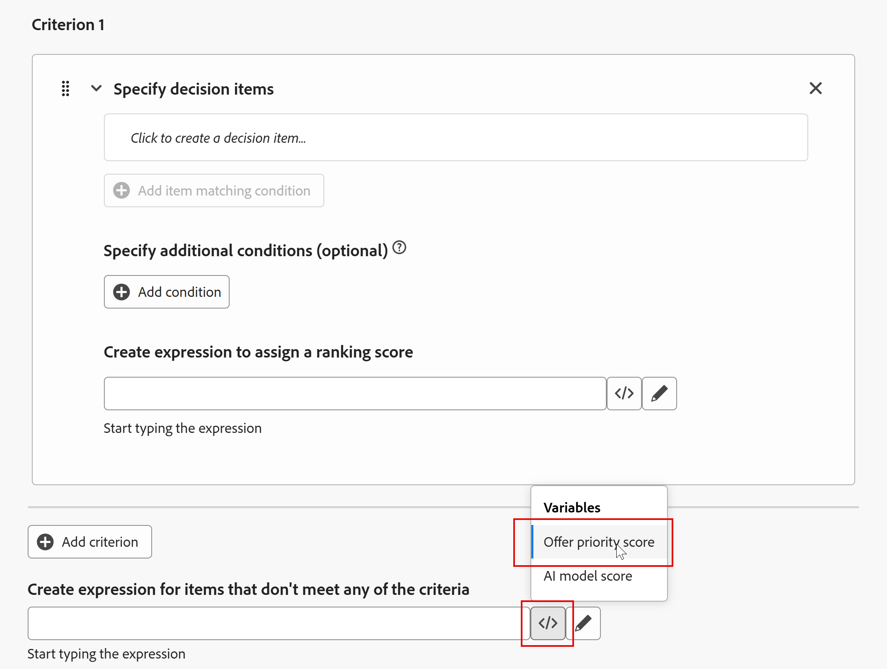
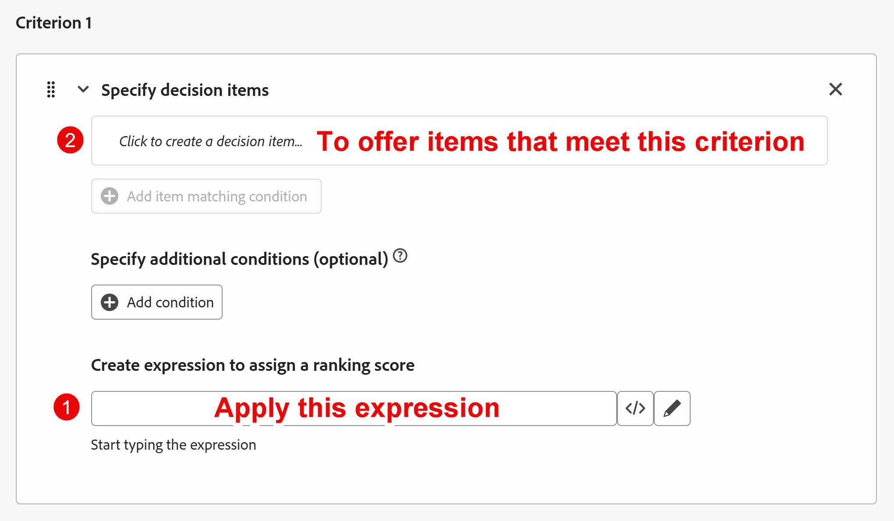
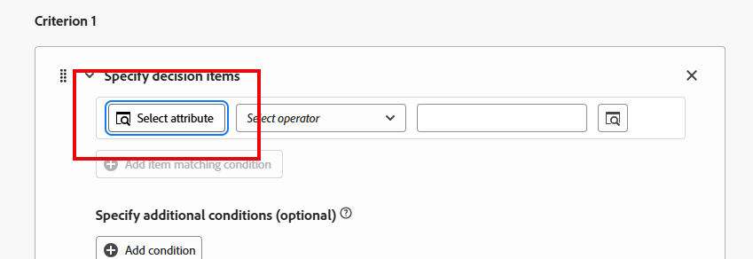
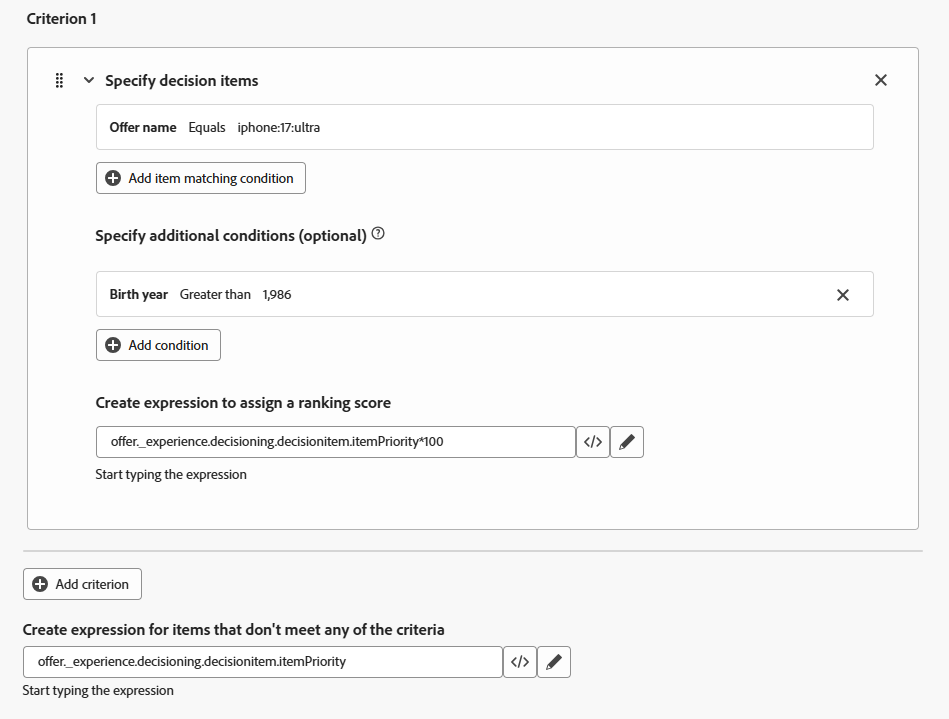
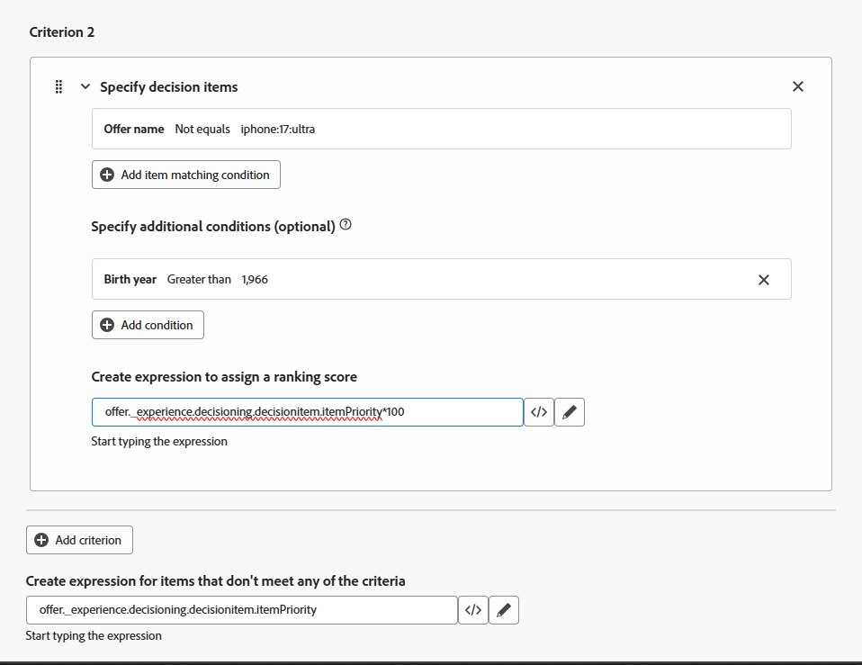

# Rangfolgeformel erstellen

## Ziel

Nachdem alle Angebotselemente erstellt, priorisiert, die Eignung angewendet und in einer Sammlung organisiert wurden, können wir unsere Aufmerksamkeit darauf lenken, wie sie für ein bestimmtes Profil angeordnet werden. Dies geschieht durch die Erstellung einer Rangfolgenformel.

Eine Rangfolgenformel erhöht die spezifischen Angebotspriorisierungen dynamisch, sodass sie „an die Spitze gelangen“, basierend auf Kriterien aus dem Profil, das mit der Web-/Mobile-Eigenschaft oder dem Erlebnisereignis selbst interagiert.

In diesem Laborszenario behaupten wir, dass das Marketing-Forschungsteam für die Verbindung 5G gezeigt hat, dass die unter 39-Jährigen zu den Ultra- oder Pro-Stufen und die 40-59 zu den Basis- und Pro-Stufen gezogen werden. Und da Connection 5G lieber höherklassige Telefone verkaufen würde, wenn alles gleich wäre, würde das Ultra-Modell zuerst für die unter 39 präsentiert werden, wobei das Pro-Modell zuerst für die 40-59 präsentiert wird. In diesem Abschnitt erfahren Sie, wie Sie eine Rangfolgenformel erstellen, um diese Geschäftsanforderungen zu erfüllen.

## Erstellen einer Rangfolgenformel und eines Standardausdrucks

1. Erweitern Sie bei Bedarf **Decisioning** in der linken Leiste und klicken Sie auf **Strategie einrichten**. Sie landen auf der Seite „Entscheidungsregeln“ und sehen die Entscheidungsregel „Pläne der oberen Ebene“, die Sie zuvor erstellt und als Eignungsanforderungen für die Elemente des Telefonangebots der oberen Ebene verwendet haben.
2. Klicken Sie auf **Rangfolgeformeln** unter dem Menü „Rangfolgeformeln“. Dadurch wird eine leere Seite geöffnet, da Sie noch keine Rangfolgeformeln haben.

   

3. Klicken Sie auf die blaue Schaltfläche **Formel erstellen**, um mit der Erstellung einer neuen Rangfolgenformel zu beginnen
4. Rangfolgeformel **iPhone 17-Rangfolgeformel**

   >[!NOTE]
   >
   >Wenn ein Erlebnisereignis mit den erforderlichen Parametern zur Anforderung eines Angebots aus einem aktiven Decisioning-Package an die Edge-Datenerfassung gesendet wird, werden alle Angebote in diesem Package anhand der Rangfolgenformel ausgewertet. Jedes Angebot behält entweder seine ursprüngliche Priorität bei oder seine Priorität wird basierend auf dem Profil, das das Erlebnisereignis ausgelöst hat, dynamisch angepasst.

5. Scrollen Sie zum unteren Rand des Abschnitts „Kriterien“, klicken Sie auf das Symbol **\&lt;/>** des Textfelds ganz unten und wählen Sie die Variable **Score der** aus.

Der Standardausdruck ist jetzt wie folgt festgelegt:

>[!NOTE]
>
>Dieses untere Textfeld ist der Standardausdruck, der auf alle Angebotselemente angewendet wird, die keine Prioritätsanpassungskriterien erfüllen. In diesem Fall ist dies einfach die Priorität, die dem Angebot bei seiner Erstellung zugewiesen wurde. Wenn der Sammlung, für die diese Rangfolgenformel ausgeführt wird, kein standardmäßiger Prioritätswert zugewiesen wird, sollten Sie einen Standardwert zuweisen

## Erstellen von Regeln zur Prioritätsanpassung

Da jetzt ein Standardausdruck vorhanden ist, können Sie mit dem Hinzufügen von Regeln beginnen, die die Priorität basierend auf dem Alter der Benutzerin bzw. des Benutzers dynamisch anpassen.

Eine Möglichkeit, über Prioritätsanpassungsregeln nachzudenken, besteht darin, sie als standardmäßige If/Then-Anweisungen zu behandeln, die nur für bestimmte Angebote gelten. Wenn der Test „true“ ergibt, passen Sie die Priorität für Angebote an, die ein bestimmtes Kriterium erfüllen. Die Benutzeroberfläche ordnet diese in einer etwas anderen Reihenfolge an, wie in diesem Screenshot beschrieben.

>[!NOTE]
>
>Das „if“ ist optional, da eine Prioritätsanpassungsregel angewendet werden könnte, wenn ein Angebot ein bestimmtes Kriterium erfüllt, ohne dass zuvor eine bedingte Anweisung erfolgt ist. Stellen Sie sich vor, wir hätten mehrere Angebote mit einem Telefon-Betriebssystemattribut (Android vs. iOS), wie in diesem Handbuch erläutert. Man könnte die Priorität aller iPhone-Angebote erhöhen, bei denen das bevorzugte Betriebssystem des Profils iOS ist. Es gibt kein „if“. Einfach „die Punktzahl anpassen, wobei Angebotsattribut = Profilattribut ist.“ Unten ist ein Bild ähnlich dem oben, das diese Idee ohne eine bedingte Anweisung umreißt.
>
>

## Kriterium 1 erstellen: Anpassungsregel für Personen unter 39 Jahren

1. Erstellen Sie zunächst die Rangfolgenregel für das Angebotselement der Ultra-Ebene. Klicken Sie in das erste Textfeld im Abschnitt **Kriterium 1** und klicken Sie dann auf die Schaltfläche **Attribut auswählen**, wenn sie angezeigt wird.

   

2. Wenn das Dialogfeld „Attribut auswählen“ geöffnet wird, klicken Sie auf **Angebotsname**. Klicken Sie nach der Auswahl auf **Speichern.**

   >[!NOTE]
   >
   >Das „Entscheidungsattribut“ bezieht sich auf Elemente des Angebotselements. Da Sie hier festlegen, für welche Angebotselemente die Kriterien gelten, stehen Ihnen nur die Attribute des Angebotselements zur Verfügung.
   >

3. Lassen Sie den Operator auf „Gleich“ gesetzt und geben Sie im restlichen Textfeld den Namen des Angebotselements der Ultra-Ebene ein, nämlich **iphone:17\:ultra**. Nach der Eingabe des Textes wird die Benutzeroberfläche aktualisiert und zeigt an, dass die entsprechende Bedingung akzeptiert wurde.
4. Klicken Sie auf **+Bedingung hinzufügen** und dann in das **neue angezeigte Textfeld** (es enthält den Text *Klicken, um ein Entscheidungselement zu erstellen…*)
5. Klicken Sie auf die jetzt verfügbare **Attribut auswählen** Option**.**
6. Wenn das Dialogfeld &#39;Attribut auswählen&#39; geöffnet wird, klicken Sie auf **Profilattribute > Person** (Sie müssen wahrscheinlich nach unten scrollen) **> Geburtsjahr**. Klicken Sie nach der Auswahl auf **Speichern.**

   >[!NOTE]
   >
   > „Profilattribute“ beziehen sich auf den Benutzer oder das Profil, der/das das Erlebnisereignis gesendet hat, und „Kontextdaten“ beziehen sich auf Elemente im Erlebnisereignis selbst, wie URL, Seitenname oder andere Attribute der Payload des Erlebnisereignisses.

7. Ändern Sie den Operator in **Größer als** und geben Sie das Geburtsjahr **1986** ein (die Benutzeroberfläche setzt ein Komma in das Jahr, was erwartet wird). Nach der Eingabe wird die Benutzeroberfläche aktualisiert, um anzugeben, dass die Bedingung akzeptiert wurde. Da der geschäftliche Anwendungsfall darin besteht, die Ultra-Stufe für alle unter 40 anzubieten, wird die Priorität für alle nach 1986 geborenen Personen angepasst.

   >[!NOTE]
   >
   >Wie bereits erwähnt, gibt die Benutzeroberfläche an, dass diese zusätzlichen Bedingungen „optional“ sind. Dies ist richtig, da die Priorität für eine Reihe von Angebotselementen ohne zusätzliche Kriterien dynamisch angepasst werden kann. Es kann sein, dass dieselben Angebotselemente in einer anderen Sammlung verwendet und mit einem anderen Satz von Ranking-Regeln sortiert werden können. Da dieses Labor nur einen einzigen Satz von Angebotselementen verwendet, werden zusätzliche Bedingungen verwendet, um die Priorität anzupassen.

8. Die ursprüngliche Priorität für das Angebotselement der Ultra-Ebene ist 4. Um die Priorität zu erhöhen, multiplizieren Sie das mit 100. Klicken Sie dazu auf das Symbol **\&lt;/>** neben dem letzten Textfeld und wählen Sie die Variable **Score für Angebotspriorität**. Fügen Sie nach dem **Text eine**\*100 ein. Dieser Ausdruck multipliziert die ursprüngliche Priorität (4) mit 100 und verleiht ihr eine neue Priorität von 400.

   Ihre Regel sollte jetzt wie folgt aussehen:

>[!NOTE]
>
>Warum mit 100 multiplizieren? Die Idee ist, dass wenn man sicherstellen will, dass die Prioritäten weit über den anderen Prioritäten angeglichen werden, und 100 ist nur eine Art einfacher Mathematik um das möglich zu machen. Rangfolgeformeln können kompliziert sein, wie Sie im nächsten Abschnitt sehen werden. Daher ist es hilfreich, die Mathematik einfach zu halten.
>
>Während wir die Multiplikation verwendeten, um den Prioritätswert zu erhöhen, hätten andere mathematische Ausdrücke verwendet werden können, um den Prioritätswert zu verringern. Im Allgemeinen ist es jedoch einfacher, die gewünschten Angebote „nach oben hin zu verschieben“, als Angebote zu machen, die nicht „nach unten versinken“ sollen.

## Kriterium 2 erstellen: Anpassungsregel für die 40-59

1. Klicken Sie unmittelbar unter der soeben erstellten Anpassungsregel auf die Schaltfläche **+ Kriterium hinzufügen**.
2. Erstellen Sie eine passende Bedingung für den Fall **dass der** Angebotsname“ NICHT gleich **iphone:17\:ultra** ist.

   >[!WARNING]
   >
   >Diese Regel soll auf alle anderen Angebotselemente angewendet werden. Weitere Informationen dazu, warum Sie weiter unten auf dieser Seite stehen, sollten Sie jedoch sehr vorsichtig mit der Verwendung dieser Logik in der Praxis sein, da sie für jedes Angebot in der Sammlung gelten würde, das diesen Wert nicht hat. In unserem Fall ist das in Ordnung, aber möglicherweise nicht in anderen Anwendungsfällen.

3. Fügen Sie die Bedingung hinzu, dass diese Regel für alle Personen gelten soll, deren Geburtsjahr größer als **1966** ist (für alle Personen unter 60).
4. Multiplizieren Sie wie bei der vorherigen Regel den standardmäßigen Prioritätswert des Angebotselements mit 100. Wenn Sie fertig sind, sieht Ihre Regel „Kriterium 2“ wie folgt aus:

>[!NOTE]
>
>Rangfolgeformeln und Eignungsregeln gemeinsam zu verwenden, kann sich komplex anfühlen, aber hier ist die Kernidee:
>
>- **Rangfolgeformeln** passen die Prioritätswerte und damit die Reihenfolge der Angebote dynamisch an.
>- **Eignungsregeln** (z. B. Entscheidungsregeln und Häufigkeitsbegrenzungen) entfernen Angebote aus der sortierten Liste, wenn der Benutzer sie nicht sehen darf.
>
>So würden die Angebote angesichts dieser Beispiele und der soeben erstellten Rangfolgenformel sortiert:
>
>**Geburtsjahr = 1990**
>
>- Ultra Priority wird **400**
>- Pro = **3**, Base = **2**, Generic = **1**
>  Ergebnis: Ultra zeigt zuerst (bis zu 3 mal), dann Pro, Base und schließlich Generic.
>
>**Geburtsjahr = 1970**
>
>- Höchste Priorität bleibt bei **4**
>- Pro wird **300**, Base = **200** und Generic = **100**
>  Ergebnis: Pro zeigt zuerst (3-mal), dann Base, dann Generic. Ultra wird zuletzt bestellt, weil seine Priorität (4) niedriger ist als generisch (100).
>
>Wenn die Berechtigung über Entscheidungsregeln und Frequenzlimitierung angewendet wird, dann
>
>- Bei Benutzern, die 1990 mit einer **Plan-ID = 1** geboren wurden, werden Ultra- und Pro-Angebote entfernt, obwohl sie am höchsten eingestuft wurden. Der Benutzer sieht nur die Angebote „Basis“ und „Generisch“, da Ultra und Pro eine zusätzliche Bedingung haben: Nur Benutzer mit **Plan-IDs 2 oder 3** können sie sehen.
>- Da das generische Angebot keine Regeln zur Frequenzlimitierung hat, wird der Benutzer mit einem Geburtsjahr **1970** das Ultra-Angebot nie sehen, da sein Prioritätswert niedriger ist als der geboosterte Wert des Generischen.

1. Scrollen Sie bei allen Regeln und dem standardmäßigen Prioritätswert nach oben zurück und klicken Sie auf die blaue Schaltfläche **Erstellen** in der oberen rechten Ecke.

>[!TIP]
>
>Sie gelangen nun zurück zur Seite „Strategie einrichten“ und sehen die soeben erstellte Single-Ranking-Formel.

>[!NOTE]
>
>Was passiert, wenn zwei Angebote die gleiche Priorität haben? Angebote mit derselben Priorität werden nach dem Zufallsprinzip ausgewählt, um an das anfragende System zurückzukehren.

## Zusammenfassung

Auf dieser Seite haben Sie eine Rangfolgenformel erstellt, die bestimmt, wie Angebotselemente für jedes Profil dynamisch sortiert werden. Sie haben auch einen Standardausdruck (den ursprünglichen Prioritätswert) definiert und dann Prioritätsanpassungsregeln hinzugefügt, die die Angebotsprioritäten auf der Grundlage von Profilkriterien (z. B. Alter) erhöhen. Diese Ranking-Logik stellt sicher, dass relevante Angebote (z. B. Ultra- oder Pro-Stufen für bestimmte Altersgruppen) bei der Bewertung an die Spitze kommen.
