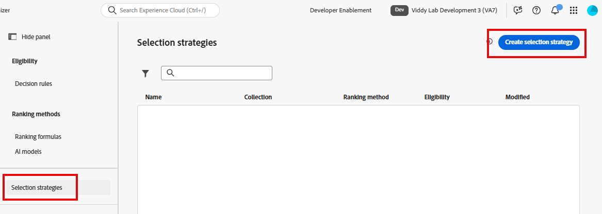
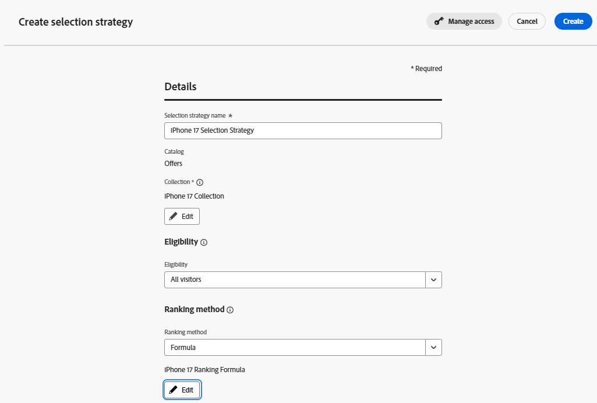

# Auswahlstrategie erstellen

## Ziel

Bis jetzt haben Sie Angebote erstellt, die Angebotseignung mit einer Entscheidungsregel definiert, sie in einer Sammlung zusammengefasst und eine Formel erstellt, die sie dynamisch basierend auf den Attributen des Profils, das die Personalisierung anfordert, neu anordnet. Da wir nur einen einzigen Satz von vier Angeboten für einen einzigen Anwendungsfall verwenden, ist es verlockend zu glauben, dass jedes dieser Elemente miteinander verbunden ist, insbesondere wenn wir sie ähnlich benannt haben. Es ist jedoch wichtig, abstrakter zu denken, wenn Sie eine langfristige Strategie und einen Umfang im Unternehmensbereich in Betracht ziehen. Angebote können in eine oder mehrere Sammlungen unterteilt werden. Rangfolgeformeln können auf jede Sammlung von Angeboten angewendet werden. Tatsächlich ist das erste Mal, dass Sie diese Elemente verbinden, die Erstellung einer Auswahlstrategie.

Stellen Sie sich vor, wir hätten Hunderte von Angeboten, die in vierzig Sammlungen verwendet werden und ein Dutzend Rangfolgeformeln. Wie würde ein Entscheidungspaket wissen, welche Rangfolgenformel für welche Angebotssammlung gelten soll? Die Auswahlstrategie stellt diesen Zusammenhang her. Wenn Sie einem Kanal Decisioning hinzufügen, fügen Sie eine (oder mehrere) Auswahlstrategien hinzu.

## Erstellen der Auswahlstrategie

1. Erweitern Sie bei Bedarf **Decisioning** in der linken Leiste und klicken Sie auf **Strategie einrichten**. Sie landen auf der Seite „Entscheidungsregeln“, wo Sie die Entscheidungsregel „Pläne der oberen Ebene“ sehen, die Sie zuvor erstellt und als Eignungsanforderungen für die Elemente des Telefonangebots der oberen Ebene verwendet haben.
2. Klicken Sie auf **Auswahlstrategien** direkt unter dem Menü „Rangfolgenmethoden“. Wenn keine Auswahlstrategien verfügbar sind, klicken Sie auf die blaue Schaltfläche **Auswahlstrategie erstellen**.

3. Auswahlstrategie benennen **iPhone 17-Auswahlstrategie**
4. Sie können sehen, dass eine Auswahlstrategie drei Dinge erfordert.
   - Eine Sammlung von Angeboten
   - Eignungsanforderungen
   - Eine Ranking-Methode

Klicken Sie auf **Sammlung auswählen**, aktivieren Sie das Kontrollkästchen neben der einzigen vorhandenen Sammlung (**iPhone 17 Collection**) und klicken Sie auf **Speichern**.

5. Lassen Sie die Dropdown-Liste „Eignung“ auf „Alle Besucher“.

>[!NOTE]
>
>Die Eignung kann über die Kriterien für die Eingabe der Journey oder Kampagne auf der Angebots-, Auswahl- oder Journey-/Kampagnenebene angewendet werden. Es hängt alles von dem Anwendungsfall ab, den Sie zu realisieren versuchen. Wenn Sie auf die **Eignung** klicken, sehen Sie dieselben Optionen für Zielgruppe und Entscheidungsregel wie auf Angebotsebene. In unserem Anwendungsfall wollten wir nur bestimmte Angebote einschränken. Daher war es sinnvoll, die Eignung auf Angebotsebene vorzunehmen.

6. Legen Sie die **Rangfolgenmethode** auf **Formel fest** klicken Sie dann auf die Schaltfläche **Formel auswählen**.

>[!NOTE]
>
>Ihnen sind möglicherweise die Optionen „Angebotspriorität“ und „KI-Modell“ in der Dropdown-Liste der Ranking-Methode aufgefallen. Wenn Sie wirklich nur Angebote mit ihrer ursprünglichen Priorität zurückgeben möchten, wählen Sie die Option „Angebotspriorität“.
>
>Die Option KI-Modell verwendet ein KI-Modell, das Impressionen, Klicks und Konversionen für zurückgegebene Angebote analysiert, um zu bestimmen, welches Angebot dem Kontakt angezeigt werden soll. Wir werden sie in diesem Labor nicht verwenden, da es Mindestdatenschwellen sowie zwei Wochen zum Trainieren der Modelle gibt.

7. Markieren Sie das Kästchen neben der einzigen Rangfolgenformel, die Sie haben (**iPhone 17 Rangfolgenformel**), und klicken Sie auf **Speichern**. Wenn Sie fertig sind, sieht Ihre Auswahlstrategie wie folgt aus:

8. Sobald Ihre Auswahlstrategie korrekt ist, klicken Sie auf die blaue Schaltfläche **Erstellen**.

>[!TIP]
>
>Jetzt sehen Sie Ihre iPhone 17-Auswahlstrategie im Menü „Auswahlstrategie“

>[!NOTE]
>
>Die Entscheidungsfindung ermöglicht eine sehr einfache oder sehr komplexe Angebotsauswahl und -reihenfolge. Am einfachen Ende könnten Sie eine Sammlung von Angeboten mit ihrer Standardpriorität, einer auf alle Besucher festgelegten Eignung und der Rangfolgenmethode „Angebotspriorität“ haben, und alle Endbenutzer würden die Angebote in der Reihenfolge ihrer ursprünglichen Prioritätswerte sehen. Auf der anderen Seite haben Sie möglicherweise eine umfangreiche Sammlung mit komplexen anfänglichen Prioritätswerten, einer maßgeschneiderten Rangfolgenformel und mehrschichtigen Eignungsregeln sowohl auf der Angebots- als auch auf der Auswahlstrategieebene. Was Sie in diesem Labor erstellt haben, befindet sich in der Mitte und wurde entworfen, um die verschiedenen Möglichkeiten zu demonstrieren, wie Entscheidungspakete konfiguriert werden können.

## Zusammenfassung

Auf dieser Seite haben Sie eine Auswahlstrategie erstellt, die die bisher erstellten Kernkomponenten zusammenfügt - die Angebotssammlung, die Eignungsregeln und die Rangfolgenformel.
