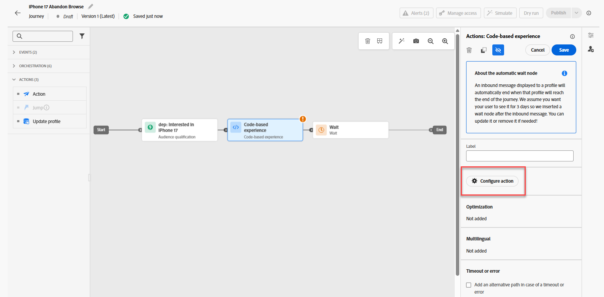
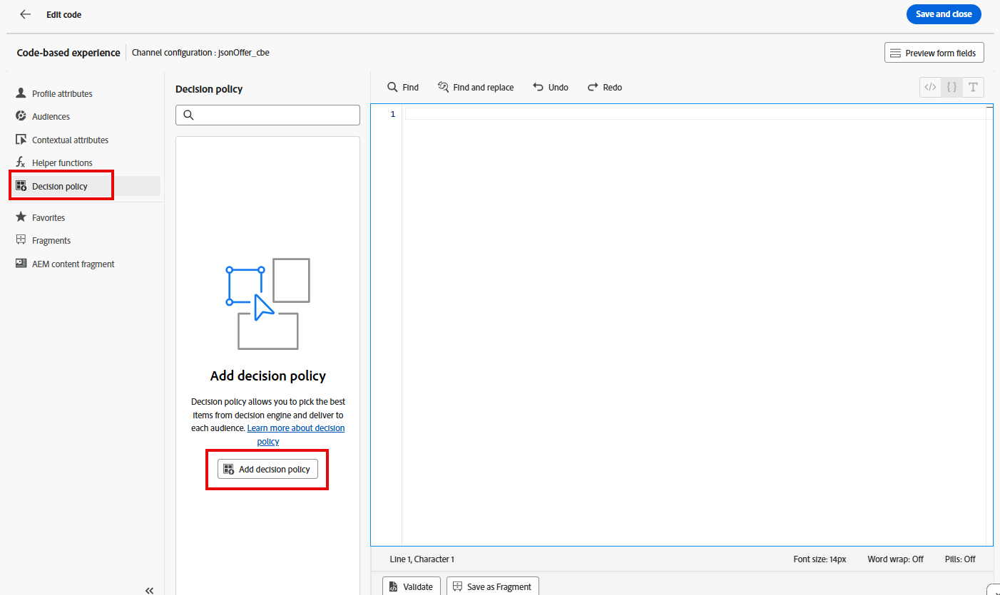
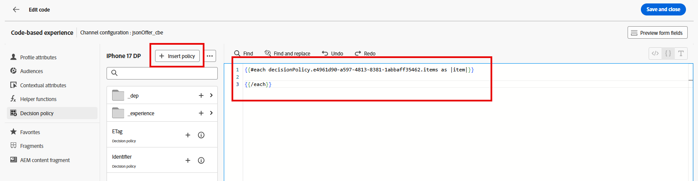
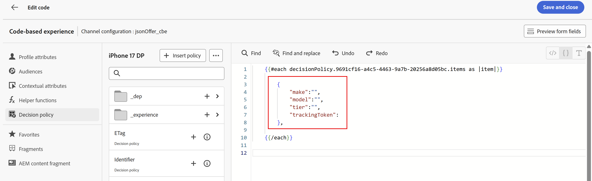

# Erstellen der Journey

## Benennen und definieren Sie Eintrittskriterien

1. Falls erforderlich, erweitern Sie das Menüelement **Journey-** in der linken Leiste und klicken Sie auf **Journey**. Sie landen auf der Seite &quot;Journey&quot;.
2. Klicken Sie auf die blaue Schaltfläche **Journey erstellen**.
3. Wenn die Überlagerung &quot;Journey erstellen“ angezeigt wird, wählen Sie **Neu erstellen** und klicken Sie auf **Bestätigen**
4. Benennen Sie in der rechten Leiste die Journey **iPhone 17 Abbrechen Durchsuchen** und klicken Sie auf die blaue Schaltfläche **Speichern**, damit Sie Aktionen zur Journey-Arbeitsfläche hinzufügen können.
5. Ziehen Sie das **Zielgruppen-Qualifizierung**-Ereignis auf die Arbeitsfläche.
6. Klicken Sie in der rechten Leiste auf das Symbol **Bleistift**, um die Zielgruppe für dieses Ereignis auszuwählen.
7. Wählen Sie die Zielgruppe **dep: Interested in iPhone 17** aus.
8. Stellen Sie sicher **dass die Dropdown** Liste „Namespace“ auf &quot;**.** An dieser Stelle sieht Ihr Journey wie folgt aus:

   

9. Sobald alle Angaben korrekt sind, klicken Sie auf die blaue Schaltfläche **Speichern**, um Ihren Fortschritt zu speichern.

>[!NOTE]
>
>Die Zielgruppe „Dep: Interested in iPhone 17“ ist eine Streaming-Zielgruppe, deren Eintrittskriterium die fiktive Übersichtsseite „Connection 5G iPhone 17“ dreimal am selben Tag ist. Wie viele Produktübersichtsseiten ist die Übersichtsseite von Connection 5G zu iPhone 17 eine dynamische Seite mit mehreren Elementen, die aktualisiert werden, ohne dass die Seite neu geladen werden muss. Auf dieser Seite können Sie die verschiedenen Ebenen von iPhone 17 und ihre Funktionen vergleichen. Wenn also jemand diese Seite 3 Mal am selben Tag ansieht, hat er wahrscheinlich ein Interesse an iPhone 17. Da jedoch nicht jedes Element der Seite getaggt und gemessen wird, verwendet Connection 5G das Alter der authentifizierten Benutzer, um die Telefonebene zu bestimmen, die ihnen angezeigt werden soll, wenn sie mit verschiedenen Touchpoints der Marke Connection 5G interagieren.


## Konfigurieren von CBE und Entscheidungsrichtlinie

1. Erweitern Sie das Akkordeon **Aktionen** direkt links von der Arbeitsfläche, ziehen Sie das Element **Aktion** auf die Arbeitsfläche und verbinden Sie es mit dem ersten Knoten.
1. Wenn die Überlagerung „Aktionstyp auswählen“ angezeigt wird, wählen Sie die Aktion **Code-basiertes Erlebnis** und klicken Sie auf die blaue Schaltfläche **Hinzufügen**.
1. Klicken Sie in den nun angezeigten Eigenschaften des „Aktion“-Code-basierten Erlebnisses auf die Schaltfläche **Aktion konfigurieren**.

   

1. Ändern Sie das Dropdown **Menü „Code-**-Konfiguration“ in den **jsonOffer\_cbe**-cbe, den Sie im letzten Abschnitt erstellt haben.

   

1. Klicken Sie auf **Inhalt bearbeiten** direkt über der Dropdown-Liste „Code-basierte Konfiguration“.
1. Klicken Sie im daraufhin angezeigten Code-basierten Erlebnis-Editor auf die Schaltfläche **Code bearbeiten**. Im daraufhin angezeigten Bildschirm fügen Sie die JSON-Datei hinzu, die den Erlebnisereignis-Anfragen zurückgegeben wird

   

1. Klicken Sie ganz links im Code-Editor auf das Menüelement **Entscheidungsrichtlinie** , gefolgt von einem Klick auf die Schaltfläche **Entscheidungsrichtlinie hinzufügen** im Menü Neu .

   

   >[!NOTE]
   >
   >Wenn Sie bei einer Auswahlstrategie eine Angebotssammlung mit einer Rangfolgenmethode verknüpfen (und die Eignung auf Strategieebene anwenden), gilt eine Entscheidungsrichtlinie, wenn Sie eine Auswahlstrategie mit einem bestimmten Versand eines Kanals verknüpfen.

1. Nennen Sie diese Entscheidungsrichtlinie **iPhone 17 DP** und lassen Sie die Anzahl der Elemente auf 1 gesetzt.

   >[!NOTE]
   >
   >Bis zu diesem Zeitpunkt haben Sie die Angebote und ihre Bestellung konfiguriert, aber nicht die Anzahl der Rücksendungen. Hier können Sie konfigurieren, wie viele Angebote zurückgegeben werden sollen.

1. Klicken Sie auf die blaue Schaltfläche **Weiter**. Hier fügen Sie die Auswahlstrategie hinzu. Klicken Sie auf die Schaltfläche **+Hinzufügen** (möglicherweise müssen Sie nach unten scrollen, um sie zu sehen) und wählen Sie **Auswahlstrategie**.
1. Aktivieren Sie das Kontrollkästchen neben der einzigen Auswahlstrategie, die Sie haben sollten (**iPhone 17-**), und klicken Sie auf **Speichern**. Wenn Sie fertig sind, sehen Sie Folgendes:

   

   >[!NOTE]
   >
   >Beachten Sie, wie Sie mehrere Auswahlstrategien hinzufügen oder einfach die Entscheidungselemente selbst hinzufügen können. Wann würden Sie mehrere Auswahlstrategien verwenden? Stellen Sie sich vor, Sie haben ein 4 x 4-Raster mit Empfehlungen für eine Ihrer digitalen Eigenschaften. Sie möchten alle mit 16 Angeboten ausfüllen. Möglicherweise sind diese Angebote auf mehrere Sammlungen verteilt, oder die ersten beiden Zeilen erfordern möglicherweise eine Auswahlstrategie, während die beiden unteren Zeilen eine andere Strategie benötigen. Im vorherigen Bildschirm hätten Sie 16 ausgewählt und dann diesen Bildschirm verwendet, um so viele Auswahlstrategien oder Angebote hinzuzufügen, wie erforderlich sind, um 16 zu erreichen.
   >
   >Das Fallback-Angebot ist optional, da es nur anwendbar wäre, wenn Endbenutzer für keines der Angebote infrage kommen (oder ungeeignet werden). In unserem Fall war unsere Auswahlstrategie für alle Besucher, und die einzigen Personen, die den CBE-Knoten erreichen würden, waren diejenigen, die die Journey betreten haben. Die Authentifizierung ist eine Voraussetzung für den Journey-Eintritt (der auf der Journey festgelegte Namespace ist einer, den sie nur hätten, wenn sie authentifiziert wären). Wir haben auch ein Fallback-Angebot in unsere Rangfolgenformel integriert, sodass es in unserem Fall nicht erforderlich ist, dieses Fallback-Angebot festzulegen.

1. Klicken Sie auf die blaue **Weiter**-Schaltfläche, um die Entscheidungsrichtlinie zu überprüfen.

   

1. Sobald alles korrekt aussieht, klicken Sie auf die blaue Schaltfläche **Erstellen**. Nach der Erstellung kehren Sie zur Seite des Ausdruckseditors zurück.
1. Es sollte ein Bildschirm ähnlich dem folgenden angezeigt werden. Wenn nicht, klicken Sie erneut auf **Entscheidungsrichtlinie** und Sie sehen, dass Ihre Entscheidungsrichtlinie angezeigt wird.

   

1. Klicken Sie auf die Schaltfläche **+ Richtlinie einfügen** und Sie sehen, dass im Code-Editor eine ForEach-Schleife angezeigt wird:

   

   >[!NOTE]
   >
   >Warum eine für jede Schleife? In unserem Fall geben wir nur ein einziges Angebot zurück. Beachten Sie jedoch die vorherigen Schritte, bei denen wir mehrere Angebote zurückgeben können. Bei der Betrachtung der Funktionalität ist der Schleifenmechanismus hier sinnvoll.

1. Fügen Sie innerhalb der Grenzen der Schleife gültige JSON-Dateien hinzu, um Marke, Modell und Ebene des Smartphones zurückzugeben, das dem Endbenutzer angeboten werden soll. Da die Frequenzlimitierung ebenfalls vorhanden ist, muss der Antwort ein TrackingToken hinzugefügt werden. Weitere Informationen hierzu finden Sie weiter unten in den Anweisungen. Um Zeit zu sparen, kopieren Sie einfach diese Codezeilen und fügen Sie sie in den Code-Editor innerhalb der For Each-Schleife ein:

   ```javascript
   {
        "make":"",
        "model":"",
        "tier":"",
        "trackingToken":""
    },
   ```

   

   >[!NOTE]
   >
   >Denken Sie daran, dass Sie dem standardmäßigen Angebots-XDM-Schema Attribute hinzugefügt haben, insbesondere die Marke, das Modell und die Ebene. Sie haben diese Attribute dann beim Erstellen der Angebote ausgefüllt. Sie fügen diese Attribute jetzt als Variablen hinzu, die mit Werten aus dem ausgewählten Angebot gefüllt werden. Das Feld trackingToken ist ein systemgenerierter Wert, der zum Tracking von Klicks und Impressionen verwendet wird.

1. Platzieren Sie den Cursor zwischen den **&quot;**&quot; des „make“-Knotens. Fügen Sie den Marker des Angebots ein, indem Sie im Menü Entscheidungsrichtlinie zum Knoten **\_dep > Gerät >** navigieren.  Klicken Sie auf das Symbol **+** im Element **Make** und Sie sehen, dass es im Editor angezeigt wird.

   

1. Fügen Sie **Attribute** Modell“ und **Ebene** auf ähnliche Weise hinzu.
1. Klicken Sie **der Attributnavigation auf** Entscheidungsrichtlinie“, um zur Stammebene zurückzukehren.
1. Füllen Sie das Attribut trackingToken, indem Sie über den Pfad **\_experience > decisioning > decisionitem > Tracking Token zum Wert** TrackingToken navigieren.
1. Schließen Sie abschließend den gesamten Code in eine eckige Klammer ein (**\[]**). Ihr endgültiger JSON-Code sollte wie folgt aussehen:

   

   >[!WARNING]
   >
   >Stellen Sie sicher, dass Sie die &quot;\[ ]&quot;-Klammern um das gesamte Entscheidungselement eingefügt haben. Verwirrt? Siehe Schritt #20 erneut.


1. Sobald alles im obigen Screenshot dargestellt ist, klicken Sie auf **Speichern und schließen** oben rechts, um Ihren Code zu speichern. Anschließend werden Sie zur Seite für das Code-basierte Erlebnis zurückgeleitet.
1. Klicken Sie auf den Rückwärtspfeil **\&lt;** neben dem Journey-Namen, und Sie gelangen zur Arbeitsfläche zurück.

   

1. Klicken Sie auf die blaue **Speichern**-Schaltfläche, um den CBE-Aktionsknoten zu speichern. Ihr Journey sieht nun wie folgt aus:

   

1. Klicken Sie nach Abschluss des Journey oben rechts auf die blaue Schaltfläche **Veröffentlichen** und **Veröffentlichen** wenn das Bestätigungsfeld angezeigt wird. Nach ein oder zwei Augenblicken sehen Sie, dass Ihre Journey jetzt live ist!


>[!TIP]
>
>Ihr Journey ist jetzt bereit, JSON-Angebote für dieses Decisioning-Paket zu unterbreiten!

>[!NOTE]
>
>Warum wurde automatisch ein Warteknoten erstellt, nachdem der CBE auf der Arbeitsfläche platziert wurde? Denken Sie daran, dass ein CBE ein eingehender Kanal ist. Im Gegensatz zu E-Mails oder Push-Benachrichtigungen, die proaktiv an den Endbenutzer gesendet werden, wird ein CBE an die Edge gesendet und dort wartet er, bis der Endbenutzer zur digitalen Eigenschaft kommt und ein Angebot anfordert. Wie lange er dort wartet, wird durch diesen Warteknoten definiert. Standardmäßig ist dieser Zeitraum auf 3 Tage festgelegt, aber er ist konfigurierbar. In diesem Labor beträgt die Wartezeit 3 Tage, aber in einem realen Szenario sollten Sie sie wahrscheinlich länger ausdehnen, da nach Ablauf der Wartezeit der Journey des Benutzers zum Endknoten weiterläuft und der CBE für diesen Benutzer aus dem Edge-Profilspeicher entfernt wird.
>
>Dies hebt auch eine wichtige Architektur und Timing-Überlegungen hervor. Wann wird der CBE für diesen Benutzer an den Edge-Profilspeicher gesendet? Wenn der/die Benutzende zu diesem Knoten fortschreitet, d. h. nachdem er/sie sich für das Segment qualifiziert hat. Das bedeutet, dass die Zeit zwischen einigen Sekunden und einigen Minuten liegt, nachdem der Benutzer diese dritte Seite angesehen hat, bevor die Streaming-Segmentierung ausgeführt wird. Der Benutzer wird in diesem Segment platziert, er gibt die Journey ein und gelangt zum CBE-Knoten. Dann wird dieser CBE für diesen Benutzer an die Edge projiziert.  In einer Testorganisation mit sehr wenig Daten- und Verarbeitungsanforderungen dauert dieser ganze Prozess nur wenige Sekunden oder Minuten. Für eine größere Organisation mit viel höherem Durchsatz sollten Sie mindestens 15 Minuten einplanen, was ein Potenzial von bis zu 2 Stunden bietet.


## Zusammenfassung

Auf dieser Seite haben Sie einen Code-basierten Erlebnis-Kanal (CBE) konfiguriert, der es externen Systemen ermöglicht, Angebotsentscheidungen über einen eingehenden Kanal im API-Stil anzufordern. Diese Einrichtung umfasste die Angabe der Oberflächen-/Standortparameter, die Client-Systeme senden werden, und die Auswahl des JSON-Ausgabeformats.
