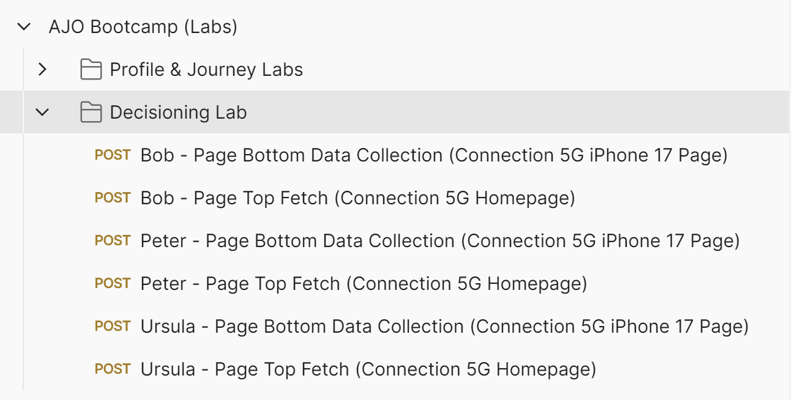
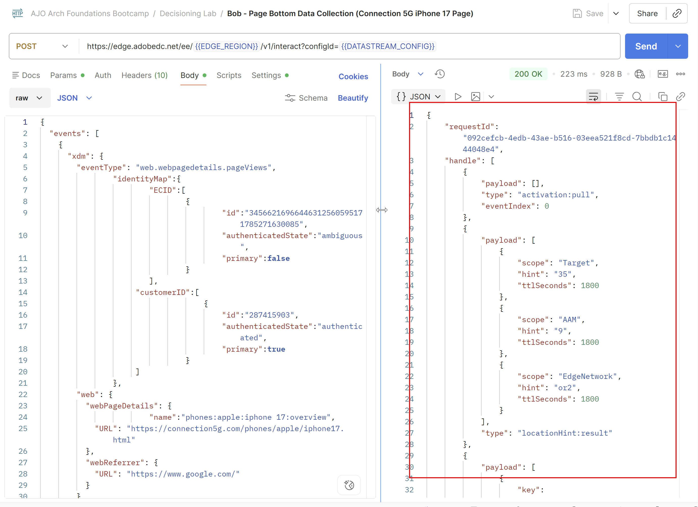
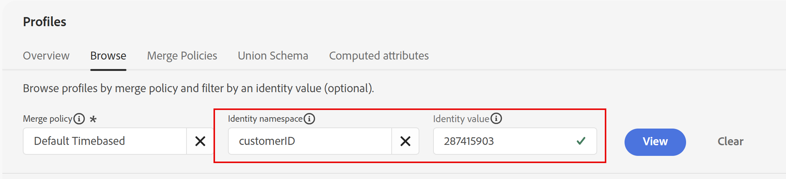
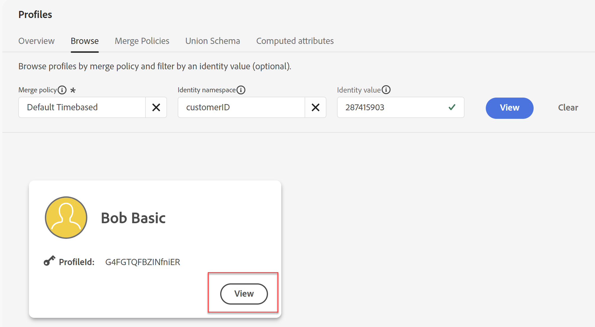
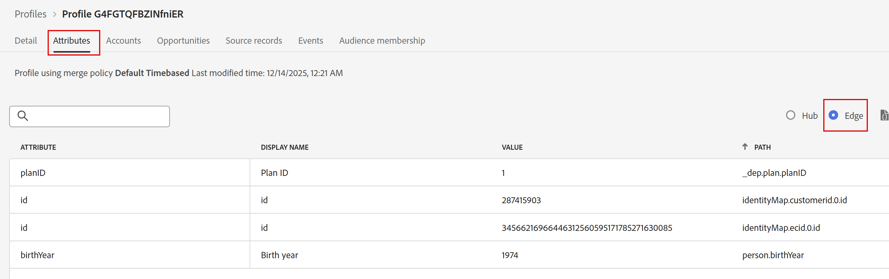
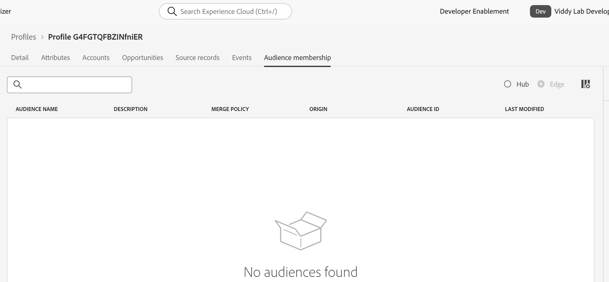
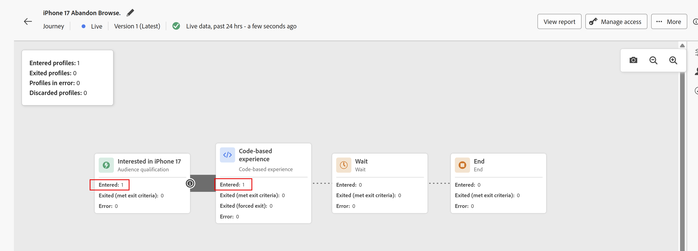
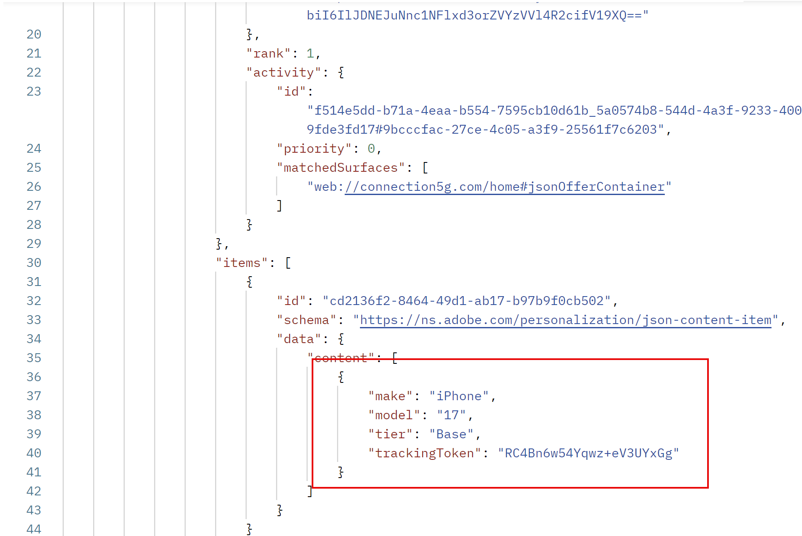
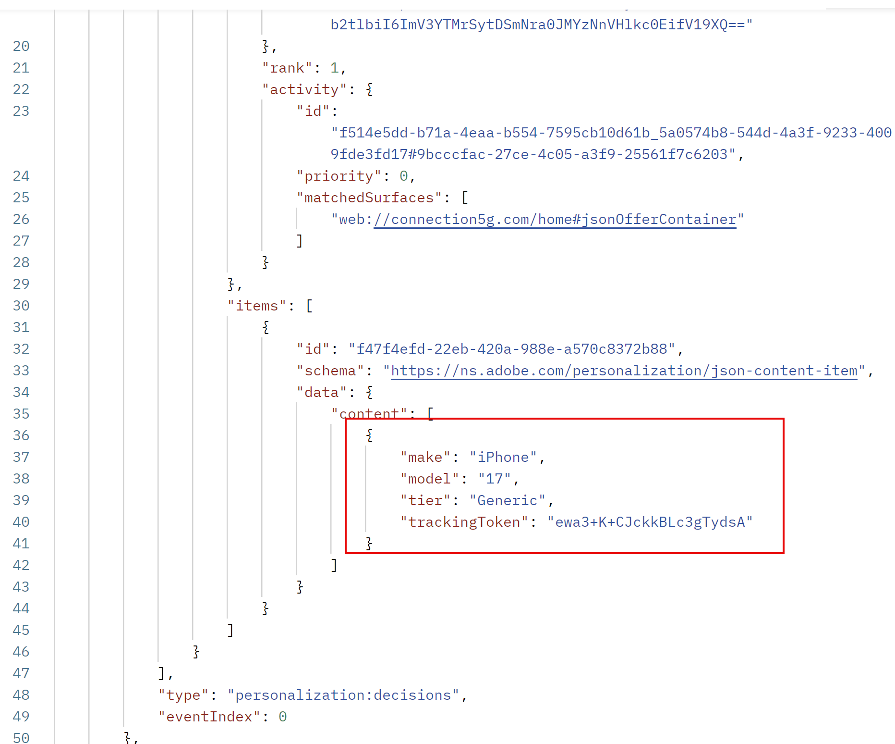

# Decisioning und CBEs in Aktion

## Ziel

Nachdem die Journey nun live ist, können Sie mit dem Versand von Erlebnisereignissen beginnen und zurückgegebene Angebote sehen. Da die IDs des Geburtsjahres und des Telefonplans einzelner Profile sich auf das zurückgegebene Angebot auswirken, müssen wir Erlebnisereignisse für vorkonfigurierte Profile mit bestimmten Geburtsjahren und Plan-IDs senden.

## Einrichtung von Profilen und Postman

Die drei Profile, die Sie verwenden werden, sind bereits in Ihrer Sandbox vorhanden und in dieser Tabelle aufgeführt:

| Vorname | Nachname | Geburtsjahr | Plan-ID | customerID | ECID | E-Mail |
| ---------- | ------------ | ---------- | ------- | ---------- | -------------------------------------- | --------------- |
| Bob | Einfach | 1974 | 1 | 287415903 | 34566216966446312560595171785271630085 | bob\@dep.com |
| Peter | Professionell | 1981 | 2 | 105946728 | 22344522145769262754334953788432801285 | peter\@dep.com |
| Ursula | Ultimate | 2002 | 3 | 730682145 | 35615467908312308343036144243711275069 | Ursula\@dep.com |

Suchen dieser Profile in AEP

1. Erweitern Sie bei Bedarf das **Kunde**-Element in der linken Leiste und klicken Sie auf **Profile**
1. Klicken Sie auf die **Durchsuchen** und unter allen Profilen, die bereits für Sie erstellt wurden oder die Sie als Teil früherer Labs erstellt haben, werden diese drei Profile angezeigt.

Suchen Sie die entsprechenden Erlebnisereignisse für jedes Profil in der Postman-Sammlung

1. Öffnen Sie bei Bedarf Postman
1. Stellen Sie sicher, dass die Umgebungsvariablen {0 **EDGE\_REGION** und **DATASTREAM\_CONFIG) weiterhin festgelegt sind.** Wenn sie erneut festgelegt werden müssen, überprüfen Sie die Schritte im Labor „Umgebung und Sammlung importieren“.
1. Erweitern Sie den Ordner **Decisioning Lab**. Für jedes Profil werden zwei Erlebnisereignisse angezeigt:

## Senden von Erlebnisereignissen

> [!IMPORTANT]
>
>Überspringen Sie nicht den einleitenden Text dieses Abschnitts!

Mit unbegrenzter Zeit und unbegrenzten Ressourcen würden wir Sie eine Tags-Bibliothek mit dem AEP Web SDK auf einer echten Website erstellen und bereitstellen lassen. Dadurch würde gezeigt, wie Angebote abgerufen und Berichte dazu erstellt werden können. Angesichts der enormen Breite und Tiefe der in diesen Laboren behandelten Inhalte haben wir uns jedoch dafür entschieden, die Erlebnisereignisse vorzubereiten, die für den Eintritt in die Journey, das Abrufen von Angeboten und das Erstellen von Berichten zu diesen Angeboten in einer Postman-Sammlung erforderlich sind, anstatt eine Website taggen zu müssen. Bei richtiger Verwendung ahmt diese Sammlung nach, wie eine ordnungsgemäß mit Tags versehene Site (oder ein beliebiger Digitalkanal) den CBE-Versandkanal auf einer Journey verwenden würde.

Der empfohlene Ansatz für AEP Web SDK-Bereitstellungen besteht darin, einen Zwei-Aufruf-pro-Seite-Ansatz zu verwenden. Bei diesem Muster sendet der Web-SDK einen „Fetch“-Aufruf oben auf der Seite an die Edge, die alle für den Benutzer erforderlichen Personalisierungen anfordert. Diese Personalisierungen werden von Edge zurückgegeben und dann von Web SDK gerendert. Ein zweiter Aufruf unten auf der Seite, der normalerweise als Datenerfassungsaufruf bezeichnet wird, wird dann an die Edge gesendet und berichtet dem Endbenutzer, was zusammen mit anderen Daten für Analytics, CJA und andere Lösungen angezeigt wurde. Wenn es darum geht, Vorschläge aus der Edge abzurufen, denken Sie an eine einfache Memodie: FAR, die für Abrufen, Anwenden und Berichten steht. Alle Vorschläge müssen abgerufen, angewendet oder gerendert (dem Endbenutzer angezeigt) und dann gemeldet werden. Es ist wichtig, dass diese Angebote als angezeigt gemeldet werden, damit die Regeln zur Frequenzlimitierung funktionieren.

Die Antworten von Adobe Target-Aktivitäten und dem AJO-Web-Kanal können automatisch von der AEP Web SDK abgerufen und angewendet werden. Ihre Berichte können auch mit dem Datenerfassungsaufruf unten auf der Seite gesendet werden. CBEs sind jedoch anders. Die AEP Web SDK kann die Vorschläge abrufen, aber es liegt an der Kundin oder dem Kunden, das zurückgegebene Objekt anzuwenden (wiederzugeben) und dann die AEP Web SDK zu verwenden, um zu berichten, was angezeigt wurde. Ein CBE verwendet in der Regel die Datenerfassungsaufrufe nicht, um Berichte über das anzuzeigen, was angezeigt wurde. Daher müssen sie manuell übergeben werden.

In der Postman-Sammlung sehen Sie, dass jedes Profil zwei Erlebnisereignis-Aufrufe hat

Ein Erlebnisereignis „Seitenanfang“

Ein Erlebnisereignis zur Datenerfassung am Seitenende

Das Seitenanfang-Erlebnisereignis enthält den Parameter „jsonOfferContainer“ in der Anfrage. Dies ist der „Speicherort auf der Seite“, den Sie für die CBE konfiguriert haben. Darüber hinaus wird bei diesem Aufruf die Skriptfunktion von Postman verwendet, um die Antwort von der Edge zu erhalten und dann sofort einen zweiten Aufruf an die Edge zu senden, wobei berichtet wird, dass das Angebot dem Endbenutzer angezeigt wurde. Es gibt keine eigentliche Anwendung oder Darstellung des Angebots, da es keine Website für dieses Labor gibt. Aus Sicht von AJO wurde das Angebot jedoch zurückgegeben und dann als gesehen gemeldet.

Der Datenerfassungsaufruf „Seitenende“ dient ausschließlich dem Generieren einer Seitenansicht für die iPhone 17-Übersichtsseite. Denken Sie daran, dass das Segment für den Einstieg in die Journey selbst 3 Aufrufe dieser Seite erfordert. Sobald dieses Erlebnisereignis dreimal gesendet wurde, gibt dieser Benutzer die Journey ein, und dann ist nur das Erlebnisereignis „Seitenanfang abrufen“ erforderlich, um das Angebot abzurufen und zu melden, dass es angezeigt wurde.

Beginne mit Bobs Profil.

1. Klicken Sie auf die Anfrage **Bob - Page Bottom Data Collection** .
2. Klicken Sie auf die Registerkarte **body** und beachten Sie die übergebenen Parameter, z. B. den Namespace customerID in der IdentityMap, der angibt, dass er authentifiziert ist, sowie den Parameter „web.webPageDetails.name“, der im Seitennamen von „phones\:apple\:iphone 17\:overview“ übergeben wird.

3. Klicken **oben** rechts auf „Senden“, um eine Seitenansicht zu senden. Sie erhalten eine Antwort, die in etwa so aussieht

4. Nachdem Sie eine korrekte Antwort erhalten haben, klicken Sie erneut auf **Senden**, um dasselbe Seitenende-Ereignis ein zweites Mal erneut zu senden. Warten Sie einige Sekunden und senden Sie dann einen dritten Datenerfassungsaufruf für das Bob-Profil. Sie haben insgesamt drei Aufrufe zum Seitenende gesendet.

Zu diesem Zeitpunkt verarbeitet das System diese Treffer und fügt Bob dem Streaming-Segment „dep: Interested in iPhone 17“ hinzu. Sobald das erledigt ist, wird Bob in die Journey gelegt. Einmal auf der Journey, dauert es nur ein paar Minuten, bis Bobs Eintritt in die Journey und das Segment in den Edge Profile Store für Bob projiziert werden.

5. Kehren Sie zur AJO-Benutzeroberfläche zurück und klicken Sie in **Leiste auf** Profile“, gefolgt von der Registerkarte **Durchsuchen**.
6. Suchen Sie mithilfe des Namespace **customerID** nach Bobs Profil mit dem Wert **287415903**.

7. Klicken Sie **Anzeigen**, um Bobs Profil zu öffnen (Bobs Profilfarbe kann anders sein als im Screenshot gezeigt).

8. Sobald sich Bobs Profil öffnet, klicken Sie auf die Registerkarte **Zielgruppenzugehörigkeit** und Sie sehen, dass Bob jetzt Mitglied des Segments „dep: Interested in iPhone 17“ ist, zumindest aus der Sicht von AEP Hub.
9. Klicken Sie auf **Attribute** und wählen Sie dann das Optionsfeld **Edge** aus, um zur Edge-Ansicht zu wechseln.

>[!WARNING]
>
>Es gibt einen unseligen UI-Fehler, der erfordert, dass Sie auf die Registerkarte Attribute klicken, um die Optionsschaltfläche zu Edge zu wechseln.

10. Klicken Sie erneut auf **Zielgruppenzugehörigkeit** und wenn Sie diese Schritte schnell genug durchgeführt haben, sehen Sie, dass die Edge ausgewählt ist und zeigt, dass Bob keine Zielgruppenzugehörigkeit hat

11. Navigieren Sie in einer neuen Browser-Registerkarte zur erstellten Journey und klicken Sie darauf. Sie sehen, dass ein Profil auf die Journey zugegriffen hat und sich jetzt auf dem CBE-Knoten befindet.

Zu diesem Zeitpunkt hat Bob die Journey betreten und die Edge-Projektion stellt derzeit eine Projektion zusammen, die Bobs Profil auf der Edge aktualisiert.

12. Wechseln Sie zurück zu Postman und klicken Sie auf die Sekunde von Bobs Erlebnisereignis-Aufrufen, **Bob - Page Top Fetch.**
13. Klicken Sie **Senden**. Was soll passieren?
    - Wenn Bobs Edge-Profil noch nicht aktualisiert wurde, erhalten Sie eine sehr ähnliche Antwort wie beim Datenerfassungsaufruf. Warten Sie in diesem Fall noch ein bis zwei Minuten und versuchen Sie dann erneut, Bobs Aufruf „Seitenanfang abrufen“ zu senden.
    - Wenn Bobs Edge-Profil aktualisiert wurde, erhalten Sie eine Antwort mit der zuvor konfigurierten JSON sowie zusätzliche Informationen, die für das Reporting verwendet werden. Aber bevor wir weitermachen, welches Angebot von iPhone 17 sollte Bob unterbreitet werden?

      Bob wurde 1974 geboren, was größer ist als 1966, also hätte er sich für das zweite Ranking-Formel-Kriterium qualifiziert, und seine Generic-, Base- und Pro-Angebot-Prioritätswerte wären mit 100 multipliziert worden, was diesen Angeboten Werte von 100, 200 bzw. 300 gegeben hätte. Bob Basic hat jedoch eine Plan-ID 1, sodass er dank der Entscheidungsregel nicht für die Ultra- oder Pro-Tier-Angebote infrage kommt. Daher wird das Angebot der Basisebene mit der Bewertung 200 angezeigt. Dies ist in der Antwort zu sehen (Sie müssen wahrscheinlich nach unten scrollen):

14. Beachten Sie, dass diese Postman-Anfrage automatisch eine Anzeigebenachrichtigung für dieses Angebot sendet. AJO hat daher bereits mindestens eine Impression für dieses Angebot aufgezeichnet. Klicken Sie **erneut** Senden“, um eine zweite Impression zu senden. Überprüfen, ob das Basisangebot erneut zurückgegeben wurde.
15. Denken Sie daran, dass für die Modelle der Ebenen Base, Pro und Ultra eine Häufigkeitsbegrenzung von 3 Impressionen gilt. Klicken Sie **3** Mal auf „Senden“, um eine dritte Antwort mit der Basisebene zu erhalten und eine weitere Impression aufzuzeichnen.
16. Klicken Sie **viertes** auf „Senden“, und was sollte passieren? Die Häufigkeitsbegrenzung für das Basisstufenangebot ist erreicht, und Sie erhalten in der Antwort das generische Angebot:

17. Klicken Sie **erneut auf** Senden“, und Sie sehen das Angebot der generischen Ebene. Sie können 100 weitere Male auf „Senden“ klicken und Sie erhalten dasselbe Angebot bis zum nächsten Tag zurück, an dem die Frequenzlimitierung zurückgesetzt wird.

>[!WARNING]
>
>Denken Sie daran, dass in AJO der Tag um Mitternacht GMT zurückgeht. Wenn Sie nach Mitternacht GMT einen weiteren Fetch-Aufruf senden würden, würde stattdessen die Angebotsrückgabe auf der Basisebene angezeigt.

18. Kehren Sie zur Journey Orchestration-Benutzeroberfläche zurück und klicken Sie auf die von Ihnen erstellte Journey mit dem **** iPhone 17 Abbruch Durchsuchen. Da die Journey live und veröffentlicht ist, werden Statistiken angezeigt. Sie sehen, dass 1 Profil auf die Journey zugegriffen hat und sich derzeit im CBE-Knoten befindet.

>[!NOTE]
>
>An dieser Stelle fragen Sie sich vielleicht, warum sich das Profil nicht auf dem Warteknoten befindet. Sollte er, nachdem er den CBE-Knoten erreicht und die Aktualisierungen für Bobs Edge-Profil projiziert hat, auf dem Warteknoten sein? Die kurze Antwort ist, dass es sein könnte, aber… man könnte auch argumentieren, dass, da die CBE aktiv zurückgegeben wird, das ist, wo Bob auf dieser Journey ist. Aber nach 3 Tagen zeigt die Journey, dass das Profil die Journey abgeschlossen hat, ohne jemals wirklich im Warteknoten gewesen zu sein.

## Senden von Erlebnisereignissen für andere Profile

Nun, da Sie die Journey gesehen haben, wie sie für Bobs Profil arbeitet, gibt es zwei weitere Profile, die getestet werden müssen.

1. Kehren Sie nach Postman zurück und suchen Sie die Erlebnisveranstaltungen für Peter und Ursula.
2. Führen Sie für jedes Profil das Ereignis „Datensammlung auf Seitenende“ dreimal aus, wobei Sie daran denken, zwischen jeder Sende-/Datenerfassungsanfrage 1-3 Sekunden einzuräumen.
3. Warten Sie einige Minuten, bis die drei Profile sich für das Streaming-Segment qualifizieren, geben Sie die Journey ein und lassen Sie dann den CBE auf ihre Edge-Profile projizieren.
4. Senden Sie den Aufruf „Seitenanfang abrufen“ so oft wie nötig, um zu überprüfen, ob die Entscheidungsregeln und Rangfolgenformeln erwartungsgemäß funktionieren.

**Entscheidungsprofile: Erwartetes Verhalten**

| Vorname | Nachname | &#x200B;1. Angebot | &#x200B;2. Angebot | Drittes Angebot | &#x200B;4. Angebot |
| ---------- | ------------ | --------- | --------- | --------- | --------- |
| Bob | Einfach | Basis | Allgemein | Allgemein | Allgemein |
| Peter | Professionell | Profi | Basis | Allgemein | Allgemein |
| Ursula | Ultimate | übermäßig | Profi | Basis | Allgemein |

5. Kehren Sie nach Abschluss des Vorgangs zur Journey zurück. Sie sehen, dass alle drei Profile in die Journey eingetreten sind und sich im CBE-Knoten befinden.

>[!NOTE]
>
>Wenn Sie 3 Tage warten und den Seitenanfang erneut abrufen, werden Sie feststellen, dass kein Angebot zurückgegeben wurde und dass alle drei Profile die Journey abgeschlossen haben

## Zusammenfassung

Auf dieser letzten Seite des Labors sind Sie in die Ausführungsphase eingetreten, in der Sie Ihre Entscheidungseinrichtung mit Erlebnisereignissen und einem Code-basierten Erlebnis-Kanal (CBE) getestet haben. Sie haben Postman verwendet, um simulierte Erlebnisereignisse an Adobe Journey Optimizer zu senden, sodass:

- Profile sind auf die von Ihnen erstellte Journey gelangt, da sie die Streaming-Segmentkriterien erfüllen.
- Der CBE-Kanal wurde mit Fetch-Ereignissen aufgerufen, um Angebotsentscheidungen auf der Grundlage von Profildaten (Geburtsjahr, Telefonplan usw.) zu erhalten.
- Angebote wurden zurückgegeben und entsprechend den konfigurierten Häufigkeitsbegrenzungen gezählt, was zeigt, wie sich unterschiedliche Regeln und Ranking-Logik auf das bereitgestellte Angebot auswirkten.
- Sie haben überprüft, dass die Frequenzlimitierung und die Eignung erwartungsgemäß funktioniert, indem Sie wiederholt Aufrufe zum Abrufen von Angeboten gesendet haben.

Sie haben echte Entscheidungsaufrufe ausgeführt und überprüft, ob sich Ihre Eignungsregeln, die Rangfolgenformel und die Angebotseinrichtung korrekt verhalten, wenn Profile mit der Entscheidungs-Engine interagieren.
