# Build-Journey

## Lernziel

Erstellen Sie eine einheitliche Journey, die mit dem konfigurierten Ereignis Bestellung versendet beginnt, die ETA von einem externen Service abruft und eine E-Mail sendet.

## Journey erstellen

Wechseln Sie zu **Journey** und klicken Sie auf **Journey erstellen - Von Grund auf neu erstellen**


## Journey-Eigenschaften

1. Aktualisieren Sie die Journey-Eigenschaften in der rechten Leiste wie folgt:
   - **Name**: `Order Shipped Journey`
   - **Beschreibung**: `Notify customer that order has shipped. Include shipping details.`
   - **Tags**: `Default`
   - **Journey-Metriken**: *leer lassen*

     >[!NOTE]
     >
     >**Leere Dropdown?**
     >
     >Mach dir keine Sorgen und mach weiter. Die allererste Journey, die in einer Sandbox erstellt wird, muss „die Pumpe vorbereiten“.  Sobald wir die Journey veröffentlicht haben, stehen in diesem Dropdown Optionen zur Auswahl.

   - **Erneuten Eintritt erlauben**: `checked`

   - **Wartezeit bis zum erneuten Eintritt:** `5 minutes`

   - **Zugriffsbeschriftungen**: *leer lassen*

   - **Zeitzone**: `Your Local timezone`

   - **Zeitzone des Profils für Wartezeiten und Bedingungen verwenden**: `NOT checked`

   - **Start-/Enddatum**: *leer lassen*

   - **Zeitüberschreitung oder Fehler**: `30`

   - **Begrenzungsregeln:** *leer lassen*

   - **Priorität**: `0`


2. Wenn alles gut aussieht, klicken Sie auf die Schaltfläche **Speichern**.


## Journey-Arbeitsfläche

### Unitäres Ereignis hinzufügen

Ziehen Sie aus dem linken Bereich unter dem Menü **Ereignisse** das Ereignis **orderShipped** wie unten dargestellt auf die Arbeitsfläche


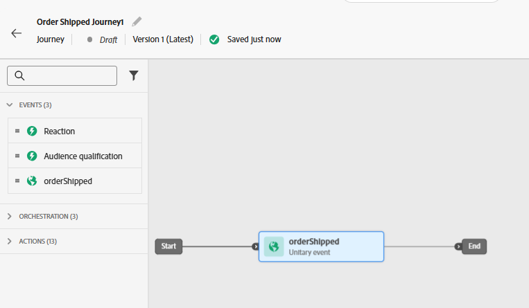


### Hinzufügen einer benutzerdefinierten Aktion

1. Wenn der linke Bereich das **Menü Aktionen** erweitert und dann die von Ihnen erstellte Aktion mit dem Namen „GetShippingDetails **nach dem** „orderShipped“ auf die Arbeitsfläche zieht

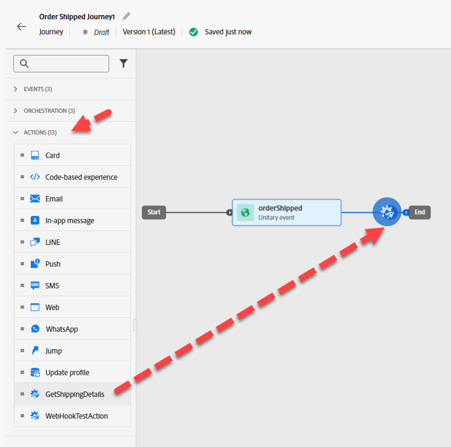

2. Stellen Sie in der rechten Leiste unter der Konfiguration von Zugriff und Datenschutz —> Dropdown-Liste Marketing-Aktion sicher, dass der Wert auf &quot;**&quot;**

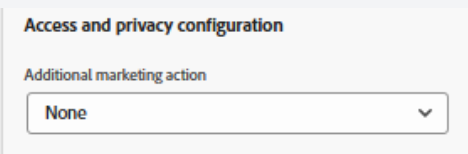

3. Klicken Sie im Menü Endpunktkonfiguration > Abfrageparameter auf das **Stiftsymbol** neben orderid

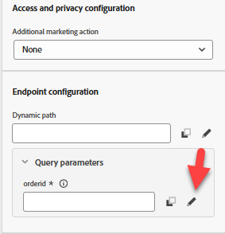

4. Erweitern Sie in dem erscheinenden Modal **Kontext** -> **orderShipped** -> **Order** und wählen Sie dann **Order ID (orderID)** und klicken Sie auf **OK**


5. Stellen Sie sicher, dass die Option Zeitüberschreitung oder Fehler in der rechten Leiste **nicht aktiviert** ist, und klicken Sie dann auf die Schaltfläche **Speichern**

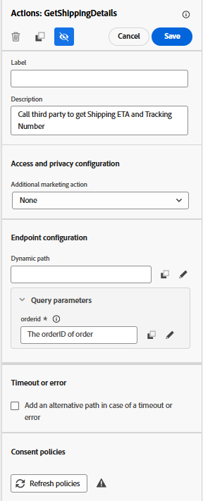


### E-Mail-Aktion hinzufügen

1. Ziehen Sie im Menü Aktionen die Aktion **Aktion** nach der Aktion GetShippingDetails auf die Arbeitsfläche

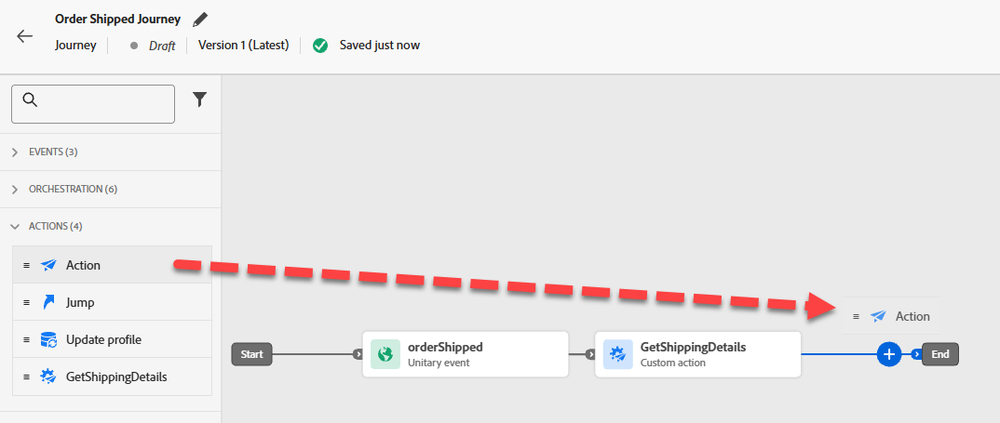

2. Wählen Sie **Marketing** Aktion „E-Mail“ und dann **Hinzufügen** aus.


3. Klicken Sie in der rechten Leiste auf **Aktion konfigurieren**

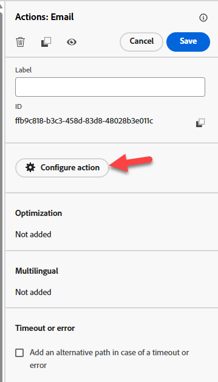

4. Legen Sie **E-Mail-**) auf `Profile-Email` fest und klicken Sie dann auf **Inhalt bearbeiten**


### E-Mail-Textkörper-Inhalt hinzufügen

Für den Inhalt werden Sie die Dinge einfach halten. Wie dumm, einfach.

1. Aktualisieren Sie die Betreffzeile auf `Order Shipped` und klicken Sie dann auf die Schaltfläche **E-Mail-Textkörper bearbeiten**

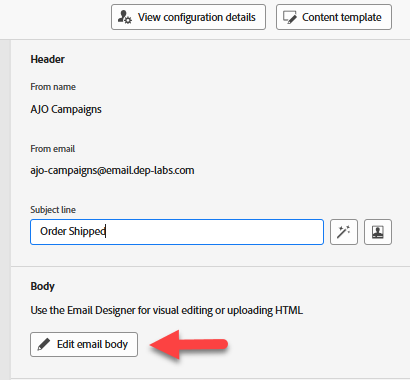

2. Klicken Sie in der oberen Leiste auf den Inhaltsbaustein **Von Grund auf** Entwerfen“


3. Ziehen Sie aus der linken Leiste unter dem Struktur-Container die Spalte **1:1)** die Arbeitsfläche

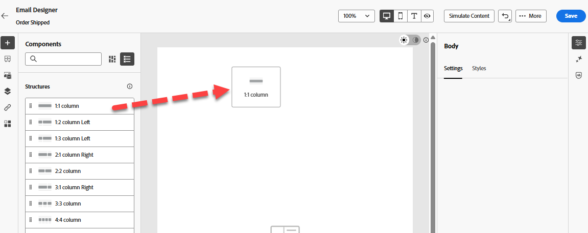

4. Ziehen Sie dann unter dem Inhalts-Container die Komponente **Text** in Ihre **1:1-Spalte**

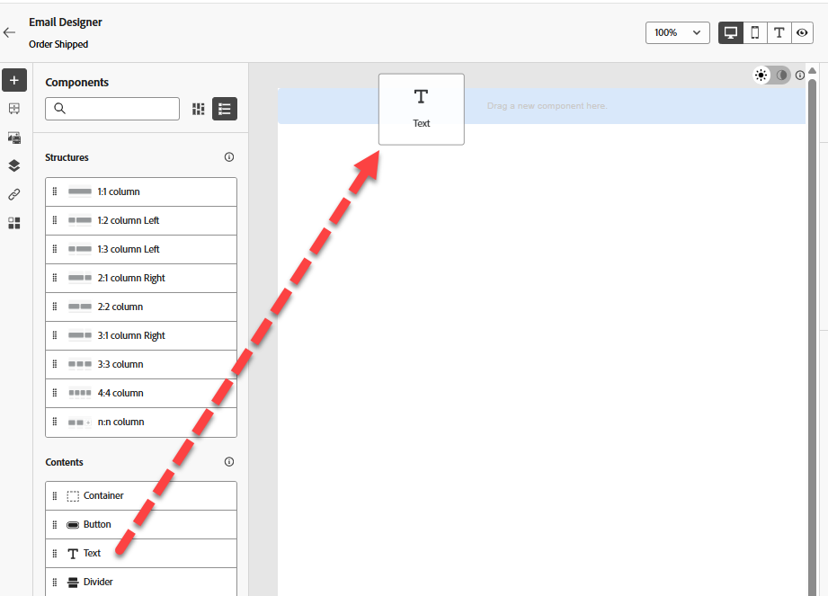

5. Klicken Sie auf die Textkomponente und **den aktuellen Text löschen** und klicken Sie dann auf das Symbol **Personalization hinzufügen**.


6. Klicken Sie in der linken Leiste auf den Ordner **Kontextuelle Attribute** navigieren Sie dann durch **Journey Orchestration** -> **Aktionen** und wählen Sie **GetShippingDetails**

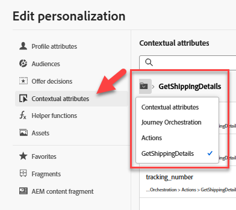

7. Kopieren Sie im Hauptteil der E-Mail **kopieren und fügen Sie** folgende JSON in den Personalization-**ein**

```json
{{profile.person.name.firstName}}, your order has shipped
ETA: 
Tracking Number: 
```

8. Fügen Sie die Personalisierungsfelder wie folgt hinzu (**klicken Sie auf das Pluszeichen &quot;+&quot; neben dem Feld in der linken Leiste**):
   - **ETA:** `eta`
   - **Tracking-Nummer:** `tracking_number`


>[!NOTE]
>
>Klicken Sie auf das **+-**, um Personalisierungsattribute aus der Leiste zur Arbeitsfläche hinzuzufügen.  Dadurch werden sie dort platziert, wo sich Ihr Cursor befindet, sodass Sie entsprechend „ausgerichtet“ sind

>[!NOTE]
>
>Ihre E-Mail verwendet eine Kombination aus Kontextattributen (ETA und Tracking-Nummer) und Profilattributen (Vorname). Wenn Sie weitere Profilattribute hinzufügen möchten, klicken Sie auf die Registerkarte Profilattribute und wählen Sie die gewünschten Informationen aus.
>
>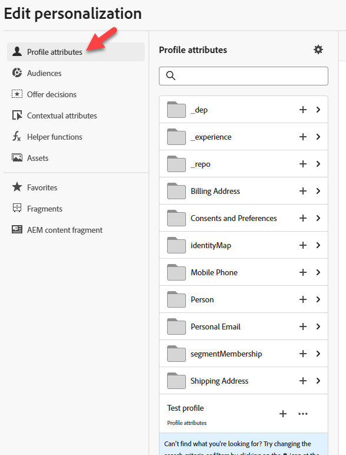

9. Klicken Sie am unteren Bildschirmrand auf die Schaltfläche **Validieren** und stellen Sie sicher, dass Sie keine Fehler haben


10. Wenn alles gut aussieht, klicken Sie auf **Speichern** oben rechts
11. Klicken Sie dann oben rechts erneut auf **Speichern** und dann oben links auf den **\&lt;- Pfeil nach links**

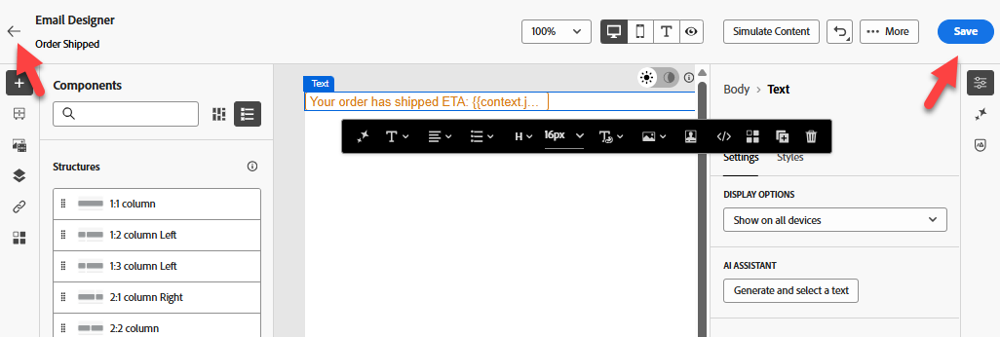

12. Klicken Sie schließlich oben links auf das Symbol **\&lt; Zurück**, um zur Journey-Arbeitsfläche zurückzukehren


>[!TIP]
>
>Klicken Sie dann erneut auf **Zurück**… Scherz! Das ist der letzte Zurück-Button…in diesem Abschnitt 😜


### E-Mail-Parameter überschreiben

Stellen Sie auf der Haupt-Journey-Arbeitsfläche im E-Mail-Knoten sicher, dass Sie die schreibgeschützten Felder sehen können (Sie müssen möglicherweise auf das Symbol **Schreibgeschützte Felder anzeigen** klicken)

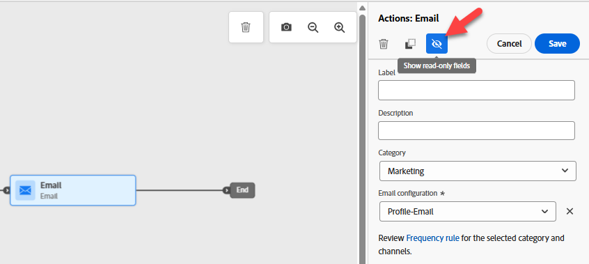

1. Scrollen Sie nach unten zu **E-Mail** Parameter und klicken Sie auf das Symbol **Parameterüberschreibungen aktivieren**.


2. Klicken Sie in das leere Textfeld und gehen Sie dann in der linken Leiste nach unten zu **Kontext** -> **orderShipped** -> **\_dep** und klicken Sie auf das Feld **personalEmail**.  Klicken Sie dann auf **OK**

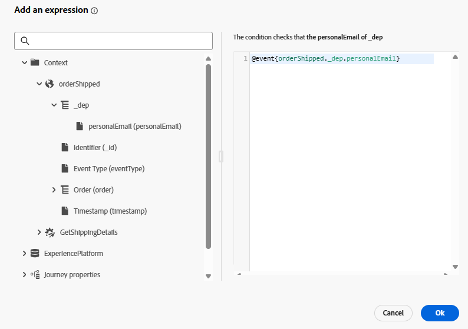

>[!WARNING]
>
>Dies ist eine gefährliche Sache. Vermeiden Sie es daher, es sei denn, Sie müssen es in einer Produktionsumgebung tun.  Dadurch wird der Standardspeicherort überschrieben, nach dem Journey im Profil suchen, um Nachrichten auszuführen.


3. Klicken Sie oben rechts auf **Speichern** und anschließend auf den **Rückwärtspfeil** \&lt;- oben links, um die Journey zu ****

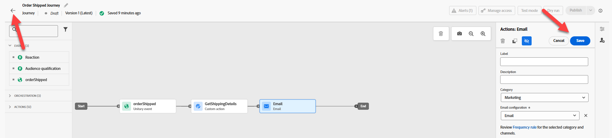

## Zusammenfassung

Eine veröffentlichte Journey, die auf den Trigger „Versand bestellen“ reagieren kann, die ETA von einem externen Service abruft und eine E-Mail sendet.
