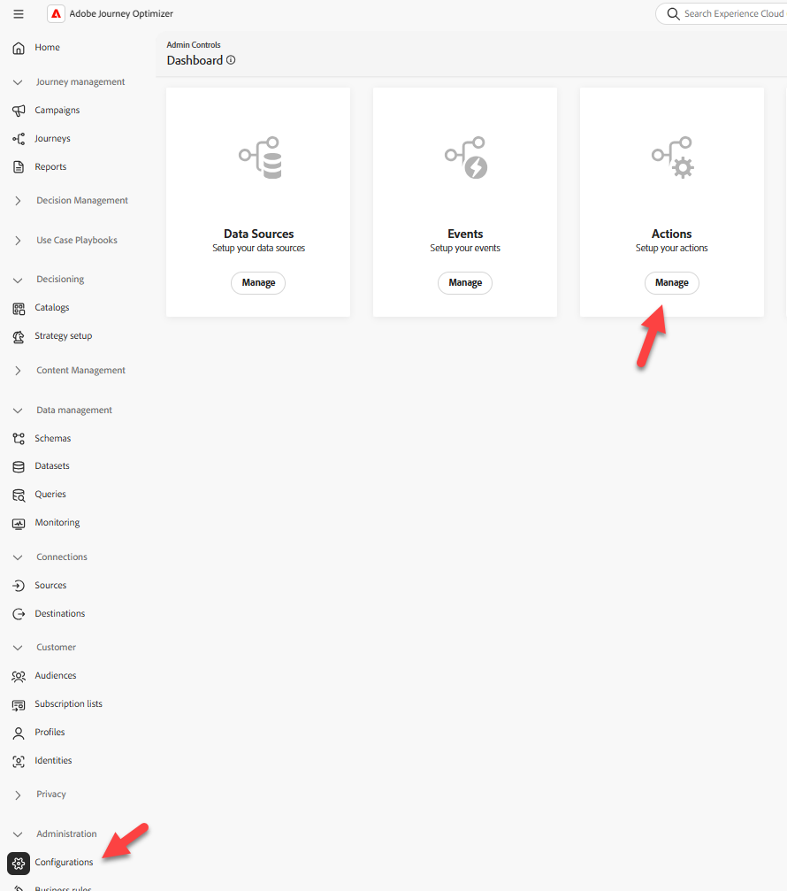
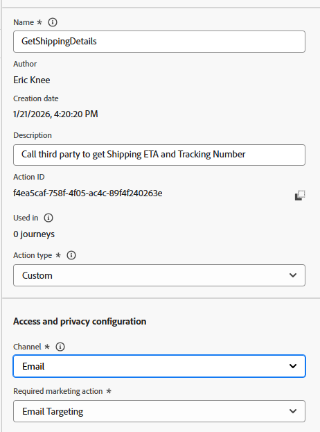
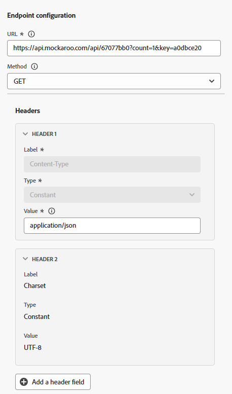
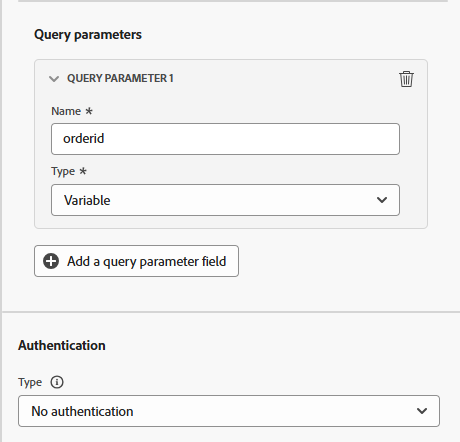
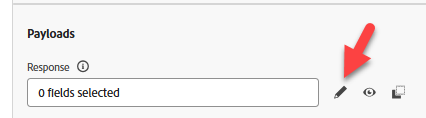
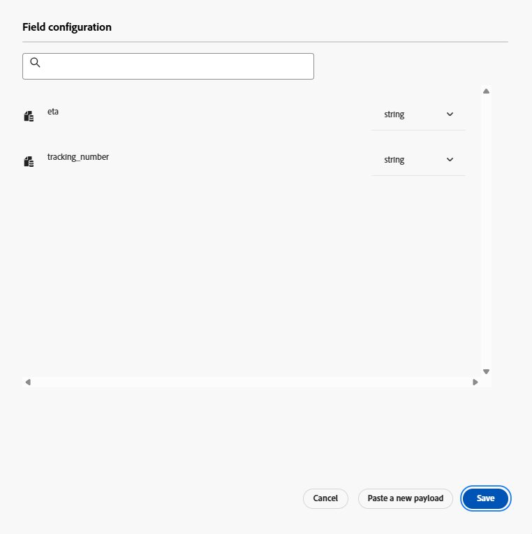
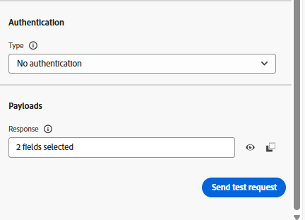
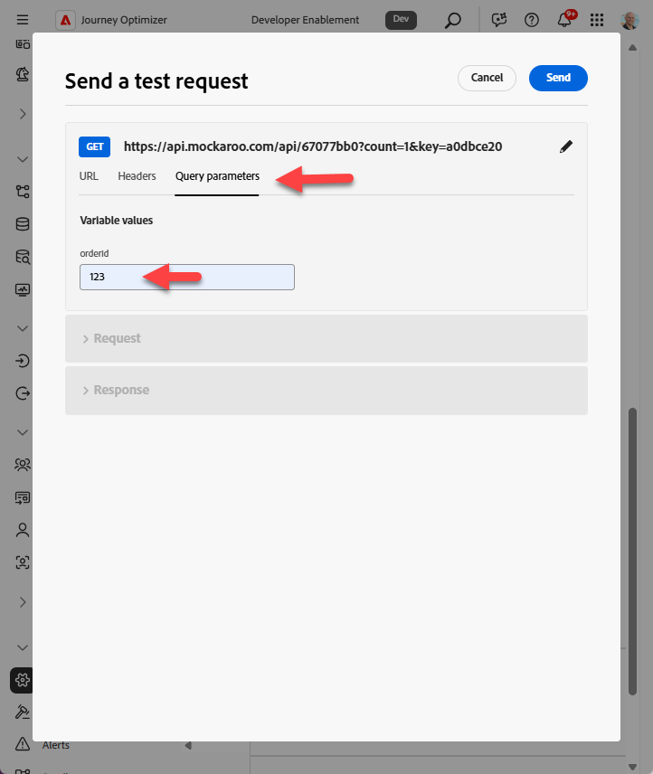
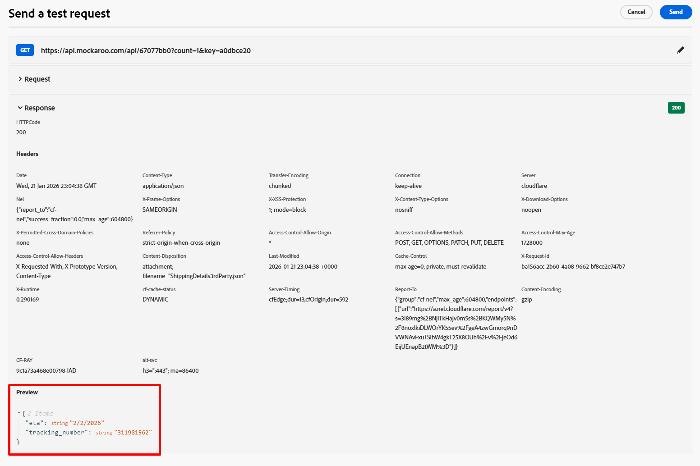

# Konfigurieren einer benutzerdefinierten Aktion

## Lernziel

Erstellen Sie eine benutzerdefinierte Aktion, die definiert, wie die Journey mit einem externen Endpunkt oder Service kommuniziert, um eine ETA für den Zeitpunkt zu erhalten, zu dem das Paket ankommt.

## Zu Aktionen navigieren

Klicken Sie in der linken Leiste unter dem Menü Administration auf **Konfigurationen** und klicken Sie dann auf der Kachel Aktionen auf die Schaltfläche **Verwalten**




## Konfigurieren der Aktion

### Aktionsname und Details

1. Klicken Sie oben rechts auf die Schaltfläche **Aktion erstellen**


&#x200B;2. Aktualisieren Sie im angezeigten Konfigurationsbedienfeld die folgenden grundlegenden Werte wie unten dargestellt:
   - **Name**: `GetShippingDetails`
   - **Beschreibung**: `Call third party to get Shipping ETA and Tracking Number`
   - **Aktionstyp**: `Custom`
   - **channel**: `Email`
   - **Erforderliche Marketing-Aktion**: `Email Targeting`




### Endpunktdetails

Geben Sie im Bereich Endpunktkonfiguration die folgenden Details an:

- **Endpunkt-URL**: `https://api.mockaroo.com/api/67077bb0?count=1&key=a0dbce20`
- **Methode**: `GET`
- **Kopfzeilen:** *unverändert lassen*
- **Abfrageparameter:**
  - **Name**: `orderid`
  - **Typ**: `variable`

>[!NOTE]
>
>Eine Variable ermöglicht es uns, einen Wert während eines Journey zu übergeben, anstatt einen statischen Wert für alle Journey zu haben

- **Authentifizierungstyp**: `No Authentication`






### Payload-Details der Antwort

Jetzt müssen Sie eine Beispiel-Payload bereitstellen, damit die Aktion weiß, wie die Antwort-Payload aussehen sollte.

1. Klicken Sie im Bereich Payloads auf das **Bleistiftsymbol**, um den Bildschirm Feldkonfiguration zu öffnen




&#x200B;2. **Kopieren Sie** nachstehende Payload und fügen Sie sie in das Feld Payload ein.

```json
{
    "eta": "11/19/2025",
    "tracking_number": "072000326"
}
```

>[!NOTE]
>
>Dies ist dieselbe JSON-Struktur, die der obige Mockaroo-Endpunkt zurückgeben sollte:


&#x200B;3. Die Antwort-Payload wird angezeigt. Klicken Sie auf **Speichern**.



>[!NOTE]
>
>Sie können alles als Zeichenfolge speichern, aber in Wirklichkeit sollten Sie dies wahrscheinlich aktualisieren, damit es dem Datentyp entspricht.


### Testen der Aktion

1. Klicken Sie auf **Schaltfläche „Testanfrage senden** in der rechten unteren Leiste, um zu überprüfen, ob Sie 😀 etwas durcheinander gebracht haben




&#x200B;2. Klicken Sie auf die **Abfrageparameter** und aktualisieren Sie den Wert für `orderId` auf **123**




&#x200B;3. Klicken Sie auf **Senden** und wenn alles gut funktioniert, sollten Sie einen Antwort-Code von 200 und eine Vorschau der Payload sehen, wie unten gezeigt…



Vorschau

```json
{
  "eta": "12/26/2025",
  "tracking_number": "063112249"
}
```

>[!WARNING]
>
>Wenn keine 200-Antwort oder Vorschau angezeigt wird, fahren Sie nicht fort. Heben Sie Ihre ✋ an, um Hilfe zu erhalten.


&#x200B;4. Klicken Sie auf **Abbrechen**, um zum Aktionsbildschirm zurückzukehren, und blättern Sie dann in der oberen rechten Leiste zurück und klicken Sie auf die Schaltfläche **Speichern**

>[!TIP]
>
>Glückwunsch! Ihre benutzerdefinierte Aktion ist dank Ihrer Fähigkeiten auf Expertenebene Strg+C, Strg+V live.

## Zusammenfassung

Eine wiederverwendbare benutzerdefinierte Aktion, die in Adobe Journey Optimizer konfiguriert ist und eine Bestell-ID akzeptiert und die ETA- und Tracking-Nummer zurückgibt.
