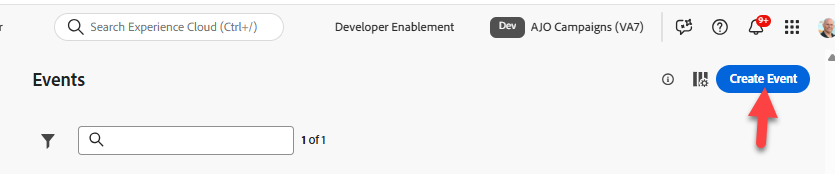
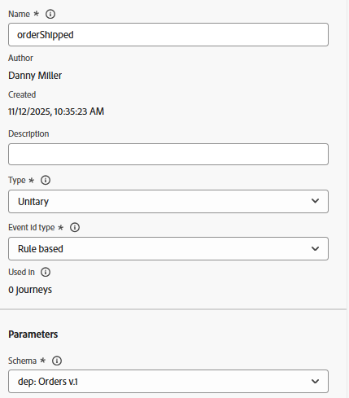
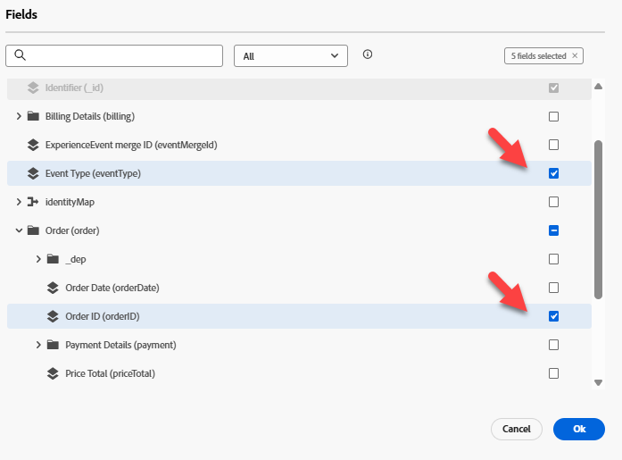
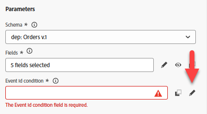
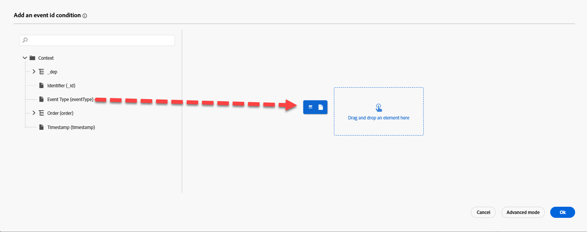
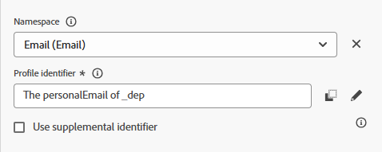
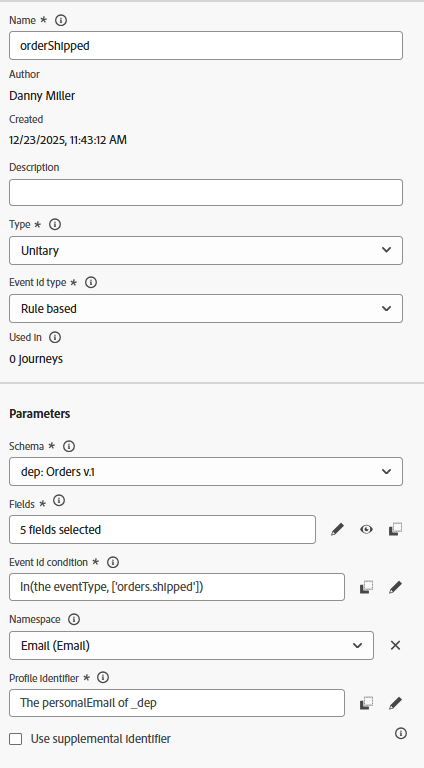

# Ereignis konfigurieren

## Lernziel

Erstellen und konfigurieren Sie ein Ereignis, durch das eine Kunden-Journey in den Trigger aufgenommen wird, wenn die Nachbestellungsaktion (Bestellung versendet) erfolgt.

## Zu Journey Optimizer navigieren

Klicken Sie in der rechten oberen Ecke Ihres Browsers auf den **Cube** und wählen Sie dann **Journey Optimizer**

## Versandereignis der Bestellung konfigurieren

Um eine Journey zu erstellen, die ein unitäres Ereignis verwendet, müssen wir zunächst das Ereignis konfigurieren.

1. Klicken Sie in der linken Leiste unter dem Menü Administration auf **Konfigurationen** und klicken Sie dann auf der Kachel Ereignisse auf die Schaltfläche **Verwalten**

   

2. Klicken Sie oben rechts auf die Schaltfläche **Ereignis erstellen**

   

3. Aktualisieren Sie die Einstellungen des Ereignisses wie folgt:
   - **name** = `orderShipped`
   - **type** = `Unitary`
   - **Ereignis-ID-Typ** = `Rule based`
   - **Schema** = `dep: Orders v.1`

   

4. Klicken Sie im `Fields` Eingabefeld auf das **Bleistiftsymbol**

   

5. Wählen Sie die folgenden Felder aus, die zum Ereignis hinzugefügt werden sollen, und klicken Sie abschließend auf die Schaltfläche **OK**.
   - `Event Type (eventType)`
   - `Order ID (orderID)`

   

   >[!NOTE]
   >
   >Stellen Sie sicher, dass Sie nur das Feld Bestell-ID und nicht alle Felder im 😁 auswählen

6. Klicken Sie in der `Event Id condition input` auf das **Bleistiftsymbol**

   

7. **Ziehen** Sie das `Event Type` Feld auf die Arbeitsfläche

   

8. Suchen Sie im angezeigten Auswahlfeld nach dem Wert und überprüfen Sie ihn mit dem Titel **orders.shipped.** Klicken Sie dann auf **OK**-Schaltfläche.

   

9. Aktualisieren Sie als Nächstes die letzten beiden Werte von Namespace und Profilkennung mit den unten angezeigten Werten:
   - **namespace** —> `Email`
   - **Profilkennung** —> `personalEmail`

>[!NOTE]
>
>**Wofür werden der Namespace und die Profilkennung verwendet?**
>
>Für jeden Journey, der ein Ereignis verwendet, müssen Sie für dieses Ereignis angeben, welcher Identity-Namespace und welche zugehörige Profilkennung zum Nachschlagen des Profils verwendet werden sollen. Es ist wichtig zu verstehen, dass die Wahl einer Identität gegenüber einer anderen sich auf die Funktionsweise des Journey auswirken kann.
>
>*Schnellbeispiel:*
>
>Ereignis-Payload ist eine Seitenansicht, die Identitäten wie enthält: ECID (primäre Identität) und Kunden-ID (optional)
>
>- ECID ausgewählt —> Es ist wahrscheinlich das erste Mal, dass Identity Service diese Beziehung gesehen hat. Wenn eine Journey dieses Ereignis erhält, versucht sie daher, das Profil mithilfe der ECID zu suchen und kein Profil zu finden.  Warum? Die Beziehung zwischen ECID und Kunden-ID existiert noch nicht, und die Eigenschaften des Profils werden wahrscheinlich mit der bekannten Kennung Kunden-ID gespeichert
>- Kunden-ID ausgewählt —> Diese Identität muss nicht ausgefüllt werden und ist in den meisten Seitenansichten wahrscheinlich leer.  Wenn diese Identität ausgewählt wurde, wird eine Journey daher nur ausgelöst, wenn eine authentifizierte Seitenansicht vorhanden ist, für die die Kunden-ID festgelegt ist.
>
>Kurze Antwort: Es gibt keine richtige Antwort, nur Kompromisse, die Sie basierend auf dem Anwendungsfall 😃 machen müssen

## Endgültige Konfiguration des OrderShipped-Ereignisses

Überprüfen Sie, ob Ihre endgültige Ereigniskonfiguration im Folgenden übereinstimmt.  Wenn alles gut aussieht, klicken Sie auf die Schaltfläche **Speichern**.

>[!TIP]
>
>Sie haben Ihr erstes AJO-Ereignis konfiguriert. High-Five Sie selbst!

## Zusammenfassung

Ein konfiguriertes Versandereignis für Bestellungen in Adobe Journey Optimizer, das als Einstiegspunkt für eine Journey verwendet werden kann
