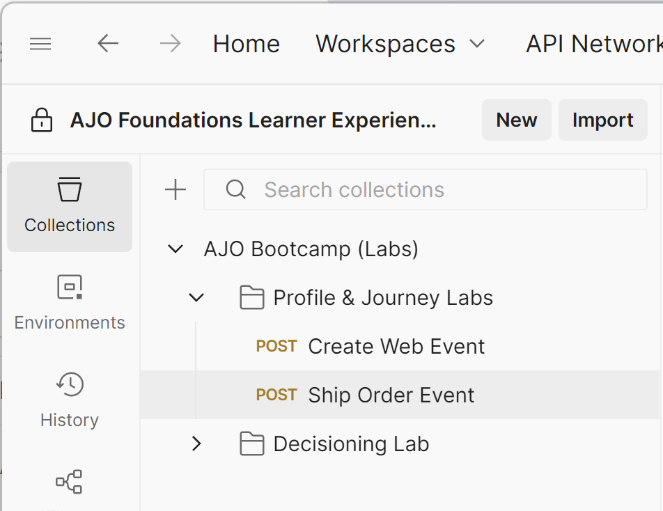

# Ereignis senden

## Lernziel

Senden eines simulierten Bestellversandereignisses an den Trigger der Journey mithilfe von Postman

## Streaming zu Hub und Edge im Vergleich

Zuvor haben wir ein Ereignis an die Edge gesendet.  Es gibt einige Anwendungsfälle, in denen wir ein Backend-System haben können, das in einem Ereignis streamen möchte, es jedoch nicht an Edge senden muss.  In diesem Labor wird gezeigt, wie dies durch **Streamen eines Bestellereignisses an den Hub** (auch als „Server an Server“ bezeichnet, z. B. Commerce-Server an AEP, was anzeigt, dass eine Bestellung versandt wurde) erreicht wird.

## Überprüfen, ob das Ereignis im Profil enthalten ist

1. Navigieren Sie zu Ihren **Profilen** und suchen Sie das Profil.
   - **Identity-Namespace** -> `email`
   - **Identitätswert** -> `henry.creel@emailsim.io`
1. Klicken Sie auf **Registerkarte** Ereignisse“.
   - Es sollte **keine** `orders.shipped` Ereignisse geben

## API-Anfrage ändern

Um die API-Anfrage zu erstellen, müssen Sie die folgenden Teile im Hauptteil der API-Anfrage ausfüllen.

Erfassen Sie zunächst die folgenden Werte:

### Konto-Streaming-Endpunkt suchen

1. Navigieren Sie **linken Leiste zu** Quellen“ und klicken Sie dann **oberen Navigationsbereich auf** Konten“
1. Suchen Sie nach **dep: HTTP API \[raw]** markieren Sie die Zeile und kopieren und speichern Sie den Wert des **Streaming-Endpunkts** an einen anderen Ort, auf den Sie später verweisen können

![dep: HTTP-API [Roh] Kontozeile mit hervorgehobenem Streaming-Endpunktwert &#x200B;](assets/send-an-event-streaming-endpoint-account-row.png "dep: HTTP-API \[Roh]")

### Datenfluss-ID suchen

1. Klicken Sie auf **dep: HTTP-API \[raw]**
1. Suchen Sie den Datensatz für **dep: Orders (Stream)** klicken Sie auf den Link Datenflüsse .
1. Kopieren Sie in der rechten Leiste die Werte **Datenfluss-ID** an eine Stelle, auf die Sie später verweisen können

>[!WARNING]
>
>Klicken Sie in ein leeres Feld in der Zeile.  Klicken Sie NICHT auf die blauen Links!

### Postman öffnen

Starten Sie Postman auf Ihrem Computer und navigieren Sie zum folgenden API-Aufruf:

- **Postman linke Seitenleiste** —> `Collections`
- **collection** —> `AJO Bootcamp (Labs)`
- **Ordner** —> `Profile & Journey Labs`
- **API-Anfrage** —> `Ship Order Event`

### Endgültige API-Anfrage erstellen

1. Kopieren Sie die in den vorherigen Schritten gespeicherten Werte an die unten hervorgehobenen Stellen.
1. Klicken Sie auf **Kopfzeilen** und fügen Sie diese Werte ein (alle nachfolgenden Leerzeichen entfernen):
   - **red** —> `Streaming Endpoint URL`
   - **grün** —> `Dataflow ID`
     - Wert sieht wie eine GUID aus (beginnt nicht mit http)

>[!CAUTION]
>
>NOCH NICHT AUSFÜHREN!

## Ausführen der API

1. Speichern Sie den API-Aufruf, indem Sie auf die Schaltfläche **Speichern** klicken
1. Ausführen einer Anfrage durch Klicken auf die Schaltfläche **Senden**

Ein erfolgreicher Aufruf sollte zu der folgenden Antwort führen…

## Zusammenfassung

Ein Versandauftragsereignis wurde erfolgreich an die Plattform gesendet.
