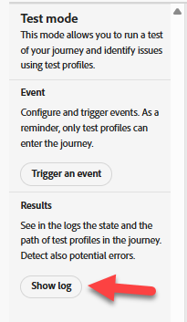
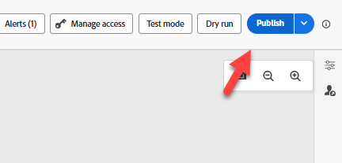
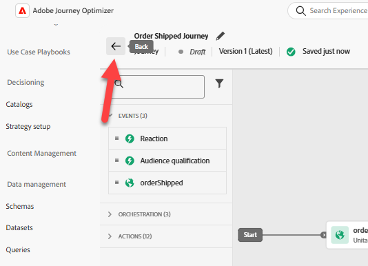

# Test-Journey

## Lernziel

Verwenden Sie die Journey-Test-Tools, um zu überprüfen, ob der Ereignis-Trigger und die Journey-Logik korrekt konfiguriert sind.

## Testen der Journey

1. Klicken Sie in der **Leiste und auf der Registerkarte** Durchsuchen **auf** Journey, wenn keine Liste angezeigt wird
2. Klicken Sie auf Ihre **Journey**, um sie zu öffnen
3. Klicken Sie auf **Warnhinweise** und stellen Sie sicher, dass keine Fehler auftreten (Warnhinweise sind in Ordnung).

   

   >[!NOTE]
   >
   >**Was ist CJMMAS - 2001-200**
   >
   >Zeigt, dass der Ausschluss-Link in einer E-Mail-Variante fehlt

4. Klicken Sie auf **Simulieren** und wählen Sie links den **Testmodus**

   


   >[!NOTE]
   >
   >Es könnte eine Minute dauern, bis wir uns fertig machen. Während dieser Zeit steht die Schaltfläche Trigger und Ereignis nicht zur Verfügung.


5. Klicken Sie auf **Ereignis als Trigger** und füllen Sie die folgenden Eigenschaften aus:
   - **Ereignistyp**: `orders.shipped`
   - **Persönliche E-Mail**: `henry.creel@emailsim.io`
   - **Auftrags-ID**: `123`
6. Klicken Sie **Senden** (beachten Sie, dass es einige Sekunden dauert, bis nach dem Klicken auf „Senden“ geantwortet wird)

   

   >[!WARNING]
   >
   >Manche Schüler bekommen Fehler und müssen diese ein paar Mal senden. Möglicherweise müssen Sie dies **mehrere** tun.
   >
   >**Manchmal** der erste Versand den Fehler:
   >
   >**Eingang existiert nicht (Referenz-ID: 3216a850-c40d-11f0-8fa5-73d1522cc9a2)**
   >
   >Wenn Sie einen Fehler erhalten, klicken Sie auf **Trigger für ein Ereignis** und dann erneut **Senden**.  Dies muss möglicherweise (**Mal)** werden.


7. Klicken Sie **Ergebnisse** -> auf **Protokoll anzeigen** links



>[!NOTE]
>
>Manche Lernenden, die Fehler erhalten haben, erhalten manchmal unterschiedliche Protokolle, in denen ein leeres Instanzen-Array-`{"instances": []}` angezeigt wird. Dies ist kein Hindernis. Fahren Sie nun mit dem nächsten Schritt fort.

Im Protokoll sollte ein ähnliches Element angezeigt werden:

>[!NOTE]
>
>Wir suchen nach den verwendeten Schlüsselfeldern: **actionsHistory**, **transitionsHistory**, **eta**, **tracking_number**, **eventType**, **personalEmail** und **orderID**.

```json
{
  "actionsHistory": {
    "8919055f-1b00-4a43-8bd6-c8af894474b2": {
      "eta": "11/27/2025",
      "tracking_number": "091204404",
      "jo_status_code": "http_200"
    }
  },
  "transitionsHistory": {
    "orderShipped (1158856989)": {
      "eventType": "orders.shipped",
      "_id": "joTestModeEvent_5abbfdcd-561d-45a7-ba42-d0640539831a",
      "_dep": {
        "personalEmail": "henry.creel@emailsim.io"
      },
      "order": {
        "orderID": "123"
      },
      "timestamp": "2025-11-17T23:30:49.576289372Z"
    }
  }
}
```


1. **Schließen** die Browser-**Registerkarte**
1. **Testmodus schließen** oben rechts

   

1. Klicken Sie oben **auf** Veröffentlichen“.

   

1. **Schließen** Sie die **Journey**, indem Sie auf den Pfeil \&lt;- oben links klicken



Als Nächstes senden wir eine echte Order Shipped-Veranstaltung nach AEP

## Zusammenfassung

Die Journey hat die Konfigurationsvalidierung bestanden und ist bereit, Ereignisse zu empfangen
