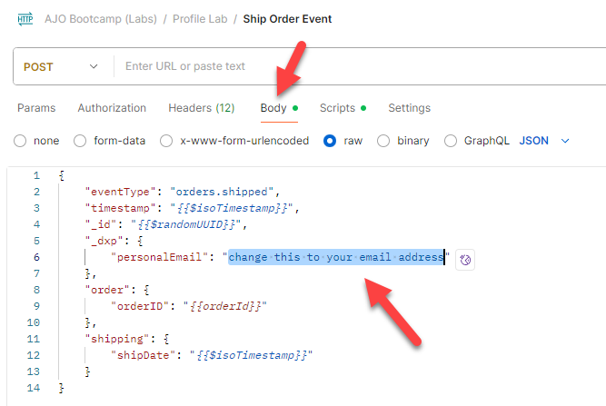

# Validieren des erfassten Ereignisses

## Lernziel

Vergewissern Sie sich, dass das Ereignis erfolgreich in Adobe Experience Platform aufgenommen wurde.

## Ereignis im Profil validieren

1. Navigieren Sie zu Ihren **Profilen** und suchen Sie Ihr Profil, um zu sehen, ob das Ereignis in das Profil aufgenommen wurde.  Es erscheint in Sekunden.
   - **Identity-Namespace** -> `email`
   - **Identitätswert** -> `henry.creel@emailsim.io`
2. Klicken Sie auf **Registerkarte** Ereignisse“. Suchen Sie nach `orders.shipped` Ereignis.

>[!WARNING]
>
>Haben Sie irgendwelche **message.feedback**-Ereignisse erhalten?  Diese stammen von Journey und weisen normalerweise auf ein Fehlschlagen oder einen Ausschluss hin.  Klicken Sie auf sie und sehen Sie sich die `reason` an.
>
>Einige Beispiele, auf die Sie in der Produktion stoßen könnten:
>
>- EmailNoAddressFoundInProfile (Sie haben versucht, eine E-Mail an ein Profil zu senden, das keine E-Mail hatte)
>- EmailNoConsent (Sie haben versucht, eine E-Mail an ein Profil zu senden, bei dem das Einverständnis auf „Nein“ gesetzt war.

&#x200B;3. Überprüfen Sie, ob sich das Profil für **Zielgruppen“** hat (dies kann einige Minuten dauern).
   - Beliebige Event Edge (innerhalb von 15 Minuten)
   - Beliebiges Ereignis-Streaming (innerhalb von 15 Minuten)

## Mit eigener E-Mail versuchen

Nachdem Sie nun die Anmeldung des Profils validiert haben, senden Sie einige versandte Bestellungsereignisse mit Ihrer eigenen E-Mail.

1. Kehren Sie zurück zu Postman und finden Sie die **Ship Order Event**
2. Klicken Sie auf **Textkörper** und ändern Sie die **E-Mail-Adresse** in Ihre.

&#x200B;3. **Speichern** und klicken Sie auf **Senden**.
&#x200B;4. Gehen Sie zurück zu den Schritten 1-3 und validieren Sie mithilfe Ihrer E-Mail-Adresse.

## Zusammenfassung

Das Ereignis wird im Profilspeicher angezeigt und das Profil ist nun Teil der Zielgruppen, die nach dem Ereignis gesucht haben.
