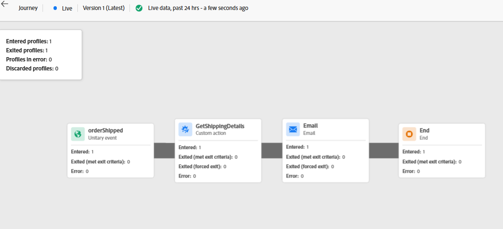
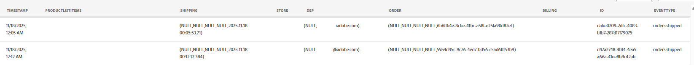

# Journey validieren

## Lernziel

Stellen Sie sicher, dass die Journey erwartungsgemäß ausgelöst und ausgeführt wurde.  Überprüfen Sie, ob Berichte Metriken erwartungsgemäß aktualisiert haben.

## Überprüfen des Journey

1. Gehen Sie zu Ihrer im Lieferumfang enthaltenen Journey, öffnen Sie sie, wenn Sie sie geschlossen haben
2. Es wurden mindestens zwei Profile eingegeben

   

3. Klicken Sie **oben rechts auf** Bericht anzeigen **> Letzte 24**.
4. Standardmäßig befinden Sie sich auf der Registerkarte **Journey** (in der linken Leiste)
   - Es werden einige Ein- und Ausstiege angezeigt (die Anzahl hängt von der Anzahl der gesendeten Ereignisse, von Tests, von Fehlern usw. ab).


Wenn alles bereinigt wurde, was Sie haben (scrollen Sie nach unten, um es zu überprüfen):

**Statistiken der Journey**

3 Eingetretene Profile (Henry, You und die Tests, die wir durchgeführt haben)

Sie können auf den Umschalter oben klicken, um **Testereignisse ausschließen** wenn Sie möchten, und diese Zahlen ändern sich

3 Ausgestiegene Profile (Henry, You und die Tests, die wir durchgeführt haben)

**Ausgeführte Aktionen und Fehler**

6 Aktionen (3 E-Mail, 3 GetShippingDetails)

**Gründe für Aktionsfehler**

0 Fehler (hoffentlich)

**Ereignisse**

3 Ereignisse (orderShipped)

3 externe Ereignisse

&#x200B;5. Klicken Sie auf die **E-Mail**-Registerkarte (in der linken Leiste).
   - **E-Mail - Versandleistung**
     - Es werden einige Werte für **Zugestellt** und **Gesendet** angezeigt (die Anzahl hängt von der Anzahl der gesendeten Ereignisse ab, von Fehlern usw.)
     - Hoffentlich haben Sie keine Fehler (es sei denn, Sie sind früher auf Probleme gestoßen)
   - **E-Mail - Statistiken**
     - E-Mail - 3 zielgerichtet, gesendet, zugestellt

   

&#x200B;6. Überprüfen Sie Ihren **E-Mail-Posteingang** und überprüfen Sie, ob Sie die E-Mail erhalten haben (sie sieht in etwa wie folgt aus)
   - *,* Ihre Bestellung wurde an ETA versendet: *10/17/2026* Tracking-Nummer: *051009364*

   >[!NOTE]
   >
   >Überprüfen Sie Ihren Spam-Ordner auf AJO-Kampagnen [ajo-campaigns@email.dep-labs.com](mailto:ajo-campaigns@email.dep-labs.com)

   >[!NOTE]
   >
   >**Warum fehlt der Vorname?**
   >
   >Wir haben den E-Mail-Knoten geändert, um den Ereigniskontext für die E-Mail-Adresse anzuzeigen.  Der Vorname in der Personalisierung wird jedoch aus \{\{profile.person.name.firstName\}\} abgerufen.
   >
   >Wenn Sie Ihr Profil für Ihre E-Mail nachschlagen, verfügen Sie dann über einen Vornamen?


&#x200B;7. *Nach 30-60 Minuten* können Sie Ihren Datensatz im Data Lake sogar mit folgenden Elementen überprüfen: **Abfragen** -> **Abfrage erstellen** -> **SQL kopieren/einfügen** -> **Ausführen**

>[!NOTE]
>
>Das Ereignis „Bestellung versendet“ wurde in gestreamt. Während es das Profil schnell aktualisiert, dauert es eine Weile, bis der Data Lake aktualisiert wird.

```sql
SELECT * FROM dep_orders
WHERE timestamp >= CURRENT_DATE
LIMIT 10
```



## Bonus (Step-Ereignisse prüfen)

>[!NOTE]
>
>Schrittereignisse zeichnen jedes Mal auf, wenn ein Profil eine Journey startet, und jeden Schritt auf der Journey. Hinweis: Es kann einige Minuten dauern, bis diese Ereignisse im Datensatz aufgezeichnet sind.


1. Während Sie in Query Service sind, können Sie sehen, was der Schritt-Ereignis-Datensatz erfasst, indem Sie diese SQL ausführen. Kopieren Sie die unten stehende SQL und fügen Sie sie in eine Abfrage ein.

```sql
select timestamp,
  identityMap,
  _experience.journeyOrchestration.stepevents.journeyVersionName,
  _experience.journeyOrchestration.stepevents.NodeName,
  _experience.journeyOrchestration.stepevents.*
  from journey_step_events
limit 50
```

Die Ergebnisse umfassen mehr als 100 Spalten und geben Ihnen einen Eindruck davon, welche Schrittereignisse aufgezeichnet werden.

>[!NOTE]
>
>Sie sind neugierig, was die einzelnen Felder bedeuten, schauen Sie sich das AJO-Schemawörterbuch an und ändern Sie die Dropdownliste in das Journey-Schrittereignisschema: [https://experienceleague.adobe.com/tools/ajo-schemas/schema-dictionary.html?lang=en](https://experienceleague.adobe.com/tools/ajo-schemas/schema-dictionary.html?lang=en)


## Zusammenfassung

Die Journey-Instanz wird in Journey-Berichten oder -Protokollen angezeigt und die konfigurierte Aktion wird ausgeführt
