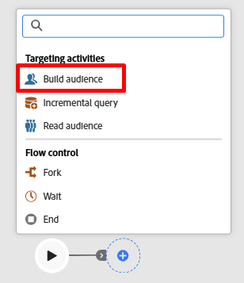
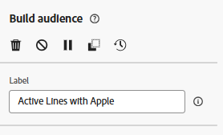
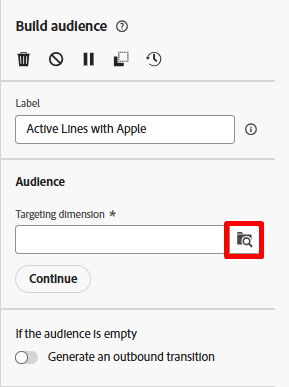
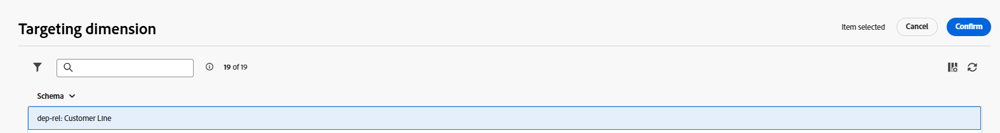
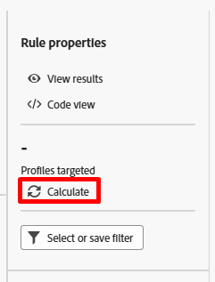
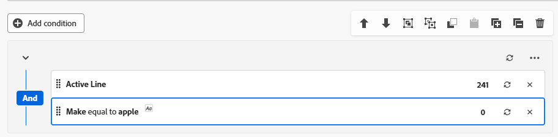

# Erstellen einer Zielgruppe

## Ziel

In den nächsten Schritten erstellen Sie die Audience, die Sie für die Kampagne ansprechen möchten. Dabei handelt es sich um alle aktiven Line-Inhaber, die über eine Marke verfügen, die dem Flaggschiff-Telefon entspricht, das gerade gestartet wird.  Ziel ist es, die Gruppe, die Sie ansprechen möchten, mit einer SMS anzusprechen, die sie dazu anhält, ihre Telefone zu aktualisieren.

## Hinzufügen der Aktivität „Zielgruppe aufbauen“

1. Klicken Sie auf der Arbeitsfläche auf das Symbol **+** wählen Sie dann die Aktivität **Zielgruppe erstellen** aus, um sie zum Workflow hinzuzufügen

2. In der rechten Leiste sehen Sie die Eigenschaften Zielgruppe erstellen . Aktualisieren Sie die Bezeichnung so, dass Folgendes angegeben wird: `Active Lines with Apple`

## Zielgruppendimension auswählen

Der nächste Schritt besteht darin, die **Zielgruppendimension** auszuwählen (d. h. welche Tabelle Sie abfragen möchten). Führen Sie die folgenden Schritte aus:

1. Klicken Sie im Feld **Zielgruppendimension** auf das Suchsymbol

2. Suchen Sie im Popup nach der Tabelle mit dem Namen **dep-rel: Customer Line** und wählen Sie sie aus. Klicken Sie dann auf die Schaltfläche **Bestätigen**.

>[!NOTE]
>
>Merken Sie sich immer **Zielgruppendimension** jede Zielgruppe, die Sie erstellen. In den nächsten Schritten erfahren Sie mehr über die Bedeutung.

>[!NOTE]
>
>Wenn Sie ein in Adobe erstelltes Schema auswählen, beachten Sie, dass das Schema mit -> *(caas) beginnt*. Dies ist lediglich ein Namespace, der auf die Tabellen im relationalen Speicher angewendet wird und für Campaign as a Service steht:)

## Zielgruppe erstellen

Nachdem Sie nun Ihre Zielgruppendimension ausgewählt haben (welches relationale Schema Sie abfragen möchten), können Sie mit der Erstellung Ihrer Definition beginnen.

1. Klicken Sie in der rechten Leiste auf die Schaltfläche **Zielgruppe erstellen**

2. Klicken Sie anschließend auf die Schaltfläche **Bedingung hinzufügen**.

## Bedingung(en) erstellen

Jetzt ist es an der Zeit, die Logik der Zielgruppe mithilfe der im Schema gefundenen Attribute zu schreiben. Ziel ist es, alle aktiven Kundenzeilen zu finden, die ein Make-of-Apple verwenden.

### Erstellen von #1

1. Legen Sie die Bedingung anhand der folgenden Informationen fest:
   - **Attribut**: `Active Line`
   - **Wert**: `true`

2. Klicken Sie auf **Aktualisieren**-Symbol, um die qualifizierten Zahlen für die Bedingung anzuzeigen.

>[!TIP]
>
>Sie sehen das Ergebnis 241, wenn Sie die Bedingung korrekt erstellt haben

### Erstellen von #2

1. Klicken Sie auf die **Bedingung hinzufügen** und wählen Sie das Schema **dep-rel:** **Product \[Lookup]** aus, indem Sie auf das Symbol **>** klicken

![Wählen Sie das Schema dep-rel: product [lookup] aus, indem Sie auf das Symbol > klicken](assets/build-an-audience-select-product-lookup-schema.png)

2. Suchen Sie nach dem Feld **Make**, klicken Sie auf die drei Punkte und wählen Sie **Werteverteilung**

3. Beachten Sie die verschiedenen Werte. Man will nur `Apple` und glücklicherweise hat es nicht 100 verschiedene Schreibweisen. Klicken Sie auf das Feld **Apple**, um es auszuwählen, und klicken Sie dann oben rechts auf **Attribut und Wert** auswählen“.

>[!NOTE]
>
>Dies ist ein Paradebeispiel dafür, wo der Datenarchitekt das Schema mit Auflistungen hätte entwerfen sollen.  Auf diese Weise muss ein Marketer den Wert nicht manuell auswählen/eingeben.  Schande über den Datenarchitekten!

4. Das Feld `Make` wird automatisch zusammen mit den unten aufgeführten Bedingungen hinzugefügt.
   - **Operator:** `Equal to`
   - **Wert:** `Apple`
   - **Von Schreibweise abhängig:** `Enabled`

5. Klicken Sie auf **calculate-Symbol** und Sie sehen 85 als Ergebnis.

>[!NOTE]
>
>Beachten Sie die Verwendung des AND-Operators in der Gruppe. Ob Sie dies in einer einzelnen Gruppe wie der gezeigten oder in mehreren Gruppen erstellen, das UND ist wichtig, da es koordinierten Kampagnen mitteilt, dass beide Bedingungen erfüllt sein müssen.

## Anzahl überprüfen

1. Klicken Sie auf **Berechnen** in der rechten Leiste unter der Überschrift Zielgruppenprofile , um eine genaue Schätzung der Zielgruppengröße zu erhalten. Sie sehen **65** als **Endzählung**.

>[!NOTE]
>
>Beachten Sie, dass jede einzelne Bedingung eine andere Zahl zurückgab (Bedingung #1 —> 241 und Bedingung #2 —> 85), aber die endgültige Zielgruppengröße die kleinere der beiden Bedingungen war.  Dies liegt an diesem AND-Operator.

2. Wenn Sie die endgültige Zählung von **65 sehen** klicken Sie oben rechts im Bildschirm auf die Schaltfläche **Bestätigen** und dann oben rechts auf die Schaltfläche **Speichern**, um Ihre Arbeit zu speichern.

## Challenge

Angenommen, Sie haben die letzte Bedingung so eingegeben, dass `Make` gleich `apple` (Kleinbuchstaben) war, und Sie haben die Konfigurationsoption für `Case sensitive` umgeschaltet `on`.  Dadurch würde die Anzahl der Bedingungen für den Datensatz gleich 0 sein.  Man hätte also 241 aktive Linien und 0, wobei die Marke Apfel ist.

**Wie hoch wäre in diesem Fall die endgültige Zielgruppengröße?**

## Antwort

Es ist null. Weißt du, warum?

## Zusammenfassung

Sie haben Ihre erste Zielgruppe erfolgreich erstellt und sollten jetzt sehen, wie einfach es ist, Ihre Zahlen innerhalb der Aktivität Zielgruppe aufbauen zu entwickeln und zu validieren.

